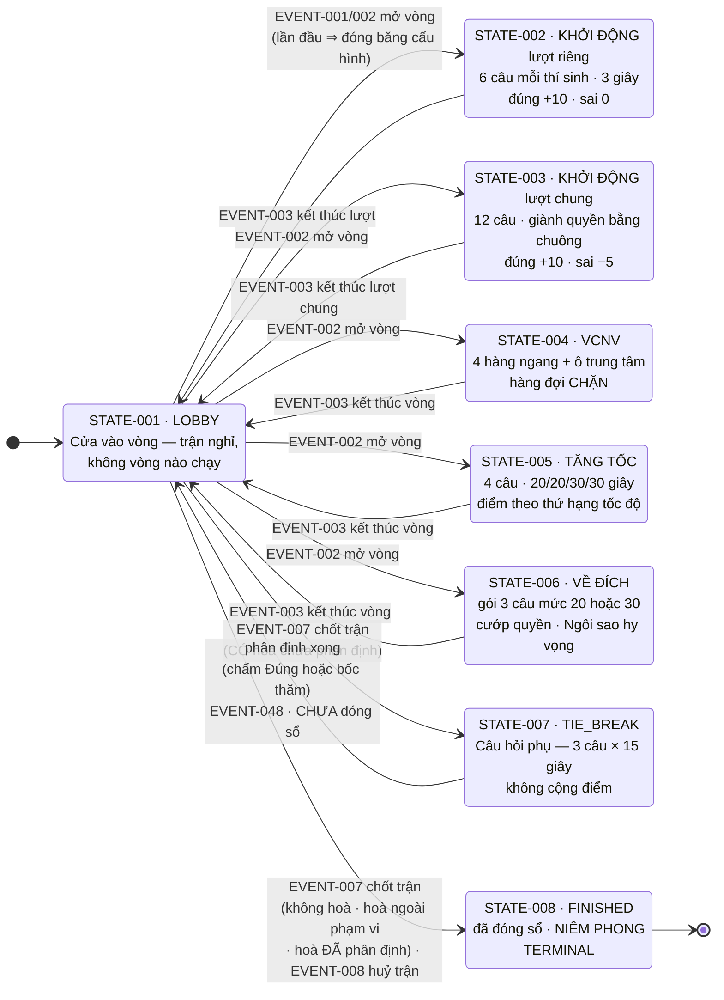
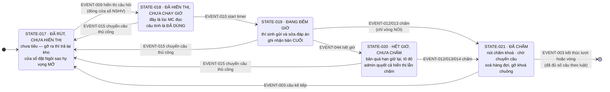
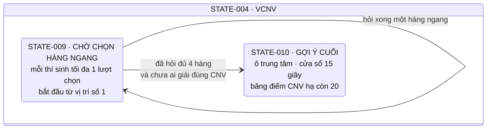
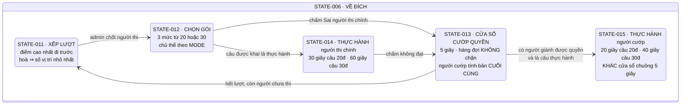
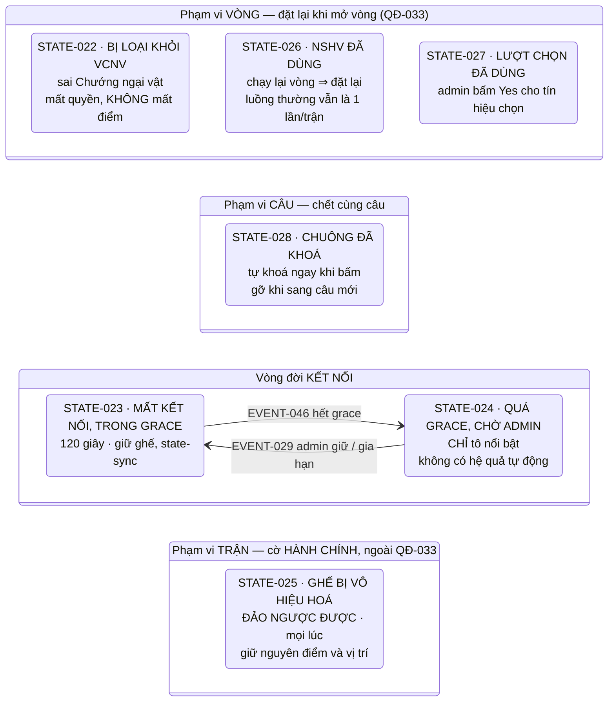
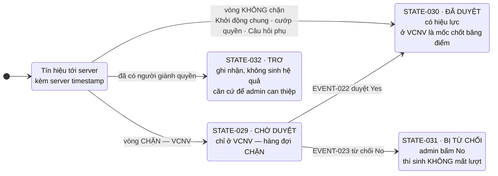
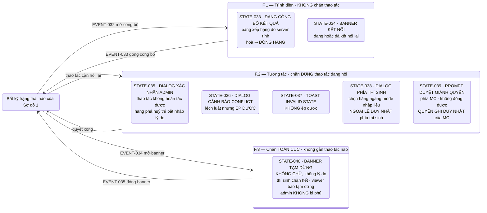
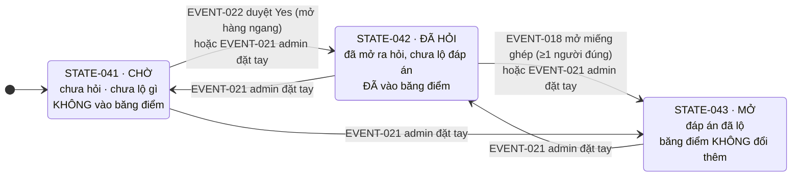

# Máy trạng thái trận đấu

> **Loại tài liệu**: đặc tả **nghiệp vụ** cho một **trận** (match) theo luật O26 — phủ 5 vòng thi và luật xuyên vòng. Không chứa code, pseudocode, tên lớp, tên bảng dữ liệu.
>
> **Tài liệu này nói CÁI ĐANG LÀ.** Lý do đằng sau mỗi lựa chọn nằm ở `decisions.md`, tra theo mã `QĐ-*`. Không có mã quyết định nào khác được dùng ở đây.

## Quan hệ với tài liệu khác

| File | Vai trò |
|---|---|
| `source/fandom-olympia-26-luat-choi.md` | Luật gốc O26 nguyên văn — **source of truth duy nhất** |
| `decisions.md` | **Vì sao** — 110 quyết định `QĐ-001` → `QĐ-110`, kèm bảng tra mã cũ |
| `glossary.md` | Thuật ngữ chuẩn `TERM-*`; tài liệu này dùng đúng tên ở đó |
| `game-rules.md` | Rule `GR-*`; **mọi transition ở đây phải trỏ về ≥1 `GR-*`** |
| `traceability.md` | Ma trận truy nguyên requirement ↔ luật gốc ↔ `QĐ-*` |
| `reviews/` | **Kho lưu** — biên bản thảo luận và đề xuất `GRR-*`. **Không phải nguồn**, không trích vào đây |

## Quy ước đọc

**Bảy thang bậc trạng thái, KHÔNG trộn lẫn.** Từ *"state"* trong tài liệu nguồn mang nhiều nghĩa; ở đây chúng được tách hẳn:

| Thang bậc | Mã | Tính chất |
|---|---|---|
| **Cấp TRẬN** | `STATE-001` → `STATE-008` | **Loại trừ lẫn nhau** — đúng **một** giá trị tại một thời điểm |
| **Cấp GIAI ĐOẠN** | `STATE-009` → `STATE-016` | Nằm **bên trong** một trạng thái cấp trận |
| **Cấp CÂU** | `STATE-017` → `STATE-021` | Vòng đời một câu hỏi, chạy bên trong một vòng |
| **Cấp GHẾ** | `STATE-022` → `STATE-028` | **Cờ song song** — nhiều cái cùng đúng một lúc |
| **Cấp TÍN HIỆU** | `STATE-029` → `STATE-032` | Vòng đời một tín hiệu trong hàng đợi |
| **Cấp LỚP PHỦ** | `STATE-033` → `STATE-040` | Chồng lên trạng thái đang chạy mà **không huỷ** nó; nhiều lớp cùng bật là hợp lệ |
| **Cấp Ô CHỮ** | `STATE-041` → `STATE-043` | Một giá trị cho **mỗi ô** của bàn cờ VCNV; năm ô độc lập |

**Ba hạng phản hồi khi một thao tác không đi được** — phân biệt bởi **quyền của admin**, đừng trộn:

| Hạng | Admin ép được? | Biểu hiện |
|---|---|---|
| **Invalid state** | **Không** | Nút không bật (admin) hoặc không render (thí sinh); server từ chối. Admin thấy **toast** |
| **Cảnh báo conflict luật** | **Có** | Dialog Yes/No; bấm Yes là thực hiện |
| **Chặn cứng** | **Không** — và chỉ có **ba** chỗ | Ngưỡng bất khả thi vật lý. Xem `INV-014` |

**Đánh dấu suy luận**: `[SUY RA]` = hệ quả bắt buộc của một quyết định, không phải phát biểu trực tiếp của nguồn. Sửa được bằng lập luận.

**Tài liệu này chỉ mô tả những gì hệ thống CÓ.** Thứ không tồn tại thì **không được nhắc tới** — không có mục *"trạng thái này không đạt tới được"*, không có event bị gạch ngang, không có transition đánh dấu đã chết. Cần biết vì sao một cơ chế của luật gốc không có mặt ở đây thì tra `decisions.md`; cần dấu truy nguyên từ rule về nguồn thì tra `traceability.md`.

> **Một chỗ trông giống nhưng KHÁC hẳn: dòng `Cấm`.** Nó không mô tả thứ không tồn tại — nó là **yêu cầu phủ định**, chặn một cách hiện thực sai mà người viết code dễ chọn (*"máy tự chấm khi hết giờ"*, *"hệ thống tự đóng sổ trận khi hết playlist"*). Mỗi dòng `Cấm` ở đây đều chặn một cám dỗ có thật.

---

# Sơ đồ

> Tám sơ đồ theo bảy thang bậc — riêng thang *giai đoạn bên trong một vòng* tách làm **3a (VCNV)** và **3b (Về đích)** cho dễ nhìn.
>
> **Chỉ Sơ đồ 1 và 2 là máy trạng thái loại trừ lẫn nhau.** Sáu sơ đồ còn lại mô tả **vòng đời song song** — chúng chạy *bên trong* hoặc *chồng lên* Sơ đồ 1, không thay thế nó.

## Sơ đồ 1 — Cấp TRẬN



> **Admin chọn vòng nào mở — playlist chỉ là gợi ý** (`QĐ-002`). Năm mũi tên rời từ `S001` vẽ như vậy để thấy rõ: **không có thứ tự cưỡng chế**.
>
> **Mọi vòng vào và ra qua `LOBBY`** (`QĐ-034`) — không có đường vòng → vòng. Bốn cửa ra khỏi một vòng: kết thúc vòng · kết thúc khẩn cấp · bỏ vòng · chạy lại vòng. Ba cửa sau không vẽ để sơ đồ khỏi rối.
>
> **Hai cạnh rời `S001` sang `S007`/`S008` là NÚT BẤM, không phải guard tự động** (`QĐ-036`): hết playlist chỉ làm hệ thống **gợi ý** chốt. Trận nằm lại ở `S001` bao lâu cũng được, và **admin sửa điểm được suốt khoảng đó**.
>
> **`S007` quay về `S001`, không đi thẳng `S008`** (`QĐ-083`): phân định xong thì trận **chưa đóng sổ**, và cần **cú bấm chốt trận thứ hai**. Nhờ vậy còn cửa **bỏ vòng `TIE_BREAK`** để sửa một phán quyết nhầm. Cú bấm thứ hai **không** vào lại `S007` — `EVENT-047` bỏ qua nhóm đã có `EVENT-048` còn hiệu lực.
>
> Mọi cạnh `S001 → vòng` mang guard **cửa vào vòng đủ câu** (`QĐ-042`); riêng cạnh **đầu tiên trong đời một trận** mang thêm side effect **đóng băng cấu hình**.
>
> **Tạo trận mới** (`EVENT-036`) **không có mũi tên ở đây** — nó không rời `S008` mà **dựng một thể hiện mới** của chính sơ đồ này, bắt đầu ở `S001` (`QĐ-039`).

## Sơ đồ 2 — Cấp CÂU, áp cho mọi vòng



> **Bốn mốc đầu đều là NÚT BẤM CỦA ADMIN, thứ tự cố định, không gộp được** (`QĐ-028`).
>
> Ở vòng **gõ máy**, cạnh `S019 → S021` **không tồn tại** — nút chấm khoá tới **`hạn chót + padding`**, riêng Khởi động tới `hạn chót` (`QĐ-030`, `QĐ-109`).
>
> **Ở VCNV còn một nút thứ NĂM đứng TRƯỚC cả bốn mốc này: *mở hàng ngang*** — nó thuộc [[#Sơ đồ 7 — Cấp Ô CHỮ|Sơ đồ 7]] và **độc lập** với hai mốc kia (`QĐ-052`). Mở một ô mà **không** hiển thị câu nào là hợp lệ.

## Sơ đồ 3a — Giai đoạn bên trong VCNV



> Vòng lặp ở `S009` là **bốn lượt hỏi hàng ngang**, không phải bốn trạng thái khác nhau.
>
> **Sơ đồ này CỐ Ý chỉ vẽ hai giai đoạn.** Ba thứ chạy song song bị lược vì chúng thuộc thang bậc khác:
> - **Tín hiệu *"Mở chướng ngại vật"* bấm được ở BẤT KỲ thời điểm nào của vòng** — kể cả khi chưa hàng ngang nào được hỏi (băng **60**), kể cả giữa lúc đồng hồ đang chạy. Nó **không chuyển giai đoạn** và **không đụng đồng hồ** (`QĐ-031`). Vòng đời tín hiệu ở [[#Sơ đồ 5 — Cấp TÍN HIỆU|Sơ đồ 5]].
> - **Vòng đời từng câu hàng ngang** ở [[#Sơ đồ 2 — Cấp CÂU, áp cho mọi vòng|Sơ đồ 2]]; **trạng thái từng ô** ở [[#Sơ đồ 7 — Cấp Ô CHỮ|Sơ đồ 7]].
> - **Ba lối ra của cả vòng** là exit conditions của `STATE-004`, thuộc Sơ đồ 1.

## Sơ đồ 3b — Giai đoạn bên trong VỀ ĐÍCH



> **Hai con số hay bị lẫn**: **5 giây** là độ dài **cửa sổ bấm chuông**; **20/40 giây** là **thời gian thực hành của người cướp**, chỉ bắt đầu đếm **sau khi** đã có người giành được quyền.

## Sơ đồ 4 — Cấp GHẾ: cờ song song



> Bốn nhóm này **không loại trừ nhau**: một ghế có thể vừa bị loại khỏi VCNV, vừa đã dùng NSHV, vừa đang mất kết nối.
>
> **Vòng đời khác nhau là lý do phải tách nhóm.** `QĐ-033` đặt lại **toàn bộ** nhóm *phạm vi VÒNG* tại mốc mở vòng, nhưng **không** chạm nhóm *phạm vi TRẬN* — cờ ở đó do **admin** sinh ra, không do vòng nào sinh ra.

## Sơ đồ 5 — Cấp TÍN HIỆU



> **`S032` và `S033` là trạng thái cuối của một tín hiệu, nhưng KHÔNG BAO GIỜ bị xoá** (`INV-001`). Thứ bị xoá theo câu hoặc vòng là **hàng đợi đang hoạt động**, không phải lịch sử.

## Sơ đồ 6 — Cấp LỚP PHỦ



> **`INV-021`**: mở hay đóng một lớp phủ **không đổi gì** ở trạng thái bên dưới. **Nhiều lớp bật cùng lúc là hợp lệ.**
>
> Ở **F.2**, bản thân hộp thoại **chỉ hỏi**; thứ đổi trạng thái là **hành động được xác nhận sau đó**, và hành động đó có event riêng. Nên *"bấm Yes"* **không phải** transition của lớp phủ.
>
> **Phân biệt `S037` với `S038`** — trông giống nhau với người dùng nhưng khác hẳn về quyền: cảnh báo thì **ép được**, toast thì **không**.

## Sơ đồ 7 — Cấp Ô CHỮ: một bản sao cho MỖI ô



> **Sơ đồ này chạy SONG SONG với Sơ đồ 2, không phải bên trong nó** (`QĐ-052`). Trạng thái của một **ô** và vòng đời của **câu hỏi** trong ô đó là **hai trục độc lập**.
>
> **Ô trung tâm dùng chung ba trạng thái này để HIỂN THỊ, nhưng KHÔNG vào phép tính băng điểm** — xem `STATE-042`.

---

# States

## A. Cấp TRẬN — loại trừ lẫn nhau

### STATE-001 — LOBBY (cửa vào vòng)

- **Mô tả**: **trạng thái nghỉ của trận** — không vòng nào đang chạy. Dùng **cả trước vòng đầu tiên lẫn giữa hai vòng**. Là nơi chạy pre-flight và là **cửa vào** của mọi vòng.
- **Vào**: trận được tạo · **mọi** nút kết thúc vòng · kết thúc vòng khẩn cấp · bỏ vòng · chạy lại vòng. **Bốn đường sau là TOÀN BỘ cửa ra của một vòng** — không có đường vòng → vòng.
- **Cho phép**: mở bất kỳ vòng nào (`EVENT-001` / `EVENT-002`) · sửa danh sách câu đã gán (`EVENT-031`) · điều chỉnh điểm (`EVENT-028`) · mở công bố kết quả (`EVENT-032`) · **chốt trận** (`EVENT-007`) · chạy pre-flight · viewer/overlay join bằng mã phòng · **gán ghế và vị trí — chỉ khi chưa vòng nào từng chạy**.
- **Cấm**: mọi thao tác thi đấu của thí sinh — không câu nào đang mở · đổi vị trí ghế sau khi trận đã start · **hệ thống tự đưa trận sang `FINISHED` hoặc `TIE_BREAK` khi hết playlist** — không có bộ đếm nào, không có guard tự động nào.
- **Ra**: **ba nhánh, cả ba đều do admin bấm** — (a) mở một vòng, guard **cửa vào vòng đủ câu** · (b) **chốt trận** và server tính ra **có hoà chưa phân định** trong `tieBreakPositions` ⇒ `TIE_BREAK` · (c) **chốt trận** và **không hoà**, hoà ngoài phạm vi, **hoặc hoà đã phân định** ⇒ `FINISHED`.
- **`LOBBY` là nơi trận quay về SAU tie-break**, không chỉ giữa các vòng: `TIE_BREAK` phân định xong thì về đây, chưa đóng sổ. Admin còn sửa điểm được ở mốc này — và nếu sửa làm nhóm hết bằng điểm thì kết quả tie-break **mất đối tượng** (`GR-022` C8).
- **Nguồn**: `QĐ-032` · `QĐ-034` · `QĐ-036` · `GR-031`, `GR-035`

> **Một guard duy nhất phân biệt "trước trận" với "giữa hai vòng"**: khi admin mở một vòng, **nếu chưa vòng nào từng chạy** thì cạnh đó **kèm đóng băng cấu hình** — RuleConfig · mode trả lời · danh sách câu · `revealAnswerAfterJudge`. Một chiều, đúng một lần. Điều kiện *"chưa vòng nào từng chạy"* **không phải cờ lưu trữ** — nó suy ra từ event log.
>
> **`LOBBY` là chỗ trận ĐỢI, không phải chỗ trận tự đóng sổ.** Phép tính điều kiện hoà chạy **tại cú bấm chốt**, nên mọi lần sửa điểm trước đó **đều vào** phép phân định: sửa điểm có thể **tạo ra** hoặc **gỡ** một nhóm hoà. Mở công bố ở đây vẫn hợp lệ và **không chốt gì** — bảng xếp hạng cuối cùng chỉ tồn tại sau `EVENT-007`.
>
> **Nội dung trình diễn giữa hai vòng** (giao lưu, giải lao, video hình hiệu) **không cần** trạng thái riêng — nó là **lớp phủ** do admin bật/tắt.

### STATE-002 — KHỞI ĐỘNG · lượt riêng

- **Mô tả**: mỗi thí sinh trả lời **6** câu của riêng mình; suy nghĩ **3 giây** kể từ mốc admin bấm start timer. Đúng **+10**, sai **0** (không phạt).
- **Vào**: admin mở vòng Khởi động; cửa vào vòng đủ câu; lượt riêng khoá vào **một** thí sinh trước câu đầu tiên.
- **Cho phép**: admin hiển thị câu → start timer → chấm → câu kế tiếp · thí sinh gửi đáp án (chỉ mode nhập liệu) · điều chỉnh điểm · bỏ / chạy lại vòng.
- **Cấm**: bấm chuông — lượt riêng không có chuông · hỏi câu thứ 7 (**không tồn tại**, nút đã chuyển thành *"Kết thúc lượt"*) · máy tự chấm.
- **Ra**: đã chấm xong câu thứ 6 của thí sinh cuối cùng **và** admin bấm kết thúc lượt.
- **Nguồn**: luật gốc §Khởi động đoạn 2 · `QĐ-041`, `QĐ-056` · `GR-001`, `GR-002`, `GR-006`, `GR-026`, `GR-033`

### STATE-003 — KHỞI ĐỘNG · lượt chung

- **Mô tả**: **12** câu, giành quyền bằng chuông. Đúng **+10**; sai **hoặc bấm chuông rồi im lặng** **−5**.
- **Vào**: lượt riêng của **mọi** thí sinh đã kết thúc; admin mở lượt chung.
- **Cho phép**: thí sinh bấm chuông — cửa sổ mở **từ mốc hiển thị câu**, kéo qua lúc MC đọc, thêm **3 giây** sau mốc start timer · admin hiển thị câu / start timer / chấm Đúng / Sai / **Huỷ kết quả** / chuyển câu thủ công.
- **Cấm**: bấm chuông sau khi đã có người giành quyền **làm đổi người giữ quyền** — tín hiệu vẫn được ghi nhưng **trơ** · mở lại chuông trên câu đã chấm · hỏi câu thứ 13.
- **Ra**: đã xử lý xong câu thứ 12 **và** admin bấm kết thúc lượt chung.
- **Nguồn**: luật gốc §Khởi động đoạn 3-5 · `QĐ-054`, `QĐ-056` · `GR-003` → `GR-006`, `GR-032`, `GR-034`

### STATE-004 — VƯỢT CHƯỚNG NGẠI VẬT

- **Mô tả**: đi tìm Chướng ngại vật qua **4 hàng ngang** + **1 ô trung tâm**. Hàng ngang **luôn trả lời bằng máy** bất kể mode. Là vòng **duy nhất** hàng đợi tín hiệu **CHẶN**.
- **Vào**: admin mở vòng VCNV; cửa vào vòng đủ câu.
- **Cho phép**: chọn hàng ngang (**một đường vào mỗi mode**) · mọi thí sinh chưa bị loại gõ đáp án hàng ngang · bấm *"Mở chướng ngại vật"* **bất cứ lúc nào** · admin duyệt Yes/No từng tín hiệu · admin mở miếng ghép · **đặt trạng thái một ô chữ bằng tay** (`EVENT-021`) — mọi lúc, kể cả khi đồng hồ đang chạy · **chốt câu hàng ngang khi mới chấm một phần**.
- **Cấm**: thao tác từ ghế **đã bị loại** — máy thí sinh không hiển thị gì, bấm không phản hồi · chọn hàng ngang **đã mở** · ưu tiên tín hiệu theo **loại** khi duyệt hàng đợi (phải thuần FIFO) · **áp mặc định SAI lên một tín hiệu *"Mở chướng ngại vật"* đang chờ duyệt**.
- **Ra**: (a) có người giải **đúng** Chướng ngại vật · (b) **toàn bộ** thí sinh bị loại ⇒ `STATE-007` · (c) hết cửa sổ 15 giây sau gợi ý cuối mà không ai giải.
- **Nguồn**: luật gốc §Vượt chướng ngại vật · `QĐ-018`, `QĐ-021`, `QĐ-052`, `QĐ-053`, `QĐ-057` · `GR-007` → `GR-012`, `GR-032`

> **Ở VCNV, "sai" có HAI hậu quả khác hẳn nhau** — và mặc định-SAI-khi-chốt-câu chỉ chạm vào một:
>
> | Loại phán quyết | Hậu quả khi SAI | Mặc định có áp |
> |---|---|---|
> | **Câu hàng ngang** | **0** điểm, ghế **vẫn thi tiếp** | **CÓ** |
> | **Trả lời Chướng ngại vật** | Ghế **BỊ LOẠI** khỏi vòng (`STATE-022`) | **KHÔNG** — tín hiệu CNV là phán quyết **riêng lẻ, có chủ đích** |
>
> Rào này bắt buộc: nếu để mặc định quét cả tín hiệu CNV đang chờ, admin chốt câu vì lý do hoàn toàn khác sẽ **loại nhầm** một thí sinh — hậu quả nặng nhất của cả vòng.

### STATE-005 — TĂNG TỐC

- **Mô tả**: **4** câu, thời gian **20/20/30/30 giây**, **luôn gõ máy**. Điểm theo **thứ hạng tốc độ trong số người được chấm ĐÚNG**: 40/30/20/10. Đồng thời gian (bằng nhau ở **millisecond**) ⇒ cùng mức điểm, bậc kế **nhảy qua** số người hoà.
- **Vào**: admin mở vòng Tăng tốc; cửa vào vòng đủ câu.
- **Cho phép**: thí sinh gửi và **gửi lại** đáp án tới khi hết giờ (ghi nhận **bản cuối**) · admin hiển thị câu / start timer / chấm từng người / **chốt câu khi mới chấm một phần** — mọi ghế chưa chấm **mặc định SAI**.
- **Cấm**: khoá ô nhập của thí sinh trước khi hết giờ · admin chấm **trước** khi hết giờ · sinh **nhiều** event điểm cho một câu — một câu = **MỘT** event cho **toàn bộ** bảng · **máy tự áp mặc định SAI khi hết giờ** (mặc định chỉ áp tại **cú bấm chốt câu**) · **đổi phán quyết của một người sau khi đã chốt câu** — thao tác này **không tồn tại**.
- **Ra**: đã chốt câu thứ 4 **và** admin bấm kết thúc vòng.
- **Nguồn**: luật gốc §Tăng tốc · `QĐ-013`, `QĐ-014`, `QĐ-053`, `QĐ-059` · `GR-013` → `GR-015`, `GR-026`, `GR-035`

> **Mặc định SAI KHÔNG phải máy tự chấm và KHÔNG phải ngoại lệ của `INV-003`.** Cú bấm *"chốt câu"* **chính là phán quyết** — nó phát biểu *"những ai tôi chưa chấm ⇒ SAI"*. Máy không tự làm gì khi hết giờ.
>
> **Câu đã chốt thì bảng điểm của câu đó là chung cuộc.** Admin chấm nhầm ⇒ sửa bằng `EVENT-028` cộng tay, mỗi ghế một event kèm lý do — kể cả phần dây chuyền khi thang điểm xê dịch (`QĐ-014`).

### STATE-006 — VỀ ĐÍCH

- **Mô tả**: mỗi thí sinh một **lượt thi** với **gói 3 câu** chọn từ hai mức **{20, 30}**. Sai ⇒ mở **cửa sổ cướp quyền 5 giây**. Mỗi thí sinh có **1 lần** Ngôi sao hy vọng.
- **Vào**: điểm tích luỹ đã tính; admin mở vòng Về đích.
- **Cho phép**: admin xếp/ép lượt (hệ thống chỉ **khuyến nghị**) · chọn gói (**chủ thể theo mode**) · đặt NSHV **trước** mốc admin hiển thị câu (**chủ thể theo mode**) · thí sinh khác bấm chuông cướp quyền · admin chấm Đúng / Sai / **Huỷ kết quả**.
- **Cấm**: đặt NSHV sau mốc admin bấm hiển thị câu — nút không render, không có tín hiệu · **máy thí sinh render nút NSHV ở mode sân khấu** · người **cướp** dùng NSHV trên câu đang cướp · đổi gói sau mốc admin hiển thị câu đầu tiên của gói.
- **Ra**: **mọi** thí sinh đã hoàn thành lượt **và** admin bấm kết thúc vòng.
- **Nguồn**: luật gốc §Về đích · `QĐ-019`, `QĐ-026`, `QĐ-058` · `GR-016` → `GR-021`

### STATE-007 — TIE_BREAK (Câu hỏi phụ)

- **Mô tả**: phân định thí sinh hoà điểm. **3** câu, **15 giây** mỗi câu, giành quyền bằng chuông. **Không cộng điểm** — chỉ đổi thứ hạng.
- **Vào**: admin bấm **chốt trận** ở `LOBBY` **và** ≥2 thí sinh cùng điểm cao nhất **và** vị trí hoà nằm trong `tieBreakPositions` — **v1 khoá cứng `[1]`**, tức chỉ vị trí NHẤT (`QĐ-085`) — **và** cửa vào vòng đủ 3 câu.
- **Cho phép**: admin hiển thị câu → bấm mốc hiệu lệnh (= start timer) → chấm · thí sinh bấm chuông **từ mốc start timer trở đi**.
- **Cấm**: cộng/trừ điểm trận · **chuông sống trước mốc hiệu lệnh** — nút **không render**, server **từ chối** tín hiệu tới sớm · **cho đồng hồ chạy tiếp sau khi đã có người giành quyền**.
- **Ra**: (a) một thí sinh được chấm **Đúng** ⇒ thắng tie-break, sinh `EVENT-048` và trận về `STATE-001` — **chưa đóng sổ**, cần thêm một cú `EVENT-007` · (b) hết 3 câu chưa phân định ⇒ `STATE-016` (bốc thăm) · (c) admin bỏ vòng — cũng là **cửa hoàn nguyên** kết quả tie-break, dùng được cả ở `STATE-001` trước cú chốt cuối.
- **Nguồn**: luật gốc §Câu hỏi phụ · `QĐ-031`, `QĐ-054`, `QĐ-055`, `QĐ-083` · `GR-022` → `GR-025`

> **Cửa sổ 15 giây là cửa sổ GIÀNH QUYỀN, không phải cửa sổ TRẢ LỜI.** Có người bấm chuông ⇒ đồng hồ **dừng ngay** tại server timestamp của tín hiệu và **không bao giờ chạy tiếp**; **không có đồng hồ nào thay thế**, mốc kế tiếp là **admin chấm**. Bấm rồi im lặng ⇒ admin chấm Sai ⇒ cả nhóm sang câu kế. Chi tiết và bằng chứng nguồn: `QĐ-031`.
>
> **Vòng này chỉ có MỘT cửa sổ duy nhất**, mở tại start timer và đóng tại tín hiệu đầu tiên hoặc hết 15 giây — vì `QĐ-054` cho chuông sống đúng từ mốc đó.

### STATE-008 — FINISHED

- **Mô tả**: **trận đã ĐÓNG SỔ và NIÊM PHONG** — chỉ đọc. Đóng sổ có **hai lý do, phân biệt bằng NHÃN chứ không phải bằng trạng thái**: `hoàn thành` (bảng điểm cuối và **thứ hạng đã chốt**) · `bỏ dở` (**không phân định thứ hạng**).
- **Vào**: (a) admin bấm **chốt trận** và **không** có nhóm hoà trong `tieBreakPositions` · (b) admin bấm **chốt trận lần hai** và nhóm hoà đã có `EVENT-048` **còn hiệu lực** *(dù thắng bằng chấm Đúng hay bằng bốc thăm)* · (c) admin bấm **huỷ trận** — từ **bất kỳ** trạng thái nào của một trận đang chạy. **Không đường vào nào là tự động**, và **tie-break tự nó KHÔNG đóng sổ trận** — nó trả trận về `STATE-001`.
- **Cho phép**: **chỉ đọc** — mở công bố kết quả (hệ thống **gợi ý** mở tại đây) · xem lại biên bản và toàn bộ lịch sử · xuất PDF · **tạo trận mới trong cùng contest** (`EVENT-036`, thao tác **cấp CONTEST**, không đụng trận này).
- **Cấm**: **điều chỉnh điểm** · chạy lại / bỏ một vòng · mọi tín hiệu của thí sinh (vào lịch sử nhưng **không có hiệu lực**) · xoá hoặc sửa event cũ.
- **Ra**: **không có**. Terminal.
- **Nguồn**: `QĐ-036`, `QĐ-037`, `QĐ-038`, `QĐ-039` · `GR-022`, `GR-025`, `GR-028`, `GR-029`

**Trường đi kèm**: `matchClosedReason` (`hoàn thành` | `bỏ dở`) · `closedBy` · `closedAt` · `reason` (**bắt buộc** khi bỏ dở).

**Khi `bỏ dở`**: điểm **giữ nguyên, không revert** · **không công bố người thắng, không phân định thứ hạng** — biên bản in điểm tại mốc đóng kèm nhãn *"trận bỏ dở"* · thống kê **không đếm** vào trận hoàn thành · retention vẫn theo `matchPurpose`.

> **Van thoát sau khi chốt còn đúng MỘT cái**: tạo trận mới. Biên bản trận cũ giữ nguyên từng dòng — muốn ghi nhận rằng nó sai thì ghi ở **trận mới**, không sửa ngược quá khứ.

---

## B. Cấp GIAI ĐOẠN — bên trong một vòng

### STATE-009 — VCNV · chờ chọn hàng ngang

- **Mô tả**: đang chờ một hàng ngang được chọn. Mỗi thí sinh có **tối đa 1 lượt lựa chọn**, bắt đầu từ **vị trí số 1**.
- **Vào**: đang ở `STATE-004`; còn ≥1 hàng ngang chưa được chọn; chưa ai giải đúng Chướng ngại vật.
- **Cho phép**: phát tín hiệu chọn hàng ngang (chủ thể theo mode) · bấm *"Mở chướng ngại vật"* · admin duyệt Yes/No.
- **Cấm**: chọn hàng ngang đã mở · admin chọn thay thí sinh ở mode nhập liệu.
- **Ra**: admin xác nhận một tín hiệu chọn ⇒ ô đó sang `STATE-042` và câu của nó vào `STATE-017`.
- **Nguồn**: luật gốc §VCNV đoạn 3 · `QĐ-019`, `QĐ-021` · `GR-007`, `GR-032`

> **Lượt chọn quay vòng về vị trí 1** khi vị trí cuối đã chọn xong, còn hàng ngang chưa hỏi, **và** đã có người bị loại. Đây là **ngoại lệ tường minh** của *"tối đa 1 lượt"*, không phải mâu thuẫn (`QĐ-057`).

### STATE-010 — VCNV · gợi ý cuối (ô trung tâm)

- **Mô tả**: giai đoạn cuối vòng VCNV. Câu ô trung tâm đúng ⇒ **+10** và ô mở; sai ⇒ ô không mở. Sau gợi ý cuối, giải đúng Chướng ngại vật chỉ còn **20 điểm**, **không phụ thuộc** câu ô trung tâm đúng hay sai.
- **Vào**: cả **4** hàng ngang **đã được hỏi** (không phải *"4 miếng ghép đã mở"*) **và** chưa ai giải đúng Chướng ngại vật **và** còn ≥1 thí sinh chưa bị loại.
- **Cho phép**: **mọi** thí sinh chưa bị loại trả lời câu ô trung tâm (luôn gõ máy, không theo lượt) · bấm *"Mở chướng ngại vật"* trong cửa sổ **15 giây** · admin mở ô trung tâm.
- **Cấm**: chờ đủ 4 miếng ghép mở mới cho ra gợi ý cuối · hoàn tác việc đã đưa ra gợi ý cuối vì câu ô trung tâm sai.
- **Ra**: có người giải đúng Chướng ngại vật · hoặc hết **15 giây** ⇒ vòng khép lại.
- **Nguồn**: luật gốc §VCNV đoạn *"Sau khi cả 4 từ hàng ngang…"* · `QĐ-052`, `QĐ-057` · `GR-009`, `GR-011`

### STATE-011 — VỀ ĐÍCH · xếp lượt

- **Mô tả**: xác định thí sinh nào thi lượt kế tiếp. Điểm cao nhất đi trước; hoà điểm thì **số vị trí nhỏ nhất** đi trước. Tính lại **sau mỗi lượt**.
- **Vào**: vào `STATE-006`, hoặc một lượt vừa hoàn thành và còn thí sinh chưa thi.
- **Cho phép**: hệ thống hiển thị **khuyến nghị** · admin xác nhận hoặc **ép** người khác qua dialog cảnh báo.
- **Cấm**: hệ thống **chặn cứng** thứ tự — thứ tự chỉ là khuyến nghị.
- **Ra**: admin chốt người thi lượt này ⇒ `STATE-012`.
- **Nguồn**: luật gốc §Về đích đoạn *"Thứ tự tham gia…"* · `QĐ-002` · `GR-016`

### STATE-012 — VỀ ĐÍCH · chọn gói

- **Mô tả**: gói gồm **3** mức chọn từ tập **{20, 30}**. Bốn phối hợp hợp lệ: 20/20/20 · 20/20/30 · 20/30/30 · 30/30/30. **Chủ thể chọn phụ thuộc MODE.**
- **Vào**: thí sinh đã được chốt là người thi lượt hiện tại.
- **Cho phép**: **[sân khấu]** admin chốt gói theo lời thí sinh, **đổi được** (last-wins) tới mốc khoá · **[nhập liệu]** thí sinh chọn và đổi gói (last-wins) · **[chỉ nhập liệu]** admin chọn hộ mặc định **20/20/20** nếu thí sinh chưa chọn khi tới lượt.
- **Cấm**: chọn số mục ≠ 3 · chọn mức ngoài {20, 30} dưới preset `O26_DEFAULT@1` · đổi gói **sau** mốc admin hiển thị câu đầu tiên của gói · **máy thí sinh render nút chọn gói ở mode sân khấu**.
- **Ra**: gói được chốt và câu đầu tiên được rút ⇒ `STATE-017`.
- **Nguồn**: luật gốc §Về đích đoạn 4 · `QĐ-019` · `GR-017`

> **Đây là một trong hai ngoại lệ của `QĐ-019`**: ở **chọn hàng ngang**, mode nhập liệu cấm tuyệt đối admin chọn thay; ở **chọn gói**, mode nhập liệu **vẫn giữ** fallback admin chọn hộ — vì luật cần một đường thoát để lượt thi không tắc, còn chọn hàng ngang thì không có mốc *"quá hạn"* tương đương.

### STATE-013 — VỀ ĐÍCH · cửa sổ cướp quyền

- **Mô tả**: cửa sổ **5 giây** để các thí sinh **khác** bấm chuông giành quyền sau khi người thi chính bị chấm Sai. Hàng đợi **không chặn** — có chuông là tính ngay.
- **Vào**: admin bấm **Sai** (hoặc *"không đạt"* ở câu thực hành) cho người thi chính.
- **Cho phép**: thí sinh khác bấm chuông · admin chấm người cướp Đúng / Sai / **Huỷ kết quả**.
- **Cấm**: người thi chính bấm chuông cướp câu của chính mình · người cướp đặt NSHV trên câu đang cướp · đặt một `hạn chót` **riêng** cho người cướp — vòng này không có, và mốc đóng là **cú bấm chấm của admin** (`QĐ-113`).
- **Ra**: có người giành quyền và đã được chấm · hoặc hết **5 giây** không ai bấm ⇒ câu khép lại.
- **Nguồn**: luật gốc §Về đích đoạn 5 · `QĐ-021` · `GR-018` → `GR-021`

### STATE-014 — VỀ ĐÍCH · pha thực hành (người thi chính)

- **Mô tả**: pha thao tác với dụng cụ ở câu được khai là thực hành. **30 giây** (câu 20đ) · **60 giây** (câu 30đ). Kênh trả lời **thứ ba** — không phải nói, không phải gõ.
- **Vào**: câu đang mở được khai `isPractical` **và** admin đã bấm **bắt đầu thực hành** (mốc riêng, sau start timer).
- **Cho phép**: thí sinh thực hành · admin chấm *"đạt yêu cầu"* / *"không đạt"* — nút chấm **sống suốt**, không khoá tới hết giờ (không có ô nhập nào để chờ).
- **Cấm**: gộp *"start timer"* và *"bắt đầu thực hành"* thành một nút · máy tự kết luận *"đạt yêu cầu"* từ tiêu chí đã khai · highlight ký tự (không tồn tại đáp án text).
- **Ra**: chấm *"đạt"* ⇒ cộng giá trị câu · chấm *"không đạt"* ⇒ `STATE-013`.
- **Nguồn**: luật gốc §Về đích đoạn *"Trong câu hỏi thực hành…"* · `GR-019`

### STATE-015 — VỀ ĐÍCH · pha thực hành (người cướp quyền)

- **Mô tả**: **20 giây** (câu 20đ) · **40 giây** (câu 30đ) — **khác** cửa sổ bấm chuông 5 giây và khác thời gian của người thi chính.
- **Vào**: một thí sinh đã giành được quyền trong `STATE-013` ở một câu thực hành.
- **Cho phép**: người cướp thực hành · admin chấm *"đạt"* / *"không đạt"* / *"Huỷ kết quả"*.
- **Cấm**: dùng **5 giây** làm thời gian thực hành của người cướp.
- **Ra**: admin chấm ⇒ transfer điểm (đạt) hoặc **−½** giá trị câu (không đạt).
- **Nguồn**: luật gốc §Về đích đoạn *"Trong câu hỏi thực hành…"* · `QĐ-058` · `GR-019`, `GR-020`

### STATE-016 — CÂU HỎI PHỤ · bốc thăm

- **Mô tả**: phân định bằng bốc thăm khi hết 3 câu vẫn chưa ai trả lời đúng. Server random, **admin xác nhận**.
- **Vào**: đã hỏi hết **3** câu tie-break **và** 0 thí sinh được chấm Đúng **và** nhóm hoà ≥2 người.
- **Cho phép**: admin bấm bốc thăm · **bốc lại** (thao tác riêng, có dialog, sinh event mới) · xác nhận kết quả.
- **Cấm**: xoá hoặc đánh dấu vô hiệu lần bốc trước — **cả hai lần đều là event thật trong log**, lần cuối cùng có hiệu lực.
- **Ra**: admin xác nhận kết quả ⇒ sinh `EVENT-048` và trận về `STATE-001` — **chưa đóng sổ**; admin bấm Chốt trận lần nữa mới niêm phong.
- **Nguồn**: luật gốc §Câu hỏi phụ câu cuối · `QĐ-011`, `QĐ-055`, `QĐ-083` · `GR-025`

---

## C. Cấp CÂU — vòng đời một câu hỏi

> Bốn mốc chuyển giữa các trạng thái này **đều là nút bấm của admin**, thứ tự **cố định**, nút sau chỉ bật khi nút trước đã bấm (`QĐ-027`, `QĐ-028`).

### STATE-017 — câu đã rút, chưa hiển thị

- **Mô tả**: câu đã được server rút khỏi pool nhưng chưa lên màn thí sinh. **Chưa tiêu** — nếu không hiển thị thì **trả lại kho đề**.
- **Vào**: sự kiện rút đề đã phát cho câu này.
- **Cho phép**: admin bấm hiển thị câu hỏi · admin rút lại (câu quay về kho).
- **Cấm**: bấm chuông · gửi đáp án. **Đặt NSHV KHÔNG bị chặn** — cửa sổ NSHV **đang mở** ở trạng thái này, đây là chỗ **duy nhất** đặt được.
- **Ra**: admin bấm hiển thị câu hỏi ⇒ `STATE-018`.
- **Nguồn**: `QĐ-044` · `GR-021`, `GR-031`, `GR-033`

### STATE-018 — câu đã hiển thị, đồng hồ chưa chạy

- **Mô tả**: câu đã lên màn thí sinh và viewer. Khoảng này **chính là lúc MC đọc**. Câu được đánh dấu **đã dùng trong contest** tại đúng mốc này.
- **Vào**: admin bấm hiển thị câu hỏi.
- **Cho phép**: bấm chuông — **chỉ ở Khởi động lượt chung**, nơi cửa sổ chuông mở từ mốc này (`QĐ-054`) · admin bấm start timer.
- **Cấm**: đặt Ngôi sao hy vọng — cửa sổ **đã đóng** tại mốc vào trạng thái này; nút không render · trả lại câu về kho · bấm chuông ở **Câu hỏi phụ** — ở đó chuông chưa sống.
- **Ra**: admin bấm start timer ⇒ `STATE-019`.
- **Nguồn**: `QĐ-028`, `QĐ-044`, `QĐ-054` · `GR-003`, `GR-021`, `GR-031`, `GR-033`

### STATE-019 — đang đếm giờ

- **Mô tả**: đồng hồ suy nghĩ đang chạy. Độ dài lấy từ **metadata của TỪNG CÂU**; preset chỉ đặt default.
- **Vào**: admin bấm start timer.
- **Cho phép**: thí sinh gửi và gửi lại đáp án (bản rỗng bị bỏ qua, giữ bản hợp lệ trước) · bấm chuông trong cửa sổ còn mở · ở vòng **nói** admin chấm được **bất cứ lúc nào**.
- **Cấm**: ở vòng **gõ máy**, admin chấm trước khi hết giờ (nút chấm khoá) · bấm start timer lần thứ hai (nút tự khoá) · tín hiệu **không giành quyền** làm gián đoạn đồng hồ.
- **Ra**: hết giờ ⇒ `STATE-020` · hoặc admin chấm (chỉ ở vòng nói) ⇒ `STATE-021`.
- **Nguồn**: `QĐ-030`, `QĐ-031` · `GR-001`, `GR-006`, `GR-015`, `GR-033`, `GR-035`

### STATE-020 — hết giờ, chưa chấm

- **Mô tả**: cửa nhận đáp án đã đóng theo **server time**; chưa có phán quyết. Bản gửi tới **sau** mốc được giữ lại và tô **đỏ**, không tự ghi đè bản hợp lệ.
- **Vào**: server time đã tới mốc hết giờ của câu.
- **Cho phép**: admin bấm hiển thị đáp án · admin chấm Đúng / Sai / **Huỷ kết quả**.
- **Cấm**: máy tự loại bản quá hạn · máy tự chấm · thí sinh gửi thêm bản được tính là hợp lệ.
- **Ra**: admin chấm ⇒ `STATE-021`.
- **Nguồn**: `QĐ-029`, `QĐ-030` · `GR-002`, `GR-008`, `GR-015`, `GR-026`, `GR-035`

### STATE-021 — đã chấm, chờ chuyển câu

- **Mô tả**: câu đã đi qua **đúng một** phán quyết. Nút chấm khoá, nút *"Câu kế tiếp"* hiện lên. Chấm xong là **kết thúc câu**: xoá hàng đợi đang hoạt động, gỡ khoá chuông cho mọi ghế.
- **Vào**: admin đã bấm một trong Đúng / Sai / Huỷ kết quả.
- **Cho phép**: admin bấm *"Câu kế tiếp"* (hoặc nút kết thúc lượt/vòng khi đã đủ số câu) · mở miếng ghép (VCNV) · điều chỉnh điểm.
- **Cấm**: chấm lại · đổi phán quyết tại chỗ · mở lại chuông cho người khác trên cùng câu.
- **Ra**: *"Câu kế tiếp"* ⇒ `STATE-017` của câu kế · hoặc nút kết thúc lượt/vòng.
- **Công bố đáp án**: vào trạng thái này là **câu khép** ⇒ server đẩy đáp án tới thí sinh, viewer và overlay nếu `revealAnswerAfterJudge` bật (`INV-017`, `GR-037`, `QĐ-080`). **Hai ngoại lệ**: phán quyết *Huỷ kết quả* **không** công bố; và ở **Về đích**, chấm Sai người thi chính dẫn sang `STATE-013` *(cửa sổ cướp)* chứ **không** vào trạng thái này — câu chưa khép, **không công bố**.
- **Nguồn**: `QĐ-014`, `QĐ-041`, `QĐ-080` · `GR-004`, `GR-026`, `GR-028`, `GR-029`, `GR-037`

---

## D. Cấp GHẾ — cờ song song

> Các cờ dưới đây **không** loại trừ nhau và **không** loại trừ trạng thái cấp trận. **Phạm vi khác nhau** là lý do phải tách nhóm — xem [[#Sơ đồ 4 — Cấp GHẾ: cờ song song|Sơ đồ 4]].

### STATE-022 — ghế bị loại khỏi VCNV `[phạm vi VÒNG]`

- **Mô tả**: hệ quả của việc trả lời **sai** Chướng ngại vật. Thí sinh vẫn thi Tăng tốc, Về đích và vẫn có thể thắng trận.
- **Vào**: admin bấm Sai cho tín hiệu giải Chướng ngại vật đã được xác nhận.
- **Cho phép**: không có, trong phạm vi VCNV.
- **Cấm**: trả lời hàng ngang · giải Chướng ngại vật · dùng lượt chọn chưa dùng — máy thí sinh **không hiển thị gì**, bấm **không phản hồi**.
- **Ra**: vòng VCNV kết thúc, hoặc vòng được chạy lại.
- **Nguồn**: luật gốc §VCNV câu cuối · `QĐ-033` · `GR-009`, `GR-010`, `GR-012`

> **Bị loại tước QUYỀN, không tước ĐIỂM** (`INV-019`): điểm hàng ngang đã kiếm được **giữ nguyên**, kể cả khi **cả sân** bị loại.

### STATE-023 — ghế mất kết nối, trong grace `[vòng đời KẾT NỐI]`

- **Mô tả**: cửa sổ **120 giây** giữ ghế: giữ ghế + state-sync, banner *"đang kết nối lại"*.
- **Vào**: server phát hiện mất kết nối. Mỗi lần mất kết nối mở một cửa sổ **mới** — grace tính lại từ đầu, **không giới hạn số lần**, **không cộng dồn**.
- **Cho phép**: thí sinh kết nối lại và được khôi phục toàn bộ — **kể cả khi câu đang mở và đồng hồ đang chạy** · admin bấm **giữ / gia hạn**.
- **Cấm**: cộng dồn thời gian của các lần mất kết nối trước · tự loại ghế · **tự vô hiệu hoá ghế vì mất kết nối** — mất kết nối và vô hiệu hoá là **hai chuyện độc lập**.
- **Ra**: kết nối lại (≤ 120 giây, biên **đóng**) ⇒ cờ tắt · hết grace ⇒ `STATE-024`.
- **Nguồn**: `QĐ-045`, `QĐ-046` · `GR-036`

**Gói khôi phục** gồm: vòng và giai đoạn hiện tại · câu đang mở (nội dung, media, mức điểm) · **hạn chót theo server time** · **bản gửi gần nhất của chính ghế đó** · cờ ghế còn hiệu lực (`STATE-022` · `STATE-025` · `STATE-026` · `STATE-027`) · trạng thái chuông theo luật · bàn cờ VCNV · điểm công khai · lớp phủ đang bật.

> **Ba ràng buộc của gói này** (`QĐ-046`): **đồng hồ không reset** — client dựng lại từ hạn chót server, không phải từ *"còn N giây"* · **không có đáp án trong gói** — khôi phục không phải đường vòng để lộ dữ liệu · **không sinh event** — đây là thao tác **đọc**.
>
> **Thứ không khôi phục được**: ký tự đang gõ dở mà **chưa gửi** — nó chưa bao giờ tới server.

### STATE-024 — ghế quá grace, chờ admin phán quyết `[vòng đời KẾT NỐI]`

- **Mô tả**: quá 120 giây. Hệ thống **chỉ tô nổi bật** ghế trên màn admin kèm thời lượng mất kết nối. **Không tự loại, không tự xoá** — trạng thái ghế **không đổi**.
- **Vào**: đã quá ngưỡng grace mà ghế chưa kết nối lại.
- **Cho phép**: admin bấm **giữ** · **gia hạn** — lúc nào cũng được, không ràng buộc trận đang ở đâu.
- **Cấm**: mọi hệ quả tự động — **không có chính sách dropout tự động nào tồn tại** · tự vô hiệu hoá ghế vì quá grace.
- **Ra**: thí sinh kết nối lại · admin bấm giữ / gia hạn. Ghế quá grace **ở lại trạng thái này**, tô nổi bật, cho tới khi một trong hai điều đó xảy ra.
- **Nguồn**: `QĐ-045` · `GR-036`

> **Quá grace KHÔNG kéo theo vô hiệu hoá.** Quá grace là **sự kiện của mạng**; vô hiệu hoá là **phán quyết của người**. Admin **muốn** thì vô hiệu hoá một ghế quá grace — nhưng đó là quyết định riêng, có nút riêng.
>
> **Ghế mất kết nối giữa vòng không cản trận chạy tiếp.** Muốn xoá hẳn ảnh hưởng của một vòng thì đường đúng là **bỏ vòng / chạy lại vòng**.

### STATE-025 — ghế bị vô hiệu hoá `[phạm vi TRẬN — cờ HÀNH CHÍNH]`

- **Mô tả**: ghế **còn trong trận nhưng không thao tác được** — máy thí sinh bị chặn toàn bộ, ghế không được đề xuất lượt. **Đảo ngược được**: admin bật lại lúc nào cũng được. **Không** bị `QĐ-033` dọn khi mở vòng, vì nó không do vòng nào sinh ra.
- **Vào**: admin bấm **vô hiệu hoá** + dialog Yes/No + lý do. **Không** điều kiện nào khác — không cần ghế mất kết nối, không cần trận ở `LOBBY`.
- **Cho phép**: admin **kích hoạt lại** · admin vẫn **điều chỉnh điểm** cho ghế này · xem lại lịch sử của ghế.
- **Cấm**: mọi thao tác thi đấu của ghế. Tín hiệu lỡ tới **vào lịch sử nhưng TRƠ**, **không drop**.
- **Ra**: admin bấm **kích hoạt lại** ⇒ ghế trở lại bình thường, **giữ nguyên** điểm và mọi cờ khác.
- **Nguồn**: `QĐ-047` · `GR-036`

> **Không có luật riêng cho ghế bị vô hiệu hoá.** Giữa một câu, nó được xử **y như ghế không trả lời** — mặc định SAI khi admin chốt câu. Thấy bất công thì admin **cộng tay**. Cố ý không thêm ngoại lệ: mỗi ngoại lệ là một nhánh phải kiểm thử.
>
> **Kích hoạt lại KHÔNG hoàn nguyên gì**: điểm đã ghi trong lúc bị vô hiệu hoá **giữ nguyên** — lịch sử append-only. Muốn sửa thì điều chỉnh điểm.

### STATE-026 — Ngôi sao hy vọng đã dùng `[phạm vi VÒNG]`

- **Mô tả**: cờ **một chiều trong phạm vi một LẦN CHẠY vòng Về đích**, một lần cho mỗi đơn vị điểm. **Luồng thường vẫn đúng *"1 lần / thí sinh / trận"*** như luật gốc — vì Về đích chạy **một lần** trong một trận và NSHV **chỉ tồn tại** ở vòng này.
- **Vào**: NSHV được đặt trong cửa sổ hợp lệ — **chủ thể bấm theo mode**; ở mode nhập liệu tín hiệu có hiệu lực **ngay**, không qua duyệt.
- **Cho phép**: — (chỉ đọc, dùng làm guard)
- **Cấm**: đặt NSHV lần thứ hai trong cùng một lần chạy vòng — nút disabled.
- **Ra**: admin **bỏ vòng** hoặc **chạy lại vòng** Về đích ⇒ cờ **đặt lại**, ngôi sao dùng được lại.
- **Nguồn**: luật gốc §Về đích đoạn 6 · `QĐ-019`, `QĐ-026`, `QĐ-033` · `GR-021`, `GR-030`

> **Vì sao phạm vi VÒNG chứ không phải TRẬN**: chạy lại vòng là van thoát khi sự cố; nếu ngôi sao không hồi sinh thì chạy lại vòng **không khôi phục được** tình trạng ban đầu, và thí sinh mất quyền vì lỗi hệ thống chứ không phải vì lựa chọn của mình (`QĐ-033`).

### STATE-027 — lượt chọn hàng ngang đã dùng `[phạm vi VÒNG]`

- **Mô tả**: cờ đánh dấu thí sinh đã dùng lượt chọn của mình ở VCNV.
- **Vào**: admin **xác nhận** (bấm Yes) một tín hiệu chọn hàng ngang của thí sinh đó.
- **Cho phép**: — (chỉ đọc, dùng làm guard)
- **Cấm**: đặt cờ khi admin bấm **No** — **từ chối không làm thí sinh mất lượt**.
- **Ra**: cờ được **bỏ qua** khi lượt quay vòng về vị trí 1 (ngoại lệ tường minh, chỉ áp khi đã có người bị loại) · hoặc vòng được mở lại.
- **Nguồn**: luật gốc §VCNV đoạn 4 · `QĐ-022`, `QĐ-033` · `GR-007`

### STATE-028 — chuông đã khoá `[phạm vi CÂU]`

- **Mô tả**: nút chuông **tự khoá ngay khi bấm**, ở frontend, **trước khi gửi tín hiệu** ⇒ một ghế chỉ phát được **một** tín hiệu chuông **đang chờ xử lý** tại một thời điểm. Áp cho **mọi nút được xếp là chuông**, gồm nút *"Mở chướng ngại vật"*. Khoá này phục vụ **chống một cú bấm thành hai tín hiệu**; nó **không** phải cơ chế đánh dấu *"ghế đã tiêu lượt"* (`QĐ-111`).
- **Vào**: thí sinh bấm chuông.
- **Cho phép**: — (chỉ đọc)
- **Cấm**: áp cơ chế này cho **nút gửi đáp án** (không khoá) hoặc **thao tác chọn hàng ngang** (có cơ chế riêng).
- **Ra** *(hai nhánh theo loại nút — `QĐ-111`)*:
  - **Chuông thường** *(Khởi động lượt chung · cướp quyền Về đích · Câu hỏi phụ)*: **câu kết thúc** ⇒ gỡ khoá cho mọi ghế.
  - **Nút *"Mở chướng ngại vật"***: khoá thành **vĩnh viễn trong lần chạy vòng** khi tín hiệu đã đi qua phán quyết **Đúng** hoặc **Sai**; **Huỷ kết quả** hoặc admin **bấm No** ⇒ **gỡ khoá cho ghế đó**, ghế bấm lại được trong cùng vòng.
- **Hiển thị**: khi đang khoá, nút **vẫn render** kèm **nhãn** nêu lý do — nhóm *khoá theo luật chơi* của `QĐ-112`, không phải nhóm ẩn.
- **Nguồn**: `QĐ-023`, `QĐ-111`, `QĐ-112` · `GR-004`, `GR-009`, `GR-034`

---

## E. Cấp TÍN HIỆU — vòng đời một tín hiệu

> Tín hiệu **gắn với ĐÍCH của nó** và vô hiệu khi đích đóng: chọn hàng ngang gắn với **lượt chọn**, trả lời gắn với **câu**, *"Mở chướng ngại vật"* gắn với **vòng**. **Lịch sử tín hiệu KHÔNG BAO GIỜ bị xoá** (`QĐ-020`).

### STATE-029 — tín hiệu chờ duyệt

- **Mô tả**: tín hiệu đã vào hàng đợi **chặn** và đang chờ admin bấm Yes/No. Chỉ tồn tại ở **VCNV**.
- **Vào**: tín hiệu chọn hàng ngang hoặc *"Mở chướng ngại vật"* tới server trong cửa sổ hợp lệ.
- **Cho phép**: admin bấm Yes ⇒ `STATE-030` · bấm No ⇒ `STATE-031`.
- **Cấm**: sắp xếp lại hàng đợi theo **loại** tín hiệu — thuần FIFO theo server timestamp · drop tín hiệu.
- **Ra**: admin duyệt hoặc từ chối · hoặc đích của tín hiệu đóng ⇒ vô hiệu, **không bị xoá**.
- **Nguồn**: `QĐ-020`, `QĐ-021` · `GR-007`, `GR-009`, `GR-032`

### STATE-030 — tín hiệu đã duyệt

- **Mô tả**: tín hiệu có hiệu lực. Ở VCNV, đây cũng là **mốc chốt băng điểm** Chướng ngại vật.
- **Vào**: admin bấm Yes (vòng chặn) · hoặc tín hiệu tới trong cửa sổ ở vòng **không chặn** — có hiệu lực **ngay**.
- **Cho phép**: thực thi hệ quả theo luật của vòng.
- **Cấm**: duyệt lại — nút Yes/No là nút một chiều, tự tắt.
- **Ra**: hệ quả đã thực thi.
- **Nguồn**: `QĐ-021` · `GR-007`, `GR-009`, `GR-032`

### STATE-031 — tín hiệu bị từ chối

- **Mô tả**: admin bấm No. Tín hiệu kế tiếp lên; **thí sinh KHÔNG mất lượt**. Đây là chỗ sửa lỗi bấm nhầm của thí sinh.
- **Vào**: admin bấm No cho một tín hiệu đang chờ duyệt.
- **Cho phép**: tín hiệu kế tiếp lên · ở mode nhập liệu, **nút chọn của thí sinh mở lại**.
- **Cấm**: đánh dấu thí sinh đã dùng lượt · đánh dấu hàng ngang đã hỏi · tiêu câu khỏi kho · khởi động đồng hồ — **chưa tác dụng phụ nào phát sinh**.
- **Ra**: — trạng thái cuối của tín hiệu, giữ **vĩnh viễn** trong lịch sử.
- **Nguồn**: `QĐ-022` · `GR-007`, `GR-009`, `GR-032`

### STATE-032 — tín hiệu trơ

- **Mô tả**: tín hiệu **được ghi nhận nhưng không sinh hệ quả nào** — chỉ là căn cứ để admin can thiệp khi có sự cố hoặc khiếu nại. Điển hình: chuông tới **sau** khi đã có người giành quyền; hoặc tín hiệu từ một ghế bị vô hiệu hoá.
- **Vào**: tín hiệu tới hợp lệ nhưng quyền đã được trao cho người khác, ở vòng **không chặn**.
- **Cho phép**: admin xem lại lịch sử để phân xử.
- **Cấm**: đổi người giữ quyền · mở lại chuông · xoá khỏi lịch sử.
- **Ra**: — giữ **vĩnh viễn** trong lịch sử.
- **Nguồn**: `QĐ-024` · `GR-003`, `GR-004`, `GR-032`

> ***Trơ* khác *drop***: drop là mất dấu, trơ là **có dấu mà không có hiệu lực**. Hệ thống này không có cơ chế drop (`INV-006`).

---

## F. Cấp LỚP PHỦ — song song với mọi trạng thái

> **Lớp phủ KHÔNG BAO GIỜ đổi trạng thái bên dưới** (`INV-021`). Đây là lý do chúng là một thang bậc riêng thay vì nằm trong enum cấp trận: **nhiều lớp cùng bật là hợp lệ**, và không lớp nào là một bước của luồng thi đấu.

| Nhóm | Ai thấy | Chặn thao tác bên dưới? | Thành viên |
|---|---|---|---|
| **F.1 — trình diễn** | viewer · overlay · thí sinh · admin | **Không** | `STATE-033` · `STATE-034` |
| **F.2 — tương tác** | chủ yếu admin (**hai** ngoại lệ: một ở thí sinh, một ở MC) | **Có**, nhưng chỉ **đúng thao tác đang hỏi** | `STATE-035` → `STATE-039` |
| **F.3 — chặn toàn cục** | thí sinh · viewer · overlay · MC (**không** phủ admin) | **Có**, chặn **TẤT CẢ**, không gắn thao tác nào | `STATE-040` |

### STATE-033 — đang công bố kết quả `[F.1]`

- **Mô tả**: lớp hiển thị **bảng xếp hạng** — tên, điểm, thứ hạng của mọi ghế. Hệ thống **gợi ý** mở ở hai mốc (hết vòng · hết trận); admin mở/đóng **tuỳ ý, bất cứ lúc nào**.
- **Vào**: admin bấm mở công bố. Không điều kiện nào khác — đây là **quyền hiển thị của admin**.
- **Cho phép**: admin đóng công bố · mọi thao tác của trạng thái bên dưới **vẫn tiếp tục**.
- **Cấm**: sinh event điểm · đổi trạng thái trận · lộ đáp án · **client tự tính thứ hạng** từ bản sao điểm của mình.
- **Ra**: admin bấm đóng. **Không có bộ đếm tự đóng.**
- **Nguồn**: `QĐ-049` · `GR-028`, `GR-035`, `GR-037`

**Ba ràng buộc nội dung**: thứ hạng **do server tính và đẩy xuống** · hoà điểm ⇒ **ĐỒNG HẠNG**, hạng kế **nhảy qua** số người đồng hạng · điểm hiển thị = `reduce(event log)` tại thời điểm mở, **điểm âm hiển thị bình thường**.

### STATE-034 — banner trạng thái kết nối `[F.1]`

- **Mô tả**: dải thông báo *"đang kết nối lại"* trên máy một ghế đang mất kết nối, và *"đã kết nối lại"* khi ghế quay về. Thuần **thông tin**.
- **Vào**: server phát hiện ghế mất kết nối ⇒ ghế vào `STATE-023`.
- **Cho phép**: mọi thao tác của trạng thái bên dưới — banner không chặn.
- **Cấm**: đổi trạng thái ghế · dừng đồng hồ · đổi quyền thao tác. Ghế mất kết nối **giữ nguyên mọi thứ** trong grace; banner chỉ **nói** ra điều đó.
- **Ra**: ghế kết nối lại, hoặc admin phán quyết.
- **Nguồn**: `QĐ-045` · `GR-036`

### STATE-035 — dialog xác nhận của admin `[F.2]`

- **Mô tả**: hộp thoại cho một thao tác **không hoàn tác được**. **BA tầng**, phân biệt bằng **cách thoát** (`QĐ-108`); *"bắt nhập lý do"* là **trục độc lập**, không suy ra từ tầng:

| Tầng | Thao tác | `Esc` | Click ra ngoài | Bắt lý do | Phím tắt `Y`/`N` |
|---|---|---|---|---|---|
| **Phá huỷ** | bỏ vòng · chạy lại vòng · kết thúc vòng khẩn cấp · huỷ trận | không đóng | không đóng | **có** | **không** |
| **Điều chỉnh điểm** | điều chỉnh điểm thủ công | **đóng, KHÔNG lưu thay đổi** | **không đóng** | **có** | có |
| **Yes/No thường** | mở đáp án · mở ô chữ · xác nhận tín hiệu · **cảnh báo lệch luật** *(`STATE-036`)* | đóng = **No** | đóng = **No** | không | có |

- **Vào**: admin kích hoạt một thao tác thuộc ba tầng trên.
- **Cho phép**: Yes ⇒ thao tác thực thi (sinh event **riêng**, không phải của dialog) · No ⇒ không có gì xảy ra.
- **Cấm**: tự đóng theo bộ đếm · bấm Yes hai lần (nút một chiều, tự tắt) · **gán phím tắt cho tầng phá huỷ** — ở đó admin đang gõ lý do, cùng lập luận `QĐ-023`.
- **Ra**: admin bấm Yes hoặc No, hoặc thoát theo đúng cách thoát của tầng.
- **Nguồn**: `QĐ-005`, `QĐ-060`, `QĐ-072`, `QĐ-108` · `GR-029`, `GR-030`, `GR-036`

> **Điều chỉnh điểm KHÔNG còn nằm ở hạng phá huỷ.** Nó có **hai** thuộc tính mà không tầng nào khác có cùng lúc — **đổi bảng điểm** như thao tác phá huỷ, nhưng được dùng **thường xuyên** vì là van thoát duy nhất cho mọi sai lầm trong trận. Xếp vào phá huỷ thì khoá cứng đường thoát nhanh; xếp vào Yes/No thường thì một click chệch làm mất cả lượng điểm lẫn lý do vừa gõ.

### STATE-036 — dialog cảnh báo conflict luật `[F.2]`

- **Mô tả**: hộp thoại báo thao tác **lệch luật nhưng vẫn cho phép** — thi hai lần, đổi lượt, đặt trạng thái ô chữ của câu đang hỏi dở. Admin bấm Yes thì **vẫn thực hiện**.
- **Vào**: admin thực hiện một thao tác thuộc danh sách conflict luật.
- **Cho phép**: Yes ⇒ ép qua · No ⇒ huỷ thao tác.
- **Cấm**: **chặn cứng** — đây là cảnh báo, không phải ngưỡng.
- **Ra**: admin quyết.
- **Nguồn**: `QĐ-002` · `GR-016`, `GR-030`

> **Đừng trộn với `STATE-037`** — cảnh báo thì **ép được**, toast invalid state thì **không**. Hai thứ trông giống nhau với người dùng nhưng khác hẳn về quyền.

### STATE-037 — toast invalid state `[F.2]`

- **Mô tả**: thông báo ngắn phía admin: thao tác **không tồn tại ở trạng thái hiện tại**, và **không ép được**. Phía **thí sinh** thì không có toast — nút **không render**, bấm **không phản hồi**, nên không có gì để báo.
- **Vào**: admin bấm một control ở invalid state (xem [[#Invalid transitions|Invalid transitions]]).
- **Cho phép**: đọc rồi bỏ qua.
- **Cấm**: cho phép ép qua · thực hiện thao tác.
- **Ra**: tự tắt sau khi hiện xong — đây là **thông báo**, không phải mốc thời gian của luật.
- **Nguồn**: `QĐ-004`

### STATE-038 — dialog xác nhận phía thí sinh `[F.2 — NGOẠI LỆ DUY NHẤT]`

- **Mô tả**: hộp thoại xác nhận **chọn hàng ngang ở mode nhập liệu**. Là **ngoại lệ tường minh duy nhất** của quy tắc *"dialog không bao giờ ở phía thí sinh"*.
- **Vào**: thí sinh click một hàng ngang ở mode nhập liệu.
- **Cho phép**: xác nhận ⇒ tín hiệu rời máy, **nút chọn khoá tạm** · huỷ ⇒ không có tín hiệu nào.
- **Cấm**: **nhân bản cơ chế này sang thao tác đua tốc độ** — chuông, *"Mở chướng ngại vật"*, gửi đáp án **tuyệt đối không có dialog**.
- **Ra**: thí sinh xác nhận hoặc huỷ. Khoá sau xác nhận **mở lại** nếu admin bấm No.
- **Nguồn**: `QĐ-005`, `QĐ-019`, `QĐ-022` · `GR-007`

> **Tiêu chí phân biệt, ghi để không ai gỡ nhầm hoặc nhân bản nhầm**: **đua tốc độ ⇒ không dialog · không đua tốc độ ⇒ có dialog**. Chọn hàng ngang là thao tác **duy nhất** trong game không bị ép thời gian.

### STATE-039 — prompt duyệt giành quyền điều khiển `[F.2 — QUYỀN GHI DUY NHẤT CỦA MC]`

- **Mô tả**: hộp thoại trên màn `/mc` hỏi MC **duyệt hay từ chối** một cú giành quyền điều khiển. Là **bề mặt quyền ghi DUY NHẤT** của MC trong toàn hệ thống — ngoài đúng thao tác này, màn `/mc` không có nút nào.
- **Vào**: một admin phát `EVENT-050` giành quyền **và** contest có MC được gán.
- **Cho phép**: MC bấm **Duyệt** ⇒ quyền chuyển sang người giành · MC bấm **Từ chối** ⇒ quyền ở nguyên chỗ cũ. Mọi thao tác của trạng thái bên dưới **vẫn chạy** — đồng hồ không dừng, vòng không tạm dừng.
- **Cấm**: **nút đóng / bỏ qua** — MC phải quyết · MC **duyệt bất cứ thứ gì khác**, đặc biệt là tín hiệu của **thí sinh** (`STATE-029` vẫn thuộc admin) · chặn đồng hồ hay bất kỳ thao tác nào ngoài chính cú giành đang hỏi.
- **Ra**: MC duyệt hoặc từ chối · hoặc phiên đang giữ **kết nối lại** ⇒ cú giành mất đối tượng, prompt đóng, quyền ở nguyên chỗ cũ.
- **Nguồn**: `QĐ-093` · `QĐ-001`, `QĐ-008`, `QĐ-070`

> **Vì sao đây là ngoại lệ của `QĐ-001` mà không phá nó.** Ba tầng của `QĐ-001` nói **MC phán quyết, admin thi hành**. Ở mọi tình huống khác admin còn đó để bấm. Ở đúng tình huống này **admin đang giữ quyền đã mất kết nối**, nên không còn ai thi hành lời của MC — tầng "bấm" trống. Đây là chỗ **duy nhất** trong hệ thống mà điều đó xảy ra, nên cũng là quyền ghi **duy nhất** của MC. Đừng nhân bản sang bất kỳ chỗ nào khác.

### STATE-040 — banner tạm dừng `[F.3]`

- **Mô tả**: lớp phủ **KHÔNG CHỮ** do admin chủ động bật. **Hai tác dụng trên hai loại màn**: máy thí sinh — **che TOÀN BỘ màn** *(không thấy bảng điểm, đồng hồ, câu hỏi — `QĐ-115`)* **và** chặn **toàn bộ** thao tác; viewer/overlay — báo hiệu **trận đang tạm dừng**, thuần thị giác. **Không text, không lý do** — khán giả tự hiểu từ bối cảnh sân khấu. Là lớp phủ **duy nhất** chặn thao tác mà **không gắn với một thao tác cụ thể** nào.
- **Vào**: admin bấm mở banner, **và không có cửa sổ thời gian nào đang đếm**. Đây là **điều kiện cứng của trạng thái**: khi có đồng hồ chạy thì nút **không bật**.
- **Cho phép**: **admin làm mọi thứ như thường** — banner **không phủ máy admin** · admin bấm đóng banner.
- **Cấm**: **mọi thao tác từ máy thí sinh** · **hiển thị bất kỳ chữ nào** trên banner, gồm cả lý do, tên người bấm, hay đồng hồ · **start timer trong lúc banner đang bật** · **tự đóng theo bộ đếm**.
- **Ra**: admin bấm đóng. Trạng thái bên dưới lộ lại **nguyên vẹn** — tức trạng thái **hiện tại**, không phải trạng thái đã lưu lúc banner bật.
- **Nguồn**: `QĐ-050`, `QĐ-115` · `GR-035`

> **Trên máy thí sinh, banner CHE TOÀN BỘ màn** (`QĐ-115`) — thí sinh **không thấy** bảng điểm, **không thấy** đồng hồ, **không thấy** câu hỏi. Đây là **ngoại lệ tường minh** của `PRD-REQ-067`.
>
> **Che ≠ đổi.** Dữ liệu bên dưới **vẫn chảy**: server vẫn đẩy, client vẫn nhận, banner chỉ phủ lên trên. Nhờ vậy §Ra *"lộ lại nguyên vẹn"* đọc đúng nghĩa — tắt banner là thấy **trạng thái hiện tại**, kể cả điểm đã đổi trong lúc che. `INV-021` **không** bị đụng.
>
> **Vế đồng hồ không tồn tại**: banner và đồng hồ **loại trừ lẫn nhau** *(xem §Vào)*, nên không có đồng hồ nào để chạy hay để đóng băng dưới banner. `INV-016` **không** bị đụng.

**Bốn ràng buộc suy ra, không phải luật mới:**

| Ràng buộc | Suy ra từ |
|---|---|
| Tín hiệu thí sinh vẫn tới server trong lúc banner bật thì **không bị drop** — nó vào lịch sử với kết cục `STATE-032` | `INV-006` |
| **Server enforce việc chặn, không chỉ client** — máy bị sửa vẫn gửi được, server phải từ chối | Zero-trust |
| **Mở/đóng banner vào `AuditLog`.** *"Không ghi lý do"* là ràng buộc **hiển thị**, không phải miễn trừ audit | Audit mọi thao tác |
| **Không cần dialog xác nhận** — banner **đảo ngược được** bằng một cú bấm | `QĐ-005` |

**Banner và đồng hồ loại trừ lẫn nhau — ràng buộc HAI CHIỀU:**

| Chiều | Phát biểu | Trạng thái liên quan |
|---|---|---|
| Không mở banner khi đồng hồ chạy | Nút mở banner không bật | `STATE-019` · `STATE-010` · `STATE-013` |
| Không start timer khi banner đang bật `[SUY RA]` | Nút start timer không bật; phải đóng banner trước | `STATE-040` |

> Chiều thứ hai là **suy ra**, nhưng thiếu nó thì chiều thứ nhất **vô nghĩa**. Hệ quả: không tồn tại thời điểm nào banner và một đồng hồ đang chạy cùng có mặt, nên câu hỏi *"banner có đóng băng đồng hồ không"* **không có chủ ngữ** — `INV-016` không cần ngoại lệ.

---

## G. Cấp Ô CHỮ — một giá trị cho mỗi ô của bàn cờ VCNV

> Bàn cờ VCNV có **5 ô**: 4 hàng ngang + ô trung tâm. Mỗi ô mang **đúng một** trong ba giá trị dưới đây; **năm ô độc lập với nhau**.
>
> **Đây là thang bậc riêng chứ không nhét vào Sơ đồ 2** vì ba nút của admin — *mở hàng ngang* · *hiển thị câu hỏi* · *start timer* — **độc lập**. Hệ quả: trạng thái của **ô** và vòng đời của **câu hỏi trong ô** tách rời hẳn. Một ô sang *đã hỏi* mà **chưa câu nào được hiển thị** là hợp lệ; một câu **đã chấm xong** mà ô vẫn ở *đã hỏi* cũng hợp lệ. Trộn hai trục thì cả hai tình huống trên đều thành bất hợp lệ — mà chúng đúng là hai tình huống cần phục vụ (`QĐ-052`).

### STATE-041 — ô chữ · CHỜ

- **Mô tả**: ô **chưa được mở ra hỏi**. Trên màn hình: ô đóng, không lộ số ký tự, không lộ đáp án. Là giá trị **khởi tạo** của cả 5 ô khi vòng VCNV mở, và khi vòng được **chạy lại**.
- **Vào**: mở vòng VCNV · hoặc admin **đặt tay lùi về**.
- **Cho phép**: được **chọn** · admin đặt tay sang giá trị bất kỳ.
- **Cấm**: **vào phép tính băng điểm** — ô ở `CHỜ` không đếm.
- **Ra**: admin duyệt Yes một tín hiệu chọn ô này · hoặc admin đặt tay.
- **Nguồn**: `QĐ-052` · `GR-007`, `GR-009`

### STATE-042 — ô chữ · ĐÃ HỎI

- **Mô tả**: ô **đã được mở ra hỏi nhưng đáp án chưa lộ**. Đây là giá trị mà **băng điểm Chướng ngại vật đọc**. Hai đường vào **hoàn toàn ngang nhau**: đường hỏi thật, và đường admin **đặt tay** để dựng lại bàn cờ sau sự cố.
- **Vào**: (a) admin **duyệt Yes** một tín hiệu chọn hàng ngang — **mốc đánh dấu là lúc MỞ ô, không phải lúc chấm** · (b) admin đặt tay · (c) admin bấm **đưa ra gợi ý cuối**, riêng cho ô trung tâm.
- **Cho phép**: hiển thị câu hỏi của ô · lộ đáp án khi ≥1 người đúng · admin đặt tay sang giá trị bất kỳ.
- **Cấm**: **đếm hai lần** — ô đã ở `ĐÃ HỎI` rồi thì mọi đường vào thêm **không** đổi băng điểm.
- **Ra**: mở miếng ghép ⇒ `STATE-043` · hoặc admin đặt tay.
- **Nguồn**: `QĐ-052` · `GR-008`, `GR-009`

**Băng điểm Chướng ngại vật là HÀM của trạng thái, không phải bộ đếm cộng dồn:**

```
băng = [60, 50, 40, 30, 20][ số hàng ngang KHÔNG ở trạng thái CHỜ ]
sau khi đã đưa ra gợi ý cuối ⇒ băng = 20 (sàn)
```

> **Hai điều cách viết này bảo đảm mà bộ đếm `+1` thì không**: **không đếm trùng** — ba lối vào (*hỏi thật* · *admin đặt tay* · *gợi ý cuối*) đều chỉ **đặt** trạng thái, nên đặt lại một ô đã `ĐÃ HỎI` là phép gán không đổi gì; và **lùi được** — admin đặt nhầm thì đặt lại, băng điểm **tự đúng theo**.
>
> **Ô TRUNG TÂM KHÔNG vào phép tính này.** Nó dùng chung ba trạng thái để **hiển thị**, nhưng băng chỉ đếm **4 hàng ngang** — thang có đúng **5 bậc cho 0→4 ô**, thêm ô thứ năm là **tràn bậc**. Việc gợi ý cuối hạ băng xuống **20** là một **quy tắc riêng**, với 20 là **sàn** (giữ 20 kể cả khi câu ô trung tâm sai).

### STATE-043 — ô chữ · MỞ

- **Mô tả**: **đáp án của ô đã lộ** — chữ cái hiện ra, miếng ghép tương ứng của Chướng ngại vật được vén. Với ô trung tâm: ô mở khi câu ô trung tâm được chấm **Đúng**.
- **Vào**: (a) mở miếng ghép khi **≥1** thí sinh được chấm Đúng · (b) admin đặt tay · (c) **công bố Chướng ngại vật** ⇒ **mọi** ô sang `MỞ` cùng lúc.
- **Cho phép**: admin đặt tay lùi về `ĐÃ HỎI` hoặc `CHỜ`.
- **Cấm**: **đổi băng điểm** — chuyển `ĐÃ HỎI → MỞ` **không** làm băng tụt thêm bậc nào. Nhờ vậy mở tay trọn một ô (đánh dấu **rồi** lộ) chỉ tính **một** lần.
- **Ra**: chỉ qua thao tác đặt tay của admin.
- **Nguồn**: `QĐ-052` · `GR-008`, `GR-012`

---

# Events

> **Mọi event của admin là một cú bấm.** Không event nào của admin xảy ra do bộ đếm hay do máy suy đoán (`QĐ-001`, `QĐ-027`).
>
> Mỗi mục khai: **Actor · Mô tả · Hợp lệ ở · Không hợp lệ ở · Nguồn**. Trường *"Không hợp lệ ở"* mô tả **invalid state** — nút không bật hoặc không render, **không ép được** (`QĐ-004`).

## A. Admin — điều khiển trận

### EVENT-001 — Bắt đầu trận

- **Actor**: Admin
- **Mô tả**: **hai việc trong một thao tác, không tách được** — (a) **ĐÓNG BĂNG CẤU HÌNH**: sao chép RuleConfig, mode trả lời, danh sách câu đã gán và `revealAnswerAfterJudge` **vào trận**; từ đây trận **không theo contest nữa**. (b) mở vòng đầu tiên.
- **Hợp lệ ở**: `STATE-001` — và **chỉ** ở đó. Đóng băng xảy ra **đúng một lần** trong đời một trận.
- **Không hợp lệ ở**: mọi trạng thái khác — cấu hình đã đóng băng rồi.
- **Nguồn**: `QĐ-032`, `QĐ-039` · `GR-031`, `GR-037`

> **Vì sao không gộp với `EVENT-002`**: bỏ vế (a) đi thì hai event **trùng nhau hoàn toàn**, và mốc đóng băng cấu hình **không còn chỗ nào để bám**. Vế (a) chính là toàn bộ lý do tồn tại của event này.

### EVENT-002 — Mở một vòng

- **Actor**: Admin
- **Mô tả**: admin chọn vòng nào bắt đầu; playlist chỉ là gợi ý. Cửa vào vòng kiểm kho đề — thiếu câu thì **không mở được vòng đó**, nhưng các vòng khác vẫn mở bình thường.
- **Hợp lệ ở**: `STATE-001` — và **chỉ** ở đó. `LOBBY` là **cửa vào của mọi vòng**; không có đường vòng → vòng.
- **Không hợp lệ ở**: mọi trạng thái vòng đang chạy — trong màn một vòng **không tồn tại nút mở vòng khác**.
- **Nguồn**: `QĐ-002`, `QĐ-034`, `QĐ-042` · `GR-030`, `GR-031`

> **Điều này KHÔNG cắt quyền của admin — nó chuẩn hoá đường đi.** *"Admin luôn chuyển vòng được"* vẫn đúng nguyên, chỉ là qua **hai bước**: rời vòng hiện tại → `LOBBY` → mở **bất kỳ** vòng nào. Chuẩn hoá qua `LOBBY` cho **một chỗ duy nhất** để chạy pre-flight, dọn cờ phạm vi vòng và ghi nhãn biên bản — thay vì phải xử lý *"vòng bị rời giữa chừng"* như một trạng thái riêng.

### EVENT-003 — Câu kế tiếp / Kết thúc lượt / Kết thúc vòng

- **Actor**: Admin
- **Mô tả**: **một nút, ba dạng.** Khi đã hỏi đủ số câu quy định, nút *"Câu kế tiếp"* **chuyển thành** nút kết thúc. Hệ thống **không bao giờ tự sinh câu thứ N+1**.
- **Hợp lệ ở**: `STATE-021`.
- **Không hợp lệ ở**: `STATE-017` → `STATE-020` — nút chỉ xuất hiện **sau khi đã chấm**.
- **Nguồn**: `QĐ-041` · `GR-002`, `GR-026`

**Số câu theo luật**: Khởi động riêng **6**/người · Khởi động chung **12** · VCNV **4+1** · Tăng tốc **4** · Về đích **3**/gói · Câu hỏi phụ **3**.

### EVENT-004 — Kết thúc vòng khẩn cấp

- **Actor**: Admin
- **Mô tả**: **cửa ra thứ hai của một vòng đang chạy** — dùng khi vòng hỏng mà admin muốn **đi tiếp và GIỮ điểm đã ghi**. Khép vòng **ngay tại chỗ** dù **chưa hỏi đủ số câu**, về `LOBBY`. **Điểm giữ nguyên, KHÔNG revert** — đây là toàn bộ khác biệt với bỏ vòng và chạy lại vòng.
- **Hợp lệ ở**: mọi trạng thái của một vòng **đang chạy**. Cần **lý do** và dialog **hạng phá huỷ**.
- **Không hợp lệ ở**: `STATE-001` — không vòng nào đang chạy để kết thúc · vòng đã ở nhãn *đã bỏ* / *đã chạy lại*.
- **Nguồn**: `QĐ-034` · `GR-030`

**Bốn side effect, không hơn:**

1. **Điểm**: không đụng. Không sinh event đảo ngược nào.
2. **Câu đang mở**: khép bằng **Huỷ kết quả** — không sinh điểm cho ai. **Mặc định SAI KHÔNG áp ở đây**: cú bấm *"chốt câu"* là phán quyết về **đáp án**, còn *"kết thúc khẩn cấp"* phát biểu *"vòng này hỏng"* — ép mọi ghế thành SAI ở đây là **tự chấm trá hình**.
3. **Cờ ghế phạm vi VÒNG**: dọn như mọi đường rời vòng khác, **không ngoại lệ**.
4. **Kho đề**: câu **đã hiển thị** thì tiêu, câu **chưa hiển thị** thì chưa tiêu.

**Biên bản**: vòng nhận nhãn **"kết thúc sớm"**, bên cạnh *hiệu lực* / *đã bỏ* / *đã chạy lại*.

### EVENT-005 — Bỏ vòng

- **Actor**: Admin
- **Mô tả**: bỏ hẳn một vòng. Điểm của vòng bị **revert**; biên bản giữ đầy đủ, vòng hiện nhãn **"đã bỏ"**; câu đã dùng **không** trả lại kho.
- **Hợp lệ ở**: mọi trạng thái cấp trận có vòng tương ứng đã hoặc đang chạy. Cần **lý do** và dialog **hạng phá huỷ**.
- **Không hợp lệ ở**: vòng **đã ở nhãn đã bỏ** — server từ chối; đây là invalid state, không phải dedup.
- **Nguồn**: `QĐ-011`, `QĐ-035` · `GR-028`, `GR-030`

### EVENT-006 — Chạy lại vòng

- **Actor**: Admin
- **Mô tả**: revert vòng rồi chạy mới. Mỗi lần chạy lại là một **lần chạy mới có chủ đích**, không bị dedup.
- **Hợp lệ ở**: như `EVENT-005`, **và** kho đề còn đủ câu cho vòng đó.
- **Không hợp lệ ở**: kho đề không đủ ⇒ không chạy lại được.
- **Side effects**: đặt lại **toàn bộ** cờ *phạm vi VÒNG* của mọi ghế — `STATE-022`, `STATE-026`, `STATE-027`. Câu đã dùng **không** trả lại pool.
- **Nguồn**: `QĐ-033`, `QĐ-035` · `GR-030`, `GR-031`

### EVENT-007 — Chốt trận

- **Actor**: Admin
- **Mô tả**: **đóng sổ một trận đã thi xong** — mốc duy nhất biến bảng điểm đang chạy thành **kết quả có thứ hạng**. Server chạy phép tính điều kiện hoà **ngay tại đây** rồi rẽ: có hoà **chưa phân định** trong `tieBreakPositions` ⇒ `STATE-007`; không hoà, hoà **ngoài** phạm vi, hoặc hoà **đã phân định** bằng `EVENT-048` còn hiệu lực ⇒ `STATE-008` với nhãn `hoàn thành`.
- **Bấm ĐƯỢC nhiều lần.** Trận có tie-break cần **hai** cú: cú đầu kích hoạt phân định *(trận về `STATE-001`)*, cú sau đóng sổ. Nút **tắt trong lúc một vòng đang chạy** — gồm `STATE-007` — và **sống lại** khi trận về `STATE-001`.
- **Hợp lệ ở**: **chỉ `STATE-001`**. Dialog Yes/No — **không** hạng phá huỷ, **không** bắt nhập lý do, **nhưng hộp thoại PHẢI nói rõ hệ quả của ĐÚNG nhánh sắp xảy ra**: server đã biết bảng điểm hiện tại nên xem trước được. Nhánh đóng sổ ⇒ *"chốt xong sẽ không sửa được điểm nữa"*; nhánh tie-break ⇒ *"sẽ vào vòng Câu hỏi phụ, trận CHƯA đóng sổ"*. Dùng chung một câu cho cả hai nhánh là **nói sai** với nhánh tie-break.
- **Không hợp lệ ở**: mọi vòng đang chạy ⇒ toast, không ép được — muốn chốt thì kết thúc vòng trước · `STATE-008`.
- **Nguồn**: `QĐ-036`, `QĐ-037` · `GR-022`, `GR-028`

**Ba thứ event này KHÔNG làm**: không tự mở công bố (hệ thống chỉ **gợi ý**) · không revert, không sinh điểm — chỉ **ghi lại** kết quả `reduce` tại mốc đó · **không kiểm "đã chạy đủ playlist"** — admin chốt sớm được, và trận vẫn mang nhãn `hoàn thành` **có thứ hạng**.

### EVENT-008 — Huỷ trận

- **Actor**: Admin
- **Mô tả**: **đóng sổ một trận không thể hoàn thành** — mất điện, hỏng thiết bị, huỷ buổi thi. Trận về `STATE-008` với nhãn `bỏ dở`. **Điểm giữ nguyên, không revert**; **không phân định thứ hạng, không người thắng**.
- **Hợp lệ ở**: **mọi** trạng thái của một trận đang chạy — `STATE-001` lẫn giữa một vòng. Cần **lý do** và dialog **hạng phá huỷ**.
- **Không hợp lệ ở**: `STATE-008` — trận đã đóng sổ, dù với nhãn nào.
- **Nguồn**: `QĐ-038` · `GR-022`, `GR-028`

> **Đây là thao tác hạng phá huỷ nặng nhất trong tài liệu** — nó đóng **cả trận** và không có đường ra. Vì vậy nó **không** được đặt cạnh nút bỏ vòng trên màn điều khiển. Nó **không xoá gì**: biên bản in đầy đủ mọi vòng đã chạy kèm nhãn của từng vòng.

## B. Admin — một câu hỏi

### EVENT-009 — Hiển thị câu hỏi

- **Actor**: Admin
- **Mô tả**: mốc thứ **nhất** trong hai mốc. Đưa câu lên màn thí sinh và viewer · **đóng** cửa sổ đặt Ngôi sao hy vọng (mọi vòng) · đánh dấu câu **đã dùng** · **mở cửa sổ chuông — CHỈ ở Khởi động lượt chung**.
- **Hợp lệ ở**: `STATE-017`.
- **Không hợp lệ ở**: `STATE-018` → `STATE-021` — nút một chiều, chỉ lần đầu có hiệu lực.
- **Nguồn**: `QĐ-027`, `QĐ-028`, `QĐ-044`, `QĐ-054` · `GR-021`, `GR-031`, `GR-033`

> **Mốc này KHÔNG mở cửa sổ chuông ở mọi vòng** (`QĐ-054`). Bốn vòng có chuông, bốn mốc mở khác nhau:
>
> | Vòng | Cửa sổ chuông mở từ |
> |---|---|
> | **Khởi động lượt chung** | **mốc này** — chuông sống suốt lúc MC đọc, thêm 3 giây sau start timer |
> | **Câu hỏi phụ** | **`EVENT-010` start timer** — trước đó nút không sống |
> | **VCNV** (*"Mở chướng ngại vật"*) | không gắn mốc nào — bấm được bất cứ lúc nào trong vòng |
> | **Về đích** (cướp quyền) | admin chấm Sai — cửa sổ 5 giây |

### EVENT-010 — Start timer

- **Actor**: Admin
- **Mô tả**: mốc thứ **hai**, ánh xạ của *"MC đọc xong câu hỏi"*. Bắt đầu đếm thời gian suy nghĩ. Mốc **tuyệt đối** — không ân hạn, không trừ bù độ trễ tay người. Nút **tự khoá** sau lần bấm đầu. Ở **Câu hỏi phụ**, đây cũng là mốc **mở cửa sổ chuông**.
- **Hợp lệ ở**: `STATE-018`.
- **Không hợp lệ ở**: `STATE-017` — thứ tự cố định, không đảo được · `STATE-019` trở đi — nút đã khoá · **khi banner tạm dừng đang bật**.
- **Nguồn**: `QĐ-006`, `QĐ-027`, `QĐ-050`, `QĐ-054` · `GR-001`, `GR-033`

### EVENT-011 — Bắt đầu thực hành

- **Actor**: Admin
- **Mô tả**: mốc **thứ ba**, chỉ tồn tại ở câu thực hành. Đóng pha suy nghĩ, mở pha thực hành.
- **Hợp lệ ở**: `STATE-019` hoặc `STATE-020` của một câu được khai là thực hành.
- **Không hợp lệ ở**: câu không phải câu thực hành — nút không tồn tại.
- **Nguồn**: `QĐ-028` · `GR-019`

### EVENT-012 — Chấm ĐÚNG

- **Actor**: Admin (MC quyết bằng lời, admin bấm)
- **Mô tả**: phán quyết chốt kết quả một câu cho một thí sinh. **Máy không bao giờ tự chấm.** Gợi ý so khớp (highlight ký tự khác) **chỉ là gợi ý**.
- **Hợp lệ ở**: `STATE-019` (chỉ vòng **nói**) · `STATE-020` (mọi vòng).
- **Không hợp lệ ở**: `STATE-019` ở vòng **gõ máy** — nút chấm khoá tới **`hạn chót + padding`**, riêng Khởi động tới `hạn chót` (`QĐ-109`) · `STATE-021` — đã chấm · câu thuộc vòng **đã bị bỏ** ⇒ toast.
- **Nguồn**: `QĐ-001`, `QĐ-010`, `QĐ-014` · `GR-026`

### EVENT-013 — Chấm SAI

- **Actor**: Admin
- **Mô tả**: như `EVENT-012` nhưng cho nhánh sai. ***"Không trả lời"* và *"trả lời sai"* là CÙNG một thao tác** — hệ thống không phân biệt.
- **Hợp lệ ở** / **Không hợp lệ ở**: như `EVENT-012`.
- **Nguồn**: `QĐ-056`, `QĐ-061` · `GR-002`, `GR-026`

### EVENT-014 — Huỷ kết quả

- **Actor**: Admin
- **Mô tả**: **outcome thứ ba**. Câu **không sinh điểm gì** — khác *Sai*, vốn kéo theo hình phạt. Chỉ tồn tại ở nơi *Sai* trừ điểm, hoặc khi câu **chỉ có** bản gửi quá hạn.
- **Hợp lệ ở**: `STATE-020` (và `STATE-019` ở vòng nói) tại: Khởi động lượt chung · Về đích người cướp quyền · Về đích câu có NSHV · mọi câu chỉ có bản quá hạn.
- **Không hợp lệ ở**: vòng mà *Sai* trừ **0 điểm** và câu có bản hợp lệ — nút không tồn tại (phán quyết nhị phân).
- **Nguồn**: `QĐ-061` · `GR-004`, `GR-020`, `GR-021`

### EVENT-015 — Chuyển câu thủ công

- **Actor**: Admin
- **Mô tả**: đóng câu ngay tại thời điểm bấm, kể cả khi cửa sổ chưa hết. Câu vẫn tính là **đã dùng**.
- **Hợp lệ ở**: `STATE-018`, `STATE-019`, `STATE-020`.
- **Không hợp lệ ở**: sau khi đã bấm — nút tự tắt.
- **Nguồn**: `QĐ-044`, `QĐ-060` · `GR-005`

### EVENT-016 — Công bố đáp án `[BÍ DANH — không phải một mốc riêng]`

- **Actor**: Admin
- **Mô tả**: **KHÔNG còn là một sự kiện riêng.** Mã này nay chỉ là **bí danh** của cú bấm **mở đáp án** chung của admin (`QĐ-048`), giữ lại để các tham chiếu cũ không trỏ vào hư không.
- **Vai trò cũ đã bị GỠ**: nó từng là **mốc cắt** xác định bản đáp án được ghi nhận ở vòng Khởi động. `QĐ-110` đã bỏ vai trò đó — **`hạn chót` của câu là hạn nhận bài duy nhất**, và bản được ghi nhận là bản hợp lệ **cuối cùng trước `hạn chót`**.
- **Vì sao gỡ**: mốc cắt tạo ra **ba thứ cùng đóng một cửa nhận bài** mà không cái nào thắng — `hạn chót` của đồng hồ, cú bấm của admin, và *"chấm xong thì nút gửi khoá lại"*. Không tổ hợp nào trong ba được quy định thứ tự, nên mọi hiện thực đều là một lựa chọn ngầm.
- **Hệ quả về số mốc**: một câu có tối đa **bốn** mốc bấm — **hiển thị câu** · **start timer** · **bắt đầu thực hành** *(chỉ câu thực hành)* · **phán quyết**.
- **Nguồn**: `QĐ-027`, `QĐ-048`, `QĐ-110` · `GR-006`

## C. Admin — VCNV

### EVENT-017 — Chọn hàng ngang (mode sân khấu)

- **Actor**: Admin
- **Mô tả**: **đường vào DUY NHẤT ở mode sân khấu** — thí sinh nói trên sân khấu, admin bấm. Tín hiệu vẫn vào **hàng đợi chặn** và cần admin duyệt.
- **Hợp lệ ở**: `STATE-009`, contest ở mode **sân khấu**.
- **Không hợp lệ ở**: contest ở mode **nhập liệu** — admin **không** chọn thay · hàng ngang đã mở.
- **Nguồn**: `QĐ-019`, `QĐ-021` · `GR-007`

### EVENT-018 — Mở miếng ghép

- **Actor**: Admin
- **Mô tả**: đi qua dialog xác nhận. Nút **một chiều, tự tắt**. Đưa ô từ `STATE-042` sang `STATE-043`.
- **Hợp lệ ở**: `STATE-021` của một câu hàng ngang, khi có **≥1** người được chấm Đúng.
- **Không hợp lệ ở**: miếng ghép đã mở · không ai được chấm Đúng.
- **Nguồn**: `QĐ-048`, `QĐ-052` · `GR-008`

> **Thao tác này KHÔNG đổi băng điểm.** Biến mà băng điểm đọc là ***số hàng ngang đã HỎI***, không phải số miếng ghép đã lộ. Nhờ vậy mở tay trọn một ô (đánh dấu **rồi** lộ) chỉ tính **một** lần.

### EVENT-019 — Đưa ra gợi ý cuối / Mở ô trung tâm

- **Actor**: Admin
- **Mô tả**: hai nút một chiều, tự tắt. **Đưa ra gợi ý cuối** hạ băng điểm Chướng ngại vật xuống **20**; **mở ô trung tâm** chỉ xảy ra khi câu ô trung tâm được chấm đúng.
- **Hợp lệ ở**: `STATE-004` khi cả 4 hàng ngang đã được hỏi và chưa ai giải đúng.
- **Không hợp lệ ở**: <4 hàng ngang đã hỏi · đã có người giải đúng · nút đã bấm.
- **Nguồn**: `QĐ-052`, `QĐ-057` · `GR-011`

### EVENT-020 — Công bố Chướng ngại vật

- **Actor**: Admin
- **Mô tả**: mở mọi miếng ghép và hiện Chướng ngại vật cho viewer — **mọi ô sang `STATE-043`**. **Thủ công, không tự động**; **tuỳ chọn** — vòng vẫn kết thúc được mà không công bố.
- **Hợp lệ ở**: `STATE-004` khi toàn bộ thí sinh đã bị loại, hoặc khi vòng khép lại.
- **Không hợp lệ ở**: đã bấm — nút một chiều tự tắt.
- **Nguồn**: `QĐ-057` · `GR-012`

### EVENT-021 — Đặt trạng thái ô chữ

- **Actor**: Admin
- **Mô tả**: **đặt thẳng** một ô sang giá trị mong muốn — `CHỜ` · `ĐÃ HỎI` · `MỞ` — **không** đi qua luồng hỏi, **cả hai chiều**. Đây là **đường DUY NHẤT để dựng lại bàn cờ sau sự cố**.
- **Hợp lệ ở**: `STATE-004`, **mọi giai đoạn** — kể cả khi một câu khác đang mở và **đồng hồ đang chạy**. Cần dialog Yes/No và vào `AuditLog`.
- **Không hợp lệ ở**: ngoài vòng VCNV — không có bàn cờ nào để đặt.
- **Cảnh báo (ép được)**: ô của **câu đang được hỏi dở** ⇒ dialog cảnh báo conflict.
- **Nguồn**: `QĐ-048`, `QĐ-052` · `GR-008`, `GR-009`, `GR-012`

**Ba ranh giới, không hơn:**

1. **Không sinh điểm cho ai.** Nó chỉ đổi **giá** của Chướng ngại vật; giá đó chỉ được dùng khi có chuông *"Mở chướng ngại vật"* được chấm Đúng. Cần cộng/trừ cho tình huống ngoài luật ⇒ `EVENT-028`.
2. **Không tiêu câu.** Mốc tiêu câu là **hiển thị câu hỏi**, mà nút đó độc lập ⇒ đặt một ô sang `ĐÃ HỎI` bằng tay thì **không câu nào lộ**, nên không câu nào tiêu.
3. **Không đụng đồng hồ, không đụng hàng đợi.**

## D. Admin — hàng đợi tín hiệu

### EVENT-022 — Duyệt tín hiệu (Yes)

- **Actor**: Admin
- **Mô tả**: xác nhận tín hiệu đang chờ trong hàng đợi **chặn**. Ở VCNV, mốc này cũng là mốc **chốt băng điểm** Chướng ngại vật.
- **Hợp lệ ở**: `STATE-029`, tín hiệu ở **đầu** hàng đợi (thuần FIFO theo server timestamp).
- **Không hợp lệ ở**: tín hiệu đã duyệt hoặc đã từ chối — nút một chiều tự tắt; server bỏ qua lệnh trùng.
- **Nguồn**: `QĐ-021` · `GR-007`, `GR-009`, `GR-032`

### EVENT-023 — Từ chối tín hiệu (No)

- **Actor**: Admin
- **Mô tả**: **từ chối KHÔNG làm thí sinh mất lượt**; tín hiệu kế tiếp lên. Ở mode nhập liệu, nút chọn của thí sinh **mở lại**.
- **Hợp lệ ở**: `STATE-029`.
- **Không hợp lệ ở**: như `EVENT-022`.
- **Nguồn**: `QĐ-022` · `GR-007`, `GR-009`, `GR-032`

### EVENT-052 — Kích hoạt tay một tín hiệu

- **Actor**: Admin
- **Mô tả**: sau khi người đang giữ quyền trả lời bị chấm **Huỷ kết quả**, admin trao quyền cho **một tín hiệu bất kỳ còn hiệu lực** trong hàng đợi của cùng **đích**. Đây là hiện thực cụ thể của mệnh đề *"hàng đợi ghi thứ tự để admin can thiệp khi có sự cố"* — trước `QĐ-104` mệnh đề đó là **lời hứa chưa có cơ chế**.
- **Hợp lệ ở**: mọi vòng có giành quyền bằng chuông — `STATE-003` Khởi động lượt chung · cửa sổ cướp quyền của `STATE-006` Về đích · `STATE-007` Câu hỏi phụ · và tín hiệu *"Mở chướng ngại vật"* ở `STATE-004` VCNV. Yêu cầu: phán quyết **vừa** chốt cho người giữ quyền là **Huỷ kết quả** (`EVENT-014`).
- **Không hợp lệ ở**: sau phán quyết **Đúng** hoặc **Sai** — nhánh **không tồn tại**, nút không bật · khi hàng đợi của đích đó **không còn** ứng viên · khi đã dùng hết hạn mức của `T-098` *(ba vòng chuông: một lần mỗi câu)*.
- **Tập ứng viên**: tín hiệu ở `STATE-032` **trơ chưa từng được xử lý** · tín hiệu ở `STATE-029` **chờ duyệt** *(VCNV)* · **và** ghế **vừa bị Huỷ kết quả** ở chính câu/vòng đó. **Không** phải ứng viên: ghế mang `STATE-022` **bị loại khỏi VCNV** · ghế mang `STATE-025` **bị vô hiệu hoá**.
- **Chọn lệch thứ tự**: hệ thống **khuyến nghị** ứng viên có server timestamp sớm nhất chưa xử lý; admin chọn ứng viên khác thì bật `STATE-036` **dialog cảnh báo lệch luật** Yes/No, **không** bắt nhập lý do, và **ép qua được**. Đây là hạng 2 của ba hạng phản hồi, **không** phải chặn cứng — `INV-014` vẫn đúng ba chỗ.
- **Side effects**: đánh dấu **người giữ quyền mới** · cấp lại **trọn** cửa sổ suy nghĩ của vòng nếu vòng đó có *(xem `T-097`)* · **mốc câu khép lùi** (`INV-017`, `GR-037`) · vào `AuditLog` kèm ghế được chọn, ghế bị vượt, và thứ tự gốc. **Không** sinh event điểm; **không** đụng cờ đã-dùng của câu; **không** đổi trạng thái nào của bàn cờ VCNV.
- **Nguồn**: `QĐ-104` · `QĐ-020`, `QĐ-024`, `QĐ-002`, `QĐ-003` · `GR-032` §Kích hoạt tay

## E. Admin — Về đích và tie-break

### EVENT-024 — Chốt gói câu

- **Actor**: Admin
- **Mô tả**: **hai ngữ cảnh, cùng một thao tác** — **(a) mode sân khấu: đây là ĐƯỜNG VÀO DUY NHẤT**, không phải fallback: thí sinh nói gói của mình trên sân khấu, admin nghe và bấm. **(b) mode nhập liệu: fallback** khi thí sinh chưa chọn lúc tới lượt — mặc định **20/20/20**, admin override được trong dialog.
- **Hợp lệ ở**: `STATE-012`.
- **Không hợp lệ ở**: mốc khoá đã qua — admin đã bấm hiển thị câu đầu tiên của gói, đề đã rời server.
- **Nguồn**: `QĐ-019` · `GR-017`

### EVENT-025 — Bốc thăm

- **Actor**: Admin (server sinh random, admin xác nhận)
- **Mô tả**: chọn ngẫu nhiên một người từ nhóm hoà. **KHÔNG idempotent theo thiết kế.**
- **Hợp lệ ở**: `STATE-016`.
- **Không hợp lệ ở**: chưa hết 3 câu · nhóm hoà <2 người.
- **Nguồn**: `QĐ-055` · `GR-025`

### EVENT-026 — Bốc lại

- **Actor**: Admin
- **Mô tả**: **thao tác riêng**, có dialog, sinh **event mới** — không phải bấm trùng nút cũ. Cả hai lần bốc đều nằm trong event log; **lần cuối cùng có hiệu lực**.
- **Hợp lệ ở**: `STATE-016` sau khi đã có một kết quả bốc **chưa xác nhận**.
- **Không hợp lệ ở**: kết quả đã được xác nhận.
- **Nguồn**: `QĐ-011` · `GR-025`

### EVENT-027 — Xác nhận kết quả bốc thăm

- **Actor**: Admin
- **Mô tả**: chốt người thắng tie-break. Kết quả là **cuối cùng**; sửa chỉ bằng cách thêm event sau.
- **Hợp lệ ở**: `STATE-016`.
- **Không hợp lệ ở**: đã xác nhận — lần bấm thứ hai là no-op.
- **Nguồn**: `QĐ-055` · `GR-025`

## F. Admin — điểm, ghế, hiển thị, contest

### EVENT-028 — Điều chỉnh điểm thủ công

- **Actor**: Admin
- **Mô tả**: event `{ghế, delta, lý do}`. **Bắt buộc nhập lý do**, vào audit log. Là **phán quyết của người** nên **không tự revert** khi vòng bị bỏ. **Không dedup** — hai lần chỉnh +5 liên tiếp là yêu cầu hợp lệ (tổng +10). `delta = 0` **vẫn sinh event**: nó là một ghi chú chính thức vào biên bản.
- **Hợp lệ ở**: mọi trạng thái của một trận **chưa đóng sổ** — `STATE-001` → `STATE-007`, gồm cả **giữa một vòng đang chạy**. Cửa sổ có giá trị nhất là `STATE-001` **trước khi chốt trận**: điểm sửa ở đó **được tính vào** phép phân định hoà.
- **Không hợp lệ ở**: **`STATE-008`** — trận đã niêm phong; toast, **không ép được** · lý do trống · ghế không tồn tại.
- **Nguồn**: `QĐ-012`, `QĐ-014`, `QĐ-036`, `QĐ-037` · `GR-028`, `GR-029`

> **Đây là van thoát DUY NHẤT cho mọi sai lầm trong trận** — chấm nhầm ở Tăng tốc, ghế bị vô hiệu hoá giữa câu, mặc định SAI oan. Muốn ghi nhận một sai sót phát hiện **sau** khi chốt thì ghi ở **trận mới**, không sửa ngược biên bản cũ.

### EVENT-029 — Phán quyết ghế mất kết nối (giữ / gia hạn)

- **Actor**: Admin
- **Mô tả**: **hai** lựa chọn, cả hai đều **không phá gì** — chúng chỉ nói *"cứ chờ tiếp"*.
- **Hợp lệ ở**: `STATE-023` (can thiệp sớm cũng được — grace là **khuyến nghị**) và `STATE-024`, **bất kể trận đang ở đâu**.
- **Không hợp lệ ở**: ghế đang kết nối bình thường.
- **Nguồn**: `QĐ-045` · `GR-036`

### EVENT-030 — Vô hiệu hoá / kích hoạt lại ghế

- **Actor**: Admin
- **Mô tả**: bật/tắt quyền thao tác của một ghế, **đảo ngược được**. Ghế bị vô hiệu hoá **vẫn ở trong trận**: giữ nguyên điểm, giữ nguyên vị trí, vẫn trên mọi bảng — chỉ **mất quyền thao tác** và **không được đề xuất lượt** (nhưng admin vẫn ép được).
- **Hợp lệ ở**: **mọi lúc trong một trận chưa đóng sổ**, kể cả giữa một câu đang mở và đồng hồ đang chạy; ghế đang online lẫn đang mất kết nối. Cần **lý do** và dialog Yes/No.
- **Không hợp lệ ở**: `STATE-008` — trận đã niêm phong · bấm cùng chiều hai lần ⇒ no-op.
- **Nguồn**: `QĐ-047` · `GR-036`

> **Đừng lẫn với *"kick viewer"***: đó là **kiểm duyệt khán giả công khai** (người vào bằng mã phòng, không account), hoàn toàn khác event này vốn tác động lên **ghế thí sinh đã xác thực**.

### EVENT-031 — Sửa danh sách câu đã gán

- **Actor**: Admin
- **Mô tả**: thêm câu từ kho vào, hoặc gỡ câu ra. Gỡ chỉ có nghĩa *"không rút nữa"*: **không** xoá cờ đã-dùng, **không** hoàn tác việc câu đã lộ, **không** đụng no-repeat cấp contest. Sau khi sửa, **pre-flight chạy lại**.
- **Cùng cửa này còn mang một thao tác nữa**: **chỉ định câu làm Câu hỏi phụ**, và gỡ chỉ định. Chỉ nhận câu **còn available**; hạn chót là **mốc bấm Chốt trận**. Chỉ định là **đặt chỗ có hiệu lực từ thời điểm chỉ định** — câu đó bị loại khỏi phép rút của các vòng **mở sau đó**, nên pre-flight của những vòng đó đòi thêm. Chỉ định ở `LOBBY` **cuối** không tốn gì. — `QĐ-081`, `GR-023`
- **Hợp lệ ở**: `STATE-001` — tức **cửa vào vòng**, đúng nơi phép kiểm kho đề đặt.
- **Không hợp lệ ở**: **mọi trạng thái vòng đang chạy** — trong vòng không có nhu cầu, vì số câu của vòng là con số cố định đã kiểm đủ tại cửa vào · **gỡ một câu đã hiển thị** ⇒ toast, **không ép được**.
- **Nguồn**: `QĐ-043`, `QĐ-044` · `GR-031`

> **Đây là lối thoát DUY NHẤT của ngưỡng chặn cứng *"cửa vào vòng thiếu câu"*** — không có nó thì một vòng thiếu câu là mất hẳn.

### EVENT-032 — Mở công bố kết quả

- **Actor**: Admin
- **Mô tả**: bật lớp hiển thị bảng xếp hạng. Server tính thứ hạng từ event log và đẩy xuống **một** sự kiện kèm bảng đã tính; cách trình bày (lộ dần từng người, bục, hiệu ứng) là **animation client-side**, không phải engine.
- **Hợp lệ ở**: **mọi trạng thái cấp trận**. Hệ thống **gợi ý** ở hai mốc: vừa kết thúc một vòng, và trận kết thúc.
- **Không hợp lệ ở**: đã đang công bố — nút một chiều, tự đổi thành nút đóng.
- **Nguồn**: `QĐ-049` · `GR-028`, `GR-035`, `GR-037`

### EVENT-033 — Đóng công bố kết quả

- **Actor**: Admin
- **Mô tả**: tắt lớp hiển thị. **Không có bộ đếm tự đóng** — mốc đóng là thao tác bấm của admin.
- **Hợp lệ ở**: `STATE-033`.
- **Không hợp lệ ở**: lớp công bố chưa mở.
- **Nguồn**: `QĐ-049` · `GR-037`

### EVENT-034 — Mở banner tạm dừng

- **Actor**: Admin
- **Mô tả**: bật lớp phủ **không chữ** — chặn toàn bộ thao tác trên máy thí sinh, báo hiệu tạm dừng trên viewer/overlay. **Không nhập lý do, không dialog xác nhận** (thao tác đảo ngược được). Hành động vẫn vào `AuditLog`.
- **Hợp lệ ở**: **mọi** trạng thái cấp trận, **với điều kiện không có cửa sổ thời gian nào đang đếm**.
- **Không hợp lệ ở**: **đang có đồng hồ chạy** — `STATE-019` · `STATE-010` · `STATE-013`: nút không bật, toast · banner đã bật.
- **Nguồn**: `QĐ-050` · `GR-035`

### EVENT-035 — Đóng banner tạm dừng

- **Actor**: Admin
- **Mô tả**: tắt lớp phủ; trạng thái bên dưới lộ lại **nguyên vẹn**. **Không có bộ đếm tự đóng.**
- **Hợp lệ ở**: `STATE-040`.
- **Không hợp lệ ở**: banner chưa bật.
- **Nguồn**: `QĐ-050`

### EVENT-036 — Tạo trận mới trong contest

- **Actor**: Admin
- **Mô tả**: **dựng một trận MỚI** dùng lại contest hiện có — cùng kho đề, cùng cấu hình gốc, cùng mã phòng. Trận mới bắt đầu ở `STATE-001` của **chính nó**; trận cũ **ở nguyên `STATE-008`** vĩnh viễn. **Không phải transition rời `STATE-008`.**
- **Hợp lệ ở**: **chỉ khi** trận gần nhất của contest đã ở `STATE-008` — với **nhãn nào cũng được**: `hoàn thành` (thi tiếp trận 2) lẫn `bỏ dở` (buổi thi hỏng, chạy lại). Cần dialog Yes/No.
- **Không hợp lệ ở**: contest **đang có một trận chưa đóng sổ** ⇒ toast · **kho đề không đủ** cho pre-flight ⇒ **chặn cứng**.
- **Nguồn**: `QĐ-039`, `QĐ-040`, `QĐ-044` · `GR-030`, `GR-031`

**Phép kiểm kho đề ĐẢO CHIỀU theo `matchPurpose`** — cùng một nút, hai phép kiểm đối nhau; đây là chỗ dễ hiện thực nhầm nhất:

| `matchPurpose` | Pool gán được | Guard |
|---|---|---|
| **`official`** | Câu **CHƯA hiển thị** ở bất kỳ trận nào của contest | Kho **còn lại** đủ pre-flight |
| **`practice`** (trong contest thật) | **CHỈ** câu **ĐÃ hiển thị** ở các trận thật trước đó | Kho **đã dùng** đủ pre-flight |

> **Vế *"contest thật phải chạy ít nhất một lần mới practice được"* không phải guard riêng — nó là HỆ QUẢ**: contest chưa chạy trận nào thì pool đã-dùng **rỗng**, pre-flight tự chặn. Dạng này xử đúng luôn ca **trận `bỏ dở`** — nó đã hiển thị vài câu nên vẫn cho ra pool luyện tập hợp lệ (`QĐ-040`).
>
> **Trận mới KHÔNG kế thừa cấu hình đã đóng băng của trận cũ**: đóng băng gắn **vào một trận**, tại cạnh vòng đầu tiên của trận đó. Nên sửa RuleConfig **giữa hai trận** là hợp lệ và không đụng trận đã chạy.

## G. Sự kiện do THÍ SINH phát

### EVENT-037 — Bấm chuông

- **Actor**: Thí sinh
- **Mô tả**: tín hiệu giành quyền trả lời. **Chỉ nhận click chuột — không gán hotkey.** **Không dialog, không rút lại được.** Nút **tự khoá** ngay khi bấm.
- **Hợp lệ ở**: `STATE-018`, `STATE-019` (Khởi động lượt chung) · `STATE-013` (cướp quyền Về đích) · `STATE-019` ở Câu hỏi phụ, tức **từ mốc start timer trở đi**.
- **Không hợp lệ ở**: ngoài cửa sổ · ghế đã bị loại · ghế bị vô hiệu hoá · ghế đã bấm ở câu này · **`STATE-018` ở Câu hỏi phụ** — chuông chưa sống ⇒ nút **không hiển thị**, bấm **không phản hồi**, **không tín hiệu nào được tạo**, và **server cũng từ chối**.
- **Nguồn**: `QĐ-023`, `QĐ-054` · `GR-003`, `GR-020`, `GR-023`, `GR-034`

### EVENT-038 — Bấm "Mở chướng ngại vật"

- **Actor**: Thí sinh
- **Mô tả**: **được xếp là CHUÔNG** ⇒ chỉ nhận click chuột, tự khoá khi bấm, không dialog. Bấm được **bất cứ lúc nào** trong vòng VCNV — kể cả khi chưa hàng ngang nào được hỏi (băng **60**), kể cả giữa lúc đồng hồ đang chạy. **Không** đụng đồng hồ.
- **Hợp lệ ở**: `STATE-004`, mọi giai đoạn, khi ghế chưa bị loại và chưa ai giải đúng.
- **Không hợp lệ ở**: ghế đã bị loại · đã có người giải đúng · vòng đã kết thúc.
- **Nguồn**: `QĐ-023`, `QĐ-031` · `GR-009`, `GR-032`, `GR-034`

### EVENT-039 — Chọn hàng ngang (mode nhập liệu)

- **Actor**: Thí sinh
- **Mô tả**: **ngoại lệ DUY NHẤT** có dialog xác nhận ở phía thí sinh — thao tác một chiều, hậu quả nặng, **không bị ép thời gian**. Xác nhận xong thì **khoá nút chọn**; khoá là **TẠM**, admin bấm No thì **mở lại**.
- **Hợp lệ ở**: `STATE-009` ở contest mode **nhập liệu**.
- **Không hợp lệ ở**: mode **sân khấu** — máy thí sinh không có nút chọn · hàng ngang đã mở · đã xác nhận và chưa bị admin từ chối.
- **Nguồn**: `QĐ-005`, `QĐ-019` · `GR-007`

### EVENT-040 — Gửi đáp án

- **Actor**: Thí sinh
- **Mô tả**: nút gửi **KHÔNG bị khoá sau khi gửi**; sửa và gửi lại bao nhiêu lần cũng được. **Luôn ghi nhận bản CUỐI CÙNG** trong các bản hợp lệ. **Bản rỗng không phải một đáp án** — bỏ qua, giữ bản hợp lệ trước đó. Nội dung được **trim** hai đầu.
- **Hợp lệ ở**: `STATE-019` — mọi vòng gõ máy, và mode nhập liệu.
- **Không hợp lệ ở**: mode sân khấu ở Khởi động / Về đích / Câu hỏi phụ — **nút gửi không tồn tại** · sau khi admin đã chấm.
- **Không có ngoại lệ nào.** Người **cướp quyền** ở Về đích cũng tính **bản CUỐI CÙNG** như mọi vai, theo **nguyên tắc hai trục** (`QĐ-113`) — vòng đó không có `hạn chót` riêng, và mốc đóng là **cú bấm chấm của admin**.
- **Nguồn**: `QĐ-029`, `QĐ-059`, `QĐ-113` · `GR-006`, `GR-008`, `GR-015`, `GR-018`, `GR-020`

### EVENT-041 — Chọn gói câu

- **Actor**: Thí sinh
- **Mô tả**: chọn 3 mức từ {20, 30}. **CHỈ TỒN TẠI Ở MODE NHẬP LIỆU** — ở mode sân khấu thí sinh **nói miệng** và đường vào là `EVENT-024`. **Last-wins** cho tới mốc khoá. Không phải chuông ⇒ không áp cơ chế *"bấm xong thì tắt"*.
- **Hợp lệ ở**: `STATE-012`, contest mode **nhập liệu**.
- **Không hợp lệ ở**: mode **sân khấu** — nút không render · sau mốc admin bấm hiển thị câu đầu tiên của gói.
- **Nguồn**: `QĐ-019` · `GR-017`

### EVENT-042 — Đặt Ngôi sao hy vọng

- **Actor**: **theo mode** — **sân khấu: ADMIN** bấm sau khi nghe thí sinh nói miệng (máy thí sinh **không render** nút) · **nhập liệu: THÍ SINH** tự bấm.
- **Mô tả**: đặt cược **1 lần/thí sinh** trong một lần chạy vòng. Đúng ⇒ **gấp đôi** giá trị câu; sai ⇒ **trừ giá trị câu** *"kể cả các thí sinh còn lại có giành quyền trả lời hay không"*. Ở mode nhập liệu tín hiệu có hiệu lực **ngay**, **không qua duyệt**.
- **Hợp lệ ở**: `STATE-017` — câu đã rút, **chưa** hiển thị — khi ghế chưa dùng NSHV.
- **Không hợp lệ ở**: `STATE-018` trở đi — cửa sổ **đã đóng**; nút không hiển thị ⇒ ngôi sao **vẫn chưa dùng** · ghế đã dùng NSHV · người **cướp quyền** trên câu đang cướp · **mode sân khấu + tín hiệu đến từ máy thí sinh** — server từ chối.
- **Nguồn**: luật gốc §Về đích đoạn 6 · `QĐ-019`, `QĐ-026`, `QĐ-058` · `GR-021`

> **Nhánh admin bấm là thao tác KHÔNG hoàn tác được** (cờ một chiều) ⇒ phải qua **dialog Yes/No phía admin**. Đó là **chống bấm nhầm**, không phải duyệt tín hiệu.
>
> **Ở mode sân khấu, cùng một người bấm NSHV và bấm hiển thị câu** ⇒ cuộc đua ở biên cửa sổ **không tồn tại**. Đua chỉ còn ở mode nhập liệu, và biên **đóng** (`INV-005`) phân xử.

## H. Sự kiện do SERVER phát

### EVENT-043 — Rút đề

- **Actor**: Server
- **Mô tả**: rút ngẫu nhiên **trong danh sách đã gán**, loại câu đã dùng trong contest. Phát event để **replay được**.
- **Hợp lệ ở**: `STATE-001` và đầu mỗi lượt/vòng khi cần câu.
- **Không hợp lệ ở**: kho không đủ ⇒ không mở được vòng đó.
- **Nguồn**: `QĐ-042`, `QĐ-044` · `GR-031`

### EVENT-044 — Hết giờ

- **Actor**: Server
- **Mô tả**: server time đã tới mốc đóng cửa sổ. **Không tự sinh kết quả** — máy không tự chấm. Chỉ đóng cửa nhận đáp án và tín hiệu của **thí sinh**; **không khoá** thao tác chấm của admin.
- **Hợp lệ ở**: `STATE-010`, `STATE-013`, `STATE-014`, `STATE-015`, `STATE-019` — sự kiện của đồng hồ, xảy ra đúng một lần cho mỗi cửa sổ.
- **Nguồn**: `QĐ-029`, `QĐ-030` · `GR-002`, `GR-005`, `GR-035`

### EVENT-045 — Phát hiện mất kết nối

- **Actor**: Server
- **Mô tả**: mở cửa sổ grace **120 giây** cho ghế.
- **Hợp lệ ở**: mọi trạng thái cấp trận từ `STATE-002` đến `STATE-007`.
- **Nguồn**: `QĐ-045` · `GR-036`

### EVENT-046 — Hết grace

- **Actor**: Server
- **Mô tả**: **chỉ tô nổi bật** ghế trên màn admin kèm thời lượng mất kết nối. **Không có hệ quả tự động nào.**
- **Hợp lệ ở**: `STATE-023`.
- **Không hợp lệ ở**: ghế đã kết nối lại · trận đã ở `STATE-008` — grace chỉ chi phối **quyền thao tác trong trận**.
- **Nguồn**: `QĐ-045` · `GR-036`

### EVENT-047 — Tính điều kiện hoà

- **Actor**: Server
- **Mô tả**: tính bảng điểm và tìm nhóm hoà ở vị trí thuộc `tieBreakPositions`. Chạy **tại cú bấm chốt trận**, trên bảng điểm tại **đúng mốc đó** — không phải lúc vòng Về đích kết thúc. **Bỏ qua nhóm đã có `TIE_BREAK_RESOLVED` còn hiệu lực** (`GR-022` C7) — đây là guard chống tái nhập `STATE-007`.
- **Hợp lệ ở**: trong lòng `EVENT-007` — không phải một nút, không gọi độc lập được.
- **Nguồn**: `QĐ-036` · `GR-022`

### EVENT-048 — Chốt kết quả Câu hỏi phụ

- **Actor**: Server
- **Mô tả**: ghi `TIE_BREAK_RESOLVED { position, tiedSeats, scoreAtResolution, winnerSeatId, method, questionId?, drawEventId?, ts }`. Là **event THỨ HẠNG, không phải event điểm** — không tham gia `reduce` ra bảng điểm, và chỉ sắp thứ tự **bên trong nhóm bằng điểm**. **Một loại event cho cả hai đường thắng**; `method` phân biệt `answer` và `random-draw`.
- **Hợp lệ ở**: trong lòng `EVENT-012` khi trận đang ở `STATE-007`, hoặc trong lòng `EVENT-027` ở `STATE-016` — **không phải một nút riêng**, không gọi độc lập được. Sinh xong thì trận về `STATE-001`, **chưa đóng sổ**.
- **Không hợp lệ ở**: mọi trạng thái khác · nhóm hoà <2 người.
- **Còn hiệu lực có điều kiện**: chỉ áp dụng khi nhóm `tiedSeats` **vẫn đang bằng điểm** và vẫn ở đúng `position`, đo tại **mốc đọc**. Không thoả ⇒ **mất đối tượng**, không xoá và không cảnh báo. Vì thế event mang `scoreAtResolution`.
- **Hoàn nguyên bằng `EVENT-005` bỏ vòng** — làm được cả lúc `STATE-007` đang chạy lẫn ở `STATE-001` **trước** cú `EVENT-007` cuối. Sau `STATE-008` thì niêm phong.
- **Nguồn**: `QĐ-083` · `GR-023`, `GR-025`

### EVENT-049 — Chuyển quyền điều khiển

- **Mô tả**: phiên **đang giữ** quyền điều khiển chủ động giao nó cho một phiên admin khác của cùng contest. Thao tác **hợp tác**: người giao là người bấm.
- **Hợp lệ ở**: **mọi** trạng thái cấp trận trừ `STATE-008` — quyền điều khiển là thuộc tính của **trận đang chạy**, không phải của một vòng.
- **Không hợp lệ ở**: `STATE-008` FINISHED *(trận niêm phong, không còn gì để điều khiển)* · khi phiên nhận **không** mang vai admin của contest đó.
- **Side effects**: quyền ghi chuyển sang phiên nhận; phiên giao thành **xem-không-bấm**. Vào `AuditLog`. **Không** sinh event điểm, **không** đụng đồng hồ, **không** đổi trạng thái nào bên dưới.
- **Nguồn**: `QĐ-008` · `QĐ-093`

### EVENT-050 — Giành quyền điều khiển

- **Mô tả**: một phiên admin **khác** lấy quyền điều khiển mà **không** cần phiên đang giữ đồng ý. Thao tác **một phía**, chỉ mở khi phiên đang giữ **mất kết nối**.
- **Hợp lệ ở**: mọi trạng thái cấp trận trừ `STATE-008`, **và** phiên đang giữ đang ở trạng thái mất kết nối.
- **Không hợp lệ ở**: phiên đang giữ **còn kết nối** — nhánh này **không tồn tại**, nút không bật; muốn đổi người thì dùng `EVENT-049` · `STATE-008`.
- **Side effects**: contest **có MC** ⇒ vào `STATE-039`, chờ MC quyết, quyền **chưa** đổi. Contest **không có MC** ⇒ quyền đổi **ngay và âm thầm**: không dialog, không thông báo cho thí sinh, khán giả hay lớp phủ. Cả hai nhánh đều vào `AuditLog` ngay tại cú bấm, kể cả khi sau đó bị từ chối.
- **Phân xử khi nhiều người cùng giành**: **chủ contest thắng**; ngoài ra theo server timestamp, biên đóng (`GR-035`, `INV-004`, `INV-007`).
- **Nguồn**: `QĐ-093` · `QĐ-008`, `QĐ-070`

### EVENT-051 — MC duyệt / từ chối cú giành quyền

- **Mô tả**: MC quyết một cú `EVENT-050` đang chờ. Là **thao tác ghi DUY NHẤT** của MC trong toàn hệ thống.
- **Hợp lệ ở**: `STATE-039` đang bật.
- **Không hợp lệ ở**: mọi lúc khác · **mọi đối tượng khác** — MC MUST NOT duyệt tín hiệu của thí sinh (`STATE-029` thuộc admin), không phán quyết Đúng/Sai, không mở đáp án.
- **Side effects**: **Duyệt** ⇒ quyền chuyển sang người giành, `STATE-039` tắt. **Từ chối** ⇒ quyền ở nguyên chỗ cũ, `STATE-039` tắt, cú giành giữ **vĩnh viễn** trong lịch sử ở trạng thái bị từ chối. Cả hai vào `AuditLog`. Không sinh event điểm, không đụng đồng hồ.
- **Nguồn**: `QĐ-093` · `QĐ-001`

---

# Transitions

## A. Cấp TRẬN

| # | Từ | Sự kiện | Guard | Sang | Side effects | Rule |
|---|---|---|---|---|---|---|
| T-001 | `STATE-001` | `EVENT-001` Bắt đầu trận | Danh sách câu đã gán; pre-flight qua; cửa vào vòng đầu đủ câu | Vòng đầu tiên | **ĐÓNG BĂNG CẤU HÌNH vào trận** — RuleConfig · mode trả lời · danh sách câu · `revealAnswerAfterJudge`. Một chiều, **đúng một lần trong đời một trận** | `GR-031`, `GR-037` |
| T-002 | `STATE-001` | `EVENT-002` Mở vòng | Cửa vào vòng đủ câu | Vòng được chọn | — | `GR-030`, `GR-031` |
| T-003 | `STATE-001` | `EVENT-002` Mở vòng | Vòng trước đó **không mở được vì thiếu câu**, admin đã bổ sung qua `T-004` và pre-flight nay đạt | Vòng được chọn | Đây là **lối thoát của ngưỡng chặn cứng** — không có `T-004` thì nhánh này không tồn tại | `GR-031` |
| T-004 | `STATE-001` | `EVENT-031` Sửa danh sách câu | Câu được gỡ **chưa hiển thị** | **Cùng trạng thái** | Danh sách gán cập nhật · **pre-flight chạy lại** · vào `AuditLog` · cờ đã-dùng **không đụng tới** | `GR-031` |
| T-005 | `STATE-002` | `EVENT-003` Kết thúc lượt | Đã chấm xong câu thứ 6 của thí sinh cuối | `STATE-003` | — | `GR-001`, `GR-002` |
| T-006 | `STATE-003` | `EVENT-003` Kết thúc lượt chung | Đã xử lý xong câu thứ 12 | `STATE-001` | Xoá hàng đợi đang hoạt động; giữ lịch sử | `GR-004`, `GR-005` |
| T-007 | `STATE-004` | `EVENT-012` Chấm Đúng (Chướng ngại vật) | Tín hiệu đã được admin xác nhận | `STATE-001` | Cộng điểm theo băng 60/50/40/30/20; vòng kết thúc | `GR-009` |
| T-008 | `STATE-004` | `EVENT-013` Chấm Sai (Chướng ngại vật) | Người bị chấm là thí sinh **cuối cùng** chưa bị loại | `STATE-001` | Đặt cờ bị loại; hàng ngang chưa hỏi bị bỏ — câu của nó **chưa hiển thị cho ai ⇒ CHƯA TIÊU, trả lại kho** | `GR-010`, `GR-012` |
| T-009 | `STATE-010` | `EVENT-044` Hết giờ | Hết 15 giây, không ai giải đúng | `STATE-001` | Vòng khép lại; không ai được điểm Chướng ngại vật | `GR-011` |
| T-010 | `STATE-005` | `EVENT-003` Kết thúc vòng | Đã chốt câu thứ 4 | `STATE-001` | — | `GR-013`, `GR-014` |
| T-011 | `STATE-006` | `EVENT-003` Kết thúc vòng | Mọi thí sinh đã hoàn thành lượt | `STATE-001` | Xoá hàng đợi; dọn cờ ghế phạm vi vòng. **KHÔNG tính điều kiện hoà, KHÔNG đóng sổ trận** | `GR-016` |
| T-012 | Mọi vòng **đang chạy** | `EVENT-004` Kết thúc khẩn cấp | Dialog hạng phá huỷ + lý do. **KHÔNG** guard về số câu đã hỏi | `STATE-001` | **Điểm GIỮ NGUYÊN, không event đảo ngược nào**; câu đang mở khép bằng **Huỷ kết quả**; dọn cờ phạm vi vòng; biên bản nhãn **"kết thúc sớm"** | `GR-030` |
| T-013 | Mọi vòng | `EVENT-005` Bỏ vòng | Vòng chưa ở nhãn *đã bỏ*; dialog hạng phá huỷ + lý do | `STATE-001` | Thêm N event đảo ngược; biên bản nhãn **"đã bỏ"**; **câu đã dùng KHÔNG trả lại kho** | `GR-030` |
| T-014 | Mọi vòng | `EVENT-006` Chạy lại vòng | Như `T-013` **và** kho đề còn đủ câu | **Chính vòng đó, chạy mới** | Event đảo ngược + đặt lại hàng đợi + **dọn toàn bộ cờ phạm vi vòng**; biên bản nhãn **"đã chạy lại"** | `GR-030`, `GR-031` |
| T-015 | `STATE-001` | `EVENT-007` Chốt trận | Dialog đã xác nhận **và** `EVENT-047` cho ra: ≥2 thí sinh cùng điểm cao nhất, vị trí ∈ `tieBreakPositions`, cửa vào vòng đủ 3 câu | `STATE-007` | Gán nhóm hoà; đặt lại hàng đợi. Nhóm hoà tính trên **điểm tại mốc bấm** | `GR-022` |
| T-016 | `STATE-001` | `EVENT-007` Chốt trận | Dialog đã xác nhận **và** không hoà, **hoặc** hoà ngoài `tieBreakPositions` | `STATE-008`, nhãn `hoàn thành` | Chốt thứ hạng; ghi `closedBy` / `closedAt`; ghi **đồng hạng** nếu hoà ngoài phạm vi. **Không** sinh event điểm | `GR-022` |
| **T-016b** | `STATE-001` | `EVENT-007` Chốt trận **lần hai** | Dialog đã xác nhận **và** nhóm hoà trùng khớp một `TIE_BREAK_RESOLVED` **còn hiệu lực** | `STATE-008`, nhãn `hoàn thành` | Đóng sổ với **thứ hạng đã phân định**; **không** vào lại `STATE-007`. Đây là **guard chống tái nhập** | `GR-022` C7 |
| **T-016c** | `STATE-001` | `EVENT-007` Chốt trận **lần hai** | Admin đã sửa điểm ⇒ nhóm hoà **khác đi** ⇒ event tie-break cũ **mất đối tượng** | `STATE-008` **hoặc** `STATE-007` | Phép phân định chạy lại trên bảng điểm mới. Vào `STATE-007` lần nữa **chỉ khi** cửa vào vòng còn đủ 3 câu | `GR-022` C8 |
| T-017 | `STATE-007` | `EVENT-012` Chấm Đúng | Thí sinh giành chuông được chấm Đúng | `STATE-001` | Sinh `EVENT-048` `TIE_BREAK_RESOLVED` (`method = 'answer'`) ⇒ đổi **thứ hạng**, **không** cộng điểm. Trận **chưa đóng sổ** — admin bấm `EVENT-007` lần nữa để chốt (`T-016b`) | `GR-023` |
| T-018 | `STATE-007` | `EVENT-044` Hết giờ (câu 3) | Đã hỏi hết 3 câu, 0 người được chấm Đúng | `STATE-016` | — | `GR-023`, `GR-025` |
| T-019 | `STATE-016` | `EVENT-027` Xác nhận kết quả | Kết quả bốc gần nhất đã hiện cho admin | `STATE-001` | Ghi event bốc thăm **và** sinh `EVENT-048` `TIE_BREAK_RESOLVED` (`method = 'random-draw'`); cập nhật thứ hạng. Trận **chưa đóng sổ** | `GR-025` |
| T-020 | **Mọi** trạng thái của trận đang chạy | `EVENT-008` Huỷ trận | Dialog hạng phá huỷ + lý do | `STATE-008`, nhãn `bỏ dở` | **Điểm GIỮ NGUYÊN**; **không phân định thứ hạng, không người thắng**; ghi `closedBy` / `closedAt` / `reason`; biên bản in nhãn **"trận bỏ dở"** kèm đủ các vòng đã chạy | `GR-022` |
| T-021 | `STATE-008` (trận **cũ**) | `EVENT-036` Tạo trận mới, `official` | Trận cũ đã đóng sổ (nhãn nào cũng được) **và** kho đề **còn lại** đủ pre-flight | **Trận MỚI ở `STATE-001`** — trận cũ **không đổi trạng thái** | Match mới: điểm rỗng, event log rỗng, ghế gán lại, cấu hình **chưa đóng băng**. Phạm vi no-repeat **đi xuyên qua** — cờ đã-dùng của contest không đặt lại. Mã phòng **giữ nguyên** | `GR-030`, `GR-031` |
| T-022 | `STATE-008` (contest **thật**) | `EVENT-036` Tạo trận mới, `practice` | Pool **ĐÃ HIỂN THỊ** của contest đủ pre-flight — **phép kiểm ĐẢO CHIỀU** so với `T-021` | **Trận practice MỚI ở `STATE-001`** | Chỉ gán được câu **đã lộ** ⇒ **không tiêu thêm câu nào**. `revealAnswerAfterJudge` mặc định **BẬT**; retention **mặc định 3 tháng**, cấu hình được (`QĐ-091`) | `GR-031` |

> **Không có transition nào rời `STATE-008`.** `T-021` và `T-022` trông giống đường ra nhưng không phải: chúng **dựng một thể hiện máy trạng thái khác**, có event log riêng. Trận cũ giữ nguyên trạng thái và biên bản (`QĐ-039`).

## B. Cấp CÂU — áp cho mọi vòng

| # | Từ | Sự kiện | Guard | Sang | Side effects | Rule |
|---|---|---|---|---|---|---|
| T-023 | — | `EVENT-043` Rút đề | Kho còn câu thoả bộ lọc; câu chưa dùng trong contest | `STATE-017` | Phát event rút đề (replay được) | `GR-031` |
| T-024 | `STATE-017` | `EVENT-009` Hiển thị câu hỏi | Câu đã được rút | `STATE-018` | **Đóng cửa sổ NSHV** (mọi vòng) · đánh dấu câu **đã dùng** · **mở cửa sổ chuông chỉ ở Khởi động lượt chung** | `GR-021`, `GR-031`, `GR-033` |
| T-025 | `STATE-018` | `EVENT-010` Start timer | Chưa bấm lần nào; banner tạm dừng **không** bật | `STATE-019` | Bắt đầu đếm thời gian suy nghĩ. Ở **Câu hỏi phụ**, đây cũng là mốc **mở cửa sổ chuông** | `GR-033` |
| T-026 | `STATE-019` | `EVENT-044` Hết giờ | server time ≥ mốc hết giờ | `STATE-020` | Khoá ô nhập của thí sinh; **không** khoá nút chấm của admin | `GR-002`, `GR-035` |
| T-027 | `STATE-019` | `EVENT-012` / `EVENT-013` | Vòng chạy kênh **nói** (mode sân khấu) | `STATE-021` | Sinh event điểm; đồng hồ còn lại mất ý nghĩa | `GR-001`, `GR-026` |
| T-028 | `STATE-020` | `EVENT-012` / `EVENT-013` / `EVENT-014` | Câu chưa có phán quyết chốt | `STATE-021` | Sinh event điểm; **xoá hàng đợi đang hoạt động**; **gỡ khoá chuông** mọi ghế | `GR-004`, `GR-026` |
| T-029 | `STATE-021` | `EVENT-003` Câu kế tiếp | Số câu đã hỏi < số câu theo luật của vòng | `STATE-017` của câu kế | — | `GR-026` |
| T-030 | `STATE-021` | `EVENT-003` Kết thúc lượt/vòng | Đã hỏi đủ số câu theo luật | Trạng thái cấp trận kế tiếp | Nút đã chuyển dạng | `GR-002`, `GR-004` |
| T-031 | `STATE-018` / `STATE-019` / `STATE-020` | `EVENT-015` Chuyển câu thủ công | Nút chưa bấm | `STATE-017` của câu kế | Câu khép lại và vẫn tính là **đã dùng** | `GR-005` |

## C. Vòng Khởi động

| # | Từ | Sự kiện | Guard | Sang | Side effects | Rule |
|---|---|---|---|---|---|---|
| T-032 | `STATE-018` / `STATE-021` (lượt chung) | `EVENT-037` Bấm chuông | Trong cửa sổ; **chưa có ai** giành quyền | `STATE-030` | Đánh dấu người giành quyền; bắt đầu đếm **3 giây** từ thời điểm giành quyền | `GR-003` |
| T-033 | `STATE-018` / `STATE-021` (lượt chung) | `EVENT-037` Bấm chuông | Trong cửa sổ; **đã có** người giành quyền | `STATE-032` Tín hiệu trơ | Ghi vào lịch sử kèm timestamp; **không** đổi người giữ quyền, **không** mở lại chuông | `GR-003` |
| T-034 | `STATE-019` (lượt chung) | `EVENT-044` Hết giờ | 0 tín hiệu chuông trong cửa sổ 3 giây | `STATE-017` của câu kế | Câu **bị bỏ qua**, không ai đổi điểm; câu vẫn tính **đã dùng** | `GR-005` |
| T-035 | `STATE-019` (mode nhập liệu) | `EVENT-040` Gửi đáp án | Bản khác rỗng sau trim; tới **trong hạn** (biên **đóng**) | `STATE-019` | Thay bản được ghi nhận; lịch sử các bản đã gửi **không xoá** | `GR-006` |
| T-036 | `STATE-020` | `EVENT-040` Gửi đáp án | Bản tới **sau `hạn chót`**, trong cửa sổ giữ bản tới muộn | `STATE-020` | Giữ **cả hai** bản; bản quá hạn tô **đỏ**; không tự ghi đè bản hợp lệ. Sau `hạn chót + padding` server **từ chối** — trừ Khởi động, vốn không có biên trên | `GR-006`, `GR-035` C6b, C6c · `QĐ-109` |

## D. Vòng VCNV

| # | Từ | Sự kiện | Guard | Sang | Side effects | Rule |
|---|---|---|---|---|---|---|
| T-037 | `STATE-004` | `EVENT-002` Mở vòng | Cửa vào vòng đủ câu | `STATE-009` | Người tới lượt = **vị trí số 1**; cả 5 ô về `STATE-041` | `GR-007` |
| T-038 | `STATE-009` | `EVENT-017` / `EVENT-039` Chọn hàng ngang | Chủ thể đúng theo **mode**; hàng ngang chưa mở; còn hàng chưa chọn | `STATE-029` Tín hiệu chờ duyệt | Hàng đợi **CHẶN**; ở mode nhập liệu nút chọn của ghế **khoá tạm** | `GR-007`, `GR-032` |
| T-039 | `STATE-029` | `EVENT-022` Duyệt Yes | Tín hiệu ở đầu hàng đợi (FIFO theo server timestamp) | `STATE-017` của câu hàng ngang | Đặt cờ **lượt chọn đã dùng**; **ô chuyển `STATE-041` → `STATE-042`** — đây là **mốc đánh dấu đã hỏi**, không phải mốc chấm; băng điểm tụt một bậc | `GR-007` |
| T-040 | `STATE-029` | `EVENT-023` Từ chối No | — | `STATE-031` Tín hiệu bị từ chối | **Không tác dụng phụ nào**: ô chưa đánh dấu, câu **trả lại kho** (chưa hiển thị), đồng hồ chưa chạy; nút chọn của thí sinh **mở lại**; thí sinh **không mất lượt** | `GR-007` |
| T-041 | `STATE-009` | *(không có sự kiện)* | Người đang tới lượt **đã bị loại** | `STATE-009` | Lượt dồn sang **vị trí tiếp theo** | `GR-007` |
| T-042 | `STATE-009` | *(không có sự kiện)* | Vị trí cuối đã chọn xong **và** còn hàng ngang chưa chọn **và** đã có người bị loại | `STATE-009` | Lượt **quay lại vị trí số 1** — ngoại lệ tường minh của *"tối đa 1 lượt"* | `GR-007` |
| T-043 | `STATE-021` (câu hàng ngang) | `EVENT-018` Mở miếng ghép | **≥1** thí sinh được chấm Đúng | `STATE-009` hoặc `STATE-010` | **Ô: `STATE-042` → `STATE-043`**; miếng ghép vén. **Băng điểm KHÔNG tụt thêm** — ô đã đếm từ `T-039` | `GR-008` |
| T-044 | `STATE-021` (câu hàng ngang) | `EVENT-003` Câu kế tiếp | **0** người đúng | `STATE-009` hoặc `STATE-010` | Miếng ghép **không** mở; **ô ở nguyên `STATE-042`** và **vẫn đếm** vào băng điểm | `GR-008` |
| T-045 | `STATE-020` (câu hàng ngang) | Admin **chốt câu** khi mới chấm một phần | Không guard về độ phủ | `STATE-021` | Mọi ghế **chưa chấm** ⇒ **SAI**, 0 điểm, ghế **vẫn thi tiếp**. Tín hiệu *"Mở chướng ngại vật"* đang chờ duyệt **KHÔNG** bị mặc định | `GR-008`, `GR-026` |
| T-046 | `STATE-009` | `EVENT-019` Đưa ra gợi ý cuối | Cả **4** hàng ngang **đã được hỏi**; chưa ai giải đúng; còn ≥1 người chưa bị loại | `STATE-010` | Ô trung tâm → `STATE-042`; băng điểm Chướng ngại vật về **20** (sàn) | `GR-011` |
| T-047 | `STATE-004` (mọi giai đoạn) | `EVENT-038` Mở chướng ngại vật | Ghế chưa bị loại; chưa ai giải đúng | `STATE-029` Tín hiệu chờ duyệt | Ghi nhận **ngay**; đồng hồ hàng ngang **chạy tiếp**; **không lộ** đáp án chuẩn lẫn bài làm của người khác | `GR-009` |
| T-048 | `STATE-029` (tín hiệu CNV) | `EVENT-022` → `EVENT-012` Chấm Đúng | — | `STATE-001` | Băng điểm chốt theo **số hàng ngang không ở trạng thái CHỜ tại mốc admin xác nhận**; vòng kết thúc | `GR-009` |
| T-049 | `STATE-029` (tín hiệu CNV) | `EVENT-022` → `EVENT-013` Chấm Sai | — | `STATE-022` Ghế bị loại | **Không trừ điểm**; điểm hàng ngang đã kiếm **GIỮ NGUYÊN**; lượt chọn chưa dùng dồn sang vị trí kế | `GR-010` |

## E. Vòng Tăng tốc

| # | Từ | Sự kiện | Guard | Sang | Side effects | Rule |
|---|---|---|---|---|---|---|
| T-050 | `STATE-019` | `EVENT-040` Gửi đáp án | Bản khác rỗng; nội dung **khác** bản trước | `STATE-019` | Cập nhật bản cuối **và** timestamp xếp hạng | `GR-015` |
| T-051 | `STATE-019` | `EVENT-040` Gửi đáp án | Nội dung **y hệt** bản trước sau trim | `STATE-019` | Bản cuối đổi nhưng **timestamp KHÔNG cập nhật** — giữ lần đầu khai nội dung đó | `GR-015` |
| T-052 | `STATE-020` | `EVENT-012` Chấm Đúng (từng người) | Nút chấm đã mở (đã hết giờ) | `STATE-021` | Xếp hạng theo timestamp bản cuối, độ phân giải **millisecond**; đồng thời gian ⇒ **cùng mức điểm**, bậc kế **nhảy qua** số người hoà; **MỘT** event điểm cho **toàn bộ** bảng, ghi **một lần tại mốc chốt câu** | `GR-013`, `GR-014` |
| T-053 | `STATE-020` | Admin **chốt câu** khi mới chấm một phần | Nút chấm đã mở. Không guard về độ phủ | `STATE-021` | Mọi ghế **chưa chấm** ⇒ **SAI**, 0 điểm và **không giữ chỗ** trong thang 40/30/20/10. Vẫn là **MỘT** event điểm cho toàn bảng. Dialog xác nhận **liệt kê tên các ghế sắp bị mặc định SAI** `[SUY RA]` | `GR-013`, `GR-026` |

## F. Vòng Về đích

| # | Từ | Sự kiện | Guard | Sang | Side effects | Rule |
|---|---|---|---|---|---|---|
| T-054 | `STATE-006` | `EVENT-002` Mở vòng | Điểm đã tính | `STATE-011` | Hệ thống hiện **khuyến nghị**: điểm cao nhất; hoà thì **số vị trí nhỏ nhất** | `GR-016` |
| T-055 | `STATE-011` | Admin chốt người thi | Người được chọn **chưa thi** lượt nào | `STATE-012` | Ép trái khuyến nghị ⇒ **dialog cảnh báo**, không chặn cứng | `GR-016` |
| T-056 | `STATE-012` | `EVENT-041` (nhập liệu) / `EVENT-024` (sân khấu, hoặc fallback) | Đúng **3** mục, mỗi mục ∈ {20, 30}; chủ thể đúng mode | `STATE-017` của câu đầu gói | Rút 3 câu theo mức đã chọn | `GR-017` |
| T-057 | `STATE-017` | `EVENT-042` Đặt NSHV | Ghế chưa dùng NSHV **trong lần chạy vòng hiện tại**; **trước** mốc hiển thị câu; chủ thể đúng mode | `STATE-026` NSHV đã dùng | Có hiệu lực **NGAY, không qua duyệt**; nút NSHV disabled. Nhánh **sân khấu**: admin là người bấm, qua dialog Yes/No — đó là **chống bấm nhầm**, không phải duyệt tín hiệu | `GR-021` |
| T-058 | `STATE-020` | `EVENT-012` Chấm Đúng (người thi chính) | — | `STATE-021` | **+giá trị câu**; **không** mở cửa sổ cướp | `GR-018` |
| T-059 | `STATE-020` | `EVENT-013` Chấm Sai (người thi chính) | — | `STATE-013` | Người thi chính **0** điểm (hoặc **−giá trị câu** nếu có NSHV); mở cửa sổ **5 giây**, hàng đợi **không chặn** | `GR-018`, `GR-020` |
| T-060 | `STATE-020` (câu có NSHV) | `EVENT-012` Chấm Đúng | — | `STATE-021` | **+2× giá trị câu** — 20 ⇒ +40 · 30 ⇒ +60 | `GR-021` |
| T-061 | `STATE-020` (câu có NSHV) | `EVENT-013` Chấm Sai | — | `STATE-013` | **−giá trị câu ĐÚNG MỘT LẦN**, bất kể có ai cướp hay không — hình phạt NSHV **thay thế** phần nợ của transfer | `GR-021` |
| T-062 | `STATE-013` | `EVENT-037` Bấm chuông | Người bấm **không phải** người thi chính; trong 5 giây | `STATE-030` | Người sớm nhất theo server timestamp giành quyền; cùng mốc ⇒ hàng đợi tự quyết | `GR-020` |
| T-063 | `STATE-013` | `EVENT-012` Chấm Đúng (người cướp) | — | `STATE-021` | **Transfer**: người sai **−giá trị câu**, người cướp **+giá trị câu**. Bản được chấm là **bản CUỐI CÙNG** của người cướp (`QĐ-113`) | `GR-020` |
| T-064 | `STATE-013` | `EVENT-013` Chấm Sai (người cướp) | — | `STATE-021` | Người cướp **−½ giá trị câu** (chia số nguyên, làm tròn xuống theo **độ lớn**); người thi chính **không** được hoàn lại | `GR-020` |
| T-065 | `STATE-013` | `EVENT-044` Hết giờ | Không ai bấm trong 5 giây | `STATE-021` | Người thi chính giữ nguyên kết quả; không ai được cộng | `GR-020` |
| T-066 | `STATE-019` (câu thực hành) | `EVENT-011` Bắt đầu thực hành | Câu được khai là thực hành; start timer đã bấm | `STATE-014` | Đếm **30 giây** (câu 20đ) hoặc **60 giây** (câu 30đ) | `GR-019` |
| T-067 | `STATE-014` | `EVENT-012` Chấm *"đạt yêu cầu"* | — | `STATE-021` | **+giá trị câu** | `GR-019` |
| T-068 | `STATE-014` | `EVENT-013` Chấm *"không đạt"* | *"không đạt"* và *"không thực hành gì"* là **cùng một thao tác** | `STATE-013` | Mở cửa sổ bấm chuông **5 giây** | `GR-019` |
| T-069 | `STATE-013` (câu thực hành) | `EVENT-037` → `EVENT-022` | Có người giành được quyền | `STATE-015` | Đếm **20 giây** (câu 20đ) hoặc **40 giây** (câu 30đ) — **không phải** 5 giây | `GR-019` |
| T-070 | `STATE-021` | `EVENT-003` Câu kế tiếp | Đã hỏi <3 câu của gói | `STATE-017` câu kế trong gói | — | `GR-017`, `GR-018` |
| T-071 | `STATE-021` | `EVENT-003` Kết thúc lượt | Đã hỏi đủ **3** câu của gói | `STATE-011` | Bảng xếp hạng tính lại cho lượt kế | `GR-016` |
| T-072 | `STATE-026` | `EVENT-005` Bỏ vòng / `EVENT-006` Chạy lại vòng Về đích | — | **− `STATE-026`**; ngôi sao dùng lại được | Cùng cơ chế với mọi cờ phạm vi VÒNG khác | `GR-030` |

## G. Vòng Câu hỏi phụ

| # | Từ | Sự kiện | Guard | Sang | Side effects | Rule |
|---|---|---|---|---|---|---|
| T-073 | `STATE-019` | `EVENT-037` Bấm chuông | Server timestamp **≥ mốc** hiệu lệnh (biên **đóng**); **chưa có ai** giành quyền | `STATE-030` | Hàng đợi **không chặn**. **Đồng hồ 15 giây DỪNG NGAY tại timestamp của tín hiệu và không bao giờ chạy tiếp**; **không** có đồng hồ mới, mốc kế tiếp là **admin chấm** | `GR-023`, `GR-024` |
| T-074 | `STATE-019` / `STATE-020` | `EVENT-037` Bấm chuông | **Đã có** người giành quyền | `STATE-032` Tín hiệu trơ | Ghi lịch sử kèm timestamp; **không** đổi người giữ quyền, **không** khởi động lại đồng hồ đã dừng | `GR-023` |
| T-075 | `STATE-020` | `EVENT-013` Chấm Sai | — | `STATE-017` câu kế | **Cả nhóm sang câu tiếp**; không trừ điểm; đặt lại hàng đợi | `GR-023` |
| T-076 | `STATE-019` | `EVENT-044` Hết giờ | Hết 15 giây, không ai bấm | `STATE-017` câu kế | Câu đóng, không ai đúng. Vẫn **TÍNH** vào tổng 3 câu | `GR-023` |

## H. Ghế — kết nối và quyền thao tác

| # | Từ | Sự kiện | Guard | Sang | Side effects | Rule |
|---|---|---|---|---|---|---|
| T-077 | Ghế đang kết nối | `EVENT-045` Phát hiện mất kết nối | Socket ngắt quá ngưỡng | `STATE-023` | Mở cửa sổ **120 giây**; banner *"đang kết nối lại"* | `GR-036` |
| T-078 | `STATE-023` | Thí sinh kết nối lại | ≤ **120 giây** (biên **đóng**) | Ghế bình thường | State-sync toàn bộ, kể cả khi câu đang mở và đồng hồ đang chạy: client dựng lại từ **hạn chót theo server time** — đồng hồ **không reset**; gói **không chứa đáp án** | `GR-036` |
| T-079 | `STATE-023` | `EVENT-046` Hết grace | Ghế chưa quay lại | `STATE-024` | **Chỉ tô nổi bật**; trạng thái ghế **KHÔNG đổi** | `GR-036` |
| T-080 | `STATE-024` | `EVENT-029` Giữ / gia hạn | — | `STATE-023` hoặc ghế bình thường | Grace kéo dài theo quyết định của admin | `GR-036` |
| T-081 | `STATE-023` / `STATE-026` | `EVENT-045` Mất kết nối lần nữa | — | `STATE-023` | Grace tính **LẠI TỪ ĐẦU**; **không giới hạn số lần**; không cộng dồn | `GR-036` |
| T-082 | Ghế **bất kỳ** | `EVENT-030` Vô hiệu hoá | Trận **chưa đóng sổ**; dialog + lý do. **Không** ràng buộc trận đang ở đâu | **+ `STATE-025`** | Ghi `AuditLog`. **Điểm và vị trí GIỮ NGUYÊN**; ghế vẫn trong mọi bảng. Máy ghế bị chặn toàn bộ; tín hiệu lỡ tới thành **TRƠ**. Ghế **không được đề xuất lượt** — nhưng admin vẫn **ép được** | `GR-036` |
| T-083 | `STATE-025` | `EVENT-030` Kích hoạt lại | Dialog + lý do | **− `STATE-025`** | **Không hoàn nguyên gì** — điểm ghi trong lúc bị vô hiệu hoá **giữ nguyên**. Muốn sửa ⇒ `EVENT-028` | `GR-036` |

## I. Cấp Ô CHỮ

| # | Từ | Sự kiện | Guard | Sang | Side effects | Rule |
|---|---|---|---|---|---|---|
| T-084 | Ô ở **giá trị bất kỳ** | `EVENT-021` Đặt trạng thái ô chữ | Đang ở vòng VCNV; dialog đã xác nhận | **Giá trị đích** admin chọn | Băng điểm **tính lại từ trạng thái 4 hàng ngang** — kể cả khi giá trị đích **lùi** ⇒ băng **lên lại**. **Không** sinh điểm, **không** tiêu câu, **không** đụng đồng hồ / hàng đợi. Vào `AuditLog` | `GR-008`, `GR-009` |
| T-085 | Ô đã ở **đúng giá trị đích** | `EVENT-021` | — | **Cùng giá trị** | **NO-OP** — phép gán, không phải phép cộng. Đây là điều làm ba lối vào *hỏi thật* / *đặt tay* / *gợi ý cuối* **không thể đếm trùng** | — |
| T-086 | **Mọi** ô | `EVENT-020` Công bố Chướng ngại vật | Vòng đã khép hoặc toàn bộ thí sinh bị loại | **Mọi ô → `STATE-043`** | Vén toàn bộ. **Băng điểm không còn ý nghĩa** — vòng đã hết, không tín hiệu CNV nào chấm được nữa | `GR-012` |

## J. Cấp LỚP PHỦ

| # | Từ | Sự kiện | Guard | Sang | Side effects | Rule |
|---|---|---|---|---|---|---|
| T-087 | Mọi trạng thái cấp trận | `EVENT-032` Mở công bố | Lớp công bố chưa mở | **+ `STATE-033`** — trạng thái bên dưới **không đổi** | Server tính thứ hạng từ event log, đẩy xuống **một** sự kiện. **Không** sinh event điểm, **không** đổi trạng thái trận | `GR-028` |
| T-088 | `STATE-033` | `EVENT-033` Đóng công bố | — | **− `STATE-033`** | Không có bộ đếm tự đóng | — |
| T-089 | Mọi trạng thái cấp trận | `EVENT-034` Mở banner tạm dừng | Banner chưa bật **và không có cửa sổ thời gian nào đang đếm** | **+ `STATE-040`** | Máy thí sinh bị chặn **toàn bộ**; viewer/overlay hiện banner **không chữ**; **máy admin không bị phủ**. Không có đồng hồ nào để đụng — guard đã bảo đảm | `GR-035` |
| T-090 | `STATE-040` | `EVENT-035` Đóng banner | — | **− `STATE-040`** | Trạng thái bên dưới lộ lại **nguyên vẹn** | — |

## H. Quyền ĐIỀU KHIỂN — song song với mọi trạng thái

> Quyền điều khiển gắn với **phiên**, không với tài khoản (`QĐ-008`). Không transition nào ở đây sinh event điểm, đụng đồng hồ, hay đổi trạng thái ở bất kỳ thang bậc nào khác.

| # | Từ | Sự kiện | Guard | Sang | Side effects | Rule |
|---|---|---|---|---|---|---|
| T-091 | Trận **chưa đóng sổ** | `EVENT-049` Chuyển quyền | Người bấm **đang giữ** quyền; người nhận mang vai admin của contest | Quyền ở phiên nhận | Phiên giao thành **xem-không-bấm**; vào `AuditLog`. Event trận sinh **sau** mốc này mang actor mới; event cũ **không bị viết lại** | `QĐ-008` |
| T-092 | Trận **chưa đóng sổ**, contest **có MC** | `EVENT-050` Giành quyền | Phiên đang giữ **mất kết nối** | **+ `STATE-039`** — quyền **CHƯA** đổi | Prompt lên màn `/mc`, **không đóng được**. Đồng hồ **vẫn chạy**, vòng **vẫn tiếp**. Cú giành vào `AuditLog` ngay | `QĐ-093` |
| T-093 | `STATE-039` | `EVENT-051` MC **Duyệt** | — | **− `STATE-039`**; quyền ở phiên giành | Vào `AuditLog` | `QĐ-093` |
| T-094 | `STATE-039` | `EVENT-051` MC **Từ chối** | — | **− `STATE-039`**; quyền **ở nguyên** chỗ cũ | Cú giành giữ **vĩnh viễn** trong lịch sử ở trạng thái bị từ chối. Người giành bấm lại được nếu holder **vẫn** mất kết nối | `QĐ-093` |
| T-095 | `STATE-039` | Phiên đang giữ **kết nối lại** | — | **− `STATE-039`**; quyền **ở nguyên** chỗ cũ | Cú giành **mất đối tượng** — không xoá, không cảnh báo. Cùng khuôn *"mất đối tượng"* của `EVENT-048` | `QĐ-093`, `QĐ-070` |
| T-096 | Trận **chưa đóng sổ**, contest **không có MC** | `EVENT-050` Giành quyền | Phiên đang giữ **mất kết nối** | Quyền ở phiên giành **ngay** | **Âm thầm**: không dialog, không báo cho thí sinh / khán giả / lớp phủ (cùng khuôn `QĐ-076`). Nhiều người cùng giành ⇒ **chủ contest thắng**, ngoài ra theo server timestamp. Vào `AuditLog` | `QĐ-093` |

## I. Kích hoạt tay một tín hiệu — mọi vòng có giành quyền bằng chuông

> Bốn transition dưới đây chỉ mở sau một phán quyết **Huỷ kết quả** cho người đang giữ quyền (`QĐ-104`). Sau **Đúng** hoặc **Sai**, nhánh này **không tồn tại**.

| # | Từ | Sự kiện | Guard | Sang | Side effects | Rule |
|---|---|---|---|---|---|---|
| T-097 | `STATE-021` câu **đã chấm** bằng `EVENT-014` Huỷ kết quả | `EVENT-052` Kích hoạt tay | Còn ứng viên trong hàng đợi của **đích**; chưa hết hạn mức `T-098` | `STATE-019` **đang đếm giờ** *(vòng có cửa sổ suy nghĩ)* · `STATE-020` **hết giờ chưa chấm** *(Về đích và tín hiệu Chướng ngại vật — không có đồng hồ trả lời riêng)* | Đánh dấu **người giữ quyền mới**; cấp lại **trọn** cửa sổ của vòng từ mốc bấm — lượt chung **3 giây**, Câu hỏi phụ **15 giây**. **Mốc câu khép LÙI** tới sau khi người này được chấm ⇒ đáp án **chưa** công bố | `GR-032` §Kích hoạt tay, `GR-037` |
| T-098 | Như `T-097` | `EVENT-052` Kích hoạt tay | **Hạn mức theo ĐÍCH của tín hiệu**: ba vòng chuông *(đích là **câu**)* ⇒ **đúng một lần cho mỗi câu**; VCNV *(đích là **vòng**)* ⇒ **một lần cho mỗi `EVENT-014`**, chuỗi dừng khi hàng đợi tín hiệu Chướng ngại vật của vòng cạn | Như `T-097` | Vượt hạn mức ⇒ **TOAST** invalid state, **không ép được** — khác hẳn cảnh báo lệch thứ tự vốn ép được | `GR-032` §Kích hoạt tay |
| T-099 | `STATE-032` tín hiệu **trơ** · hoặc `STATE-029` **chờ duyệt** *(VCNV)* | `EVENT-052` Kích hoạt tay | Tín hiệu còn hiệu lực với **đích** của nó; ghế phát **không** mang `STATE-022` bị loại và **không** mang `STATE-025` bị vô hiệu hoá | `STATE-030` tín hiệu **đã duyệt** | Tín hiệu chuyển từ **không có hiệu lực** sang **có hiệu lực**; **cả hai** trạng thái giữ trong lịch sử (`INV-001`). Ở VCNV, đây cũng là mốc **chốt băng điểm** như `EVENT-022` | `GR-009`, `GR-032` |
| T-100 | Ghế **vừa bị Huỷ kết quả** ở chính câu/vòng đó | `EVENT-052` Kích hoạt tay | Cùng guard `T-099`, trừ vế tín hiệu — ghế này **không có** tín hiệu mới | Tín hiệu cũ **ở nguyên** `STATE-030` | Quyền trả lời được **cấp lại** cho chính ghế đó — lượt thứ hai trên cùng một câu. Không sinh trạng thái tín hiệu mới, vì đây là **cấp lại quyền**, không phải một tín hiệu khác | `GR-032` §Kích hoạt tay |

> **Vì sao `T-099` không phá `INV-007`.** FIFO thuần chi phối **thứ tự xử lý bình thường** của hàng đợi; `EVENT-052` là **can thiệp ngoại lệ của người**, hiện trên màn điều khiển và vào `AuditLog`. Chọn lệch thứ tự bật `STATE-036` cảnh báo, ép được — nó **không** phải một quy tắc ưu tiên ẩn của máy, thứ mà `GR-032` §Đồng thời cấm.

---

# Invalid transitions

> **Ba hạng outcome, không được trộn** — xem [[#Quy ước đọc|Quy ước đọc]]:
> - **KHÔNG CÓ TÍN HIỆU** (phía thí sinh): bấm **không phản hồi** ⇒ không sự kiện nào được tạo. Đây **không phải** drop — không có gì để drop. **Kết cục hiển thị của hạng này có HAI dạng** (`QĐ-112`): control **mất nghĩa** ở pha hiện tại ⇒ **không render**; control **có nghĩa nhưng ghế này bị luật cấm** ⇒ **render vô hiệu hoá kèm nhãn**. Cả hai đều cho ra *không có tín hiệu*.
> - **TOAST** (phía admin): nút không bật; nếu tín hiệu vẫn tới thì server từ chối. **Không ép được.**
> - **DIALOG CẢNH BÁO**: lệch luật nhưng **ép được**.

| Trạng thái | Sự kiện | Vì sao không đi được | Outcome | Rule |
|---|---|---|---|---|
| Trận **chưa đóng sổ** *(`STATE-001`→`007`, `016`)* | Thao tác quản trị làm **GIẢM** quyền của một tài khoản dính tới trận đó — gỡ permission khỏi túi vai · thu hồi phép gán vai · vô hiệu hoá tài khoản | Thu hồi quyền của phiên đang giữ quyền điều khiển làm **khoá chết trận**: mất `PERM-041` thì không chấm được, mà phán quyết là **điều kiện chuyển câu**; mọi lối thoát đóng cùng lúc | **TOAST** invalid state. **Cấp THÊM quyền vẫn được, hiệu lực ngay** | `QĐ-095` · `INV-010`, `GR-026` |
| `STATE-018` ở **Câu hỏi phụ** | `EVENT-037` Bấm chuông | Chuông **chưa sống** trước mốc start timer | KHÔNG CÓ TÍN HIỆU; **server cũng từ chối** (zero-trust) | `GR-024`, `GR-034` |
| Ngoài cửa sổ chuông | `EVENT-037` | Cửa sổ đã đóng | KHÔNG CÓ TÍN HIỆU | `GR-003`, `GR-034` |
| `STATE-028` Chuông đã khoá | `EVENT-037` | Nút tự khoá **trước khi gửi** ⇒ không có cú bấm thứ hai | KHÔNG CÓ TÍN HIỆU — nút **vẫn render kèm nhãn** *(nhóm khoá theo luật chơi)*; server vẫn phải bỏ qua nếu nhận được | `GR-034`, `QĐ-111`, `QĐ-112` |
| `STATE-018` trở đi | `EVENT-042` Đặt NSHV | Cửa sổ NSHV **đã đóng** tại mốc hiển thị câu; ngôi sao **vẫn chưa dùng** | KHÔNG CÓ TÍN HIỆU | `GR-021` |
| `STATE-026` NSHV đã dùng | `EVENT-042` | Một lần cho mỗi lần chạy vòng | KHÔNG CÓ TÍN HIỆU (nút disabled) | `GR-021` |
| Mode **sân khấu** | `EVENT-042` từ máy thí sinh | Máy thí sinh **không render** nút NSHV — thí sinh nói miệng, admin bấm | KHÔNG CÓ TÍN HIỆU | `GR-021` |
| Mode **sân khấu** | `EVENT-041` Thí sinh chọn gói | Như trên | KHÔNG CÓ TÍN HIỆU | `GR-017` |
| Mode **sân khấu** | `EVENT-039` Thí sinh chọn hàng ngang | Như trên | KHÔNG CÓ TÍN HIỆU | `GR-007` |
| Mode **nhập liệu** | `EVENT-017` Admin chọn hàng ngang | Admin **không** chọn thay ở mode này | Nút không tồn tại | `GR-007` |
| `STATE-009`, hàng ngang đã mở | `EVENT-039` | Hàng đã mở không còn là mục tiêu chọn được | KHÔNG CÓ TÍN HIỆU | `GR-007` |
| `STATE-022` Ghế bị loại khỏi VCNV | Mọi sự kiện của thí sinh trong VCNV | Máy thí sinh không hiển thị gì | KHÔNG CÓ TÍN HIỆU | `GR-010` |
| `STATE-025` Ghế bị vô hiệu hoá | **Mọi** sự kiện của thí sinh | Máy ghế bị chặn toàn bộ; **server enforce** | Tín hiệu vào lịch sử với kết cục **`STATE-032` TRƠ** — **không drop** | `GR-036` |
| `STATE-040` Banner tạm dừng đang bật | **Mọi** sự kiện của thí sinh | Banner **che toàn bộ màn thí sinh** và chặn toàn bộ thao tác; **server enforce**, không tin client. Dữ liệu bên dưới vẫn chảy — **che ≠ đổi** | Như trên | `GR-035`, `QĐ-115`, `INV-021` |
| `STATE-008` FINISHED | `EVENT-037` Bấm chuông | Trận đã đóng sổ | Ghi lịch sử, **không có hiệu lực** | — |
| `STATE-017` Câu chưa hiển thị | `EVENT-010` Start timer | Hai mốc có **thứ tự cố định**: hiển thị trước | Nút chưa bật | `GR-033` |
| `STATE-019` trở đi | `EVENT-010` Start timer | Nút **tự khoá** sau lần bấm đầu | Nút disabled | `GR-033` |
| `STATE-040` Banner đang bật | `EVENT-010` Start timer | Chiều còn lại của ràng buộc loại trừ — phải đóng banner trước | **TOAST** | `GR-035` |
| Đang có đồng hồ chạy | `EVENT-034` Mở banner | Banner và đồng hồ **loại trừ lẫn nhau** | **TOAST** | `GR-035` |
| `STATE-019` ở vòng **gõ máy** | `EVENT-012` / `EVENT-013` Chấm | Nút chấm **khoá tới `hạn chót + padding`** — tránh chấm khi thí sinh còn đang sửa, **và** khi một bản tới muộn còn có thể tới. Riêng **Khởi động** mở ngay tại `hạn chót` | Nút disabled | `GR-006`, `QĐ-109` |
| `STATE-021` Đã chấm | `EVENT-012` / `EVENT-013` Chấm lại | Một câu chỉ đi qua **đúng một** phán quyết | Nút disabled; server từ chối phán quyết lặp | `GR-026` |
| Câu Tăng tốc **đã chốt** | Đổi phán quyết của **một** người | Bảng điểm của câu là **chung cuộc** — event điểm toàn bảng **không sửa từng phần** | **Thao tác không tồn tại**; sửa sai qua `EVENT-028` | `GR-029` |
| Câu thuộc vòng **đã bị bỏ** | `EVENT-012` Chấm Đúng | Không sinh event điểm cho vòng đã bỏ | **TOAST** | `GR-030` |
| Vòng **đã ở nhãn đã bỏ** | `EVENT-005` Bỏ vòng | **NO-OP** — điểm không tụt gấp đôi | **TOAST** (invalid state, không phải dedup) | `GR-030` |
| Miếng ghép đã mở | `EVENT-018` Mở miếng ghép | Nút một chiều, tự tắt | Nút disabled; server bỏ qua lệnh trùng | `GR-008` |
| Ô trung tâm đã mở | `EVENT-019` Mở ô trung tâm | Như trên | Nút disabled | `GR-011` |
| Ngoài vòng VCNV | `EVENT-021` Đặt trạng thái ô chữ | Không có bàn cờ nào để đặt | Nút không tồn tại | — |
| Ô của **câu đang được hỏi dở** | `EVENT-021` | Lệch luật nhưng **ÉP ĐƯỢC** | **DIALOG CẢNH BÁO** | — |
| Kết quả bốc thăm đã xác nhận | `EVENT-026` Bốc lại | Kết quả là cuối cùng | Nút disabled | `GR-025` |
| Một vòng **đang chạy** | `EVENT-002` Mở vòng khác | `LOBBY` là cửa vào của mọi vòng | Nút không tồn tại trong màn một vòng | `GR-030` |
| Một vòng **đang chạy** | `EVENT-007` Chốt trận | Phải kết thúc vòng trước | **TOAST** | `GR-022` |
| Một vòng **đang chạy** | `EVENT-031` Sửa danh sách câu | Số câu của vòng là con số cố định đã kiểm đủ tại cửa vào | **TOAST** | `GR-031` |
| Câu **đã hiển thị** | `EVENT-031` gỡ câu đó | Gỡ được thì gỡ-rồi-thêm-lại sẽ là đường lách no-repeat | **TOAST** | `GR-031` |
| `STATE-008` FINISHED | `EVENT-028` Điều chỉnh điểm | Trận **niêm phong** tại mốc chốt | **TOAST** | `GR-029` |
| `STATE-008` FINISHED | `EVENT-005` / `EVENT-006` Bỏ / chạy lại vòng | Cùng lý do — chạy lại vòng **làm đổi điểm** | Nút không tồn tại | `GR-030` |
| `STATE-008` FINISHED | `EVENT-030` Vô hiệu hoá ghế | Trận đã niêm phong | Nút không bật | `GR-036` |
| Contest **đang có trận chưa đóng sổ** | `EVENT-036` Tạo trận mới | Một contest chỉ có một trận chạy tại một thời điểm | **TOAST** | `GR-030` |
| Kho đề không đủ | `EVENT-036` / `EVENT-002` | **CHẶN CỨNG** — ngưỡng bất khả thi, **không ép được** | Dialog báo thiếu, nêu số câu còn thiếu. Lối thoát: `EVENT-031` | `GR-031` |
| Điều chỉnh điểm không có lý do | `EVENT-028` | Lý do là **bắt buộc** | Server từ chối | `GR-029` |

---

# Bất biến

> Những điều **luôn phải đúng** trước và sau **mọi** transition. Một transition vi phạm một bất biến là **lỗi đặc tả**, không phải một ngoại lệ.

### INV-001 — Lịch sử chỉ thêm, không bao giờ mất

Event log và **lịch sử tín hiệu** là append-only, linear, **không bao giờ bị xoá**. Hoàn nguyên là **thêm event đảo ngược**, không phải xoá. *"Xoá hàng đợi"* chỉ đụng **hàng đợi đang hoạt động**; lịch sử tín hiệu — kể cả tín hiệu **trơ** và **bị từ chối** — giữ vĩnh viễn. — `QĐ-011`, `QĐ-020`

### INV-002 — Điểm luôn là hàm của event log

Sau mọi transition, điểm của mọi đơn vị điểm phải bằng kết quả tính lại từ toàn bộ event log. **Không tồn tại đường nào sửa điểm trực tiếp.** — `QĐ-011`

### INV-003 — Không transition nào sinh điểm mà không qua phán quyết của người

**Không tồn tại cơ chế tự chấm.** Kết quả so khớp (chuẩn hoá + highlight ký tự khác) là **đầu vào của gợi ý**, không bao giờ là phán quyết. — `QĐ-010`

### INV-004 — Mọi mốc thời gian đều là server time

Timeout, thứ tự chuông, thứ hạng tốc độ đều theo đồng hồ server; client chỉ hiển thị. Thứ tự và xếp hạng tính trên **đồng hồ đơn điệu** của tiến trình — **đồng hồ tường chỉ dùng để hiển thị và ghi log**. — `QĐ-006`

### INV-005 — Biên thời gian là biên ĐÓNG

Tín hiệu hoặc submission có timestamp **đúng bằng** mốc ⇒ **vẫn hợp lệ**. Áp cho **cả** tín hiệu giành quyền, submission đáp án, và mốc grace 120 giây. — `QĐ-029`

### INV-006 — Mọi tín hiệu đã tới server đều có outcome; không có cơ chế drop

Tín hiệu hoặc được thực thi, hoặc bị từ chối, hoặc **trơ** — nhưng luôn được ghi. Nhánh *invalid state* **không phải** drop: ở đó **không tín hiệu nào được sinh ra**. — `QĐ-020`, `QĐ-024`

### INV-007 — Hàng đợi xử lý thuần FIFO theo server timestamp

Không ưu tiên theo **loại** tín hiệu, không theo số ghế hay vị trí. Hai tín hiệu **cùng mốc** ⇒ hàng đợi tự quyết — ngẫu nhiên **lúc nhận**, **tất định khi dựng lại** (thứ tự đã chọn được ghi lại). — `QĐ-025`

### INV-008 — Từ chối một tín hiệu không làm thí sinh mất lượt

Và **không tác dụng phụ nào** đã phát sinh: chưa đánh dấu đã hỏi, câu chưa tiêu, đồng hồ chưa chạy. — `QĐ-022`

### INV-009 — Một câu chỉ KHÉP một lần

**Đơn vị của bất biến này là bộ ba *(câu, thí sinh, loại phán quyết)*, không phải *(câu)*.** Một câu hợp lệ mang **nhiều** phán quyết: `GR-008` chấm **từng** thí sinh cho một câu hàng ngang, và `GR-018` → `GR-020` chấm người thi chính rồi chấm **người cướp quyền** cho cùng một câu Về đích. Đọc bất biến này theo **câu** sẽ cấm đúng cơ chế trung tâm của vòng Về đích.

Cái **chỉ xảy ra một lần** là mốc **KHÉP câu**: từ đó không còn đường chấm lại cho bất kỳ ai, và sửa sai chỉ đi qua **điều chỉnh điểm thủ công**. Server phải từ chối một phán quyết trùng bộ ba trên; khoá ở giao diện chỉ là lớp tăng cường.

**Hai chỗ mốc khép ĐẾN MUỘN hơn cú bấm chấm:**

- **Về đích** — cú chấm **Sai** người thi chính vừa là phán quyết vừa là cú **mở cửa sổ cướp quyền**; câu chỉ khép sau khi người cướp được chấm (`GR-037`).
- **Kích hoạt tay** — sau một phán quyết **Huỷ kết quả**, admin còn trao quyền cho một tín hiệu khác được (`EVENT-052`, `T-097`); câu khép sau khi người được kích hoạt đã được chấm.

**Ở hai vòng chấm theo lô** — Tăng tốc và câu hàng ngang VCNV — dấu Đúng/Sai đặt cho từng ghế là **lựa chọn tạm**, sửa lại được **không giới hạn** cho tới cú bấm **chốt câu**; sự kiện điểm chỉ sinh tại cú bấm đó (`GR-013` §Bấm trùng, `GR-008` §Thứ tự đánh giá). — `QĐ-014`, `QĐ-104`

### INV-010 — Phán quyết là điều kiện để chuyển câu

**Không tồn tại trạng thái *"vòng đã đóng mà còn câu chưa chấm"*** — ở mọi vòng.

Ở **hai vòng chấm theo lô** — Tăng tốc và câu hàng ngang VCNV — bất biến này đứng vững nhờ mặc định SAI: cú bấm **chốt câu** **hàm ý** cả bảng đã có phán quyết.

**Kết thúc vòng khẩn cấp không mở lỗ hổng**: câu đang mở khép bằng **Huỷ kết quả** — *"chấm"* ở đây gồm **ba** hạng phán quyết (Đúng · Sai · **Huỷ**), không phải hai. Một vòng kết thúc sớm để lại một câu **đã được phán quyết là không tính cho ai**, và đó vẫn là phán quyết **của người**.

**Ngoại lệ tường minh**: tín hiệu *"Mở chướng ngại vật"* đang chờ duyệt **không** bị mặc định — SAI ở đó **loại thí sinh**. — `QĐ-053`, `QĐ-061`

### INV-011 — Câu đã hiển thị thì không bao giờ trả lại kho

*"Đã dùng"* = **đã hiển thị cho thí sinh**, không phải *"đã chấm"*. Câu **bị bỏ qua sau khi đã hiển thị** và câu **của vòng bị bỏ** đều **tiêu**. Câu **đã rút nhưng chưa hiển thị** là **chưa tiêu, trả lại kho** — gồm cả câu của một **hàng ngang không bao giờ được chọn** khi cả sân bị loại: chưa ai thấy nó thì chưa lộ.

**Gỡ một câu khỏi danh sách gán không phải là trả nó về kho**: gỡ chỉ có nghĩa *"không rút nữa"*. Câu **đã hiển thị** thì **không gỡ được** — nếu gỡ được thì gỡ-rồi-thêm-lại là đường lách chính bất biến này.

**Không có ngoại lệ cho `practice`, và không cần**: trận practice trong contest thật chỉ được gán câu **đã tiêu rồi**. — `QĐ-040`, `QĐ-044`

### INV-012 — Số câu của một vòng là con số cố định

Hệ thống **không bao giờ tự sinh câu thứ N+1**. Hệ quả: biên *"lớn hơn max"* của mọi vòng **không tồn tại**, và *"kho đề cạn giữa vòng"* **không tồn tại** — nhu cầu của vòng đã được kiểm đủ tại cửa vào. — `QĐ-041`, `QĐ-042`

### INV-013 — Tín hiệu KHÔNG GIÀNH QUYỀN không làm gián đoạn đồng hồ

Cái bị hoãn là **việc HIỂN THỊ**, không phải thời gian. Bản quá hạn cũng **không tự lộ** và **không bị máy loại thẳng** — vào lịch sử màn admin kèm dấu **đỏ**.

**Tín hiệu GIÀNH QUYỀN thì khác**: ở Khởi động lượt chung nó **thay** đồng hồ bằng đồng hồ mới; ở Câu hỏi phụ nó **khép** cửa sổ. Cả hai đều không mâu thuẫn — cửa sổ giành quyền **đã hoàn thành chức năng** tại mốc có người giành được. — `QĐ-031`

### INV-014 — Chỉ có BA chỗ chặn cứng

Cửa sổ cướp Về đích **≥2** người · Câu hỏi phụ **≥2** người · **cửa vào vòng thiếu câu**.

Mọi lệch luật khác chỉ **cảnh báo**, admin ép được. Thao tác ở **invalid state** là hạng khác — không ép được, nhưng cũng **không phải** chặn: nhánh đó **không tồn tại**. Chặn cứng luôn là một **ngưỡng tài nguyên**; invalid state là một **thao tác không có đối tượng**. — `QĐ-003`, `QĐ-004`

### INV-015 — Đồng hồ và lớp phủ khoá THÍ SINH, không khoá ADMIN

Hai ngoại lệ tường minh: nút **start timer** tự khoá sau lần bấm đầu, và ở vòng thí sinh **gõ đáp án** thì nút **chấm** khoá tới **`hạn chót + padding`** *(Khởi động: tới `hạn chót`)*. — `QĐ-030`, `QĐ-109`

### INV-016 — Đồng hồ không bao giờ ĐÓNG BĂNG

Một cửa sổ đã mở thì **chạy hết theo server time**, trừ khi có sự kiện **khép hẳn** nó. Hệ thống **không tự dừng** ở bất kỳ ngưỡng nào, kể cả khi có người mất kết nối.

**Phân biệt KHÉP với ĐÓNG BĂNG**: bất biến này cấm **đóng băng** — giữ đồng hồ lại rồi thả ra, vì thời gian đã trôi thì không lấy lại được. Nó **không** cấm một cửa sổ **kết thúc sớm** khi lý do tồn tại của nó đã hết. Hai đường khép hợp lệ: chuông ở Câu hỏi phụ, và các đường khép vòng. — `QĐ-030`, `QĐ-031`

### INV-017 — Trước mốc CÂU KHÉP, đáp án chỉ rời server tới ai giữ `PERM-045`

Ai giữ **`PERM-045` `match.readAnswer`** xem được mọi lúc — ở bốn vai dựng sẵn là *Quản trị* và *MC*. Ai **không** giữ nó xem được **từ mốc câu khép trở đi**, với điều kiện `revealAnswerAfterJudge` bật — cờ này mặc định **BẬT**. Server enforce bất kể client là ai, đã join room gì, UI có ẩn nút hay không.

**Cửa kiểm hỏi PERMISSION, không hỏi tên vai** (`QĐ-094` điều cấm 1). Viết *"nếu là admin hoặc MC"* ở đây là đặt một hàng rào bảo mật lên một thứ mà vai tuỳ biến đổi được mà không ai để ý.

**Mốc là CÂU KHÉP, không phải *"đã chấm"*.** Hai mốc trùng nhau ở mọi vòng **trừ Về đích**, nơi cú bấm *chấm Sai* mở cửa sổ cướp quyền 5 giây — câu chỉ khép sau khi cửa sổ đóng và người cướp đã được chấm. Ba ca đứng ngoài: câu bị bỏ qua **vẫn công bố**; phán quyết *Huỷ kết quả* **không** tự công bố; đáp án **Chướng ngại vật** theo `GR-012`, không theo cơ chế này.

**Cấm đẩy đáp án xuống client trước mốc rồi ẩn bằng cờ hiển thị** — server chỉ đẩy tại đúng mốc.

**Chỉ ĐÁP ÁN là mật, và chỉ mật tới mốc.** Ba loại thông tin, ba chế độ — đừng trộn: **đáp án chuẩn** = mật tới mốc câu khép · **bài làm của thí sinh khác** = ẩn tạm thời trong lúc câu còn mở, lộ khi admin bấm · **điểm số** = **công khai với mọi vai, luôn luôn**. — `QĐ-015`, `QĐ-051`, `QĐ-080`

### INV-018 — Điểm được phép ÂM, không có sàn

Không transition nào được kẹp điểm về 0. Điểm âm tham gia bình thường vào xếp lượt Về đích và điều kiện hoà. — `QĐ-012`

### INV-019 — Bị loại tước QUYỀN, không tước ĐIỂM

Điểm hàng ngang đã kiếm được trước khi bị loại khỏi VCNV **giữ nguyên**, kể cả khi **cả sân** bị loại. — `QĐ-057`

### INV-020 — Thứ tự vòng và thứ tự lượt là KHUYẾN NGHỊ

Admin chọn vòng nào bắt đầu và lượt của ai. Conflict luật ⇒ dialog cảnh báo, admin bấm Yes thì vẫn thực hiện. — `QĐ-002`

### INV-021 — Lớp phủ không bao giờ đổi trạng thái bên dưới

Mở hay đóng bất kỳ lớp phủ nào đều **không**: sinh event điểm · đổi trạng thái trận / vòng / câu / ghế / tín hiệu · đụng đồng hồ · đụng hàng đợi · đổi quyền thao tác. Đóng lớp phủ ⇒ trạng thái bên dưới lộ lại **nguyên vẹn**.

**Hệ quả**: **nhiều lớp phủ bật cùng lúc là hợp lệ**. Nếu nhét chúng vào enum cấp trận thì mỗi lần công bố kết quả sẽ phải *"rời"* vòng đang chạy rồi *"quay lại"* — hai transition giả và một cửa cho lỗi mất trạng thái. — `QĐ-049`, `QĐ-050`

### INV-022 — Toàn bộ trạng thái trận nằm ở HAI thứ

**Event log** (ra điểm) và **vòng nào đang mở**. Khôi phục sau bất kỳ sự cố nào = **sửa điểm** + **mở lại vòng cần chạy**. **Không có bước thứ ba.**

Ba hệ quả bắt buộc:

1. **Mở một vòng ⇒ vòng đó bắt đầu SẠCH.** Mọi cờ phạm vi vòng đặt lại tại mốc mở: `STATE-022` · `STATE-026` · `STATE-027` · `STATE-028` · bàn cờ VCNV · hàng đợi đang hoạt động · cửa sổ cướp quyền · gói câu đã chọn. **Ngoại lệ đúng một cái**: `STATE-025` — cờ **hành chính của admin**, không do vòng nào sinh ra.
2. **Mọi ràng buộc *"sau vòng X"* đọc thành *"tại thời điểm MỞ vòng Y"***. ⇒ Bỏ một vòng **không làm mất tiền đề** của vòng sau.
3. **Cấm phụ thuộc ẩn giữa các vòng.** Một vòng chỉ đọc: RuleConfig đã đóng băng · danh sách câu đã gán · **bảng điểm hiện tại**.

— `QĐ-033`, `QĐ-047`

---

# Phụ lục — vùng chưa có tiền lệ hiện thực

> `Athena-Intelligent-Olympia` là một bản hiện thực **đã chạy thật** của cùng bài toán. Nó **không có thẩm quyền quy định luật** — nơi hai bên khác nhau, lý do KnowledgeDome chọn đường của mình đã ghi ở `decisions.md`.
>
> Mục này giữ đúng **một** thứ có giá trị cho người hiện thực: **những cơ chế chưa từng được cài trong dòng dõi codebase này**. Rủi ro của chúng nằm ở **kiểm thử**, không ở đặc tả — nên ưu tiên viết acceptance criteria cho chúng trước.

| Cơ chế | Tình trạng ở tiền lệ |
|---|---|
| **Đồng thời gian ở Tăng tốc ⇒ cùng mức điểm, bậc kế nhảy qua** | **Không tồn tại một dòng nào.** Thang tụt tuần tự; hai người cùng mốc vẫn nhận 40 và 30. Điều khoản này có trong luật từ Olympia 7 nhưng **chưa bao giờ được cài** |
| **Tự phát hiện điều kiện hoà** | Không có. Admin tự chọn tay ai vào Câu hỏi phụ |
| **Hết 3 câu chưa phân định ⇒ bốc thăm** | Không có. Vòng phụ chạy không giới hạn số câu, admin bấm kết thúc khi muốn |
| **Grace 120 giây giữ ghế khi mất kết nối** | Không có grace. Mất kết nối ⇒ **giải phóng chỗ ngay lập tức** |
| **Đồng hồ đơn điệu** (`INV-004`) | Tiền lệ đo thời gian bằng **đồng hồ tường** ở cả năm vòng. Với hồ sơ **portable LAN** — máy không đồng bộ NTP, người vận hành có thể chỉnh giờ máy giữa trận — đây đúng là thứ `INV-004` cấm. Ghi lại vì nó là **cách làm mặc định** mà một hiện thực dễ rơi vào |
