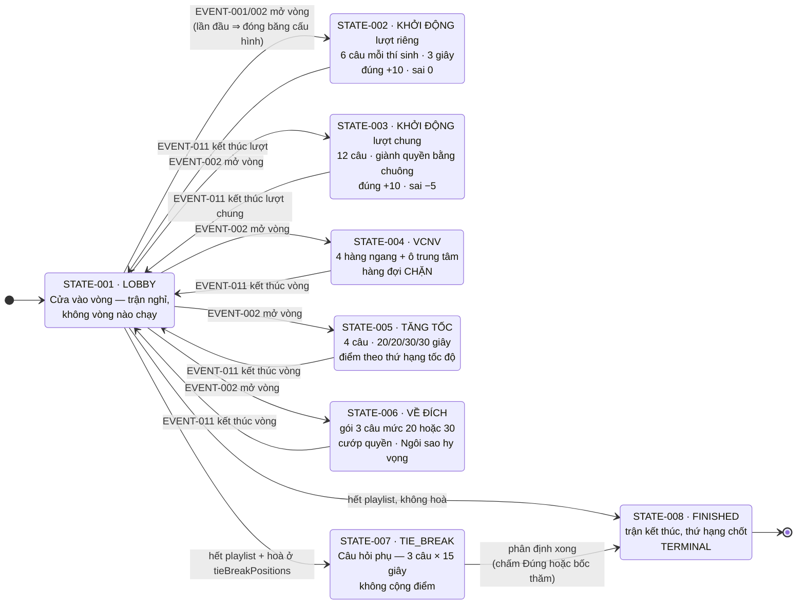
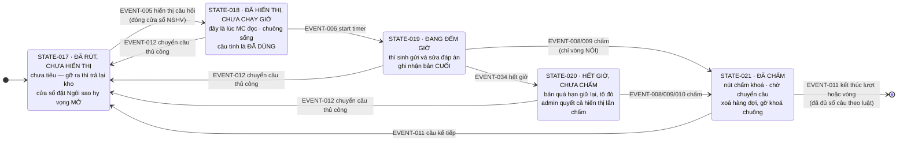
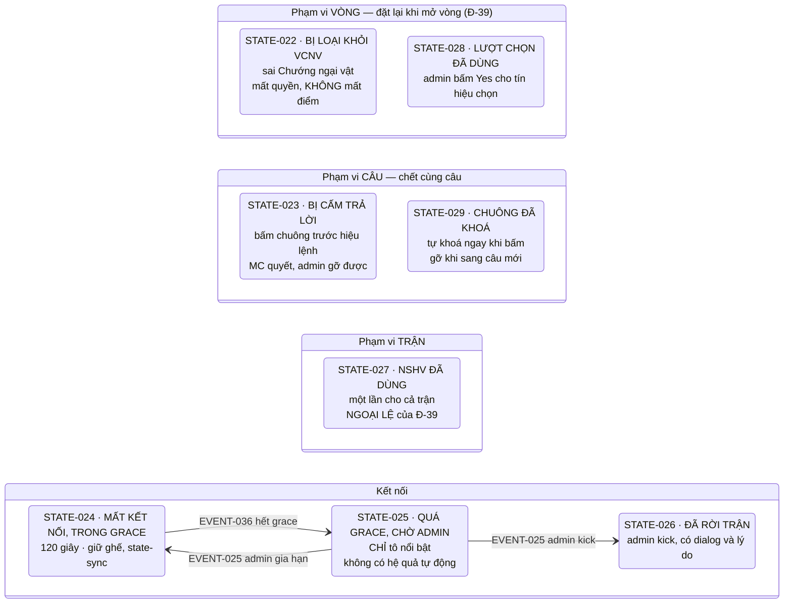
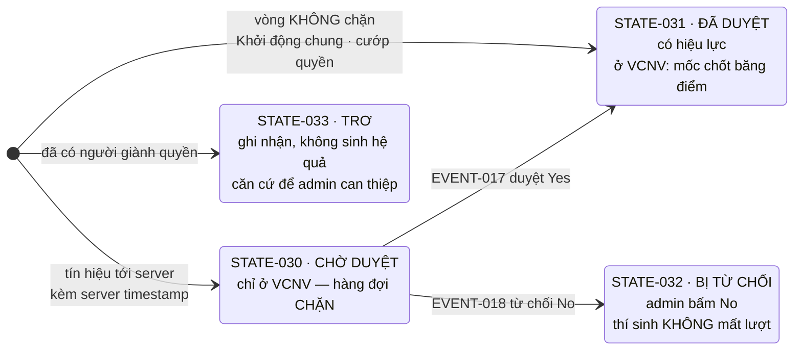
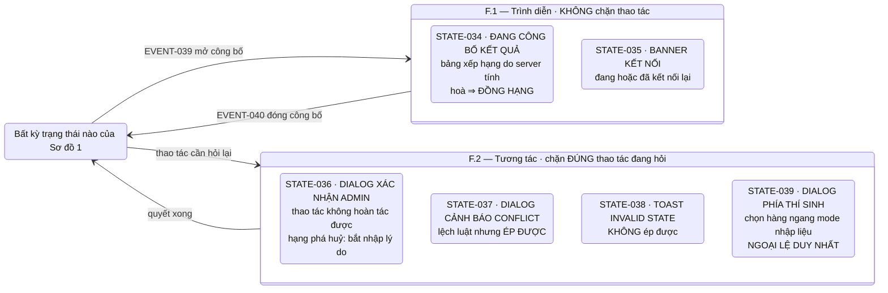

# Game State Machine

> **Ngày lập**: 2026-07-27
> **Phạm vi**: máy trạng thái nghiệp vụ của một **trận** (match) theo luật O26, phủ 5 vòng thi + luật xuyên vòng.
> **Loại tài liệu**: đặc tả **nghiệp vụ**. Không chứa code, pseudocode, tên lớp, tên bảng dữ liệu.
>
> **Cập nhật gần nhất**: 2026-07-27.
>
> **Bốn quyết định của chủ dự án được đưa vào tài liệu này** — `Đ-37` (sửa danh sách đề tại cửa vào vòng) · `Đ-38` (`LOBBY` là cửa vào vòng, enum 4 giá trị) · `Đ-39` (pipeline vòng độc lập) · `C-19` / `C-20` (màn công bố kết quả · điểm số công khai với mọi vai).
>
> **Hai nguồn KHÔNG dùng làm căn cứ**: `plans/**` là **bản nháp** (`CLAUDE.md`); demo tĩnh `public/` là **bản xem thử làm vội, không có giá trị tham chiếu** (chủ dự án xác nhận 2026-07-27). Tiền lệ hiện thực `Athena-Intelligent-Olympia` dùng để **phát hiện nhánh còn thiếu**, không dùng để quyết luật — đối chiếu ở [[#D. Đối chiếu tiền lệ — Athena|§D]].

## Quan hệ với các tài liệu khác

| File | Vai trò |
|---|---|
| `docs/source/fandom-olympia-26-luat-choi.md` | Luật gốc O26 nguyên văn — source of truth duy nhất |
| `docs/glossary.md` | Thuật ngữ chuẩn TERM-001 → TERM-059; file này dùng đúng tên ở đó |
| `docs/game-rules.md` | 37 rule GR-001 → GR-037; **mọi transition ở đây phải trỏ về ≥1 GR** |
| `docs/game-rules-inventory.md` | Kiểm kê R-*, mục chưa định nghĩa U-*, mâu thuẫn K-* |
| `docs/reviews/game-rules-decisions.md` | Quyết định đã chốt Đ-1 → Đ-37 |
| `docs/reviews/game-rules-resolutions.md` | Phân xử 26/07 + 25 đề xuất **chưa duyệt** |
| `D:\Github\Athena-Intelligent-Olympia` | **Tiền lệ hiện thực** (.NET/WPF, đã chạy thật) — `K-15` gọi là *"Athena cũ"* và đã **bãi bỏ** bảng điểm của nó. **KHÔNG phải nguồn requirement**: dùng để **phát hiện nhánh còn thiếu**, không dùng để quyết luật. Đối chiếu ở [[#D. Đối chiếu tiền lệ — Athena|§D]] |

## Quy ước đọc

- **Bốn thang bậc trạng thái, KHÔNG trộn lẫn** — đây là hệ quả trực tiếp của `TERM-022` (`⚠ CONFLICT`: từ *"state"* được dùng cho cả cấp trận lẫn cấp ghế):
  - **Cấp TRẬN** (STATE-001 → STATE-008) — **loại trừ lẫn nhau**, đúng **một** giá trị tại một thời điểm.
  - **Cấp GIAI ĐOẠN / CÂU** (STATE-009 → STATE-021) — nằm **bên trong** một trạng thái cấp trận.
  - **Cấp GHẾ và cấp TÍN HIỆU** (STATE-022 → STATE-033) — **cờ song song**, nhiều cái cùng đúng một lúc.
  - **Cấp LỚP PHỦ** (STATE-034 → STATE-039) — chồng lên trạng thái đang chạy mà **không huỷ** nó; **nhiều lớp cùng bật là hợp lệ**. Xem `INV-21`.
- **Marker**: `NEEDS CLARIFICATION` = nguồn chưa quy định · `CONFLICT` = hai nguồn cùng áp dụng nhưng cho outcome khác nhau; tài liệu này **không phân xử**.
- Trạng thái nào **không có nguồn** thì **không được đặt ra** — chỗ cần một trạng thái trung gian mà tài liệu chưa quy định được ghi ở [[#Unresolved transitions|Unresolved transitions]].

---

---

# Sơ đồ

> Sáu sơ đồ theo đúng sáu thang bậc ở [[#Quy ước đọc|Quy ước đọc]]. Mỗi node ghi **mã + mô tả ngắn**; nhãn trên mũi tên là **sự kiện** (mã `EVENT-*`), guard đặt trong ngoặc.
>
> **Chỉ sơ đồ 1 và 2 là máy trạng thái loại trừ lẫn nhau.** Bốn sơ đồ còn lại mô tả **vòng đời song song** — chúng chạy *bên trong* hoặc *chồng lên* sơ đồ 1, không thay thế nó.

## Sơ đồ 1 — Cấp TRẬN (§A)

> **Admin chọn vòng nào mở — playlist chỉ là gợi ý** (`Đ-5`). Năm mũi tên từ `S001` vẽ rời để thấy rõ điều đó: **không có thứ tự cưỡng chế**.
> **Bỏ vòng / chạy lại vòng** (EVENT-003/004) đưa **mọi** vòng về `S001`; không vẽ để sơ đồ khỏi rối.
> Mọi cạnh `S001 → vòng` mang guard **cửa vào vòng đủ câu** (`Đ-31`); riêng cạnh **đầu tiên trong đời một trận** mang thêm side effect **đóng băng cấu hình** (`NT-C`).

## Sơ đồ 2 — Cấp CÂU (§C), áp cho mọi vòng

> **Bốn mốc đầu đều là NÚT BẤM CỦA ADMIN, thứ tự cố định, không gộp được.** Gộp *"hiển thị"* với *"start timer"* là **phá luật**: cửa sổ chuông co lại đúng bằng thời gian suy nghĩ, và cửa sổ Ngôi sao hy vọng mất mốc đóng.
> Ở vòng **gõ máy**, cạnh `S019 → S021` **không tồn tại** — nút chấm khoá tới khi hết giờ (`Đ-35`).

## Sơ đồ 3 — Giai đoạn bên trong VCNV và VỀ ĐÍCH (§B)

```mermaid
stateDiagram-v2
  state "STATE-004 · VCNV" as VCNV {
    direction LR
    S009: STATE-009 · CHỜ CHỌN HÀNG NGANG<br/>mỗi thí sinh tối đa 1 lượt chọn<br/>bắt đầu từ vị trí số 1
    S010: STATE-010 · GỢI Ý CUỐI<br/>ô trung tâm · cửa sổ 15 giây<br/>băng điểm CNV hạ còn 20
    S009 --> S009: hỏi xong một hàng ngang
    S009 --> S010: đã hỏi đủ 4 hàng<br/>và chưa ai giải đúng CNV
  }
  state "STATE-006 · VỀ ĐÍCH" as VD {
    direction LR
    S011: STATE-011 · XẾP LƯỢT<br/>điểm cao nhất đi trước<br/>hoà ⇒ số vị trí nhỏ nhất
    S012: STATE-012 · CHỌN GÓI<br/>3 mức từ 20 hoặc 30<br/>admin chọn hộ 20/20/20 nếu quá hạn
    S014: STATE-014 · THỰC HÀNH người thi chính<br/>30 giây câu 20đ · 60 giây câu 30đ
    S013: STATE-013 · CỬA SỔ CƯỚP QUYỀN<br/>5 giây · hàng đợi KHÔNG chặn<br/>người cướp tính bản ĐẦU TIÊN
    S015: STATE-015 · THỰC HÀNH người cướp<br/>20 giây câu 20đ · 40 giây câu 30đ<br/>KHÁC cửa sổ chuông 5 giây
    S011 --> S012: admin chốt người thi
    S012 --> S014: câu được khai là thực hành
    S012 --> S013: chấm Sai người thi chính
    S014 --> S013: chấm không đạt
    S013 --> S015: có người giành được quyền<br/>và là câu thực hành
    S013 --> S011: hết lượt, còn người chưa thi
  }
```

> **Hai con số hay bị lẫn ở Về đích**: **5 giây** là độ dài **cửa sổ bấm chuông**; **20/40 giây** là **thời gian thực hành của người cướp**, chỉ bắt đầu đếm **sau khi** đã có người giành được quyền.

## Sơ đồ 4 — Cấp GHẾ (§D): cờ song song

> Bốn nhóm này **không loại trừ nhau**: một ghế có thể vừa bị loại khỏi VCNV, vừa đã dùng NSHV, vừa đang mất kết nối. **Vòng đời khác nhau** là lý do phải tách nhóm — `Đ-39` đặt lại nhóm *phạm vi VÒNG* tại mốc mở vòng, nhưng **không** đụng nhóm *phạm vi TRẬN*.

## Sơ đồ 5 — Cấp TÍN HIỆU (§E)

> **`S032` và `S033` là trạng thái cuối của một tín hiệu, nhưng KHÔNG BAO GIỜ bị xoá** — lịch sử tín hiệu là append-only vĩnh viễn (`INV-01`). Thứ bị xoá theo câu hoặc vòng là **hàng đợi đang hoạt động**, không phải lịch sử.

## Sơ đồ 6 — Cấp LỚP PHỦ (§F)

> **`INV-21`**: mở hay đóng một lớp phủ **không đổi gì** ở trạng thái bên dưới — không sinh event điểm, không đụng đồng hồ, không đụng hàng đợi. **Nhiều lớp bật cùng lúc là hợp lệ.**
> Ở **F.2**, bản thân hộp thoại **chỉ hỏi**; thứ đổi trạng thái là **hành động được xác nhận sau đó**, và hành động đó có event riêng. Nên *"bấm Yes"* **không phải** transition của lớp phủ.
> **Phân biệt `S037` với `S038`** — hai thứ trông giống nhau với người dùng nhưng khác hẳn về quyền: cảnh báo thì **ép được**, toast thì **không**.

# States

## A. Cấp TRẬN — loại trừ lẫn nhau

### STATE-001 — LOBBY (CỬA VÀO VÒNG)

- **Description**: **trạng thái nghỉ của trận** — không vòng nào đang chạy. Dùng **cả trước vòng đầu tiên lẫn giữa hai vòng** (`Đ-38`). Là nơi chạy pre-flight và là **cửa vào** của mọi vòng.
- **Entry conditions**: (a) trận được tạo — contest đã gán kho đề, người tạo **đã chọn danh sách câu hỏi** (hệ thống KHÔNG tự lấy đề) · (b) **mọi** nút *"Kết thúc vòng"* · (c) bỏ vòng · (d) chạy lại vòng.
- **Allowed actions**: **mở bất kỳ vòng nào** (EVENT-001 / EVENT-002) · **thêm / bớt câu và sửa thông tin câu trong danh sách đã gán** (EVENT-038) · **sửa điểm qua event log** (EVENT-020) · **mở công bố kết quả** (EVENT-039) · chạy pre-flight · viewer/overlay join bằng mã phòng 6 số · **gán ghế và vị trí — chỉ khi chưa vòng nào từng chạy**.
- **Forbidden actions**: mọi thao tác thi đấu của thí sinh (chuông, gửi đáp án) — không câu nào đang mở · đổi vị trí ghế **sau khi trận đã start** (`R-VD-02`, `TERM-002`).
- **Exit conditions**: **ba nhánh** — (a) admin mở một vòng, với điều kiện cửa vào vòng đủ câu (`Đ-31`) · (b) → `TIE_BREAK` khi hết playlist và có hoà ở `tieBreakPositions` · (c) → `FINISHED` khi hết playlist, không hoà.

> **Một guard duy nhất phân biệt "trước trận" với "giữa hai vòng"**: khi admin mở một vòng, **nếu chưa vòng nào từng chạy** thì cạnh đó **kèm đóng băng cấu hình** (`NT-C`: RuleConfig · mode trả lời · danh sách câu · `revealAnswerAfterJudge`) — một chiều, đúng một lần. Ngược lại thì không.
>
> Điều kiện *"chưa vòng nào từng chạy"* **không phải cờ lưu trữ** — nó suy ra từ event log (`Đ-5.3`). Đó là lý do hai trạng thái cũ gộp được: khác biệt nằm trên **một cạnh**, không nằm ở **bản thân trạng thái**.
>
> **Nội dung trình diễn giữa hai vòng** (giao lưu, giải lao, video hình hiệu) **không cần** trạng thái riêng — nó là **lớp phủ** do admin bật/tắt (§F), không phải một bước của luồng thi đấu.
- **Terminal**: No
- **Related rules**: GR-031, GR-035
- **Source**: `game-rules-inventory.md` §Trạng thái game · `game-rules.md` §GR-031 Related states, Evaluation order

### STATE-002 — KHỞI ĐỘNG · LƯỢT RIÊNG

- **Description**: vòng Khởi động, phân đoạn lượt riêng. Mỗi thí sinh trả lời **6** câu của riêng mình; suy nghĩ **3 giây** kể từ mốc admin bấm start timer. Đúng **+10**, sai **0** (không phạt).
- **Entry conditions**: admin mở vòng Khởi động (EVENT-002); cửa vào vòng đủ câu; lượt riêng khoá vào **một** thí sinh trước câu đầu tiên.
- **Allowed actions**: admin hiển thị câu → start timer → chấm Đúng/Sai → Câu kế tiếp · thí sinh gửi đáp án (chỉ mode nhập liệu) · admin điều chỉnh điểm thủ công · admin bỏ/chạy lại vòng.
- **Forbidden actions**: bấm chuông (lượt riêng không có chuông) · hỏi câu thứ 7 — **KHÔNG TỒN TẠI**, nút "Câu kế tiếp" đã chuyển thành "Kết thúc lượt" · máy tự chấm.
- **Exit conditions**: đã chấm xong câu thứ 6 của thí sinh cuối cùng **và** admin bấm kết thúc lượt riêng.
- **Terminal**: No
- **Related rules**: GR-001, GR-002, GR-006, GR-026, GR-033
- **Source**: `docs/source/fandom-olympia-26-luat-choi.md` §Khởi động đoạn 2 · `game-rules.md` §GR-001 Related states, Boundaries

### STATE-003 — KHỞI ĐỘNG · LƯỢT CHUNG

- **Description**: phân đoạn lượt chung của vòng Khởi động. **12** câu, giành quyền bằng chuông. Đúng **+10**, sai hoặc bấm chuông rồi im lặng **−5**.
- **Entry conditions**: lượt riêng của **mọi** thí sinh đã kết thúc; admin mở lượt chung.
- **Allowed actions**: thí sinh bấm chuông (cửa sổ mở từ mốc hiển thị câu, kéo qua lúc MC đọc, thêm **3 giây** sau mốc start timer) · admin hiển thị câu / start timer / chấm Đúng / Sai / **Huỷ kết quả** / chuyển câu thủ công.
- **Forbidden actions**: bấm chuông sau khi đã có người giành quyền **làm đổi người giữ quyền** (tín hiệu vẫn được ghi nhưng **trơ**) · mở lại chuông trên câu đã chấm · hỏi câu thứ 13 — KHÔNG TỒN TẠI.
- **Exit conditions**: đã chấm xong (hoặc bỏ qua) câu thứ 12 **và** admin bấm kết thúc lượt chung.
- **Terminal**: No
- **Related rules**: GR-003, GR-004, GR-005, GR-006, GR-032, GR-034
- **Source**: `docs/source/fandom-olympia-26-luat-choi.md` §Khởi động đoạn 3-5 · `game-rules.md` §GR-003, §GR-004 Boundaries

### STATE-004 — VƯỢT CHƯỚNG NGẠI VẬT (VCNV)

- **Description**: vòng đi tìm Chướng ngại vật qua **4 hàng ngang** + **1 ô trung tâm**. Hàng ngang **luôn trả lời bằng máy** bất kể mode contest. Là vòng **duy nhất** hàng đợi tín hiệu **CHẶN**.
- **Entry conditions**: admin mở vòng VCNV; cửa vào vòng đủ câu.
- **Allowed actions**: chọn hàng ngang (**một đường vào mỗi mode**: sân khấu → chỉ admin; nhập liệu → chỉ thí sinh) · mọi thí sinh chưa bị loại gõ đáp án hàng ngang · bấm "Mở chướng ngại vật" **bất cứ lúc nào** · admin duyệt Yes/No từng tín hiệu · admin mở miếng ghép.
- **Forbidden actions**: thao tác từ ghế **đã bị loại** — máy thí sinh không hiển thị gì, bấm không phản hồi · chọn hàng ngang **đã mở** · ưu tiên tín hiệu theo **loại** khi duyệt hàng đợi (phải thuần FIFO theo server timestamp).
- **Exit conditions**: (a) có người giải **đúng** Chướng ngại vật · (b) **toàn bộ** thí sinh bị loại → STATE-007 · (c) hết cửa sổ 15 giây sau gợi ý cuối mà không ai giải.
- **Terminal**: No
- **Related rules**: GR-007 → GR-012, GR-032
- **Source**: `docs/source/fandom-olympia-26-luat-choi.md` §Vượt chướng ngại vật · `game-rules.md` §GR-007 Related states

### STATE-005 — TĂNG TỐC

- **Description**: **4** câu, thời gian lần lượt **20/20/30/30 giây**, **luôn gõ máy**. Điểm theo **thứ hạng tốc độ trong số người được admin chấm ĐÚNG**: 40/30/20/10. Đồng thời gian (bằng nhau ở **millisecond**) ⇒ cùng mức điểm, bậc kế **nhảy qua** số người hoà.
- **Entry conditions**: admin mở vòng Tăng tốc; cửa vào vòng đủ câu.
- **Allowed actions**: thí sinh gửi và **gửi lại** đáp án tới khi hết giờ (ghi nhận **bản cuối**) · admin hiển thị câu / start timer / chấm từng người / chốt câu.
- **Forbidden actions**: khoá ô nhập của thí sinh trước khi hết giờ · admin chấm **trước** khi hết giờ (nút chấm khoá tới khi hết giờ ở vòng gõ máy) · sinh **nhiều** event điểm cho một câu — một câu = **MỘT** event điểm cho **toàn bộ** bảng.
- **Exit conditions**: đã chốt câu thứ 4 **và** admin bấm kết thúc vòng.
- **Terminal**: No
- **Related rules**: GR-013, GR-014, GR-015, GR-026, GR-035
- **Source**: `docs/source/fandom-olympia-26-luat-choi.md` §Tăng tốc · `game-rules.md` §GR-013 Related states

### STATE-006 — VỀ ĐÍCH

- **Description**: mỗi thí sinh một **lượt thi** với **gói 3 câu** chọn từ hai mức **{20, 30}**. Sai ⇒ mở **cửa sổ cướp quyền 5 giây**. Mỗi thí sinh có **1 lần** Ngôi sao hy vọng cả trận.
- **Entry conditions**: vòng Tăng tốc đã kết thúc; điểm tích luỹ đã tính; admin mở vòng Về đích.
- **Allowed actions**: admin xếp/ép lượt (hệ thống chỉ **recommend**) · thí sinh chọn gói · thí sinh đặt NSHV **trước** mốc admin hiển thị câu · thí sinh khác bấm chuông cướp quyền · admin chấm Đúng / Sai / **Huỷ kết quả**.
- **Forbidden actions**: đặt NSHV sau mốc admin bấm hiển thị câu — nút không render, không có tín hiệu · người **cướp** dùng NSHV trên câu đang cướp · đổi gói sau mốc admin hiển thị câu đầu tiên của gói.
- **Exit conditions**: **mọi** thí sinh đã hoàn thành lượt của mình **và** admin bấm kết thúc vòng.
- **Terminal**: No
- **Related rules**: GR-016 → GR-021
- **Source**: `docs/source/fandom-olympia-26-luat-choi.md` §Về đích · `game-rules.md` §GR-016 Related states

### STATE-007 — TIE_BREAK (Câu hỏi phụ)

- **Description**: vòng phân định thí sinh hoà điểm. **3** câu, **15 giây** mỗi câu, giành quyền bằng chuông. **Không cộng điểm** — chỉ đổi thứ hạng.
- **Entry conditions**: vòng Về đích đã kết thúc (cửa sổ cướp câu cuối đã đóng và đã chấm) **và** ≥2 thí sinh cùng điểm cao nhất **và** vị trí hoà nằm trong `tieBreakPositions` (mặc định `[1]` — chỉ vị trí NHẤT) **và** cửa vào vòng đủ 3 câu.
- **Allowed actions**: admin hiển thị câu → bấm mốc hiệu lệnh (= start timer) → chấm · thí sinh bấm chuông · admin gỡ lệnh cấm cho ghế bấm sớm.
- **Forbidden actions**: cộng/trừ điểm trận · bấm chuông **trước** mốc hiệu lệnh mà không chịu hình phạt mất quyền trả lời câu đó.
- **Exit conditions**: (a) một thí sinh được chấm **Đúng** ⇒ thắng tie-break · (b) hết 3 câu chưa phân định ⇒ STATE-016 (bốc thăm) · (c) admin bỏ vòng.
- **Terminal**: No
- **Related rules**: GR-022, GR-023, GR-024, GR-025
- **Source**: `docs/source/fandom-olympia-26-luat-choi.md` §Câu hỏi phụ · `game-rules.md` §GR-022 Related states

### STATE-008 — FINISHED

- **Description**: trận đã kết thúc; bảng điểm cuối và thứ hạng đã chốt; xuất được biên bản trận.
- **Entry conditions**: (a) vòng cuối playlist kết thúc **và** không có nhóm hoà trong phạm vi `tieBreakPositions` · (b) tie-break đã phân định được người thắng · (c) kết quả bốc thăm đã được admin xác nhận.
- **Allowed actions**: **mở công bố kết quả (EVENT-039)** — hệ thống **gợi ý** mở tại đây · xem lại biên bản và toàn bộ lịch sử event · xuất PDF/biên bản · điều chỉnh điểm thủ công (sinh event mới, lịch sử append-only) · xem lại lịch sử tín hiệu.
- **Forbidden actions**: mọi tín hiệu của thí sinh — vào lịch sử nhưng **không có hiệu lực** · xoá hoặc sửa event cũ.
- **Exit conditions**: **không có** đường ra được nguồn phê duyệt. Xem [[#Terminal states|Terminal states]] và mục `UNRES-13`, `UNRES-14`.
- **Terminal**: **Yes**
- **Related rules**: GR-022, GR-025, GR-028, GR-029
- **Source**: `game-rules-inventory.md` §Trạng thái game · `game-rules.md` §GR-022 Decision table C3/C4

---

## B. Giai đoạn bên trong một vòng

### STATE-009 — VCNV · CHỜ CHỌN HÀNG NGANG

- **Description**: giai đoạn đang chờ một hàng ngang được chọn. Mỗi thí sinh có **tối đa 1 lượt lựa chọn**, bắt đầu từ **vị trí số 1**.
- **Entry conditions**: đang ở STATE-004; còn ≥1 hàng ngang chưa được chọn; chưa ai giải đúng Chướng ngại vật.
- **Allowed actions**: phát tín hiệu chọn hàng ngang (chủ thể theo mode) · bấm "Mở chướng ngại vật" · admin duyệt Yes/No.
- **Forbidden actions**: chọn hàng ngang đã mở · admin chọn thay thí sinh ở mode nhập liệu.
- **Exit conditions**: admin xác nhận một tín hiệu chọn ⇒ hàng ngang đó chuyển sang đang được hỏi (STATE-018).
- **Terminal**: No
- **Related rules**: GR-007, GR-032
- **Source**: `docs/source/fandom-olympia-26-luat-choi.md` §VCNV đoạn 3 · `game-rules.md` §GR-007 Conditions

### STATE-010 — VCNV · GỢI Ý CUỐI (ô trung tâm)

- **Description**: giai đoạn cuối vòng VCNV. Câu ô trung tâm đúng ⇒ **+10** và ô mở; sai ⇒ ô không mở. Sau gợi ý cuối, giải đúng Chướng ngại vật chỉ còn **20 điểm**, **không phụ thuộc** câu ô trung tâm đúng hay sai.
- **Entry conditions**: cả **4** hàng ngang **đã được hỏi** (không phải "4 miếng ghép đã mở") **và** chưa ai giải đúng Chướng ngại vật **và** còn ≥1 thí sinh chưa bị loại.
- **Allowed actions**: **mọi** thí sinh chưa bị loại trả lời câu ô trung tâm (luôn gõ máy, không theo lượt) · bấm "Mở chướng ngại vật" trong cửa sổ **15 giây** · admin mở ô trung tâm.
- **Forbidden actions**: chờ đủ 4 miếng ghép mở mới cho ra gợi ý cuối · hoàn tác việc đã đưa ra gợi ý cuối vì câu ô trung tâm sai.
- **Exit conditions**: có người giải đúng Chướng ngại vật · hoặc hết **15 giây** không ai giải ⇒ vòng khép lại.
- **Terminal**: No
- **Related rules**: GR-011, GR-009
- **Source**: `docs/source/fandom-olympia-26-luat-choi.md` §VCNV đoạn "Sau khi cả 4 từ hàng ngang…" · `game-rules.md` §GR-011

### STATE-011 — VỀ ĐÍCH · XẾP LƯỢT

- **Description**: giai đoạn xác định thí sinh nào thi lượt kế tiếp. Điểm cao nhất đi trước; hoà điểm thì **số vị trí nhỏ nhất** đi trước. Tính lại **sau mỗi lượt**.
- **Entry conditions**: vào STATE-006, hoặc một lượt Về đích vừa hoàn thành và còn thí sinh chưa thi.
- **Allowed actions**: hệ thống hiển thị **recommendation** · admin xác nhận hoặc **ép** người khác (qua dialog cảnh báo Yes/No).
- **Forbidden actions**: hệ thống **chặn cứng** thứ tự — thứ tự chỉ là recommendation, admin ép được.
- **Exit conditions**: admin chốt người thi lượt này ⇒ STATE-012.
- **Terminal**: No
- **Related rules**: GR-016
- **Source**: `docs/source/fandom-olympia-26-luat-choi.md` §Về đích đoạn "Thứ tự tham gia…" · `game-rules.md` §GR-016

### STATE-012 — VỀ ĐÍCH · CHỌN GÓI

- **Description**: thí sinh đang chọn **3** mức từ tập **{20, 30}** để tạo gói của mình. Bốn phối hợp hợp lệ: 20/20/20 · 20/20/30 · 20/30/30 · 30/30/30.
- **Entry conditions**: thí sinh đã được chốt là người thi lượt hiện tại.
- **Allowed actions**: thí sinh chọn và **đổi** gói (last-wins) · admin chọn hộ mặc định **20/20/20** nếu thí sinh chưa chọn khi tới lượt.
- **Forbidden actions**: chọn số mục ≠ 3 · chọn mức ngoài {20, 30} dưới preset `O26_DEFAULT@1` · đổi gói **sau** mốc admin hiển thị câu đầu tiên của gói.
- **Exit conditions**: gói được chốt và câu đầu tiên được rút ⇒ STATE-017.
- **Terminal**: No
- **Related rules**: GR-017
- **Source**: `docs/source/fandom-olympia-26-luat-choi.md` §Về đích đoạn 4 · `game-rules.md` §GR-017

### STATE-013 — VỀ ĐÍCH · CỬA SỔ CƯỚP QUYỀN

- **Description**: cửa sổ **5 giây** để các thí sinh **khác** bấm chuông giành quyền trả lời sau khi người thi chính bị chấm Sai. Hàng đợi **KHÔNG chặn** — có chuông là tính ngay.
- **Entry conditions**: admin bấm **Sai** (hoặc "không đạt" ở câu thực hành) cho người thi chính.
- **Allowed actions**: thí sinh khác bấm chuông · admin chấm người cướp Đúng / Sai / **Huỷ kết quả**.
- **Forbidden actions**: người thi chính bấm chuông cướp câu của chính mình · người cướp đặt NSHV trên câu đang cướp · ghi nhận **bản cuối** của người cướp — người cướp chỉ tính **bản ĐẦU TIÊN**.
- **Exit conditions**: có người giành quyền và đã được chấm · hoặc hết **5 giây** không ai bấm ⇒ câu khép lại.
- **Terminal**: No
- **Related rules**: GR-018, GR-019, GR-020, GR-021
- **Source**: `docs/source/fandom-olympia-26-luat-choi.md` §Về đích đoạn 5 · `game-rules.md` §GR-020

### STATE-014 — VỀ ĐÍCH · PHA THỰC HÀNH (người thi chính)

- **Description**: pha thao tác với dụng cụ ở câu được khai là thực hành. **30 giây** (câu 20đ) · **60 giây** (câu 30đ). Kênh trả lời **thứ ba** — không phải nói, không phải gõ.
- **Entry conditions**: câu đang mở được khai `isPractical` **và** admin đã bấm **bắt đầu thực hành** (mốc riêng, sau start timer).
- **Allowed actions**: thí sinh thực hành · admin chấm "đạt yêu cầu" / "không đạt" — nút chấm **sống suốt**, không khoá tới hết giờ (không có ô nhập nào để chờ).
- **Forbidden actions**: gộp "start timer" và "bắt đầu thực hành" thành một nút · máy tự kết luận "đạt yêu cầu" từ tiêu chí đã khai · highlight ký tự (không tồn tại đáp án text).
- **Exit conditions**: admin chấm "đạt" ⇒ cộng giá trị câu · admin chấm "không đạt" ⇒ STATE-013.
- **Terminal**: No
- **Related rules**: GR-019
- **Source**: `docs/source/fandom-olympia-26-luat-choi.md` §Về đích đoạn "Trong câu hỏi thực hành…" · `game-rules.md` §GR-019

### STATE-015 — VỀ ĐÍCH · PHA THỰC HÀNH (người cướp quyền)

- **Description**: pha thực hành của thí sinh đã cướp được quyền. **20 giây** (câu 20đ) · **40 giây** (câu 30đ) — **khác** cửa sổ bấm chuông 5 giây và khác thời gian thực hành của người thi chính.
- **Entry conditions**: một thí sinh đã giành được quyền trong STATE-013 ở một câu thực hành.
- **Allowed actions**: người cướp thực hành · admin chấm "đạt" / "không đạt" / "Huỷ kết quả".
- **Forbidden actions**: dùng **5 giây** làm thời gian thực hành của người cướp (5 giây là độ dài **cửa sổ bấm chuông**, không phải thời gian thực hành).
- **Exit conditions**: admin chấm ⇒ transfer điểm (đạt) hoặc **−½** giá trị câu (không đạt).
- **Terminal**: No
- **Related rules**: GR-019 C4, GR-020
- **Source**: `docs/source/fandom-olympia-26-luat-choi.md` §Về đích đoạn "Trong câu hỏi thực hành…" · `game-rules.md` §GR-019 Mô hình dữ liệu

### STATE-016 — CÂU HỎI PHỤ · BỐC THĂM

- **Description**: giai đoạn phân định bằng bốc thăm khi hết 3 câu vẫn chưa ai trả lời đúng. Server random, **admin xác nhận**.
- **Entry conditions**: đã hỏi hết **3** câu tie-break **và** 0 thí sinh được chấm Đúng **và** nhóm hoà ≥2 người.
- **Allowed actions**: admin bấm bốc thăm · admin bấm **bốc lại** (thao tác riêng, có dialog Yes/No, sinh event mới) · admin xác nhận kết quả.
- **Forbidden actions**: xoá hoặc đánh dấu vô hiệu lần bốc trước — **cả hai lần đều là event thật trong log**, lần cuối cùng có hiệu lực.
- **Exit conditions**: admin xác nhận kết quả bốc thăm ⇒ STATE-008.
- **Terminal**: No
- **Related rules**: GR-025
- **Source**: `docs/source/fandom-olympia-26-luat-choi.md` §Câu hỏi phụ câu cuối · `game-rules.md` §GR-025

---

## C. Cấp CÂU — vòng đời một câu hỏi

> Bốn mốc chuyển giữa các trạng thái này **đều là nút bấm của admin**, thứ tự **cố định**, nút sau chỉ bật khi nút trước đã bấm (`Đ-26`, `Đ-33`, nguyên tắc nền điểm 17).

### STATE-017 — CÂU ĐÃ RÚT, CHƯA HIỂN THỊ

- **Description**: câu đã được server rút khỏi pool nhưng chưa lên màn thí sinh. **Chưa tiêu** — nếu không hiển thị thì **trả lại kho đề**.
- **Entry conditions**: sự kiện rút đề đã phát cho câu này.
- **Allowed actions**: admin bấm hiển thị câu hỏi · admin rút lại (câu quay về kho).
- **Forbidden actions**: bấm chuông · gửi đáp án · đặt NSHV bị chặn — cửa sổ NSHV **đang mở** ở trạng thái này, đây là chỗ **duy nhất** đặt được.
- **Exit conditions**: admin bấm hiển thị câu hỏi ⇒ STATE-018.
- **Terminal**: No
- **Related rules**: GR-031, GR-021, GR-033
- **Source**: `game-rules.md` §GR-031 Outcomes (`GRR-118`) · §GR-021 Conditions

### STATE-018 — CÂU ĐÃ HIỂN THỊ, ĐỒNG HỒ CHƯA CHẠY

- **Description**: câu đã lên màn thí sinh và viewer. Khoảng này **chính là lúc MC đọc**. Câu được đánh dấu **đã dùng trong contest** tại đúng mốc này.
- **Entry conditions**: admin bấm hiển thị câu hỏi.
- **Allowed actions**: bấm chuông (**cửa sổ chuông mở từ đây** ở lượt chung Khởi động) · admin bấm start timer.
- **Forbidden actions**: đặt Ngôi sao hy vọng — cửa sổ **đã đóng** tại mốc vào trạng thái này; nút không render, không có tín hiệu · trả lại câu về kho.
- **Exit conditions**: admin bấm start timer ⇒ STATE-019.
- **Terminal**: No
- **Related rules**: GR-003, GR-021, GR-031, GR-033
- **Source**: `game-rules.md` §Nguyên tắc nền điểm 17 · §GR-033 Conditions

### STATE-019 — ĐANG ĐẾM GIỜ

- **Description**: đồng hồ suy nghĩ đang chạy. Độ dài lấy từ **metadata của TỪNG CÂU**, preset chỉ đặt default.
- **Entry conditions**: admin bấm start timer.
- **Allowed actions**: thí sinh gửi và gửi lại đáp án (bản rỗng bị bỏ qua, giữ bản hợp lệ trước) · bấm chuông trong cửa sổ còn mở · ở vòng **nói** (mode sân khấu) admin chấm được **bất cứ lúc nào**.
- **Forbidden actions**: ở vòng **gõ máy**, admin chấm trước khi hết giờ (nút chấm khoá) · bấm start timer lần thứ hai (nút tự khoá) · tín hiệu của thí sinh làm **gián đoạn** đồng hồ — đồng hồ chạy tiếp bình thường.
- **Exit conditions**: hết giờ ⇒ STATE-020 · hoặc admin chấm (chỉ ở vòng nói) ⇒ STATE-021.
- **Terminal**: No
- **Related rules**: GR-001, GR-006, GR-015, GR-033, GR-035
- **Source**: `game-rules.md` §Nguyên tắc nền điểm 10, 14, 21, 22 · `glossary.md` TERM-051

### STATE-020 — HẾT GIỜ, CHƯA CHẤM

- **Description**: cửa nhận đáp án đã đóng theo **server time**; chưa có phán quyết. Bản gửi tới **sau** mốc được giữ lại và tô **đỏ**, không tự ghi đè bản hợp lệ.
- **Entry conditions**: server time đã tới mốc hết giờ của câu.
- **Allowed actions**: admin bấm hiển thị đáp án · admin chấm Đúng / Sai / (**Huỷ kết quả** khi Sai kéo theo hình phạt, hoặc khi câu **chỉ có** bản quá hạn).
- **Forbidden actions**: máy tự loại bản quá hạn · máy tự chấm · thí sinh gửi thêm bản được tính là hợp lệ.
- **Exit conditions**: admin chấm ⇒ STATE-021.
- **Terminal**: No
- **Related rules**: GR-002, GR-008, GR-015, GR-026, GR-035
- **Source**: `game-rules.md` §Nguyên tắc nền điểm 21 (bảng bản quá hạn) · §GR-035 Concurrency

### STATE-021 — ĐÃ CHẤM, CHỜ CHUYỂN CÂU

- **Description**: câu đã đi qua **đúng một** phán quyết. Nút chấm khoá, nút "Câu kế tiếp" hiện lên. Chấm xong là **kết thúc câu**: xoá hàng đợi đang hoạt động, gỡ khoá chuông cho mọi ghế.
- **Entry conditions**: admin đã bấm một trong Đúng / Sai / Huỷ kết quả.
- **Allowed actions**: admin bấm "Câu kế tiếp" (hoặc nút kết thúc lượt/vòng khi đã đủ số câu theo luật) · admin mở miếng ghép (VCNV) · điều chỉnh điểm thủ công.
- **Forbidden actions**: chấm lại · đổi phán quyết tại chỗ · mở lại chuông cho người khác trên cùng câu. Muốn sửa thì đi qua hoàn nguyên event log hoặc điều chỉnh thủ công.
- **Exit conditions**: admin bấm "Câu kế tiếp" ⇒ STATE-017 của câu kế · hoặc bấm nút kết thúc lượt/vòng.
- **Terminal**: No
- **Related rules**: GR-004, GR-026, GR-028, GR-029
- **Source**: `game-rules.md` §Nguyên tắc nền điểm 12, 13, 18, 19

---

## D. Cấp GHẾ — cờ song song, nhiều cái cùng đúng

> Đây là **thang bậc thứ hai** của từ *"state"* (`TERM-022` S2). Các cờ dưới đây **không** loại trừ nhau và **không** loại trừ trạng thái cấp trận.

### STATE-022 — GHẾ BỊ LOẠI KHỎI VCNV

- **Description**: hệ quả của việc trả lời **sai** Chướng ngại vật. Phạm vi **một vòng** — thí sinh vẫn thi Tăng tốc, Về đích và vẫn có thể thắng trận.
- **Entry conditions**: admin bấm Sai cho tín hiệu giải Chướng ngại vật đã được xác nhận.
- **Allowed actions**: không có, trong phạm vi VCNV. Ghế vẫn tham gia bình thường ở các vòng sau.
- **Forbidden actions**: trả lời hàng ngang · giải Chướng ngại vật · dùng lượt chọn chưa dùng — máy thí sinh **không hiển thị gì**, bấm **không phản hồi**.
- **Exit conditions**: vòng VCNV kết thúc (cờ chết cùng vòng).
- **Terminal**: No
- **Related rules**: GR-009, GR-010, GR-012
- **Source**: `docs/source/fandom-olympia-26-luat-choi.md` §VCNV câu cuối · `glossary.md` TERM-035

### STATE-023 — GHẾ BỊ CẤM TRẢ LỜI (theo CÂU)

- **Description**: hình phạt khi bấm chuông **trước hiệu lệnh** ở Câu hỏi phụ. Là một **TRẠNG THÁI CẤM**, không phải bỏ qua một lần bấm. Phạm vi **một câu**; lệnh cấm **chết cùng câu**.
- **Entry conditions**: server timestamp của tín hiệu chuông **nhỏ hơn** mốc admin bấm start timer, ở STATE-007.
- **Allowed actions**: admin bấm gỡ lệnh cấm (MC quyết bằng lời) — gỡ được **trước khi trả lời** và trong lúc câu còn mở; **giữ nguyên timestamp gốc**.
- **Forbidden actions**: trả lời câu đó khi cấm chưa được gỡ · áp cơ chế này ở Khởi động (luật cho phép bấm trong lúc MC đọc) hoặc VCNV (bấm bất cứ lúc nào).
- **Exit conditions**: admin gỡ cấm · hoặc câu kết thúc.
- **Terminal**: No
- **Related rules**: GR-024
- **Source**: `docs/source/fandom-olympia-26-luat-choi.md` §Câu hỏi phụ câu cuối · `glossary.md` TERM-036

### STATE-024 — GHẾ MẤT KẾT NỐI, TRONG GRACE

- **Description**: cửa sổ **120 giây** giữ ghế. Trong grace: giữ ghế + state-sync, banner "đang kết nối lại".
- **Entry conditions**: server phát hiện mất kết nối. Mỗi lần mất kết nối mở một cửa sổ **mới** — grace tính lại từ đầu, **không giới hạn số lần**.
- **Allowed actions**: thí sinh kết nối lại và được restore toàn bộ trạng thái · admin can thiệp sớm (kick / gia hạn) qua dialog Yes/No + audit.
- **Forbidden actions**: cộng dồn thời gian của các lần mất kết nối trước · tự loại ghế.
- **Exit conditions**: kết nối lại (≤ 120.000 giây — **biên đóng**) ⇒ cờ tắt · hết grace ⇒ STATE-025.
- **Terminal**: No
- **Related rules**: GR-036
- **Source**: `game-rules-inventory.md` §R-GEN-09 · `game-rules.md` §GR-036 Idempotency

### STATE-025 — GHẾ QUÁ GRACE, CHỜ ADMIN PHÁN QUYẾT

- **Description**: quá 120 giây. Hệ thống **CHỈ TÔ NỔI BẬT** ghế trên màn admin kèm thời lượng mất kết nối. **Không tự loại, không tự xoá** — trạng thái ghế **không đổi**.
- **Entry conditions**: đã quá ngưỡng grace mà ghế chưa kết nối lại.
- **Allowed actions**: admin bấm **giữ** · **gia hạn** · **kick**. Kick là thao tác không hoàn tác được ⇒ dialog Yes/No + AuditLog kèm lý do.
- **Forbidden actions**: mọi hệ quả tự động — không có chính sách dropout tự động nào tồn tại.
- **Exit conditions**: thí sinh kết nối lại · hoặc admin bấm một trong ba lựa chọn.
- **Terminal**: No
- **Related rules**: GR-036
- **Source**: `game-rules.md` §GR-036 Purpose (đóng `U-13`, chốt 2026-07-26)

### STATE-026 — GHẾ ĐÃ RỜI TRẬN

- **Description**: ghế bị admin kick.
- **Entry conditions**: admin bấm kick và xác nhận dialog.
- **Allowed actions**: xem lại lịch sử của ghế trong biên bản.
- **Forbidden actions**: mọi thao tác thi đấu.
- **Exit conditions**: `NEEDS CLARIFICATION` — không nguồn nào nói ghế đã kick có quay lại được không.
- **Terminal**: No (trong phạm vi ghế)
- **Related rules**: GR-036
- **Source**: `game-rules.md` §GR-036 C2b, C5

### STATE-027 — NGÔI SAO HY VỌNG ĐÃ DÙNG

- **Description**: cờ **một chiều**, phạm vi **một trận**, một lần cho mỗi đơn vị điểm.
- **Entry conditions**: thí sinh đặt NSHV trong cửa sổ hợp lệ (Về đích hàng đợi **không chặn** ⇒ có hiệu lực ngay khi tới).
- **Allowed actions**: — (chỉ đọc, dùng làm guard)
- **Forbidden actions**: đặt NSHV lần thứ hai — nút disabled.
- **Exit conditions**: không có trong phạm vi một trận.
- **Terminal**: Yes (trong phạm vi một trận)
- **Related rules**: GR-021
- **Source**: `docs/source/fandom-olympia-26-luat-choi.md` §Về đích đoạn 6 · `game-rules.md` §GR-021
- **Ghi chú**: `Đ-5.d` đề xuất phạm vi là **một contest**, không phải một trận — **đề xuất CHƯA DUYỆT**, xem `UNRES-04`.

### STATE-028 — LƯỢT CHỌN HÀNG NGANG ĐÃ DÙNG

- **Description**: cờ đánh dấu thí sinh đã dùng lượt chọn của mình ở VCNV.
- **Entry conditions**: admin **xác nhận** (bấm Yes) một tín hiệu chọn hàng ngang của thí sinh đó.
- **Allowed actions**: — (chỉ đọc, dùng làm guard)
- **Forbidden actions**: đặt cờ khi admin bấm **No** — **từ chối không làm thí sinh mất lượt**.
- **Exit conditions**: cờ được **bỏ qua** khi lượt quay vòng về vị trí 1 (ngoại lệ tường minh, chỉ áp khi đã có người bị loại).
- **Terminal**: No
- **Related rules**: GR-007
- **Source**: `docs/source/fandom-olympia-26-luat-choi.md` §VCNV đoạn 4 · `game-rules.md` §GR-007 Conditions

### STATE-029 — CHUÔNG ĐÃ KHOÁ (theo CÂU)

- **Description**: nút chuông **tự khoá ngay khi bấm**, ở frontend, **trước khi gửi tín hiệu** ⇒ một ghế chỉ phát được **một** tín hiệu chuông cho một câu. Áp cho **mọi nút được xếp là chuông**, gồm nút "Mở chướng ngại vật".
- **Entry conditions**: thí sinh bấm chuông.
- **Allowed actions**: — (chỉ đọc)
- **Forbidden actions**: áp cơ chế này cho **nút gửi đáp án** (không khoá) hoặc **thao tác chọn hàng ngang** (có cơ chế riêng).
- **Exit conditions**: câu kết thúc ⇒ gỡ khoá cho mọi ghế, sẵn sàng câu mới.
- **Terminal**: No
- **Related rules**: GR-004, GR-009, GR-034
- **Source**: `game-rules.md` §Nguyên tắc nền điểm 16, 18 · §GR-034 Idempotency

---

## E. Cấp TÍN HIỆU — vòng đời một tín hiệu trong hàng đợi

> `Đ-7.b2`: tín hiệu **gắn với ĐÍCH của nó** và vô hiệu khi đích đóng — chọn hàng ngang gắn với **lượt chọn**, trả lời gắn với **câu**, "Mở chướng ngại vật" gắn với **vòng**. **LỊCH SỬ tín hiệu KHÔNG BAO GIỜ bị xoá.**

### STATE-030 — TÍN HIỆU CHỜ DUYỆT

- **Description**: tín hiệu đã vào hàng đợi **chặn** và đang chờ admin bấm Yes/No. Chỉ tồn tại ở **VCNV**.
- **Entry conditions**: tín hiệu chọn hàng ngang hoặc "Mở chướng ngại vật" tới server trong cửa sổ hợp lệ.
- **Allowed actions**: admin bấm Yes ⇒ STATE-031 · admin bấm No ⇒ STATE-032.
- **Forbidden actions**: sắp xếp lại hàng đợi theo **loại** tín hiệu — thuần FIFO theo server timestamp · drop tín hiệu.
- **Exit conditions**: admin duyệt hoặc từ chối · hoặc đích của tín hiệu đóng ⇒ vô hiệu, **không bị xoá**.
- **Terminal**: No
- **Related rules**: GR-007, GR-009, GR-032
- **Source**: `game-rules.md` §GR-032 Decision table · §Nguyên tắc nền điểm 4

### STATE-031 — TÍN HIỆU ĐÃ DUYỆT

- **Description**: tín hiệu có hiệu lực. Ở VCNV, đây cũng là **mốc chốt băng điểm** Chướng ngại vật (`Đ-7.c`).
- **Entry conditions**: admin bấm Yes (vòng chặn) · hoặc tín hiệu tới trong cửa sổ ở vòng **không chặn** (Khởi động lượt chung, cướp quyền Về đích) — có hiệu lực **ngay**.
- **Allowed actions**: thực thi hệ quả theo luật của vòng.
- **Forbidden actions**: duyệt lại — nút Yes/No là nút một chiều, tự tắt.
- **Exit conditions**: hệ quả đã thực thi.
- **Terminal**: No
- **Related rules**: GR-007, GR-009, GR-032
- **Source**: `game-rules.md` §GR-032 · §GR-009 Evaluation order

### STATE-032 — TÍN HIỆU BỊ TỪ CHỐI

- **Description**: admin bấm No. Tín hiệu kế tiếp lên; **thí sinh KHÔNG mất lượt**. Đây là chỗ sửa lỗi bấm nhầm của thí sinh.
- **Entry conditions**: admin bấm No cho một tín hiệu đang chờ duyệt.
- **Allowed actions**: tín hiệu kế tiếp trong hàng đợi lên · ở mode nhập liệu, **nút chọn của thí sinh mở lại**.
- **Forbidden actions**: đánh dấu thí sinh đã dùng lượt · đánh dấu hàng ngang đã hỏi · tiêu câu khỏi kho · khởi động đồng hồ — **chưa tác dụng phụ nào phát sinh**.
- **Exit conditions**: — (trạng thái cuối của tín hiệu, giữ vĩnh viễn trong lịch sử)
- **Terminal**: Yes (trong phạm vi vòng đời tín hiệu)
- **Related rules**: GR-007, GR-009, GR-032
- **Source**: `game-rules.md` §GR-007 C2 · `glossary.md` TERM-032

### STATE-033 — TÍN HIỆU TRƠ

- **Description**: tín hiệu **được ghi nhận nhưng không sinh hệ quả nào** — chỉ là căn cứ để admin can thiệp khi có sự cố hoặc khiếu nại. Điển hình: chuông tới **sau** khi đã có người giành quyền ở lượt chung.
- **Entry conditions**: tín hiệu tới hợp lệ nhưng quyền đã được trao cho người khác, ở vòng **không chặn**.
- **Allowed actions**: admin xem lại lịch sử để phân xử.
- **Forbidden actions**: đổi người giữ quyền · mở lại chuông · xoá khỏi lịch sử.
- **Exit conditions**: — (giữ vĩnh viễn trong lịch sử)
- **Terminal**: Yes (trong phạm vi vòng đời tín hiệu)
- **Related rules**: GR-003, GR-004, GR-032
- **Source**: `game-rules.md` §GR-003 C3, Error outcomes (`Đ-25`)

---

## F. Cấp LỚP PHỦ (overlay) — song song với mọi trạng thái

> **Đây là thang bậc thứ tư, và nó có một luật riêng: `INV-21` — lớp phủ KHÔNG BAO GIỜ đổi trạng thái bên dưới.** Mở hay đóng một lớp phủ đều **không** sinh event điểm, **không** đổi trạng thái trận / vòng / câu / ghế, **không** đụng đồng hồ, **không** đụng hàng đợi. Đóng lớp phủ ⇒ trạng thái bên dưới lộ lại **nguyên vẹn**.
>
> Đây là lý do lớp phủ được tách thành một thang bậc riêng thay vì nhét vào máy trạng thái cấp trận: **nhiều lớp phủ cùng bật một lúc là hợp lệ**, và không lớp nào trong số đó là một bước của luồng thi đấu.

**Hai nhóm, khác nhau ở chỗ có CHẶN thao tác hay không:**

| Nhóm | Ai thấy | Có chặn thao tác bên dưới? | Thành viên |
|---|---|---|---|
| **F.1 — Lớp phủ TRÌNH DIỄN** | viewer · overlay · thí sinh · admin | **Không** — thi đấu tiếp tục bình thường | STATE-034 · STATE-035 |
| **F.2 — Lớp phủ TƯƠNG TÁC** | chủ yếu admin (một ngoại lệ ở thí sinh) | **Có**, nhưng chỉ chặn **đúng thao tác đang hỏi** | STATE-036 · STATE-037 · STATE-038 |

> **Phân biệt then chốt ở F.2**: bản thân **hộp thoại không đổi trạng thái gì cả** — thứ đổi trạng thái là **hành động được xác nhận sau đó**. Nên `INV-21` vẫn đúng nguyên: hộp thoại là một lớp phủ, hệ quả là một event riêng.

---

## F.1 — Lớp phủ trình diễn

### STATE-034 — ĐANG CÔNG BỐ KẾT QUẢ

- **Description**: lớp hiển thị **bảng xếp hạng** — tên, điểm, thứ hạng của mọi ghế. Là **lớp phủ**, không phải một trạng thái cấp trận: nó **chồng lên** trạng thái đang chạy mà **không huỷ** trạng thái đó. Hệ thống **gợi ý** mở ở hai mốc (hết vòng · hết trận); admin mở/đóng **tuỳ ý, bất cứ lúc nào**.
- **Entry conditions**: admin bấm mở công bố (EVENT-039). Không có điều kiện nào khác — đây là **quyền hiển thị của admin**, cùng họ với quyền mở/đóng đáp án và ô chữ.
- **Allowed actions**: admin đóng công bố (EVENT-040) · mọi thao tác của trạng thái bên dưới **vẫn tiếp tục** — lớp phủ không khoá gì.
- **Forbidden actions**: sinh event điểm · đổi trạng thái trận · lộ đáp án (GR-037 giữ nguyên) · **client tự tính thứ hạng** từ bản sao điểm của mình.
- **Exit conditions**: admin bấm đóng. **Không có bộ đếm tự đóng** — mốc đóng là một thao tác bấm, như mọi mốc khác.
- **Terminal**: No
- **Related rules**: GR-028 (điểm là hàm của event log — công bố chỉ **trình bày** kết quả `reduce`), GR-035, GR-037
- **Source**: `product-discovery.md` **C-19** (chốt 2026-07-27) · `Đ-11` / C-11 (quyền mở/đóng hiển thị) · `D22` (nhịp lộ là animation, không phải engine)

**Nội dung bảng xếp hạng — ba ràng buộc suy ra từ quyết định sẵn có:**

| Ràng buộc | Suy ra từ |
|---|---|
| Thứ hạng **do server tính và đẩy xuống**; client chỉ render | `CLAUDE.md` §Quy ước · INV-04 |
| Hoà điểm ⇒ **ĐỒNG HẠNG**, hạng kế **nhảy qua** số người đồng hạng | `GRR-032` · `GRR-057` / `Đ-10.7a` |
| Điểm hiển thị = `reduce(event log)` tại thời điểm mở; **điểm âm hiển thị bình thường** | INV-02 · INV-18 |

### STATE-035 — BANNER TRẠNG THÁI KẾT NỐI

- **Description**: dải thông báo *"đang kết nối lại"* trên máy một ghế đang mất kết nối, và *"đã kết nối lại"* khi ghế quay về. Thuần **thông tin**, không khoá gì.
- **Entry conditions**: server phát hiện ghế mất kết nối (EVENT-035) ⇒ ghế vào STATE-024.
- **Allowed actions**: mọi thao tác của trạng thái bên dưới — banner không chặn.
- **Forbidden actions**: đổi trạng thái ghế · dừng đồng hồ · đổi quyền thao tác. Ghế mất kết nối **giữ nguyên mọi thứ** trong grace; banner chỉ **nói** ra điều đó.
- **Exit conditions**: ghế kết nối lại, hoặc admin phán quyết (EVENT-025).
- **Terminal**: No
- **Related rules**: GR-036
- **Source**: `game-rules.md` §GR-036 C1 (*"banner đã kết nối lại"*) · STATE-024
- **Ghi chú**: đây là banner **duy nhất** báo tình trạng hệ thống. Trận **không bao giờ gián đoạn** ở phía hệ thống (`Đ-21`, `INV-16`), nên không có banner nào khác loại này.

---

## F.2 — Lớp phủ tương tác

### STATE-036 — DIALOG XÁC NHẬN CỦA ADMIN

- **Description**: hộp thoại Yes/No cho một thao tác **không hoàn tác được**. Hai hạng: **thường** (mở đáp án, mở ô chữ, xác nhận tín hiệu) và **phá huỷ** (bỏ vòng, chạy lại vòng, kick ghế, điều chỉnh điểm) — hạng phá huỷ **không tắt được** và **bắt nhập lý do**.
- **Entry conditions**: admin kích hoạt một thao tác thuộc hai hạng trên.
- **Allowed actions**: bấm Yes ⇒ thao tác thực thi (sinh event **riêng**, không phải của dialog) · bấm No ⇒ không có gì xảy ra.
- **Forbidden actions**: tự đóng theo bộ đếm · bấm Yes hai lần (nút một chiều, tự tắt — `Đ-29`).
- **Exit conditions**: admin bấm Yes hoặc No.
- **Terminal**: No
- **Related rules**: GR-029, GR-030, GR-036
- **Source**: `CLAUDE.md` §UX (dialog cho thao tác không hoàn tác) · `Đ-29` · `product-discovery.md` S-3

### STATE-037 — DIALOG CẢNH BÁO CONFLICT LUẬT

- **Description**: hộp thoại báo thao tác **lệch luật nhưng vẫn cho phép** — thi hai lần, đổi lượt, mở vòng khi vòng trước chưa xong. Admin bấm Yes thì **vẫn thực hiện**.
- **Entry conditions**: admin thực hiện một thao tác thuộc danh sách conflict luật (`Đ-15.a`).
- **Allowed actions**: Yes ⇒ ép qua · No ⇒ huỷ thao tác.
- **Forbidden actions**: **chặn cứng** — đây là cảnh báo, không phải ngưỡng. Chỉ **ba** chỗ chặn cứng tồn tại (INV-14).
- **Exit conditions**: admin quyết.
- **Terminal**: No
- **Related rules**: GR-016 C5, GR-030 C4
- **Source**: `Đ-5` (advisory, không chặn cứng) · nguyên tắc nền điểm 8, 9 · `product-discovery.md` S-3
- **Ghi chú**: **đừng trộn với STATE-038** — cảnh báo thì **ép được**, toast invalid state thì **không**. Hai thứ trông giống nhau với người dùng (`Đ-16` / `S-18`).

### STATE-038 — TOAST INVALID STATE

- **Description**: thông báo ngắn phía admin: thao tác **không tồn tại ở trạng thái hiện tại**, và **không ép được**. Phía **thí sinh** thì không có toast — nút **không render**, bấm **không phản hồi**, nên không có gì để báo.
- **Entry conditions**: admin bấm một control ở invalid state (xem bảng [[#Invalid transitions|Invalid transitions]], cột *TOAST*).
- **Allowed actions**: đọc rồi bỏ qua.
- **Forbidden actions**: cho phép ép qua · thực hiện thao tác.
- **Exit conditions**: tự tắt sau khi hiện xong (đây là **thông báo**, không phải mốc thời gian của luật — nên ngoại lệ của nguyên tắc nền điểm 2 không áp).
- **Terminal**: No
- **Related rules**: mọi dòng *TOAST* ở [[#Invalid transitions|Invalid transitions]]
- **Source**: `Đ-16` · nguyên tắc nền điểm 9 · `product-discovery.md` **S-18** (bộ thông điệp toast chuẩn — **chưa quyết**)

### STATE-039 — DIALOG XÁC NHẬN PHÍA THÍ SINH `[NGOẠI LỆ DUY NHẤT]`

- **Description**: hộp thoại xác nhận **chọn hàng ngang ở mode nhập liệu**. Là **ngoại lệ tường minh duy nhất** của quy tắc *"dialog không bao giờ ở phía thí sinh"*.
- **Entry conditions**: thí sinh click một hàng ngang ở mode nhập liệu (EVENT-029).
- **Allowed actions**: xác nhận ⇒ tín hiệu rời máy, **nút chọn khoá tạm** · huỷ ⇒ không có tín hiệu nào.
- **Forbidden actions**: **nhân bản cơ chế này sang thao tác đua tốc độ** — chuông, "Mở chướng ngại vật", gửi đáp án **tuyệt đối không có dialog**.
- **Exit conditions**: thí sinh xác nhận hoặc huỷ. Khoá sau xác nhận **mở lại** nếu admin bấm No (INV-08).
- **Terminal**: No
- **Related rules**: GR-007 C6b
- **Source**: `Đ-36` · nguyên tắc nền điểm 23
- **Tiêu chí phân biệt** (ghi để không ai gỡ nhầm hoặc nhân bản nhầm): **đua tốc độ ⇒ không dialog · không đua tốc độ ⇒ có dialog**. Chọn hàng ngang là thao tác **duy nhất** trong game không bị ép thời gian.

---

# Events

## A. Sự kiện do ADMIN phát

### EVENT-001 — Bắt đầu trận

- **Actor**: Admin
- **Description**: **hai việc trong một thao tác, không tách được**: (a) **ĐÓNG BĂNG CẤU HÌNH** — sao chép RuleConfig, mode trả lời, danh sách câu đã gán và `revealAnswerAfterJudge` **vào trận**; từ đây trận **không theo contest nữa**. (b) mở vòng đầu tiên.
- **Inputs**: playlist · danh sách câu đã gán · RuleConfig và mode trả lời của contest · kết quả pre-flight của vòng đầu.
- **Valid states**: STATE-001 — và **chỉ** STATE-001. Đóng băng cấu hình xảy ra **đúng một lần** trong đời một trận.
- **Invalid states**: mọi trạng thái khác — cấu hình đã đóng băng rồi, không có gì để đóng băng lần hai.
- **Related rules**: GR-031, GR-037 C9
- **Source**: `game-rules.md` §GR-031 Trigger · `game-rules-resolutions.md` **NT-C** (*"mọi tham số luật được sao chép vào match tại thời điểm start và không đổi theo contest nữa"*)

> **Vì sao KHÔNG gộp với EVENT-002** (câu hỏi đã đặt ra 2026-07-27): bỏ vế (a) đi thì hai event **trùng nhau hoàn toàn**, và mốc đóng băng cấu hình sẽ **không còn chỗ nào để bám**. Vế (a) chính là toàn bộ lý do tồn tại của EVENT-001 — và cũng là khác biệt bản chất giữa STATE-001 và STATE-007.
>
> Bản trước của tài liệu này khai thiếu vế (a), khiến hai event trông như bản sao của nhau. Đã sửa.

### EVENT-002 — Mở một vòng

- **Actor**: Admin
- **Description**: **admin chọn vòng nào bắt đầu**; playlist chỉ là gợi ý. Cửa vào vòng kiểm kho đề — thiếu câu thì **không mở được vòng đó**, nhưng các vòng khác vẫn mở bình thường.
- **Inputs**: vòng đích · số câu vòng đó cần (con số cố định theo luật) · số câu còn trong kho.
- **Valid states**: STATE-001, STATE-007, **và mọi trạng thái cấp trận khác** — kể cả khi vòng hiện tại **chưa kết thúc** (GR-030 C4: cảnh báo *"vòng A chưa kết thúc"*, admin bấm Yes thì vẫn chuyển; GR-012 C3: *"admin luôn chuyển vòng được"*).
- **Invalid states**: — (mở vòng khi vòng trước chưa xong là **conflict luật**, đi qua **dialog cảnh báo**, admin ép được; không phải invalid state). **Nhưng vòng bị rời giữa chừng rơi vào trạng thái nào thì chưa có nguồn** — xem `UNRES-09`.
- **Related rules**: GR-030, GR-031
- **Source**: `game-rules.md` §Nguyên tắc nền điểm 20 · §GR-030 C4

### EVENT-003 — Bỏ vòng

- **Actor**: Admin
- **Description**: bỏ hẳn một vòng. Điểm của vòng bị **revert** (thêm event đảo ngược); biên bản giữ đầy đủ, vòng hiện nhãn **"đã bỏ"**; câu đã dùng **KHÔNG** trả lại kho.
- **Inputs**: vòng ID · xác nhận dialog hạng phá huỷ (không tắt được, bắt nhập lý do).
- **Valid states**: mọi trạng thái cấp trận có vòng tương ứng đã hoặc đang chạy.
- **Invalid states**: vòng **đã ở trạng thái đã bỏ** — server từ chối; đây là INVALID STATE, không phải dedup.
- **Related rules**: GR-030, GR-028
- **Source**: `game-rules.md` §GR-030 Trigger, C5

### EVENT-004 — Chạy lại vòng

- **Actor**: Admin
- **Description**: revert vòng rồi chạy mới. Mỗi lần chạy lại là một **lần chạy mới có chủ đích**, không bị dedup.
- **Inputs**: vòng ID · kho đề còn đủ câu cho vòng đó.
- **Valid states**: như EVENT-003.
- **Invalid states**: kho đề không đủ ⇒ **không chạy lại được** (chặn tại cửa vào vòng).
- **Related rules**: GR-030, GR-031
- **Source**: `game-rules.md` §GR-030 C2, Idempotency

### EVENT-005 — Bấm hiển thị câu hỏi

- **Actor**: Admin
- **Description**: mốc thứ **nhất** trong hai mốc. Đưa câu lên màn thí sinh và viewer · **mở cửa sổ chuông** · **đóng** cửa sổ đặt Ngôi sao hy vọng · đánh dấu câu **đã dùng**.
- **Inputs**: câu đang chờ hiển thị · server timestamp.
- **Valid states**: STATE-017
- **Invalid states**: STATE-018 → STATE-021 — nút một chiều, chỉ lần đầu có hiệu lực.
- **Related rules**: GR-033, GR-021, GR-031
- **Source**: `game-rules.md` §Nguyên tắc nền điểm 17 · §GR-033 C3

### EVENT-006 — Bấm start timer

- **Actor**: Admin
- **Description**: mốc thứ **hai**, ánh xạ của *"MC đọc xong câu hỏi"*. Bắt đầu đếm thời gian suy nghĩ. Mốc **tuyệt đối** — không ân hạn, không trừ bù độ trễ tay người. Nút **tự khoá** sau lần bấm đầu.
- **Inputs**: thời gian suy nghĩ của câu (metadata từng câu) · server timestamp.
- **Valid states**: STATE-018
- **Invalid states**: STATE-017 (chưa hiển thị — thứ tự cố định, không đảo được) · STATE-019 trở đi (nút đã khoá).
- **Related rules**: GR-001, GR-033
- **Source**: `game-rules.md` §GR-033 Conditions, Idempotency

### EVENT-007 — Bấm bắt đầu thực hành

- **Actor**: Admin
- **Description**: mốc **thứ ba**, chỉ tồn tại ở câu thực hành. Đóng pha suy nghĩ, mở pha thực hành.
- **Inputs**: thời gian thực hành của câu (30s/60s cho người thi chính · 20s/40s cho người cướp).
- **Valid states**: STATE-019 hoặc STATE-020 của một câu được khai là thực hành.
- **Invalid states**: câu không phải câu thực hành — nút không tồn tại.
- **Related rules**: GR-019
- **Source**: `game-rules.md` §GR-019 Conditions, Evaluation order

### EVENT-008 — Chấm ĐÚNG

- **Actor**: Admin (MC quyết bằng lời, admin bấm)
- **Description**: phán quyết chốt kết quả một câu cho một thí sinh. **Máy không bao giờ tự chấm** ở trận chính thức.
- **Inputs**: thí sinh · câu · gợi ý so khớp (highlight ký tự khác — **chỉ là gợi ý**).
- **Valid states**: STATE-019 (chỉ vòng **nói**) · STATE-020 (mọi vòng).
- **Invalid states**: STATE-019 ở vòng **gõ máy** (nút chấm khoá tới khi hết giờ) · STATE-021 (đã chấm) · câu thuộc vòng **đã bị bỏ** ⇒ máy admin hiện **toast**, không thực hiện được.
- **Related rules**: GR-001, GR-004, GR-008, GR-013, GR-018, GR-026
- **Source**: `game-rules.md` §GR-026 Conditions · §Nguyên tắc nền điểm 1, 22

### EVENT-009 — Chấm SAI

- **Actor**: Admin
- **Description**: như EVENT-008 nhưng cho nhánh sai. *"Không trả lời"* và *"trả lời sai"* là **cùng một thao tác** — hệ thống không phân biệt.
- **Inputs**: như EVENT-008.
- **Valid states**: như EVENT-008.
- **Invalid states**: như EVENT-008.
- **Related rules**: GR-002, GR-004, GR-010, GR-018, GR-020, GR-026
- **Source**: `game-rules.md` §GR-002 Conditions (`Đ-19`)

### EVENT-010 — Huỷ kết quả

- **Actor**: Admin
- **Description**: **outcome thứ ba**. Câu **không sinh điểm gì** — khác *Sai*, vốn kéo theo hình phạt. Chỉ tồn tại ở nơi *Sai* trừ điểm, hoặc khi câu **chỉ có** bản gửi quá hạn.
- **Inputs**: như EVENT-008.
- **Valid states**: STATE-020 (và STATE-019 ở vòng nói) tại: Khởi động lượt chung · Về đích người cướp quyền · Về đích câu có NSHV · mọi câu chỉ có bản quá hạn.
- **Invalid states**: vòng mà *Sai* trừ **0 điểm** và câu có bản hợp lệ — nút không tồn tại (phán quyết nhị phân).
- **Related rules**: GR-004 C3, GR-020, GR-021
- **Source**: `game-rules.md` §Nguyên tắc nền điểm 12 (bảng), điểm 21

### EVENT-011 — Câu kế tiếp / Kết thúc lượt / Kết thúc vòng

- **Actor**: Admin
- **Description**: **một nút, ba dạng.** Khi đã hỏi đủ số câu quy định, nút "Câu kế tiếp" **chuyển thành** nút kết thúc. Hệ thống **không bao giờ tự sinh câu thứ N+1**.
- **Inputs**: số câu đã hỏi · số câu theo luật của vòng (KĐ riêng 6/người · KĐ chung 12 · VCNV 4+1 · Tăng tốc 4 · Về đích 3/gói · Câu hỏi phụ 3).
- **Valid states**: STATE-021
- **Invalid states**: STATE-017 → STATE-020 — nút chỉ xuất hiện **sau khi đã chấm**.
- **Related rules**: GR-002, GR-026
- **Source**: `game-rules.md` §Nguyên tắc nền điểm 13, 19

### EVENT-012 — Chuyển câu thủ công (bỏ qua câu)

- **Actor**: Admin
- **Description**: đóng câu ngay tại thời điểm bấm, kể cả khi cửa sổ chưa hết. Câu vẫn tính là **đã dùng**.
- **Inputs**: câu hiện tại · server timestamp.
- **Valid states**: STATE-018, STATE-019, STATE-020
- **Invalid states**: sau khi đã bấm — nút tự tắt, nút "Hiển thị câu hỏi" của câu mới bật.
- **Related rules**: GR-005
- **Source**: `game-rules.md` §GR-005 C4, Idempotency

### EVENT-013 — Bấm công bố đáp án (mốc cắt Khởi động)

- **Actor**: Admin
- **Description**: ánh xạ của mốc *"MC công bố đáp án"*. Là **mốc cắt** để xác định bản đáp án được ghi nhận ở vòng Khởi động, mode nhập liệu.
- **Inputs**: server timestamp của lần bấm.
- **Valid states**: STATE-019, STATE-020 ở vòng Khởi động, mode nhập liệu.
- **Invalid states**: mode sân khấu — không có bản gửi nào để cắt.
- **Related rules**: GR-006
- **Source**: `game-rules.md` §GR-006 C8

### EVENT-014 — Mở miếng ghép

- **Actor**: Admin
- **Description**: thao tác **của admin**, đi qua dialog xác nhận. Nút **một chiều, tự tắt** sau khi bấm.
- **Inputs**: số thứ tự hàng ngang · kết quả chấm của các thí sinh cho hàng ngang đó.
- **Valid states**: STATE-021 của một câu hàng ngang, khi có **≥1** người được chấm Đúng.
- **Invalid states**: miếng ghép đã mở · không ai được chấm Đúng.
- **Related rules**: GR-008
- **Source**: `docs/source/fandom-olympia-26-luat-choi.md` §VCNV đoạn "Sau khi trả lời đúng…" · `game-rules.md` §GR-008 C4, C5

### EVENT-015 — Đưa ra gợi ý cuối / Mở ô trung tâm

- **Actor**: Admin
- **Description**: hai nút một chiều, tự tắt. Việc **đưa ra gợi ý cuối** hạ băng điểm Chướng ngại vật xuống **20**; việc **mở ô trung tâm** chỉ xảy ra khi câu ô trung tâm được chấm đúng.
- **Inputs**: trạng thái 4 hàng ngang · kết quả chấm câu ô trung tâm.
- **Valid states**: STATE-004 khi cả 4 hàng ngang đã được hỏi và chưa ai giải đúng Chướng ngại vật.
- **Invalid states**: <4 hàng ngang đã hỏi · đã có người giải đúng · nút đã bấm.
- **Related rules**: GR-011
- **Source**: `game-rules.md` §GR-011 Evaluation order

### EVENT-016 — Công bố Chướng ngại vật (mở toàn bộ)

- **Actor**: Admin
- **Description**: mở mọi miếng ghép và hiện Chướng ngại vật cho viewer. **Thao tác thủ công, không tự động**; **tuỳ chọn** — vòng vẫn kết thúc được mà không công bố.
- **Inputs**: —
- **Valid states**: STATE-004 khi toàn bộ thí sinh đã bị loại, hoặc khi vòng khép lại.
- **Invalid states**: đã bấm — nút một chiều tự tắt.
- **Related rules**: GR-012
- **Source**: `game-rules.md` §GR-012 Conditions, C2, C3

### EVENT-017 — Duyệt tín hiệu (Yes)

- **Actor**: Admin
- **Description**: xác nhận một tín hiệu đang chờ trong hàng đợi **chặn**. Ở VCNV, mốc này cũng là mốc **chốt băng điểm** Chướng ngại vật.
- **Inputs**: tín hiệu đầu hàng đợi (thuần FIFO theo server timestamp).
- **Valid states**: STATE-030
- **Invalid states**: tín hiệu đã duyệt hoặc đã từ chối — nút một chiều tự tắt; server bỏ qua lệnh trùng.
- **Related rules**: GR-007, GR-009, GR-032
- **Source**: `game-rules.md` §GR-032 C2 · §GR-009 Evaluation order

### EVENT-018 — Từ chối tín hiệu (No)

- **Actor**: Admin
- **Description**: **reject KHÔNG làm thí sinh mất lượt**; tín hiệu kế tiếp lên. Ở mode nhập liệu, nút chọn của thí sinh **mở lại**.
- **Inputs**: tín hiệu đang chờ.
- **Valid states**: STATE-030
- **Invalid states**: như EVENT-017.
- **Related rules**: GR-007 C2, GR-009 C8, GR-032 C3
- **Source**: `game-rules.md` §GR-007 C2 (`GRR-143`)

### EVENT-019 — Gỡ lệnh cấm

- **Actor**: Admin (MC quyết bằng lời)
- **Description**: gỡ trạng thái cấm trả lời của một ghế cho **một câu**. Giữ nguyên **timestamp gốc** của tín hiệu.
- **Inputs**: ghế · câu.
- **Valid states**: STATE-023, **trước khi thí sinh trả lời** và trong lúc câu còn mở.
- **Invalid states**: câu đã kết thúc — gỡ cấm **vô hiệu lực**, chỉ ghi lịch sử.
- **Related rules**: GR-024
- **Source**: `game-rules.md` §GR-024 C2, C3

### EVENT-020 — Điều chỉnh điểm thủ công

- **Actor**: Admin
- **Description**: event điều chỉnh `{delta, lý do}`. **Bắt buộc nhập lý do**, vào audit log. Là **phán quyết của người** nên **KHÔNG tự revert** khi vòng bị bỏ. **Không dedup** — hai lần chỉnh +5 liên tiếp là yêu cầu hợp lệ (tổng +10).
- **Inputs**: ghế · delta (số nguyên, âm/dương/0) · lý do (bắt buộc).
- **Valid states**: mọi trạng thái cấp trận, gồm cả STATE-008.
- **Invalid states**: lý do trống · ghế không tồn tại ⇒ server từ chối.
- **Related rules**: GR-029, GR-028
- **Source**: `game-rules.md` §GR-029 Conditions, Idempotency

### EVENT-021 — Bốc thăm

- **Actor**: Admin (server sinh random, admin xác nhận)
- **Description**: chọn ngẫu nhiên một người từ nhóm hoà. **KHÔNG idempotent theo thiết kế**.
- **Inputs**: nhóm hoà · `exhaustedFallback: 'random-draw'` (mặc định).
- **Valid states**: STATE-016
- **Invalid states**: chưa hết 3 câu · nhóm hoà <2 người.
- **Related rules**: GR-025
- **Source**: `docs/source/fandom-olympia-26-luat-choi.md` §Câu hỏi phụ câu cuối · `game-rules.md` §GR-025

### EVENT-022 — Bốc lại

- **Actor**: Admin
- **Description**: **thao tác riêng**, có dialog Yes/No, sinh **event mới**. Không phải bấm trùng nút cũ. Cả hai lần bốc đều nằm trong event log; **lần cuối cùng có hiệu lực**.
- **Inputs**: như EVENT-021.
- **Valid states**: STATE-016 sau khi đã có một kết quả bốc chưa xác nhận.
- **Invalid states**: kết quả đã được xác nhận (EVENT-023).
- **Related rules**: GR-025 C3
- **Source**: `game-rules.md` §GR-025 C3, Error outcomes (`GRR-157`)

### EVENT-023 — Xác nhận kết quả bốc thăm

- **Actor**: Admin
- **Description**: chốt người thắng tie-break. Kết quả là **cuối cùng**; sửa chỉ bằng cách thêm event sau.
- **Inputs**: kết quả bốc gần nhất.
- **Valid states**: STATE-016
- **Invalid states**: đã xác nhận — lần bấm thứ hai là no-op.
- **Related rules**: GR-025 C2
- **Source**: `game-rules.md` §GR-025 Decision table, Idempotency

### EVENT-024 — Chọn gói câu hộ thí sinh

- **Actor**: Admin
- **Description**: fallback khi thí sinh chưa chọn gói lúc tới lượt. Mặc định **20/20/20**, admin override được trong dialog.
- **Inputs**: ghế · gói mặc định.
- **Valid states**: STATE-012
- **Invalid states**: thí sinh đã chốt gói và mốc khoá đã qua.
- **Related rules**: GR-017 C3
- **Source**: `game-rules.md` §GR-017 Decision table

### EVENT-025 — Phán quyết ghế mất kết nối (giữ / gia hạn / kick)

- **Actor**: Admin
- **Description**: ba lựa chọn cho một ghế quá grace. **Kick** là thao tác không hoàn tác được ⇒ dialog Yes/No + AuditLog kèm lý do.
- **Inputs**: ghế · thời lượng mất kết nối · lý do (khi kick).
- **Valid states**: STATE-024 (can thiệp sớm cũng được — grace là **khuyến nghị**, không phải ràng buộc cưỡng chế) · STATE-025.
- **Invalid states**: ghế đang kết nối bình thường.
- **Related rules**: GR-036 C2b, C5
- **Source**: `game-rules.md` §GR-036 Purpose, Decision table

### EVENT-026 — Chọn hàng ngang (mode sân khấu)

- **Actor**: Admin
- **Description**: ở mode sân khấu, **chỉ admin** click chọn hàng ngang; máy thí sinh **không có nút chọn**.
- **Inputs**: hàng ngang chưa mở · thí sinh đang tới lượt chọn.
- **Valid states**: STATE-009 ở contest chạy mode **sân khấu**.
- **Invalid states**: contest chạy mode **nhập liệu** — admin **không** chọn thay (`Đ-36`).
- **Related rules**: GR-007
- **Source**: `game-rules.md` §Nguyên tắc nền điểm 23 · §GR-007 Trigger

### EVENT-038 — Thêm / bớt câu trong danh sách đã gán

- **Actor**: Admin
- **Description**: sửa **danh sách câu đã gán** của trận — thêm câu từ kho vào, hoặc gỡ câu ra. Gỡ chỉ có nghĩa **"không rút nữa"**: **không** xoá cờ đã-dùng, **không** hoàn tác việc câu đã lộ, **không** đụng no-repeat cấp contest. Sau khi sửa, **pre-flight chạy lại**.
- **Inputs**: câu được thêm hoặc gỡ · trạng thái của câu (*chưa rút* / *đã rút, chưa hiển thị* / *đã hiển thị*) · lý do vào AuditLog.
- **Valid states**: STATE-001 LOBBY (cửa vào vòng) — tức **cửa vào vòng**, đúng nơi `Đ-31` đặt phép kiểm kho đề.
- **Invalid states**: **mọi trạng thái vòng đang chạy** (STATE-002 → STATE-006, STATE-007) — trong vòng không có nhu cầu, vì số câu của vòng là con số cố định đã kiểm đủ tại cửa vào (`Đ-30`) · **gỡ một câu đã hiển thị** ⇒ toast, **không ép được** (`Đ-16`).
- **Related rules**: GR-031 C6→C9, GR-025 Error outcomes, GR-030
- **Source**: `game-rules-decisions.md` §11.22 `Đ-37` (chốt 2026-07-27) · `product-discovery.md` C-18

### EVENT-039 — Mở công bố kết quả

- **Actor**: Admin
- **Description**: bật lớp hiển thị bảng xếp hạng. Server tính thứ hạng từ event log và đẩy xuống **một** sự kiện kèm bảng đã tính; cách trình bày (lộ dần từng người, bục, hiệu ứng) là **animation client-side**, không phải engine.
- **Inputs**: bảng điểm hiện tại = `reduce(event log)` · quy tắc đồng hạng (standard competition ranking).
- **Valid states**: **mọi trạng thái cấp trận** — STATE-001 → STATE-008. Hệ thống **gợi ý** ở hai mốc: vừa kết thúc một vòng (STATE-007) và trận kết thúc (STATE-008); gợi ý theo mô hình advisory của `Đ-5`, không cưỡng chế.
- **Invalid states**: đã đang công bố (STATE-034) — nút một chiều, tự tắt sau khi bấm (`Đ-29`).
- **Related rules**: GR-028, GR-035, GR-037
- **Source**: `product-discovery.md` C-19 · `Đ-11` / C-11

### EVENT-040 — Đóng công bố kết quả

- **Actor**: Admin
- **Description**: tắt lớp hiển thị. **Không có bộ đếm tự đóng** — mốc đóng là thao tác bấm của admin, đúng nguyên tắc nền điểm 2.
- **Inputs**: —
- **Valid states**: STATE-034
- **Invalid states**: lớp công bố chưa mở.
- **Related rules**: GR-037
- **Source**: `product-discovery.md` C-19 · nguyên tắc nền điểm 2

---

## B. Sự kiện do THÍ SINH phát

### EVENT-027 — Bấm chuông

- **Actor**: Thí sinh
- **Description**: tín hiệu giành quyền trả lời. **Chỉ nhận click chuột — không gán hotkey.** Phía thí sinh **không có dialog, không rút lại được**. Nút **tự khoá** ngay khi bấm.
- **Inputs**: ghế · server timestamp.
- **Valid states**: STATE-018, STATE-019 (Khởi động lượt chung) · STATE-013 (cướp quyền Về đích) · STATE-007 sau mốc hiệu lệnh (Câu hỏi phụ).
- **Invalid states**: ngoài cửa sổ · ghế đã bị loại · ghế đã bấm ở câu này · trước mốc admin hiển thị câu ⇒ nút **không hiển thị, bấm không phản hồi**, **không có tín hiệu nào được tạo**.
- **Related rules**: GR-003, GR-020, GR-023, GR-024, GR-032, GR-034
- **Source**: `docs/source/fandom-olympia-26-luat-choi.md` §Khởi động, §Về đích, §Câu hỏi phụ · `game-rules.md` §GR-034

### EVENT-028 — Bấm "Mở chướng ngại vật"

- **Actor**: Thí sinh
- **Description**: **được xếp là CHUÔNG** ⇒ chỉ nhận click chuột, tự khoá khi bấm, không có dialog phía thí sinh. Bấm được **bất cứ lúc nào** trong vòng VCNV.
- **Inputs**: ghế · server timestamp.
- **Valid states**: STATE-004 (mọi giai đoạn), khi ghế chưa bị loại và chưa ai giải đúng.
- **Invalid states**: ghế đã bị loại · đã có người giải đúng · vòng đã kết thúc ⇒ không có tín hiệu nào được tạo.
- **Related rules**: GR-009, GR-032, GR-034
- **Source**: `docs/source/fandom-olympia-26-luat-choi.md` §VCNV · `game-rules.md` §GR-009 Conditions

### EVENT-029 — Chọn hàng ngang (mode nhập liệu)

- **Actor**: Thí sinh
- **Description**: **ngoại lệ DUY NHẤT** có dialog xác nhận ở phía thí sinh — thao tác một chiều, hậu quả nặng, **không bị ép thời gian**. Xác nhận xong thì **khoá nút chọn**; khoá là **TẠM**, admin bấm No thì **mở lại**.
- **Inputs**: hàng ngang chưa mở · ghế · server timestamp.
- **Valid states**: STATE-009 ở contest chạy mode **nhập liệu**.
- **Invalid states**: contest chạy mode **sân khấu** — máy thí sinh không có nút chọn · hàng ngang đã mở · đã xác nhận và chưa bị admin từ chối.
- **Related rules**: GR-007
- **Source**: `game-rules.md` §Nguyên tắc nền điểm 23 (`Đ-36`) · §GR-007 C6b

### EVENT-030 — Gửi đáp án

- **Actor**: Thí sinh
- **Description**: nút gửi **KHÔNG bị khoá sau khi gửi**; sửa và gửi lại bao nhiêu lần cũng được. **Luôn ghi nhận bản CUỐI CÙNG** trong các bản hợp lệ. **Bản rỗng không phải một đáp án** — bỏ qua, giữ bản hợp lệ trước đó.
- **Inputs**: nội dung (trim đầu/cuối) · ghế · server timestamp.
- **Valid states**: STATE-019 (mọi vòng gõ máy, và mode nhập liệu).
- **Invalid states**: mode sân khấu ở Khởi động / Về đích / Câu hỏi phụ — **nút gửi không tồn tại**, thí sinh đọc đáp án · sau khi admin đã chấm — nút gửi khoá lại.
- **Related rules**: GR-006, GR-008, GR-015, GR-018
- **Source**: `game-rules.md` §Nguyên tắc nền điểm 21, 22
- **Ngoại lệ**: người **cướp quyền** ở Về đích chỉ tính **bản ĐẦU TIÊN** — ngược với mọi chỗ khác (GR-020 Conditions 3).

### EVENT-031 — Chọn gói câu

- **Actor**: Thí sinh
- **Description**: chọn 3 mức từ {20, 30}. **Last-wins** cho tới mốc khoá. Không phải chuông ⇒ không áp cơ chế "bấm xong thì tắt".
- **Inputs**: ba mức đã chọn.
- **Valid states**: STATE-012
- **Invalid states**: sau mốc admin bấm hiển thị câu đầu tiên của gói — đề đã rời server, không đổi ngược được.
- **Related rules**: GR-017
- **Source**: `game-rules.md` §GR-017 C4, Idempotency (`GRR-054`)

### EVENT-032 — Đặt Ngôi sao hy vọng

- **Actor**: Thí sinh
- **Description**: đặt cược **1 lần/thí sinh/trận**. Đúng ⇒ **gấp đôi** giá trị câu; sai ⇒ **trừ giá trị câu**, *"kể cả các thí sinh còn lại có giành quyền trả lời hay không"*.
- **Inputs**: ghế · câu sắp hỏi · server timestamp.
- **Valid states**: STATE-017 (câu đã rút, **chưa** hiển thị), khi ghế chưa dùng NSHV.
- **Invalid states**: STATE-018 trở đi — cửa sổ **đã đóng** tại mốc admin bấm hiển thị; nút không hiển thị, không phản hồi ⇒ ngôi sao **vẫn chưa dùng** · ghế đã dùng NSHV (STATE-027) · người **cướp quyền** trên câu đang cướp.
- **Related rules**: GR-021, GR-018, GR-020
- **Source**: `docs/source/fandom-olympia-26-luat-choi.md` §Về đích đoạn 6 · `game-rules.md` §GR-021

---

## C. Sự kiện do SERVER phát

### EVENT-033 — Rút đề

- **Actor**: Server
- **Description**: rút ngẫu nhiên **trong danh sách đã gán**, loại câu đã dùng trong contest. Phát event để **replay được**.
- **Inputs**: danh sách đã gán (snapshot) · cờ đã dùng · số câu cần.
- **Valid states**: STATE-001 và đầu mỗi lượt/vòng khi cần câu.
- **Invalid states**: kho không đủ ⇒ không mở được vòng đó (chặn tại cửa vào vòng).
- **Related rules**: GR-031
- **Source**: `game-rules.md` §GR-031 Evaluation order

### EVENT-034 — Hết giờ

- **Actor**: Server
- **Description**: server time đã tới mốc đóng cửa sổ. **Không tự sinh kết quả** — máy không tự chấm. Chỉ đóng cửa nhận đáp án/tín hiệu của **thí sinh**; **không khoá** thao tác chấm của admin.
- **Inputs**: mốc hết giờ (tính từ mốc admin bấm) · server time.
- **Valid states**: STATE-019, STATE-013, STATE-014, STATE-015, STATE-010
- **Invalid states**: — (là sự kiện của đồng hồ, luôn xảy ra đúng một lần cho mỗi cửa sổ)
- **Related rules**: GR-002, GR-005, GR-035
- **Source**: `game-rules.md` §Nguyên tắc nền điểm 10 · §GR-035

### EVENT-035 — Phát hiện mất kết nối

- **Actor**: Server
- **Description**: mở cửa sổ grace **120 giây** cho ghế.
- **Inputs**: ghế · server timestamp phát hiện.
- **Valid states**: mọi trạng thái cấp trận từ STATE-002 đến STATE-007.
- **Invalid states**: — 
- **Related rules**: GR-036
- **Source**: `game-rules.md` §GR-036 Trigger

### EVENT-036 — Hết grace 120 giây

- **Actor**: Server
- **Description**: **chỉ tô nổi bật** ghế trên màn admin kèm thời lượng mất kết nối. **Không có hệ quả tự động nào.**
- **Inputs**: ghế · thời lượng mất kết nối.
- **Valid states**: STATE-024
- **Invalid states**: ghế đã kết nối lại · trận đã ở STATE-008 — grace chỉ chi phối **quyền thao tác trong trận**, hết grace lúc đó **không có hệ quả nào**.
- **Related rules**: GR-036
- **Source**: `game-rules.md` §GR-036 C2, C7

### EVENT-037 — Tính điều kiện hoà sau Về đích

- **Actor**: Server
- **Description**: sau khi vòng Về đích kết thúc, tính bảng điểm và tìm nhóm hoà ở vị trí thuộc `tieBreakPositions`.
- **Inputs**: bảng điểm tích luỹ · `tieBreakPositions` (mặc định `[1]`) · số người trong nhóm hoà.
- **Valid states**: cuối STATE-006
- **Invalid states**: vòng Về đích chưa kết thúc (cửa sổ cướp câu cuối chưa đóng hoặc chưa chấm).
- **Related rules**: GR-022
- **Source**: `docs/source/fandom-olympia-26-luat-choi.md` §Câu hỏi phụ câu 1 · `game-rules.md` §GR-022 Evaluation order

---

# Transitions

## A. Cấp TRẬN

| Transition | From | Event | Guard condition | To | Side effects | Rule |
|---|---|---|---|---|---|---|
| T-001 | STATE-001 LOBBY | EVENT-001 Bắt đầu trận | Danh sách câu đã gán; pre-flight qua; cửa vào vòng đầu đủ câu | Vòng đầu tiên của playlist | **ĐÓNG BĂNG CẤU HÌNH vào trận** — RuleConfig · mode trả lời · danh sách câu đã gán · `revealAnswerAfterJudge`. Một chiều, **đúng một lần trong đời một trận**; sửa cấu hình contest sau đó **không đụng** trận đã chạy | GR-031, GR-037 C9, `NT-C` |
| T-002 | STATE-002 KĐ riêng | EVENT-011 Kết thúc lượt | Đã chấm xong câu thứ 6 của thí sinh cuối | STATE-003 KĐ chung | — | GR-001, GR-002 |
| T-003 | STATE-003 KĐ chung | EVENT-011 Kết thúc lượt chung | Đã xử lý xong câu thứ 12 | STATE-001 LOBBY | Xoá hàng đợi đang hoạt động; giữ lịch sử | GR-004, GR-005 |
| T-004 | STATE-001 LOBBY | EVENT-002 Mở vòng | Cửa vào vòng đủ câu | Vòng được chọn (STATE-002…STATE-006) | — | GR-030, GR-031 |
| T-005 | STATE-004 VCNV | EVENT-008 Chấm Đúng (Chướng ngại vật) | Tín hiệu đã được admin xác nhận | STATE-001 LOBBY | Cộng điểm theo băng 60/50/40/30/20; vòng kết thúc | GR-009 |
| T-006 | STATE-004 VCNV | EVENT-009 Chấm Sai (Chướng ngại vật) | Người bị chấm là thí sinh **cuối cùng** chưa bị loại | STATE-001 LOBBY | Đặt cờ bị loại; hàng ngang chưa hỏi bị bỏ (câu vẫn tiêu) | GR-010, GR-012 |
| T-007 | STATE-010 VCNV gợi ý cuối | EVENT-034 Hết giờ | Hết 15 giây, không ai giải đúng | STATE-001 LOBBY | Vòng khép lại; không ai được điểm Chướng ngại vật | GR-011 C7 |
| T-008 | STATE-005 Tăng tốc | EVENT-011 Kết thúc vòng | Đã chốt câu thứ 4 | STATE-001 LOBBY | — | GR-013, GR-014 |
| T-009 | STATE-006 Về đích | EVENT-011 Kết thúc vòng | Mọi thí sinh đã hoàn thành lượt | STATE-008 hoặc STATE-007 (theo T-010/T-011) | Server tính điều kiện hoà (EVENT-037) | GR-016, GR-022 |
| T-010 | STATE-006 Về đích | EVENT-037 Tính điều kiện hoà | ≥2 thí sinh cùng điểm cao nhất **và** vị trí ∈ `tieBreakPositions` **và** cửa vào vòng đủ 3 câu | STATE-007 TIE_BREAK | Gán nhóm hoà; đặt lại hàng đợi | GR-022 C1, C2 |
| T-011 | STATE-006 Về đích | EVENT-037 Tính điều kiện hoà | Không hoà, **hoặc** hoà ngoài `tieBreakPositions` | STATE-008 FINISHED | Ghi đồng hạng vào biên bản nếu hoà ngoài phạm vi | GR-022 C3, C4 |
| T-012 | STATE-007 TIE_BREAK | EVENT-008 Chấm Đúng | Thí sinh giành chuông được chấm Đúng | STATE-008 FINISHED | Đổi **thứ hạng**, **không** cộng điểm | GR-023 C1 |
| T-013 | STATE-007 TIE_BREAK | EVENT-034 Hết giờ (câu 3) | Đã hỏi hết 3 câu, 0 người được chấm Đúng | STATE-016 Bốc thăm | — | GR-023 C4, GR-025 |
| T-014 | STATE-016 Bốc thăm | EVENT-023 Xác nhận kết quả | Kết quả bốc gần nhất đã hiện cho admin | STATE-008 FINISHED | Ghi event bốc thăm; cập nhật thứ hạng | GR-025 C2 |
| T-015 | Mọi vòng | EVENT-003 Bỏ vòng | Vòng chưa ở trạng thái "đã bỏ"; dialog hạng phá huỷ đã xác nhận + lý do | STATE-001 LOBBY | Thêm N event đảo ngược; biên bản gắn nhãn "đã bỏ"; **câu đã dùng KHÔNG trả lại kho** | GR-030 C1 |
| T-016 | Mọi vòng | EVENT-004 Chạy lại vòng | Như T-015 **và** kho đề còn đủ câu cho vòng đó | Chính vòng đó, chạy mới | Event đảo ngược + đặt lại hàng đợi; biên bản gắn nhãn "đã chạy lại" | GR-030 C2 |
| T-075 | STATE-001 LOBBY (cửa vào vòng) | EVENT-038 Thêm / bớt câu | Câu được gỡ **chưa hiển thị** cho thí sinh | **Cùng trạng thái** (self-transition) | Danh sách gán cập nhật · **pre-flight chạy lại** · vào AuditLog · cờ đã-dùng **không đụng tới** | GR-031 C6, C8 |
| T-076 | STATE-001 LOBBY | EVENT-002 Mở vòng | Vòng trước đó **không mở được vì thiếu câu**, admin đã bổ sung qua T-075 và pre-flight nay đạt | Vòng được chọn | Đây là **lối thoát của ngưỡng chặn cứng `Đ-31`** — không có T-075 thì nhánh này không tồn tại | GR-031 C3, `Đ-37` |
| T-077 | Mọi trạng thái cấp trận (STATE-001 → STATE-008) | EVENT-039 Mở công bố | Lớp công bố chưa mở | **+ STATE-034** (lớp phủ; trạng thái bên dưới **không đổi**) | Server tính thứ hạng từ event log, đẩy xuống **một** sự kiện. **Không** sinh event điểm, **không** đổi trạng thái trận | C-19, GR-028 |
| T-078 | STATE-034 | EVENT-040 Đóng công bố | — | **− STATE-034**; trạng thái bên dưới lộ lại nguyên vẹn | Không có bộ đếm tự đóng | C-19 |

## B. Cấp CÂU (áp cho mọi vòng)

| Transition | From | Event | Guard condition | To | Side effects | Rule |
|---|---|---|---|---|---|---|
| T-017 | — | EVENT-033 Rút đề | Kho còn câu thoả bộ lọc; câu chưa dùng trong contest | STATE-017 Đã rút, chưa hiển thị | Phát event rút đề (replay được) | GR-031 |
| T-018 | STATE-017 | EVENT-005 Hiển thị câu hỏi | Câu đã được rút | STATE-018 Đã hiển thị, chưa chạy giờ | **Mở cửa sổ chuông** · **đóng cửa sổ NSHV** · đánh dấu câu **đã dùng** | GR-033, GR-021, GR-031 |
| T-019 | STATE-018 | EVENT-006 Start timer | Chưa bấm lần nào (nút tự khoá) | STATE-019 Đang đếm giờ | Bắt đầu đếm thời gian suy nghĩ của câu | GR-033 |
| T-020 | STATE-019 | EVENT-034 Hết giờ | server time ≥ mốc hết giờ | STATE-020 Hết giờ, chưa chấm | Khoá ô nhập của thí sinh; **không** khoá nút chấm của admin | GR-035, GR-002 |
| T-021 | STATE-019 | EVENT-008 / EVENT-009 | Vòng chạy kênh **nói** (mode sân khấu) | STATE-021 Đã chấm | Sinh event điểm; đồng hồ còn lại mất ý nghĩa | GR-001, GR-026 |
| T-022 | STATE-020 | EVENT-008 / EVENT-009 / EVENT-010 | Câu chưa có phán quyết chốt | STATE-021 Đã chấm | Sinh event điểm; **xoá hàng đợi đang hoạt động**; **gỡ khoá chuông** mọi ghế | GR-004, GR-026 |
| T-023 | STATE-021 | EVENT-011 Câu kế tiếp | Số câu đã hỏi < số câu theo luật của vòng | STATE-017 của câu kế | — | GR-026, nguyên tắc nền điểm 19 |
| T-024 | STATE-021 | EVENT-011 Kết thúc lượt/vòng | Đã hỏi đủ số câu theo luật | Trạng thái cấp trận kế tiếp | Nút đã chuyển dạng | GR-002, GR-004 |
| T-025 | STATE-018/021/022 | EVENT-012 Chuyển câu thủ công | Nút chưa bấm | STATE-017 của câu kế | Câu khép lại và vẫn tính là **đã dùng** | GR-005 C4 |

## C. Vòng Khởi động

| Transition | From | Event | Guard condition | To | Side effects | Rule |
|---|---|---|---|---|---|---|
| T-026 | STATE-018/021 (lượt chung) | EVENT-027 Bấm chuông | Trong cửa sổ; **chưa có ai** giành quyền | STATE-031 Tín hiệu đã duyệt | Đánh dấu người giành quyền; bắt đầu đếm **3 giây** từ thời điểm giành quyền | GR-003 C1 |
| T-027 | STATE-018/021 (lượt chung) | EVENT-027 Bấm chuông | Trong cửa sổ; **đã có** người giành quyền | STATE-033 Tín hiệu trơ | Ghi vào hàng đợi kèm timestamp; **không** đổi người giữ quyền, **không** mở lại chuông | GR-003 C3 |
| T-028 | STATE-019 (lượt chung) | EVENT-034 Hết giờ | 0 tín hiệu chuông trong cửa sổ 3 giây | STATE-017 của câu kế | Câu **bị bỏ qua**, không ai đổi điểm; câu vẫn tính **đã dùng** | GR-005 C1 |
| T-029 | STATE-019 (mode nhập liệu) | EVENT-030 Gửi đáp án | Bản khác rỗng sau khi trim; tới **trong hạn** (biên **đóng**) | STATE-019 (không đổi) | Thay bản được ghi nhận; lịch sử các bản đã gửi **không xoá** | GR-006 C1, C2 |
| T-030 | STATE-020 | EVENT-030 Gửi đáp án | Bản tới **sau** mốc cắt | STATE-020 (không đổi) | Giữ **cả hai** bản; bản quá hạn tô **đỏ**; không tự ghi đè bản hợp lệ | GR-006 C4, C5 |

## D. Vòng VCNV

| Transition | From | Event | Guard condition | To | Side effects | Rule |
|---|---|---|---|---|---|---|
| T-031 | STATE-004 | EVENT-002 Mở vòng | Cửa vào vòng đủ câu | STATE-009 Chờ chọn hàng ngang | Người tới lượt = **vị trí số 1** | GR-007 |
| T-032 | STATE-009 | EVENT-026 / EVENT-029 Chọn hàng ngang | Chủ thể đúng theo **mode**; hàng ngang chưa mở; còn hàng chưa chọn | STATE-030 Tín hiệu chờ duyệt | Hàng đợi **CHẶN**; ở mode nhập liệu nút chọn của ghế **khoá tạm** | GR-007 C1, GR-032 |
| T-033 | STATE-030 | EVENT-017 Duyệt Yes | Tín hiệu ở đầu hàng đợi (FIFO theo server timestamp) | STATE-017 của câu hàng ngang | Đặt cờ **lượt chọn đã dùng** (STATE-028); hàng ngang chuyển sang đang được hỏi | GR-007 C1 |
| T-034 | STATE-030 | EVENT-018 Từ chối No | — | STATE-032 Tín hiệu bị từ chối | **Không tác dụng phụ nào**: hàng ngang chưa đánh dấu đã hỏi, câu **trả lại kho** (chưa hiển thị), đồng hồ chưa chạy; nút chọn của thí sinh **mở lại**; thí sinh **không mất lượt** | GR-007 C2 (`GRR-143`) |
| T-035 | STATE-009 | (không có event) | Người đang tới lượt **đã bị loại** | STATE-009 (cập nhật người tới lượt) | Lượt dồn sang **vị trí tiếp theo** | GR-007 C3 |
| T-036 | STATE-009 | (không có event) | Vị trí cuối đã chọn xong **và** còn hàng ngang chưa chọn **và** đã có người bị loại | STATE-009 (cập nhật người tới lượt) | Lượt **quay lại vị trí số 1** — ngoại lệ tường minh của *"tối đa 1 lượt"* | GR-007 C4 |
| T-037 | STATE-021 (câu hàng ngang) | EVENT-014 Mở miếng ghép | **≥1** thí sinh được chấm Đúng | STATE-009 hoặc STATE-010 | Miếng ghép tương ứng mở; hàng ngang tính là **đã hỏi** dù miếng ghép mở hay không | GR-008 C1, C4 |
| T-038 | STATE-021 (câu hàng ngang) | EVENT-011 Câu kế tiếp | **0** người đúng | STATE-009 hoặc STATE-010 | Miếng ghép **không** mở; hàng ngang vẫn tính **đã hỏi** | GR-008 C3 |
| T-039 | STATE-009 | EVENT-015 Đưa ra gợi ý cuối | Cả **4** hàng ngang **đã được hỏi**; chưa ai giải đúng; còn ≥1 người chưa bị loại | STATE-010 Gợi ý cuối | Băng điểm Chướng ngại vật hạ xuống **20** | GR-011 C1 |
| T-040 | STATE-004 (mọi giai đoạn) | EVENT-028 Mở chướng ngại vật | Ghế chưa bị loại; chưa ai giải đúng | STATE-030 Tín hiệu chờ duyệt | Ghi nhận **ngay**; đồng hồ hàng ngang **chạy tiếp**; **không lộ** đáp án chuẩn lẫn bài làm của người khác | GR-008 C9, GR-009 |
| T-041 | STATE-030 (tín hiệu CNV) | EVENT-017 Duyệt Yes → EVENT-008 Chấm Đúng | — | STATE-001 LOBBY | Băng điểm chốt theo **số hàng ngang đã hỏi tại mốc admin xác nhận**: 60/50/40/30, sau gợi ý cuối **20**; vòng kết thúc | GR-009 C1→C5 |
| T-042 | STATE-030 (tín hiệu CNV) | EVENT-017 Duyệt Yes → EVENT-009 Chấm Sai | — | STATE-022 Ghế bị loại khỏi VCNV | **Không trừ điểm**; điểm hàng ngang đã kiếm **GIỮ NGUYÊN**; lượt chọn chưa dùng dồn sang vị trí kế | GR-010 C1, C3 |

## E. Vòng Tăng tốc

| Transition | From | Event | Guard condition | To | Side effects | Rule |
|---|---|---|---|---|---|---|
| T-043 | STATE-019 | EVENT-030 Gửi đáp án | Bản khác rỗng; nội dung **khác** bản trước | STATE-019 (không đổi) | Cập nhật bản cuối **và** timestamp xếp hạng | GR-015 C2 |
| T-044 | STATE-019 | EVENT-030 Gửi đáp án | Nội dung **y hệt** bản trước sau trim | STATE-019 (không đổi) | Bản cuối đổi nhưng **timestamp KHÔNG cập nhật** (giữ lần đầu khai nội dung đó) | GR-015 C1 |
| T-045 | STATE-020 | EVENT-008 Chấm Đúng (từng người) | Nút chấm đã mở (đã hết giờ) | STATE-021 | Xếp hạng theo timestamp bản cuối, độ phân giải **millisecond**; đồng thời gian ⇒ **cùng mức điểm**, bậc kế **nhảy qua** số người hoà; **MỘT** event điểm cho **toàn bộ** bảng | GR-013, GR-014 |

## F. Vòng Về đích

| Transition | From | Event | Guard condition | To | Side effects | Rule |
|---|---|---|---|---|---|---|
| T-046 | STATE-006 | EVENT-002 Mở vòng | Vòng Tăng tốc đã kết thúc; điểm đã tính | STATE-011 Xếp lượt | Hệ thống hiện **recommendation** (điểm cao nhất; hoà thì **số vị trí nhỏ nhất**) | GR-016 |
| T-047 | STATE-011 | Admin chốt người thi | Người được chọn **chưa thi** lượt nào | STATE-012 Chọn gói | Nếu admin ép trái recommendation ⇒ **dialog cảnh báo** Yes/No, không chặn cứng | GR-016 C5 |
| T-048 | STATE-012 | EVENT-031 / EVENT-024 Chốt gói | Đúng **3** mục, mỗi mục ∈ {20, 30} | STATE-017 của câu đầu gói | Rút 3 câu theo mức đã chọn | GR-017 |
| T-049 | STATE-020 | EVENT-008 Chấm Đúng (người thi chính) | — | STATE-021 | **+giá trị câu**; **không** mở cửa sổ cướp | GR-018 C1 |
| T-050 | STATE-020 | EVENT-009 Chấm Sai (người thi chính) | — | STATE-013 Cửa sổ cướp quyền | Người thi chính **0** điểm (hoặc **−giá trị câu** nếu có NSHV); mở cửa sổ **5 giây**, hàng đợi **KHÔNG chặn** | GR-018 C2, GR-020 |
| T-051 | STATE-013 | EVENT-027 Bấm chuông | Người bấm **không phải** người thi chính; trong 5 giây | STATE-031 Tín hiệu đã duyệt | Người sớm nhất theo server timestamp giành quyền; cùng mốc ⇒ hàng đợi tự quyết **ngẫu nhiên** | GR-020 Conditions 1, 2 |
| T-052 | STATE-013 | EVENT-008 Chấm Đúng (người cướp) | — | STATE-021 | **Transfer**: người sai **−giá trị câu**, người cướp **+giá trị câu**. Bản được chấm là **bản ĐẦU TIÊN** của người cướp | GR-020 C1 |
| T-053 | STATE-013 | EVENT-009 Chấm Sai (người cướp) | — | STATE-021 | Người cướp **−½ giá trị câu** (chia số nguyên, làm tròn xuống theo **độ lớn**); người thi chính **không** được hoàn lại | GR-020 C2, Error outcomes |
| T-054 | STATE-013 | EVENT-034 Hết giờ | Không ai bấm trong 5 giây | STATE-021 | Người thi chính giữ nguyên kết quả; không ai được cộng | GR-020 C3 |
| T-055 | STATE-017 | EVENT-032 Đặt NSHV | Ghế chưa dùng NSHV; **trước** mốc admin bấm hiển thị câu | STATE-027 NSHV đã dùng | Có hiệu lực **ngay** (hàng đợi Về đích không chặn); nút NSHV disabled | GR-021 C1 |
| T-056 | STATE-020 (câu có NSHV) | EVENT-008 Chấm Đúng | — | STATE-021 | **+2× giá trị câu** (20 ⇒ +40 · 30 ⇒ +60) | GR-021 C1 |
| T-057 | STATE-020 (câu có NSHV) | EVENT-009 Chấm Sai | — | STATE-013 Cửa sổ cướp quyền | **−giá trị câu ĐÚNG MỘT LẦN**, bất kể có ai cướp hay không — hình phạt NSHV **thay thế** phần nợ của transfer, không cộng dồn | GR-021 C5, C5b, C5c |
| T-058 | STATE-019 (câu thực hành) | EVENT-007 Bắt đầu thực hành | Câu được khai là thực hành; start timer đã bấm | STATE-014 Pha thực hành | Đếm **30 giây** (câu 20đ) hoặc **60 giây** (câu 30đ) | GR-019 Conditions 1 |
| T-059 | STATE-014 | EVENT-008 Chấm "đạt yêu cầu" | — | STATE-021 | **+giá trị câu** | GR-019 C1, C3 |
| T-060 | STATE-014 | EVENT-009 Chấm "không đạt" | *"không đạt"* và *"không thực hành gì"* là **cùng một thao tác** | STATE-013 Cửa sổ cướp quyền | Mở cửa sổ bấm chuông **5 giây** | GR-019 C2 |
| T-061 | STATE-013 (câu thực hành) | EVENT-027 → EVENT-017 | Có người giành được quyền | STATE-015 Pha thực hành người cướp | Đếm **20 giây** (câu 20đ) hoặc **40 giây** (câu 30đ) — **không phải** 5 giây | GR-019 C4 |
| T-062 | STATE-021 | EVENT-011 Câu kế tiếp | Đã hỏi <3 câu của gói | STATE-017 câu kế trong gói | — | GR-017, GR-018 |
| T-063 | STATE-021 | EVENT-011 Kết thúc lượt | Đã hỏi đủ **3** câu của gói | STATE-011 Xếp lượt (tính lại) | Bảng xếp hạng tính lại cho lượt kế | GR-016 Conditions 3 |

## G. Vòng Câu hỏi phụ

| Transition | From | Event | Guard condition | To | Side effects | Rule |
|---|---|---|---|---|---|---|
| T-064 | STATE-018 | EVENT-027 Bấm chuông | Server timestamp **< mốc** admin bấm start timer (hiệu lệnh) | STATE-023 Ghế bị cấm trả lời | Ghế nhận nhãn "cấm câu N"; tín hiệu vẫn ghi vào lịch sử; **không** trừ điểm | GR-024 C1 |
| T-065 | STATE-023 | EVENT-019 Gỡ lệnh cấm | Trước khi thí sinh trả lời **và** câu còn mở | STATE-007 (ghế trở lại bình thường) | Gỡ nhãn cấm; **giữ nguyên timestamp gốc** của tín hiệu | GR-024 C2 |
| T-066 | STATE-019 | EVENT-027 Bấm chuông | Server timestamp **≥ mốc** hiệu lệnh (biên **đóng**) | STATE-031 Tín hiệu đã duyệt | Hàng đợi **không chặn**; xử lý theo server timestamp | GR-023 Conditions, GR-024 C4 |
| T-067 | STATE-020 | EVENT-009 Chấm Sai | — | STATE-017 câu kế | **Cả nhóm sang câu tiếp**; không trừ điểm; đặt lại hàng đợi | GR-023 C2 |
| T-068 | STATE-019 | EVENT-034 Hết giờ | Hết 15 giây, không ai bấm | STATE-017 câu kế | Câu đóng, không ai đúng | GR-023 C3 |

## H. Mất kết nối

| Transition | From | Event | Guard condition | To | Side effects | Rule |
|---|---|---|---|---|---|---|
| T-069 | Ghế đang kết nối | EVENT-035 Phát hiện mất kết nối | Socket ngắt quá ngưỡng | STATE-024 Trong grace | Mở cửa sổ **120 giây**; banner "đang kết nối lại" | GR-036 |
| T-070 | STATE-024 | Thí sinh kết nối lại | ≤ **120.000 giây** (biên **đóng**) | Ghế bình thường | State-sync toàn bộ, kể cả khi trận đã chuyển vòng | GR-036 C1, C4 |
| T-071 | STATE-024 | EVENT-036 Hết grace | Ghế chưa quay lại | STATE-025 Chờ admin | **Chỉ tô nổi bật**; trạng thái ghế **KHÔNG đổi** | GR-036 C2 |
| T-072 | STATE-025 | EVENT-025 Admin bấm kick | Dialog Yes/No + lý do | STATE-026 Đã rời trận | Ghi AuditLog | GR-036 C2b |
| T-073 | STATE-025 | EVENT-025 Admin bấm giữ / gia hạn | — | STATE-024 hoặc ghế bình thường | Grace kéo dài theo quyết định của admin | GR-036 C5 |
| T-074 | STATE-024/027 | EVENT-035 Mất kết nối lần nữa | — | STATE-024 | Grace tính **LẠI TỪ ĐẦU**; **không giới hạn số lần**; không cộng dồn | GR-036 Idempotency |

---

# Invalid transitions

> **Ba hạng outcome, phân biệt bởi nguyên tắc nền điểm 8 và 9** — không được trộn:
> - **KHÔNG CÓ TÍN HIỆU** (invalid state, phía thí sinh): nút **không hiển thị**, bấm **không phản hồi** ⇒ không sự kiện nào được tạo. Đây **không phải** drop — không có gì để drop.
> - **TOAST** (invalid state, phía admin): thao tác **không thực hiện được**, admin **không ép được**.
> - **DIALOG CẢNH BÁO** (conflict luật, phía admin): admin bấm Yes thì **vẫn thực hiện**.

| Current state | Event | Expected outcome | Error | Rule |
|---|---|---|---|---|
| STATE-017 Câu chưa hiển thị | EVENT-027 Bấm chuông | Chuông **chưa sống**; màn thí sinh chưa có gì | KHÔNG CÓ TÍN HIỆU | GR-003 Boundaries |
| STATE-021 Đã chấm | EVENT-027 Bấm chuông | Chấm xong là **kết thúc câu** — không mở lại chuông cho người khác | KHÔNG CÓ TÍN HIỆU | GR-004 C6 |
| STATE-022 Ghế bị loại VCNV | EVENT-028 Mở chướng ngại vật | Ghế đã mất mọi quyền trong vòng | KHÔNG CÓ TÍN HIỆU | GR-009 C9, GR-010 C4 |
| STATE-022 Ghế bị loại VCNV | EVENT-030 Gửi đáp án hàng ngang | Ô nhập không hiển thị | KHÔNG CÓ TÍN HIỆU | GR-008 C6 |
| STATE-004 sau khi có người giải đúng | EVENT-028 Mở chướng ngại vật | Vòng đã kết thúc | KHÔNG CÓ TÍN HIỆU | GR-009 C10 |
| STATE-029 Chuông đã khoá | EVENT-027 Bấm chuông | Nút tự khoá **trước khi gửi** ⇒ không có cú bấm thứ hai | KHÔNG CÓ TÍN HIỆU (server vẫn phải bỏ qua nếu nhận được) | GR-034 Idempotency |
| STATE-018 trở đi | EVENT-032 Đặt NSHV | Cửa sổ NSHV **đã đóng** tại mốc hiển thị câu; ngôi sao **vẫn chưa dùng** | KHÔNG CÓ TÍN HIỆU | GR-021 C6 |
| STATE-027 NSHV đã dùng | EVENT-032 Đặt NSHV | Một lần cho cả trận | KHÔNG CÓ TÍN HIỆU (nút disabled) | GR-021 C3 |
| STATE-009, hàng ngang đã mở | EVENT-029 Chọn hàng ngang | Hàng đã mở không còn là mục tiêu chọn được | KHÔNG CÓ TÍN HIỆU | GR-007 C5 |
| STATE-009, mode **sân khấu** | EVENT-029 Thí sinh chọn hàng ngang | Máy thí sinh **không có nút chọn** ở mode này | KHÔNG CÓ TÍN HIỆU | GR-007 C6a (`Đ-36`) |
| STATE-009, mode **nhập liệu** | EVENT-026 Admin chọn hàng ngang | Admin **không** chọn thay ở mode này | Nút không tồn tại | GR-007 Conditions (`Đ-36`) |
| Ngoài cửa sổ chuông | EVENT-027 Bấm chuông | Cửa sổ đã đóng | KHÔNG CÓ TÍN HIỆU | GR-003 C6, GR-034 C6 |
| STATE-008 FINISHED | EVENT-027 Bấm chuông | Tín hiệu vào lịch sử nhưng **không có hiệu lực** | Ghi lịch sử, không sinh outcome | `GRR-076` (nhánh `FINISHED` giữ) |
| STATE-019 ở vòng **gõ máy** | EVENT-008 / EVENT-009 Chấm | Nút chấm **khoá tới khi hết giờ** — tránh chấm khi thí sinh còn đang sửa | Nút disabled | GR-006 Concurrency (`Đ-35`) |
| STATE-017 Câu chưa hiển thị | EVENT-006 Start timer | Hai mốc có **thứ tự cố định**: hiển thị trước, start timer sau | Nút chưa bật | GR-033 Concurrency |
| STATE-019 trở đi | EVENT-006 Start timer | Nút **tự khoá** sau lần bấm đầu | Nút disabled | GR-033 Idempotency |
| STATE-021 Đã chấm | EVENT-008 / EVENT-009 Chấm lại | Một câu chỉ đi qua **đúng một** phán quyết | Nút disabled; server phải từ chối phán quyết lặp (Zero-trust) | Nguyên tắc nền điểm 12, 13 |
| Câu thuộc vòng **đã bị bỏ** | EVENT-008 Chấm Đúng | Không sinh event điểm cho vòng đã bỏ | **TOAST** — không thực hiện được | GR-001 C4, GR-013 Error outcomes |
| Vòng **đã ở trạng thái đã bỏ** | EVENT-003 Bỏ vòng | **NO-OP** — điểm không tụt gấp đôi | **TOAST** (INVALID STATE, không phải dedup) | GR-030 C5 |
| Miếng ghép đã mở | EVENT-014 Mở miếng ghép | Nút một chiều, tự tắt | Nút disabled; server bỏ qua lệnh trùng | GR-008 C5 |
| Ô trung tâm đã mở | EVENT-015 Mở ô trung tâm | Như trên | Nút disabled | GR-011 C8 |
| Kết quả bốc thăm đã xác nhận | EVENT-023 Xác nhận lại | No-op | Nút disabled | GR-025 Idempotency |
| Kho đề thiếu câu cho vòng | EVENT-002 Mở vòng | **Không mở được vòng đó**; các vòng khác vẫn mở bình thường. **Lối thoát** = EVENT-038 rồi mở lại (T-076) | Chặn cứng tại cửa vào vòng | GR-031 C3, `Đ-31`, `Đ-37` |
| Câu **đã hiển thị** cho thí sinh | EVENT-038 gỡ khỏi danh sách gán | Câu đã tiêu không còn là mục tiêu của thao tác gỡ. Nếu cho gỡ thì **gỡ-rồi-thêm-lại** thành đường lách no-repeat toàn contest | **TOAST** — không thực hiện được, **không** phải chặn cứng thứ tư (xem INV-14) | GR-031 C7, `Đ-37`, `Đ-16` |
| Một vòng **đang chạy** | EVENT-038 Thêm / bớt câu | Cửa sửa chỉ mở ở `LOBBY` (cửa vào vòng) | **TOAST** — trong vòng không có nhu cầu (`Đ-30`) | GR-031 C9, `Đ-37` |
| Kho đề thiếu câu | EVENT-004 Chạy lại vòng | Không chạy lại được | Chặn cứng tại cửa vào vòng | GR-030 Error outcomes |
| Điều chỉnh điểm không có lý do | EVENT-020 | Lý do là **bắt buộc** | Server từ chối | GR-029 Error outcomes |
| Vòng trước chưa kết thúc | EVENT-002 Mở vòng khác | Vẫn thực hiện được nếu admin bấm Yes | **DIALOG CẢNH BÁO** (conflict luật) | GR-030 C4 |
| Người được chọn không đúng recommendation | Admin chốt người thi Về đích | Vẫn thực hiện được | **DIALOG CẢNH BÁO** | GR-016 C5 |
| Tín hiệu chọn hàng ngang từ thí sinh **sai lượt** | EVENT-029 | Tín hiệu vào hàng đợi; admin quyết | **DIALOG CẢNH BÁO**, không chặn cứng | GR-007 C7 |
| Câu thực hành thiếu ghi chú dụng cụ | EVENT-002 Mở vòng | Vòng vẫn mở được | **CẢNH BÁO** (dụng cụ là vật lý, máy không kiểm được) | GR-019 Error outcomes |

---

# Terminal states

## STATE-008 — FINISHED (trạng thái kết thúc duy nhất)

### Điều kiện kết thúc

Ba đường vào, tất cả đều được nguồn quy định:

1. **Không hoà** — vòng cuối playlist kết thúc, đúng một thí sinh có điểm cao nhất (GR-022 C3).
2. **Hoà ngoài phạm vi phân định** — có nhóm hoà nhưng vị trí hoà **không** nằm trong `tieBreakPositions` (mặc định `[1]`); nhóm đó được ghi **ĐỒNG HẠNG** trong biên bản (GR-022 C4).
3. **Đã phân định** — một thí sinh được chấm Đúng ở Câu hỏi phụ (GR-023 C1), hoặc kết quả bốc thăm đã được admin xác nhận (GR-025 C2).

### Action còn được phép

| Action | Được phép | Căn cứ |
|---|---|---|
| Xem lại toàn bộ event log và lịch sử tín hiệu | ✅ | Lịch sử **append-only, không bao giờ xoá** (nguyên tắc nền điểm 3, 6) |
| Xuất biên bản trận / PDF | ✅ | GR-028 |
| Điều chỉnh điểm thủ công (EVENT-020) | ✅ | GR-029 — không bị ràng buộc ở vòng nào; sinh event mới, không sửa event cũ |
| Tín hiệu của thí sinh | ⚠️ **Ghi lịch sử, KHÔNG có hiệu lực** | `GRR-076` (nhánh `FINISHED`) |
| Hết grace của một ghế mất kết nối | ⚠️ **Không có hệ quả nào** — ghế được **GIỮ** | GR-036 C7 |
| Xoá / sửa event cũ | ❌ | Lịch sử linear, append-only |
| **Mở công bố kết quả** (EVENT-039) | ✅ **Hệ thống gợi ý mở tại đây** | C-19 — đây là một trong hai mốc mặc định |

### Có thể restart hay không

**Không có transition rời STATE-008 nào được nguồn phê duyệt.**

- Sửa một kết quả đã chốt đi qua **hoàn nguyên event log** (GR-028) hoặc **điều chỉnh thủ công** (GR-029) — cả hai đều **thêm event mới**, trận **vẫn ở** STATE-008.
- `GRR-120` đề xuất cho phép **chạy lại vòng sau `FINISHED`** (cảnh báo hạng phá huỷ, PDF in nhãn *"bản sửa đổi lần N"*) — **ĐỀ XUẤT CHƯA DUYỆT**, xem `UNRES-14`.
- GR-022 lại mô tả `FINISHED` → `TIE_BREAK` như một transition bình thường — mâu thuẫn với tính terminal, xem `UNRES-13`.

### Cách bắt đầu round hoặc game mới

- **Vòng mới trong cùng trận**: EVENT-002 từ STATE-001 LOBBY. Cửa vào vòng kiểm kho đề; câu đã dùng **không** trả lại.
- **Trận mới trong cùng contest**: `NEEDS CLARIFICATION`. Quy tắc **no-repeat ở cấp CONTEST** hàm ý contest chứa **nhiều** trận, và trận mới bắt đầu lại từ STATE-001 với pool đã trừ những câu đã dùng — nhưng **không nguồn nào phát biểu thao tác tạo trận mới**. Đề xuất `C-9` (ranh giới *Contest = bản thiết kế · Match = một lần chạy*, mã phòng thuộc contest, UI có nút *"Bắt đầu trận mới"*) là **ĐỀ XUẤT CHƯA DUYỆT**.
- **Contest mới**: ngoài phạm vi máy trạng thái trận.

**Source**: `game-rules.md` §GR-022, §GR-025, §GR-028, §GR-029, §GR-036 C7 · `game-rules-resolutions.md` §0.7 mục 18, 20 · `game-rules-inventory.md` §R-GEN-06

---

# Transition invariants

Những điều **luôn phải đúng** trước và sau **mọi** transition.

## INV-01 — Lịch sử chỉ thêm, không bao giờ mất

Event log và **lịch sử tín hiệu** là append-only, linear, **không bao giờ bị xoá**. Hoàn nguyên là **thêm event đảo ngược** (như `git revert`), không phải `reset --hard`. "Xoá hàng đợi" chỉ đụng **hàng đợi đang hoạt động**; lịch sử tín hiệu — kể cả tín hiệu **trơ** và tín hiệu **bị từ chối** — giữ vĩnh viễn.
*Rule*: GR-028, GR-032 · nguyên tắc nền điểm 3, 6

## INV-02 — Điểm luôn là hàm của event log

Sau mọi transition, điểm của mọi đơn vị điểm phải bằng kết quả tính lại từ toàn bộ event log. Không tồn tại đường nào sửa điểm trực tiếp.
*Rule*: GR-028

## INV-03 — Không transition nào sinh điểm mà không qua phán quyết của người

Trong trận chính thức **không tồn tại** cơ chế tự chấm. Kết quả so khớp (chuẩn hoá + highlight ký tự khác) là **đầu vào của gợi ý**, không bao giờ là phán quyết.
*Rule*: GR-026, GR-027 · nguyên tắc nền điểm 1

## INV-04 — Mọi mốc thời gian đều là server time

Timeout, thứ tự chuông, thứ hạng tốc độ đều theo đồng hồ server; client chỉ hiển thị. Thứ tự và xếp hạng trong một trận tính trên **đồng hồ đơn điệu** của tiến trình — đồng hồ tường chỉ dùng để hiển thị và ghi log.
*Rule*: GR-035

## INV-05 — Biên thời gian là biên ĐÓNG

Tín hiệu hoặc submission có timestamp **đúng bằng** mốc ⇒ **vẫn hợp lệ**. Áp cho **cả** tín hiệu giành quyền **và** submission đáp án, và cho cả mốc grace 120 giây.
*Rule*: GR-003 Boundaries, GR-005 C3, GR-006 C3, GR-035 Concurrency, GR-036 Boundaries (`Đ-28`)

## INV-06 — Mọi tín hiệu đã tới server đều có outcome; không có cơ chế drop

Tín hiệu hoặc được thực thi, hoặc bị từ chối, hoặc **trơ** — nhưng luôn được ghi. Nhánh "invalid state" **không phải** drop: ở đó **không tín hiệu nào được sinh ra**.
*Rule*: GR-032 · nguyên tắc nền điểm 3, 9

## INV-07 — Hàng đợi xử lý thuần FIFO theo server timestamp

Không ưu tiên theo **loại** tín hiệu, không ưu tiên theo số ghế hay vị trí. Hai tín hiệu **cùng mốc** ⇒ hàng đợi tự quyết **ngẫu nhiên** — ngẫu nhiên **lúc nhận**, **tất định khi dựng lại** (thứ tự đã chọn được ghi lại).
*Rule*: GR-007 C9, GR-009 Concurrency, GR-032 Concurrency · nguyên tắc nền điểm 3, 15

## INV-08 — Từ chối một tín hiệu không làm thí sinh mất lượt

Và **không tác dụng phụ nào** đã phát sinh: chưa đánh dấu đã hỏi, câu chưa tiêu, đồng hồ chưa chạy.
*Rule*: GR-007 C2, GR-009 C8, GR-032 C6

## INV-09 — Một câu chỉ đi qua đúng MỘT phán quyết

Sau khi admin bấm, nút chấm khoá và nút "Câu kế tiếp" hiện lên. Sửa một phán quyết đã chốt chỉ đi qua hoàn nguyên event log hoặc điều chỉnh thủ công. Khoá nằm ở giao diện — server vẫn phải từ chối phán quyết lặp lại.
*Rule*: GR-026 · nguyên tắc nền điểm 12, 13

## INV-10 — Phán quyết là điều kiện để chuyển câu

Không tồn tại trạng thái "vòng đã đóng mà còn câu chưa chấm" ở các vòng hỏi tuần tự.
*Rule*: nguyên tắc nền điểm 13 · (ngoại lệ chưa quy định ở vòng xếp hạng: xem `UNRES-01`)

## INV-11 — Câu đã hiển thị thì không bao giờ trả lại kho

*"Đã dùng"* = **đã hiển thị cho thí sinh**, không phải "đã chấm". Câu bị bỏ qua, câu của vòng bị bỏ, câu của hàng ngang chưa hỏi khi cả sân bị loại — **đều tiêu**. Ngược lại, câu **đã rút nhưng chưa hiển thị** là **chưa tiêu, trả lại kho**. Ranh giới trùng đúng mốc admin bấm hiển thị câu hỏi.
**Gỡ một câu khỏi danh sách gán KHÔNG phải là trả nó về kho** (`Đ-37`): gỡ chỉ có nghĩa *"không rút nữa"*, cờ đã-dùng và no-repeat cấp contest giữ nguyên. Câu **đã hiển thị** thì **không gỡ được** — nếu gỡ được thì gỡ-rồi-thêm-lại sẽ là đường lách chính invariant này.
*Rule*: GR-005, GR-012 C4, GR-030, GR-031 (`GRR-085`, `GRR-118`, `Đ-37`)

## INV-12 — Số câu của một vòng là con số cố định

Hệ thống **không bao giờ tự sinh câu thứ N+1**. Hệ quả: biên *"lớn hơn max"* của mọi vòng **KHÔNG TỒN TẠI**, và **"kho đề cạn giữa vòng" KHÔNG TỒN TẠI** — nhu cầu của vòng đã được kiểm đủ tại cửa vào.
*Rule*: nguyên tắc nền điểm 19, 20 (`Đ-30`, `Đ-31`)

## INV-13 — Tín hiệu của thí sinh không làm gián đoạn đồng hồ đang chạy

Cái bị hoãn là **việc HIỂN THỊ**, không phải thời gian. Bản quá hạn cũng **không tự lộ** và **không bị máy loại thẳng** — vào lịch sử màn admin kèm dấu **đỏ**.
*Rule*: GR-008 C9, GR-010 Concurrency · nguyên tắc nền điểm 14

## INV-14 — Chỉ có BA chỗ chặn cứng

Hai ngưỡng số người của `Đ-15.3`, và **cửa vào vòng thiếu câu** (`Đ-31`). Mọi lệch luật khác chỉ **cảnh báo**, admin ép được qua dialog. Thao tác ở **invalid state** là hạng khác — không ép được, nhưng cũng không phải "chặn": nhánh đó **không tồn tại**.

> **`Đ-37` KHÔNG thêm ngưỡng thứ tư.** *"Không gỡ được câu đã hiển thị"* được phân loại là **INVALID STATE** (`Đ-16`): một câu đã tiêu không còn là **mục tiêu hợp lệ** của thao tác gỡ. Chặn cứng trong tài liệu này luôn là một **ngưỡng tài nguyên** (số người, số câu); đây là một **thao tác không tồn tại cho đối tượng đó**. Con số **BA** giữ nguyên, `NT-D` của `game-rules-resolutions.md` không phải sửa.
>
> Ngược lại, `Đ-37` **làm cho ngưỡng thứ ba dùng được**: `Đ-31` chặn cứng và **không ép được**, nên nếu không có đường bổ sung đề thì một vòng thiếu câu là mất hẳn. T-076 là lối thoát đó.

*Rule*: nguyên tắc nền điểm 8, 9, 20 · `Đ-37`

## INV-15 — Đồng hồ khoá thao tác của THÍ SINH, không khoá thao tác của ADMIN

Hai ngoại lệ tường minh: nút **start timer** tự khoá sau lần bấm đầu, và ở vòng thí sinh **gõ đáp án** thì nút **chấm** khoá tới khi hết giờ.
*Rule*: nguyên tắc nền điểm 10, 22

## INV-16 — Đồng hồ chạy liên tục, không bao giờ đóng băng

Một cửa sổ thời gian đã mở thì **chạy hết theo server time**. Hệ thống **không tự dừng** ở bất kỳ ngưỡng nào, kể cả khi admin hoặc thí sinh mất kết nối; **không** có thao tác nào đóng băng đồng hồ. Van thoát khi sự cố rơi vào giữa một cửa sổ có ràng buộc thời gian là **bỏ hoặc chạy lại vòng**.
*Rule*: nguyên tắc nền điểm 11 (`Đ-21`)

## INV-17 — Đáp án chỉ rời server tới ADMIN + MC

Ngoại lệ duy nhất: `revealAnswerAfterJudge` bật **và** câu đã chấm xong. Overlay **không bao giờ** nhận đáp án. Server enforce bất kể client là ai, đã join room gì, UI có ẩn nút hay không.

**Chỉ ĐÁP ÁN là mật.** Ba loại thông tin, ba chế độ — đừng trộn: **đáp án chuẩn** = mật (rule này) · **bài làm của thí sinh khác** = ẩn tạm thời trong lúc câu còn mở, lộ khi admin bấm (GR-008 C9) · **điểm số** = **công khai với mọi vai, luôn luôn**, gồm cả máy thí sinh (**C-20**).

*Rule*: GR-037 · GR-008 C9 · `product-discovery.md` C-20 · `CLAUDE.md` §Zero-trust

## INV-18 — Điểm được phép ÂM, không có sàn

Không transition nào được kẹp điểm về 0. Điểm âm tham gia bình thường vào xếp lượt Về đích và điều kiện hoà.
*Rule*: GR-004 C5, GR-016 Boundaries, GR-020 Error outcomes (`Đ-2`)

## INV-19 — Bị loại tước QUYỀN, không tước ĐIỂM

Điểm hàng ngang đã kiếm được trước khi bị loại khỏi VCNV **giữ nguyên**, kể cả khi **cả sân** bị loại.
*Rule*: GR-009 No-change guarantees, GR-010 C3, GR-012 C8 (`GRR-022`/`GRR-023`)

## INV-22 — Pipeline vòng ĐỘC LẬP: khôi phục bằng sửa điểm + mở lại vòng

Toàn bộ trạng thái của một trận nằm ở **hai** thứ: **event log** (ra điểm) và **vòng nào đang mở**. Khôi phục sau bất kỳ sự cố nào = **sửa điểm** + **mở lại vòng cần chạy**. Không có bước thứ ba.

Ba hệ quả bắt buộc:

1. **Mở một vòng ⇒ vòng đó bắt đầu SẠCH.** Mọi cờ phạm vi vòng đặt lại tại mốc mở: STATE-023 (bị loại) · STATE-024 (bị cấm) · STATE-029 (lượt chọn đã dùng) · STATE-030 (chuông đã khoá) · miếng ghép và hàng ngang · hàng đợi đang hoạt động · cửa sổ cướp quyền · gói câu đã chọn. **Ngoại lệ đúng một cái**: STATE-028 (NSHV đã dùng) — phạm vi của nó là **một trận**, không phải một vòng.
2. **Mọi ràng buộc *"sau vòng X"* đọc thành *"tại thời điểm MỞ vòng Y"***: thứ tự lượt Về đích = bảng điểm tại mốc mở Về đích · điều kiện kích hoạt Câu hỏi phụ = bảng điểm tại mốc mở Câu hỏi phụ. ⇒ Bỏ một vòng **không làm mất tiền đề** của vòng sau.
3. **Cấm phụ thuộc ẩn giữa các vòng.** Một vòng chỉ đọc: RuleConfig đã snapshot · danh sách câu đã gán · **bảng điểm hiện tại**. Không đọc trạng thái nội bộ của vòng khác.

> Đây là quyết định về **độ tin cậy**, không phải tiện dụng: hồ sơ triển khai là **portable LAN, không có kỹ sư trực**. Thứ cứu được một buổi thi đang hỏng là mô hình mà người vận hành **giữ trọn trong đầu** — *"sửa điểm, mở lại vòng"*. Mọi trạng thái ẩn cần dọn thêm đều là một cách để buổi thi hỏng.
>
> **Bằng chứng thực địa cho hệ quả (1)**: lỗi duy nhất trong `bug.txt` của Athena chính là vi phạm nó — chạy lại vòng Về đích mà trạng thái cửa sổ cướp quyền của lần chạy trước không được dọn ⇒ treo toàn bộ nút giành quyền. Xem [[#D. Đối chiếu tiền lệ — Athena|§D]].

*Rule*: `Đ-39` · `Đ-5.1` · `Đ-5.3`

## INV-21 — Lớp phủ không bao giờ đổi trạng thái bên dưới

Mở hay đóng bất kỳ lớp phủ nào (§F) đều **không**: sinh event điểm · đổi trạng thái trận / vòng / câu / ghế / tín hiệu · đụng đồng hồ · đụng hàng đợi · đổi quyền thao tác. Đóng lớp phủ ⇒ trạng thái bên dưới lộ lại **nguyên vẹn**.

**Hệ quả then chốt**: **nhiều lớp phủ bật cùng lúc là hợp lệ**, và không lớp nào là một bước của luồng thi đấu. Vì vậy chúng **không** nằm trong enum cấp trận — nếu nhét vào đó thì mỗi lần công bố kết quả sẽ phải "rời" vòng đang chạy rồi "quay lại", tạo ra hai transition giả và một cửa cho lỗi mất trạng thái.

**Ở nhóm tương tác (F.2), bất biến này vẫn đúng**: hộp thoại **chỉ hỏi**; thứ đổi trạng thái là **hành động được xác nhận sau đó**, và hành động đó có event riêng. Nên *"bấm Yes"* không phải một transition của lớp phủ — nó là trigger của một transition khác.

*Rule*: C-19 · `Đ-11` / C-11 · `Đ-16` · `Đ-36` · GR-036

## INV-20 — Thứ tự vòng và thứ tự lượt là RECOMMENDATION, không phải ràng buộc

Admin chọn vòng nào bắt đầu và lượt của ai. Conflict luật ⇒ dialog cảnh báo, admin bấm Yes thì vẫn thực hiện.
*Rule*: GR-016, GR-030 · `Đ-5`

---

# Unresolved transitions

## A. `NEEDS CLARIFICATION` — thiếu transition hoặc thiếu guard

### UNRES-01 — Tăng tốc: chuyển câu khi mới chấm MỘT PHẦN số thí sinh

Nguyên tắc nền điểm 13 nói *"phán quyết là điều kiện để chuyển câu"*, nhưng ghi rõ ngoại lệ: ở **vòng xếp hạng**, việc chuyển câu khi mới chấm một phần **chưa được quy định**. INV-10 vì vậy có một lỗ hổng ở STATE-005.
*Nguồn*: `game-rules.md` §GR-026 Error outcomes · `game-rules-review.md` GRR-162

### UNRES-02 — Số phận các submission đã nhận của ghế bị xử dropout

GR-036 Concurrency đặt câu hỏi và **không trả lời**: submission tới trước khi admin kick được tính hay bỏ? T-072 không có side effect nào cho các submission đang treo.
*Nguồn*: `game-rules.md` §GR-036 Concurrency · `game-rules-review.md` GRR-169 · `glossary.md` TERM-049

### UNRES-03 — Ghế đã bị kick có quay lại được không

STATE-026 không có exit condition nào được nguồn quy định.
*Nguồn*: `game-rules.md` §GR-036 C2b

### UNRES-04 — Phạm vi cờ "NSHV đã dùng": một TRẬN hay một CONTEST

Luật gốc và GR-021 nói **1 lần / thí sinh / trận**. `Đ-5.d` đề xuất đọc thành **1 lần / thí sinh / contest**, không hồi sinh kể cả khi admin cho thi Về đích hai lần — **ĐỀ XUẤT CHƯA DUYỆT**. Exit condition của STATE-027 phụ thuộc lựa chọn này.
*Nguồn*: `game-rules-resolutions.md` §0.7 mục 10

### UNRES-05 — Trạng thái cho trận không hoàn thành

Đề xuất thêm `ABANDONED` vào máy trạng thái (`GRR-077`) — **ĐỀ XUẤT CHƯA DUYỆT**. Hiện tại một trận bị bỏ dở **không có** trạng thái nào để rơi vào: STATE-008 FINISHED đòi hỏi trận đã phân định.
*Nguồn*: `game-rules-resolutions.md` §0.7 mục 4

### UNRES-06 — Thao tác tạo TRẬN MỚI trong cùng contest

Quy tắc no-repeat ở cấp contest hàm ý một contest chứa nhiều trận, nhưng **không nguồn nào phát biểu thao tác tạo trận mới** hay transition từ STATE-008 sang STATE-001 của trận kế. Đề xuất `C-9` (nút *"Bắt đầu trận mới"*) **CHƯA DUYỆT**.
*Nguồn*: `game-rules-inventory.md` §R-GEN-06 · `game-rules-resolutions.md` §0.7 mục 20

### UNRES-07 — Gỡ lệnh cấm có sinh event hoàn nguyên không

`Đ-6.3c` đề xuất *"có event, không dialog"* — **CHƯA DUYỆT**. T-065 vì vậy chưa khai được side effect đầy đủ. (Đã được ghi nhận là **không chặn** GR-024 vì không đổi outcome.)
*Nguồn*: `game-rules.md` §GR-024 Idempotency · `game-rules-resolutions.md` §0.7 mục 12

### UNRES-08 — Miếng ghép admin mở tay có tính vào thang điểm Chướng ngại vật không

`Q-A2` đề xuất **CÓ tính** — **CHƯA DUYỆT**. Ảnh hưởng guard của T-041 (băng điểm đếm theo *"số hàng ngang đã hỏi"*, nhưng chưa nói miếng ghép mở tay có đổi con số đó không).

> **Tiền lệ Athena ủng hộ "CÓ tính".** Biến quyết định băng điểm (`RowTotal`) được tăng ở **cả ba** lối vào, không phân biệt: chọn hàng ngang để hỏi · **admin mở/đóng hàng ngang bằng tay** · đưa ra gợi ý cuối. Tức thao tác tay của admin **đổi băng điểm y như một lượt hỏi thật**. Đây là bằng chứng hiện thực, **không phải quyết định** — `Q-A2` vẫn cần chủ dự án duyệt.
> *Nguồn*: `AIServer/Obstacle.cs` — `Row_Click`, `RowShow_Click`, `FinalHint_Click`, và `ObstacleDone_Click` (bảng băng theo `RowTotal`).

*Nguồn*: `game-rules-resolutions.md` §0.7 mục 21

> **UNRES-09 → UNRES-12 phát hiện từ đối chiếu tiền lệ Athena** (xem [[#D. Đối chiếu tiền lệ — Athena|§D]]). Chúng **không phải** yêu cầu của Athena — Athena không có thẩm quyền quy định luật. Chúng là những **nhánh mà một bản hiện thực đã chạy thật buộc phải xử lý**, còn tài liệu KnowledgeDome thì chưa phát biểu.

### UNRES-09 — Vòng bị rời giữa chừng rơi vào trạng thái nào

Ba đường rời một vòng đang chạy đều có nguồn, nhưng **chỉ hai** đường có hệ quả được quy định:

| Đường rời | Điểm của vòng | Nhãn biên bản | Nguồn |
|---|---|---|---|
| **Bỏ vòng** (EVENT-003) | **revert** | *"đã bỏ"* | GR-030 C1 |
| **Chạy lại vòng** (EVENT-004) | **revert** rồi chạy mới | *"đã chạy lại"* | GR-030 C2 |
| **Mở vòng khác khi vòng này chưa xong** (EVENT-002 + dialog cảnh báo) | `NEEDS CLARIFICATION` | `NEEDS CLARIFICATION` | GR-030 C4, GR-012 C3 |

Đường thứ ba được nguồn **cho phép tường minh** (*"admin luôn chuyển vòng được"*), nhưng không nguồn nào nói vòng bị rời có **giữ điểm** hay không, có gắn nhãn gì trong biên bản, và nó có được **mở lại để chạy tiếp** (khác với *chạy lại từ đầu*) hay không.

**Ảnh hưởng**: T-015/T-016 chỉ phủ hai đường đầu. Liên quan chặt với `UNRES-05` (`ABANDONED` ở cấp trận) — cùng một lỗ hổng ở hai cấp: **không có trạng thái nào cho "dở dang"**.

> **Tiền lệ Athena có một nút riêng cho việc này**: `Emergency_Click` — *"kết thúc khẩn cấp giữa phần thi"* — đóng vòng ngay, **giữ nguyên điểm đã ghi**, không revert. Đó là **đường thứ tư**, và KnowledgeDome **không có** thao tác tương ứng: nguyên tắc nền điểm 19 quy định nút kết thúc vòng **chỉ xuất hiện khi đã hỏi đủ số câu**.
> *Nguồn*: `AIServer/Finish.cs` — `Emergency_Click` → `ScrollBack()` · dòng 1 của `bug.txt`

### UNRES-10 — Số phận đồng hồ 15 giây khi có người bấm chuông ở Câu hỏi phụ

GR-023 và GR-024 quy định đủ về **ai được quyền** và **hình phạt bấm sớm**, nhưng **im lặng** về đồng hồ: khi một thí sinh giành được quyền trả lời, cửa sổ 15 giây **chạy tiếp**, **dừng**, hay **kết thúc**?

Ba mệnh đề đang có, không mệnh đề nào giải được:

- Nguyên tắc nền điểm 14: *"Tín hiệu của thí sinh KHÔNG làm gián đoạn đồng hồ đang chạy"* — nhưng đoạn giải thích của nó nói về **việc HIỂN THỊ** ở VCNV, không nói về vòng có chuông.
- Khởi động lượt chung có quy tắc riêng và **ngược lại**: *"Thời gian suy nghĩ 3 giây được tính **từ thời điểm giành được quyền**"* — tức bấm chuông **thay** đồng hồ bằng một đồng hồ mới.
- Câu hỏi phụ **không có** mệnh đề tương ứng nào.

**Ảnh hưởng**: T-066, T-068 và STATE-019 ở STATE-007 đều chưa khai được. Nếu đọc theo điểm 14 thì người bấm chuông ở giây 14 chỉ còn 1 giây để trả lời — hệ quả nặng mà không nguồn nào chấp nhận tường minh.

> **Tiền lệ Athena: DỪNG rồi CHẠY TIẾP.** Có tín hiệu ⇒ đồng hồ ngừng cộng dồn; nếu người đó bị chấm **Sai** ⇒ quay lại `OnTime` và đồng hồ **chạy tiếp từ chỗ dừng**, không reset. Nhạc đếm giờ cũng ngừng rồi chạy tiếp theo — tức đây là **thiết kế có chủ đích**, không phải lỗi.
> *Nguồn*: `AIServer/Extra.cs` — `ElapsedTime` chỉ cộng khi `State == OnTime`; `PnWrong_Click` đặt lại `State = OnTime`.

### UNRES-11 — Admin đóng / mở một hàng ngang ngoài luồng hỏi

`Đ-11` cho admin **toàn quyền mở/đóng đáp án và ô chữ**, nhưng máy trạng thái **không có** event nào cho thao tác *"đánh dấu một hàng ngang là đã hỏi mà không hỏi nó"* hay *"lộ đáp án một hàng ngang chưa hỏi"*. EVENT-014 chỉ phủ **mở miếng ghép sau khi đã chấm**.

Câu chưa trả lời được:
- Hàng ngang có mấy trạng thái? Tài liệu hàm ý **hai** (chưa hỏi / đã hỏi), nhưng *"đã hỏi mà không ai đúng"* và *"đã mở đáp án"* là hai thứ khác nhau ở màn hình.
- Thao tác đó có tiêu câu (INV-11) không?
- Nó có đổi băng điểm Chướng ngại vật không — trùng với `UNRES-08`.

> **Tiền lệ Athena có thao tác này và nó là một TOGGLE ba trạng thái**: hàng ngang đen (chưa hỏi) → đỏ (đánh dấu đã hỏi, **`RowTotal++`**) → xanh (lộ đáp án). Vào bằng chuột phải + hộp thoại *"Bạn có muốn mở hàng ngang?"*.
> *Nguồn*: `AIServer/Obstacle.cs` — `OpenObstacle` → `RowShow_Click`

### UNRES-12 — Match `practice` có tiêu `usedInContest` không `[v1.5]`

INV-11 phát biểu *"câu đã hiển thị thì không bao giờ trả lại kho"*, phạm vi no-repeat là **toàn contest**. Không nguồn nào nói **match `practice` có nằm trong phạm vi đó không**.

Hai cách đọc đều hợp lý và cho kết quả ngược nhau:
- **Có tiêu** — `practice` cũng là một match của contest, INV-11 áp nguyên ⇒ một buổi tổng duyệt **đốt sạch** kho đề của trận chính thức.
- **Không tiêu** — `practice` là tổng duyệt, không được làm hao kho ⇒ INV-11 cần một mệnh đề loại trừ.

Liên quan `TERM-054`: `everPublic` **đã có** ngoại lệ tường minh cho `practice` (*"match practice cho phép, gắn badge đề public"*), nên việc `usedInContest` **không** có ngoại lệ tương ứng nhiều khả năng là **thiếu sót**, không phải chủ đích. Thuộc v1.5 nhưng phải chốt **trong v1** vì `CLAUDE.md` yêu cầu schema làm đủ ngay từ v1.

> **Tiền lệ Athena có đúng cơ chế này**: cờ `DemoOn` — khi bật, câu hỏi **không bị ghi khỏi kho** (`if (!DemoOn) Questions.Save();`), áp ở cả bốn vòng.
> *Nguồn*: `AIServer/Obstacle.cs`, `Finish.cs`, `Extra.cs`, `Start.cs` — `MainPage.GetDemoState()`

## B. `CONFLICT` — hai nguồn cho outcome khác nhau

### UNRES-13 — `FINISHED` là terminal hay là trạng thái trung gian

| Nguồn | Phát biểu |
|---|---|
| `game-rules-inventory.md` §Trạng thái game · cách dùng chung | `FINISHED` là **trạng thái kết thúc** |
| `game-rules.md` §GR-022 State changes và C1 | *"Match: `FINISHED` ← hoàn thành vòng Về đích nhưng chưa phân định"* rồi *"Match state: `FINISHED` → `TIE_BREAK`"* ⇒ **rời được** `FINISHED` |

**Ảnh hưởng**: T-010 và T-011 hiện được viết theo cách đọc thứ nhất (Về đích → TIE_BREAK **hoặc** → FINISHED, không đi qua FINISHED rồi quay ra). Nếu chọn cách đọc thứ hai thì `FINISHED` **không phải** terminal và toàn bộ mục [[#Terminal states|Terminal states]] phải viết lại.

### UNRES-14 — Có chạy lại vòng sau `FINISHED` được không

`GRR-120` đề xuất **cho phép** (cảnh báo hạng phá huỷ, PDF in nhãn *"bản sửa đổi lần N"*) — **ĐỀ XUẤT CHƯA DUYỆT**. Nếu duyệt thì `FINISHED` mất tính terminal, và T-015/T-016 phải mở rộng valid states.
*Nguồn*: `game-rules-resolutions.md` §0.7 mục 18

### UNRES-15 — Tín hiệu đặt NSHV có đi qua hàng đợi CHẶN không

Trong cùng một rule (GR-021):

| Chỗ | Phát biểu |
|---|---|
| Conditions điểm 4 · State changes | Về đích là vòng hàng đợi **KHÔNG chặn** ⇒ tín hiệu **có hiệu lực ngay**, không chờ admin |
| Evaluation order bước 4-5 · C3 · Inputs | *"Admin duyệt (Yes = chấp nhận, No = từ chối)"*, *"nút disable nếu admin Yes"* |

**Ảnh hưởng**: T-055 hiện viết theo vế thứ nhất (có hiệu lực ngay). Nếu vế thứ hai đúng thì phải chèn STATE-030 vào giữa.

### UNRES-16 — Độ hạt của một event điểm

`TERM-026` `⚠ CONFLICT`: (E1) event **theo thí sinh**, dedup theo khoá `(câu, thí sinh, loại phán quyết)` · (E2) *"một câu = MỘT event điểm cho TOÀN BỘ người chơi"* ở vòng xếp hạng.

**Ảnh hưởng trực tiếp lên transition**: T-045 (Tăng tốc) theo E2, T-022 (mọi vòng khác) theo E1. Vùng chưa định nghĩa: **đổi phán quyết của MỘT người ở Tăng tốc** — không có khoá dedup dùng chung cho cả hai độ hạt, nên không suy ra được side effect của transition đó.
*Nguồn*: `glossary.md` TERM-026 · `game-rules-review.md` GRR-147

### UNRES-17 — Mâu thuẫn nội bộ còn sót trong `game-rules.md`

Bốn chỗ mà **Decision table** đã ghi mục đó **đã đóng**, nhưng phần văn bản khác của **cùng rule** vẫn ghi **chưa chốt**. Không đổi outcome của transition nào, nhưng làm người đọc không biết tin vế nào:

| Rule | Chỗ ghi ĐÃ ĐÓNG | Chỗ vẫn ghi CHƯA CHỐT |
|---|---|---|
| GR-020 | Error outcomes: `U-20` chốt 2026-07-26, chia số nguyên | Boundaries: *"quy tắc làm tròn… vẫn chưa chốt (U-20)"* |
| GR-021 | C5/C5b/C5c: **đóng `U-8`** | Error outcomes: *"số học khi cả hai áp dụng chưa chốt (U-8)"* · Examples: *"chưa chốt (U-8)"* |
| GR-027 | C3: **`K-6` ĐÃ TAN — không còn là conflict** | Error outcomes: *"mâu thuẫn luật (chưa phân xử)"* |
| GR-036 | Purpose + C2: **không có chính sách dropout tự động** | Conditions: *"Ghế có thể bị loại khỏi vòng, mất quyền, hoặc xoá từ trận"* · Ví dụ 2: *"Nếu policy = `remove_from_round`…"* · Ví dụ 3: engine tự dừng lại theo D13.4 (mâu thuẫn `Đ-21`) |

*Nguồn*: `game-rules.md` §GR-020, §GR-021, §GR-027, §GR-036

## C. Ghi chú — thuật ngữ `CONFLICT` ảnh hưởng cách đọc máy trạng thái

Năm mục `CONFLICT` của `glossary.md` chạm trực tiếp vào tài liệu này. Tài liệu này **không phân xử**, chỉ nêu cách nó đã đọc để người sau kiểm được:

| Mã | Từ | Cách tài liệu này đọc |
|---|---|---|
| TERM-013 | `game` | Luôn hiểu là **match** (nghĩa G1). Nghĩa "sản phẩm / thể loại" không xuất hiện ở đây |
| TERM-016 | `lượt` (4 nghĩa) | Phân biệt tường minh: **phân đoạn vòng** (STATE-002/003) · **lượt chọn VCNV** (STATE-028) · **lượt thi Về đích** (STATE-011) |
| TERM-017 | `phase` (2 nghĩa) | Chỉ dùng nghĩa **bước trong luồng một câu hỏi**; nghĩa "giai đoạn phát hành" không xuất hiện |
| TERM-022 | `state` (2 thang bậc) | Tách thành **A/B/C** (loại trừ lẫn nhau) và **D/E** (cờ song song) — xem [[#Quy ước đọc|Quy ước đọc]] |
| TERM-037 | `cancelled` (4 nghĩa) | **Bỏ vòng** (EVENT-003) · **Chạy lại vòng** (EVENT-004) · **Từ chối tín hiệu** (EVENT-018) là ba thứ khác nhau. Nghĩa thứ tư — **huỷ cửa sổ cướp** khi câu bị skip giữa lúc cửa sổ đang mở (`U-19`) — **chưa chốt**, nên **không có transition nào** cho nó ở đây |

---

## D. Đối chiếu tiền lệ — Athena

> **Athena KHÔNG phải nguồn requirement.** `K-15` đã bãi bỏ bảng điểm của nó (VCNV 80/60/40/20 · Về đích 10/20/30) và `K-1` ghi nhận vòng Khởi động của nó theo biến thể `W26` (60 giây, không giới hạn số câu) mà `D8` đã loại. Mục này tồn tại vì một lý do khác: Athena là **bản hiện thực đã chạy thật của cùng bài toán**, nên nó đi qua những nhánh mà đặc tả viết trên giấy dễ bỏ sót.
>
> **Quy tắc dùng mục này**: một dòng ở đây **không bao giờ** đủ để đổi một quyết định của KnowledgeDome. Nó chỉ dùng để (a) **tăng độ tin** vào quyết định đã có, hoặc (b) **chỉ ra một nhánh chưa có ai hỏi**.

### D.1 — Athena XÁC NHẬN quyết định đã có của KnowledgeDome

Sáu chỗ hai bên trùng nhau **dù suy ra từ đường khác nhau**. Đây là cơ sở để **không mở lại** các mục này.

| Quyết định KnowledgeDome | Athena làm gì | Nguồn Athena |
|---|---|---|
| **Số học NSHV × cướp quyền** (`U-8`, GR-020 C5): người thi chính mất giá trị câu **đúng MỘT lần**, người cướp đúng vẫn **+value** | Khi trao điểm cho người cướp, chỉ trừ người thi chính **nếu người đó KHÔNG đặt sao** — vì đã trừ lúc chấm Sai rồi | `Finish.cs` `OtherRight_Click`: `if (!StarOn) Players[CurrentPlayerIndex].Score -= …` |
| **Cửa sổ NSHV đóng tại mốc admin bấm hiển thị câu** (`GRR-048`, T-018) | Đặt sao chỉ nhận ở trạng thái *"đã chọn xong gói, chưa hiện câu"*; sau khi hiện câu thì không còn đường vào | `Finish.cs` `Pi_DClick` case `WaitingForShowingQuestion` |
| **Thứ hạng Tăng tốc tính TRÊN TẬP NGƯỜI ĐÚNG** — người sai **không giữ chỗ** trong thang (GR-013, GR-014 Evaluation order) | Thang 40→30→20→10 chỉ **tụt một bậc khi có người đúng**; người sai bị bỏ qua hoàn toàn | `Acceleration.cs` `Done_Click`: `num -= 10` nằm **trong** nhánh `Right` |
| **Reject tín hiệu không làm mất lượt** (INV-08) | Huỷ một tín hiệu Chướng ngại vật thì **hoàn nguyên bộ đếm thứ tự**, đưa bàn cờ về đúng trạng thái trước đó | `Obstacle.cs` `ObstacleDone_Click` nhánh `Normal`: `ObstacleActivated--` |
| **Mọi thí sinh chưa bị loại cùng trả lời hàng ngang và ô trung tâm** (GR-008, GR-011 C5) | Chấm hàng ngang duyệt **cả 4 ghế** trong một thao tác; gợi ý cuối đi qua **đúng cùng đường** với một hàng ngang | `Obstacle.cs` `RowDone_Click`, `FinalHint_Click` |
| **Công bố Chướng ngại vật là thao tác THỦ CÔNG của admin, không tự động** (GR-012 C2) | Nút riêng, có hộp thoại xác nhận *"Bạn có muốn mở toàn bộ CNV không?"* | `Obstacle.cs` `ObstacleOpen_Click` |

### D.2 — Athena làm KHÁC, và KnowledgeDome đã chốt ngược

Bốn chỗ Athena đi một đường, KnowledgeDome đã chọn đường kia **và có căn cứ mạnh hơn**. Ghi lại để lần sau không ai "sửa" KnowledgeDome về phía Athena vì tưởng đó là chuẩn.

| Điểm | Athena | KnowledgeDome | Vì sao KnowledgeDome thắng |
|---|---|---|---|
| Câu hỏi phụ, **trả lời sai** | Câu **vẫn mở**, những người còn lại tiếp tục bấm chuông cho tới khi cả nhóm đã thử | **Sang câu tiếp** (GR-023 C2) | Luật gốc nói thẳng: *"Nếu trả lời sai, các thí sinh sẽ **bước sang câu hỏi tiếp theo**."* — `docs/source/…` §Câu hỏi phụ |
| Câu hỏi phụ, **điểm** | Cộng **+1** cho người trả lời đúng | **Không cộng điểm**, chỉ đổi thứ hạng (`K-9`, `GRR-058`) | Luật gốc mô tả kết quả là *"thí sinh có số điểm **bằng** với thí sinh còn lại"* — phân định thứ hạng, không phải ghi điểm |
| **Ghi nhận bản cuối** khi nội dung y hệt bản trước | Luôn cập nhật mốc thời gian | **KHÔNG cập nhật** mốc, giữ lần đầu khai nội dung đó (GR-015 C1, T-044) | Cập nhật mốc cho một bản **không đổi nội dung** cho phép thí sinh **tự làm xấu** thứ hạng của mình bằng thao tác vô nghĩa — và ở vòng xếp hạng thì mốc **là** kết quả |
| **Mốc tiêu câu khỏi kho** | Lúc **rút** | Lúc **hiển thị** (`GRR-085`/`GRR-118`, INV-11) | Rút mà chưa hiển thị thì **chưa ai thấy đề** ⇒ chưa lộ. Đây cũng là thứ giữ cho T-034 (admin bấm No) **không tác dụng phụ** |

### D.3 — Chỗ Athena KHÔNG có gì, nên KnowledgeDome đang ở vùng chưa có tiền lệ

Ba cơ chế của KnowledgeDome **chưa từng được hiện thực** trong dòng dõi codebase này ⇒ rủi ro nằm ở **kiểm thử**, không ở đặc tả. Nêu ra để ưu tiên khi viết acceptance criteria.

| Cơ chế KnowledgeDome | Tình trạng ở Athena |
|---|---|
| **Đồng thời gian ở Tăng tốc ⇒ cùng mức điểm, bậc kế nhảy qua** (GR-014, `K-8`) | **Không tồn tại một dòng nào.** Thang tụt tuần tự `num -= 10`; hai người cùng mốc vẫn nhận 40 và 30. Điều khoản *"cùng nhận một mức điểm"* — có trong luật từ Olympia 7 — **chưa bao giờ được cài** |
| **Tự phát hiện điều kiện hoà sau Về đích** (EVENT-037, GR-022) | Không có. Admin **tự chọn tay** ai vào Câu hỏi phụ, hệ thống không tính nhóm hoà |
| **Hết 3 câu chưa phân định ⇒ bốc thăm** (GR-025, STATE-016) | Không có. Vòng phụ chạy **không giới hạn số câu**, admin bấm kết thúc khi muốn; không có cơ chế bốc thăm |
| **Grace 120 giây giữ ghế khi mất kết nối** (GR-036, STATE-024) | Không có grace. Mất kết nối ⇒ **giải phóng chỗ ngay lập tức**, phát một sự kiện `disconnect` rồi thôi |

### D.4 — Một quan sát về đồng hồ, củng cố `U-14`

Toàn bộ Athena đo thời gian bằng **đồng hồ tường** (`DateTime.Now` trừ đi một mốc đã lưu), ở cả năm vòng. Đây đúng là thứ mà GR-035 Error outcomes cấm: *"thứ tự và xếp hạng trong một trận phải tính trên **ĐỒNG HỒ ĐƠN ĐIỆU**, đồng hồ tường chỉ dùng để hiển thị và ghi log"*.

Với hồ sơ triển khai **portable Windows LAN** (máy không đồng bộ NTP, người vận hành có thể chỉnh giờ máy giữa trận), quy định của GR-035 **không phải là chi tiết kỹ thuật** — nó là điều kiện để INV-04 đứng vững. Athena là ví dụ cho thấy cách làm mặc định sẽ rơi vào đâu nếu không nói rõ.

### D.5 — Màn công bố kết quả: Athena có, và nó là nguồn gốc của `C-19`

Athena có một màn công bố kết quả **first-class**: `ResultUI` là một giá trị trong enum chuyển màn, **ngang hàng với 5 vòng thi**, và **mọi** vòng khi kết thúc đều điều hướng tới nó. Đây là bằng chứng dẫn tới quyết định **C-19** (chốt 2026-07-27).

**Logic Athena, nguyên trạng:**

| Hành vi | Chi tiết |
|---|---|
| **Thứ tự lộ** | Lộ **từng người một**, mỗi lần chọn người có **điểm thấp nhất chưa lộ** ⇒ công bố **từ hạng bét lên hạng nhất** |
| **Nhịp** | 1 giây trượt vào · **3 giây mỗi người** · hết 4 người thì chờ **4 giây** rồi **tự quay về** màn điều khiển |
| **Nơi tính thứ hạng** | **Mỗi client tự tính** từ bản sao điểm của mình; server chỉ gửi lệnh chuyển màn |
| **Hoà điểm** | So sánh **thuần nhỏ hơn** ⇒ hai người bằng điểm nhận thứ tự **tuỳ tiện theo chỉ số ghế**; **không có khái niệm đồng hạng** |
| **Sau khi công bố** | Xoá vòng vừa chạy khỏi lịch sử điều hướng |

**KnowledgeDome giữ gì, đổi gì:**

| Điểm | Athena | KnowledgeDome (C-19) | Căn cứ đổi |
|---|---|---|---|
| **Có màn công bố** | Có, sau mỗi vòng | **Giữ** — gợi ý mở sau mỗi vòng và cuối trận | Chốt 27/07 |
| **Phạm vi** | Chỉ ở mốc cố định | **Mở rộng** — admin mở/đóng **tuỳ ý, bất cứ lúc nào** | `Đ-11` / C-11 (admin toàn quyền mở/đóng hiển thị) |
| **Nơi tính thứ hạng** | **Client tự tính** | **Server tính, đẩy xuống** | `CLAUDE.md` §Quy ước · INV-04. Client tự tính thì một máy lỡ mất một lệnh điểm sẽ **hiện bảng xếp hạng khác server** |
| **Hoà điểm** | Thứ tự tuỳ tiện | **ĐỒNG HẠNG**, hạng kế nhảy qua | `GRR-032` (đã duyệt) · `GRR-057` |
| **Nhịp lộ** | Cứng trong mã, 3 giây/người | **Animation client-side**, engine chỉ emit một sự kiện | `D22` — animation là module độc lập với engine |
| **Đóng màn** | **Tự** quay về sau 4 giây | **Admin bấm đóng**; không có bộ đếm | Nguyên tắc nền điểm 2 — mọi mốc là một nút của admin |

> **Demo tĩnh `public/` KHÔNG được dùng làm căn cứ** ở đây (chủ dự án xác nhận 2026-07-27: bản xem thử làm vội, chưa có giá trị tham chiếu). Athena là **tiền lệ hiện thực duy nhất** cho màn công bố.
