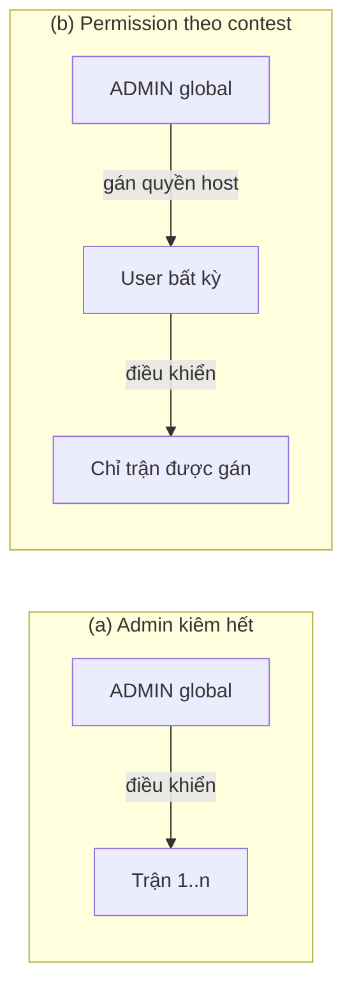
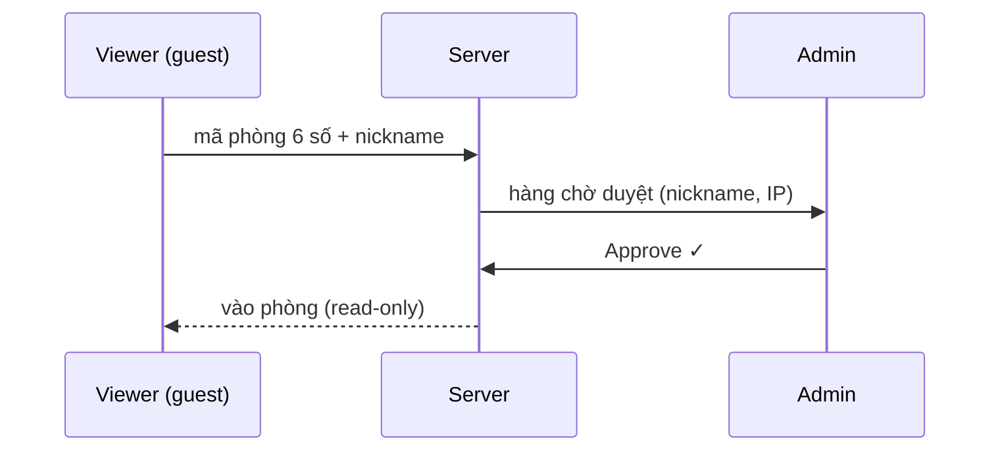
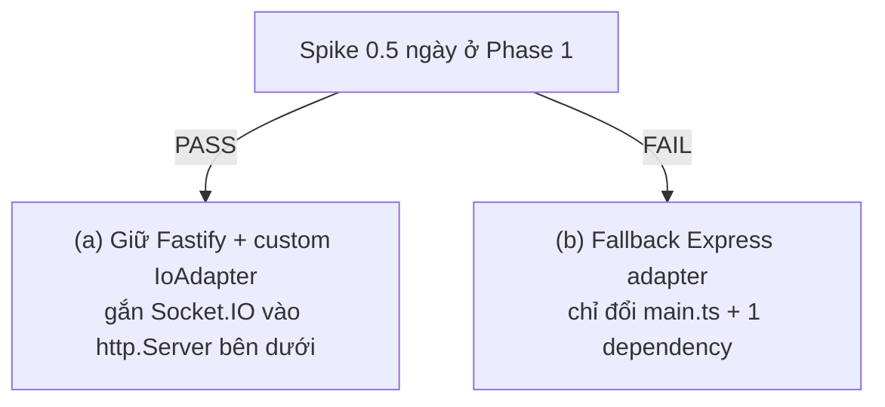
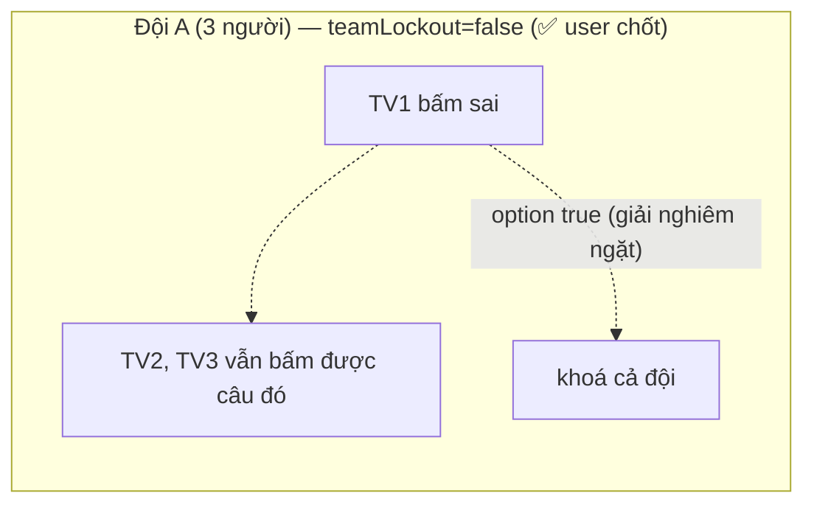

# DEFERED — Các quyết định chờ bạn chốt

> Claude ghi vào đây những quyết định cần bạn trả lời. Mỗi mục: **bối cảnh & lý do phải hỏi → các phương án (ưu/nhược) → đề xuất của Claude + lý do**.
> Trong lúc chờ, Claude dùng phương án đề xuất để planning không bị chặn — bạn đổi lựa chọn thì plan chỉnh theo, chưa có code nào bị đập.
> Trả lời nhanh: chỉ cần ghi `D1: b, D5: đồng ý, D8: ...`.

## Đã chốt trước đó (không cần trả lời lại)

- Luật 2026: Claude tự research online → rule-spec tại `260711-2340-olympia-contest-system/research/rules-2026.md`.
- Livestream: OBS **Browser Source overlay** (trang web nền trong suốt), không encode video.
- Giai đoạn này chỉ tạo `plans/` + `public/` (demo); monorepo code thật dựng ở Phase 1.
- Demo tĩnh mock data + đủ animation, 5 màn: thí sinh, viewer, overlay OBS, admin, kho đề. Demo chỉ được coi là xong sau khi Claude tự mở bằng Playwright kiểm tra chạy đúng.

---

## D1. Số thí sinh mỗi trận ✅ ĐÃ CHỐT (12/07)

> **User chốt:** hỗ trợ **1-12 thí sinh**, cho phép gộp đội (bấm chuông/trả lời cá nhân, điểm về đội — kiểu Pop Culture Jeopardy); lượt cá nhân khi có đội: config per-contest (all-members / representative). UI tối ưu 4 ghế, adaptive 1-12. Chi tiết: `260711-2340-olympia-contest-system/research/ruleconfig-v2-spec.md` §2. **Lộ trình (D18 12/07): v1 chỉ CÁ NHÂN 1-12 ghế; tính năng ĐỘI phát hành ở v2 — nhưng schema DB/Zod (Team, seat.teamId, scoringUnit) có sẵn từ v1.**

**Bối cảnh cũ (lưu tham khảo):** Olympia chuẩn là đúng 4 thí sinh. Nhưng quyết định này ảnh hưởng **sâu** đến engine: luật Tăng tốc chấm 40/30/20/10 theo thứ hạng (4 mức = 4 người), VCNV thứ tự chọn hàng ngang, Về đích mỗi người một lượt. Nếu sau này mới đổi số ghế, phải sửa cả scoring lẫn UI layout — nên phải chốt trước Phase 6.

| Phương án | Ưu | Nhược |
|---|---|---|
| (a) Cố định đúng 4 | Engine + UI đơn giản nhất, đúng luật tuyệt đối | Không tổ chức được trận luyện tập 2-3 người; 1 thí sinh vắng là không chạy được trận |
| (b) 4 ghế, cho phép ghế trống (1-4 người) | Giữ engine thiết kế quanh 4 ghế (đơn giản gần bằng (a)); vẫn chạy được khi thiếu người; layout UI không đổi | Luật xếp hạng Tăng tốc khi 2 người cần định nghĩa rõ (vẫn 40/30) |
| (c) Linh hoạt 2-8 ghế config | Phục vụ giải trường học đông người | Phá vỡ nhiều giả định luật (thang điểm tăng tốc, thời lượng khởi động, layout viewer/overlay); chi phí lớn, YAGNI |

**→ Đề xuất: (b).** Được 95% lợi ích của (c) với ~5% chi phí; ghế trống chỉ là "seat.userId = null, engine bỏ qua lượt của ghế đó". Nếu tương lai thật sự cần 5+ ghế (như O25 quý 4 có 5 thí sinh!), nâng cấp từ (b) dễ hơn từ (a) vì engine đã quen khái niệm "ghế động".

## D2. Ngôn ngữ giao diện ✅ ĐÃ CHỐT (12/07)

> **User chốt:** CHỈ hỗ trợ tiếng Việt (không i18n); **múi giờ thống nhất UTC+7** — DB lưu timestamp UTC (chuẩn kỹ thuật), MỌI hiển thị/format/log/PDF theo UTC+7, không có setting timezone per-user. Vẫn giữ kỷ luật tách string ra `vi.ts` (phương án b — dễ bảo trì, không phải để i18n).

**Bối cảnh cũ (tham khảo):** UI chắc chắn tiếng Việt. Câu hỏi chỉ là có dựng khung i18n (react-i18next...) ngay từ đầu không — vì thêm i18n **sau khi** đã có hàng trăm string rải rác thì tốn công gấp nhiều lần.

| Phương án | Ưu | Nhược |
|---|---|---|
| (a) Hard-code tiếng Việt trong component | Nhanh nhất | Muốn thêm EN sau này phải cào lại toàn bộ |
| (b) Tách string ra file constants `vi.ts` (không lib i18n) | Gần như không tốn thêm công; sau này gắn i18n lib chỉ là đổi cách import | Kỷ luật code phải giữ (không hard-code lẻ tẻ) |
| (c) Dựng react-i18next đầy đủ ngay | Sẵn sàng đa ngôn ngữ | Tốn công setup + tra key khi dev, cho một nhu cầu chưa tồn tại (YAGNI) |

**→ Đề xuất: (b).** Chi phí ~0, giữ được đường lùi. Gameshow này bản chất gắn với tiếng Việt (câu hỏi, luật chơi) — khả năng cần EN rất thấp, không đáng trả giá (c).

## D3. Ai điều khiển trận — admin kiêm luôn, hay tách role "Host/MC"? ✅ ĐÃ CHỐT

> **User đã chốt (12/07):** (1) admin điều khiển các bước của cuộc thi là chính, giống app Athena cũ (AIServer là bàn điều khiển); (2) **có thể thêm role mới** — dùng mô hình permission: 1 role có nhiều permission, 1 user có nhiều role. 4 role ban đầu (admin/setter/contestant/viewer) là seed data, không hard-code trong logic; mọi authz check theo permission, không theo tên role.

**Bối cảnh & lý do phải hỏi (lưu để tham khảo):** Yêu cầu gốc nêu 4 role (admin, người ra đề, thí sinh, viewer), nhưng vận hành một trận cần người bấm next câu, start timer, chấm Đúng/Sai, duyệt viewer. Nếu người đó là "admin toàn hệ thống" thì mọi người điều khiển trận đều có quyền tạo/sửa user + xem toàn bộ kho đề — vi phạm nguyên tắc least-privilege khi tổ chức giải nhiều trận với nhiều người dẫn khác nhau.



| Phương án | Ưu | Nhược |
|---|---|---|
| (a) Admin kiêm điều khiển trận | Đơn giản, đúng 4 role như yêu cầu | Ai cầm trận nào cũng là super-admin; nguy hiểm khi giải lớn nhiều người vận hành |
| (b) Không thêm role mới, nhưng quyền "host trận X" là **permission gắn theo contest** (admin gán cho user bất kỳ) | Giữ đúng 4 role; least-privilege; tách "host" tương lai = 0 công | Thêm 1 bảng permission nhỏ |
| (c) Thêm role HOST toàn cục thứ 5 | Rõ ràng về danh xưng | Trái yêu cầu gốc 4 role; role toàn cục vẫn không giới hạn theo trận |

**→ Đề xuất: (b).** v1 thực tế vẫn là admin tự host (admin mặc nhiên có quyền), nhưng data model để quyền điều khiển theo contest — một quyết định rẻ bây giờ, đắt nếu làm sau.

## D4. Chấm điểm ✅ ĐÃ CHỐT (12/07, bổ sung lần 2)

> **User chốt:** admin bấm Đúng/Sai cho câu miệng; câu gõ auto-match + admin override.
> **Bổ sung 12/07 (lần 2):** contest có toggle **`autoJudge` bật/tắt chấm tự động — DEFAULT TẮT**: mặc định MỌI câu (kể cả câu gõ) do NGƯỜI ĐIỀU KHIỂN chấm (auto-match vẫn chạy ngầm nhưng chỉ hiện **gợi ý** cho admin, không tự chốt điểm); bật `autoJudge` → câu gõ tự chốt theo auto-match, admin vẫn override được. Câu miệng luôn chấm tay bất kể toggle. **So khớp auto BẮT BUỘC: case-INSENSITIVE + TRIM đầu/cuối + COLLAPSE mọi khoảng trắng thừa giữa từ về 1 space** (áp cả submission lẫn acceptedAnswers — đã trim từ lúc lưu kho D20.1; bỏ dấu tiếng Việt là tuỳ chọn config).

**Bối cảnh cũ (tham khảo):** Khởi động & Về đích là trả lời **miệng** (thí sinh nói, không gõ) — máy không tự chấm được. VCNV/Tăng tốc gõ đáp án — auto-match được.

| Phương án                                                                | Ưu                                                                | Nhược                                                                                                        |
| ------------------------------------------------------------------------ | ----------------------------------------------------------------- | ------------------------------------------------------------------------------------------------------------ |
| (a) Admin bấm Đúng/Sai cho câu miệng; câu gõ auto-match + admin override | Đúng cách Olympia thật vận hành (có trọng tài); đơn giản, tin cậy | Admin phải tập trung cao trong trận                                                                          |
| (b) Speech-to-text tự chấm                                               | "Tự động hoá"                                                     | Tiếng Việt + tên riêng + tiếng ồn trường quay = sai số cao; độ trễ; chi phí lớn — không đáng tin cho thi đấu |
| (c) Bắt thí sinh gõ mọi câu                                              | Auto-chấm được hết                                                | Phá format Olympia (khởi động 5s/câu không kịp gõ), trải nghiệm tệ                                           |

**→ Đề xuất: (a).** Đây cũng chính là cách chương trình thật làm. Phase 8 thiết kế JudgingPanel có hotkey `C`/`X` để admin chấm nhanh không mỏi.

## D5. Viewer có cần account không? ✅ SUPERSEDED (12/07)

> **User chốt lại 12/07:** viewer + overlay PUBLIC theo mã phòng — không account, không duyệt, thay thế cả 3 phương án dưới (giữ làm tham khảo). Kiểm soát = rate-limit + khoá cổng + kick.

**Bối cảnh:** Yêu cầu gốc: viewer connect thẳng vào room bằng mã 6 số, admin duyệt vào. Câu hỏi: viewer có phải đăng nhập (admin phải tạo account cho từng khán giả?) hay là khách vãng lai.



| Phương án | Ưu | Nhược |
|---|---|---|
| (a) Guest: mã phòng + nickname → chờ duyệt | Không ma sát; admin không phải tạo hàng trăm account; đúng yêu cầu "connect thẳng, admin duyệt" | Nickname mạo danh (giảm bằng duyệt tay + hiện IP); khó cấm vĩnh viễn một người |
| (b) Bắt buộc account | Danh tính rõ, cấm được | Admin phải tạo account cho mọi khán giả — không thực tế với 500 viewer |
| (c) Hybrid: guest mặc định, tuỳ contest bật "chỉ user có account" | Linh hoạt | Thêm một config, chút phức tạp |

**→ Đề xuất: (a) cho v1**, thiết kế sẵn cột `userId nullable` trong ViewerSession để nâng lên (c) sau nếu cần. Việc duyệt tay của admin đã là lớp kiểm soát chính rồi — account không thêm được bao nhiêu an toàn mà tăng ma sát rất nhiều.

## D6. Giới hạn dung lượng media mỗi câu hỏi ✅ ĐÃ CHỐT (12/07): PHƯƠNG ÁN (a)

> **User chốt:** Ảnh ≤10MB, video ≤200MB, audio ≤20MB (env config). Kèm khuyến nghị vận hành: video câu hỏi nên transcode 1080p H.264 trước khi upload (ghi vào docs, chưa làm auto-transcode ở v1).

**Bối cảnh cũ (tham khảo):** MinIO self-host nên không lo phí cloud, nhưng cần giới hạn để (1) video quá nặng làm nghẽn preload giữa trận — rủi ro livestream, (2) tránh kho đề phình vô hạn.

| Phương án                                             | Ưu                                                        | Nhược                                                           |
| ----------------------------------------------------- | --------------------------------------------------------- | --------------------------------------------------------------- |
| (a) Ảnh ≤10MB, video ≤200MB, audio ≤20MB (env config) | Đủ cho video 1080p ~2-3 phút; preload kịp trong 1 câu hỏi | Video 4K dài không vừa (không cần cho chiếu web)                |
| (b) Không giới hạn                                    | Tự do                                                     | Một video 2GB có thể giết preload pipeline giữa trận livestream |

**→ Đề xuất: (a)** — giá trị đặt trong env, đổi lúc nào cũng được. Kèm khuyến nghị vận hành: video câu hỏi nên transcode 1080p H.264 trước khi upload (ghi vào docs, chưa làm auto-transcode ở v1).

## D15. Quy trình duyệt đề & màn hình MC — ✅ ĐÃ CHỐT TOÀN BỘ (12/07)

1. **Duyệt đề ✅ CHỐT 12/07: bổ sung theo dạng PERMISSION** — activate DRAFT→ACTIVE gate bằng permission **`question.review`** (không hard-code theo role): seed thêm role **REVIEWER** (chỉ mang `question.review` + `question.view`); admin mặc định có permission này. Ai có `question.review` xem được đáp án câu đang duyệt (audit log). Zero công engine — đúng mô hình RBAC D3.
2. ~~MC có được thấy đáp án trước khi công bố không?~~ **ĐÃ CHỐT 12/07: CÓ** — MC xem câu hỏi + đáp án + tóm tắt kết quả (route `/mc`, permission `match.viewAnswer` theo contest, audit log). Threat model cập nhật: đáp án rời server tới các kênh authenticated có permission (admin, MC, reviewer khi duyệt).

**Bối cảnh cũ:** (1) DRAFT→ACTIVE cần người duyệt — plan cũ đặt "chỉ admin activate"; user nâng thành permission riêng. (2) Olympia thật có MC đọc câu hỏi — route `/mc` read-only chữ to.

## D16. Hướng sản phẩm: practice mode solo cho thí sinh? — ✅ ĐÃ CHỐT (12/07)
> **User chốt:** (1) bộ đề có visibility **PUBLIC** (share link/download, kèm đáp án theo setting per-set default có) — nền tảng dữ liệu cho practice đã thành yêu cầu chính thức (phase-03); (2) **thêm sẵn cột `visibility: PRIVATE|PUBLIC`** vào Question ngay từ v1 (1 cột, 0 chi phí, tránh migration sau — khớp nguyên tắc DB-đủ-từ-v1 của D18). Bộ đề PUBLIC + share-link + UI luyện tập thuộc mốc **v1.5 (practice)** theo lộ trình D18.

**Bối cảnh cũ (tham khảo):** Giá trị dài hạn với CLB là luyện tập hàng tuần, không chỉ 2 trận/năm. Nhưng luyện solo cần "đề công khai" — mâu thuẫn với nguyên tắc bảo mật đề. Cột `visibility` thêm sẵn nên nếu **không bao giờ** làm solo thì cột vẫn vô hại.

---

## D8. Luật 2026 ✅ ĐÃ CHỐT (12/07): FANDOM WIKI LÀ SOURCE OF TRUTH + NÚT "ÁP DỤNG LUẬT 2026"

> **User chốt:** (1) Thời gian, số câu, điểm của TỪNG VÒNG là **CÓ THỂ CUSTOM** (RuleConfig — như thiết kế); (2) contest builder có nút **"Áp dụng luật 2026"** áp preset `O26_DEFAULT` với **source of truth = [Fandom: Luật chơi/Olympia 26](https://duong-len-dinh-olympia.fandom.com/vi/wiki/Lu%E1%BA%ADt_ch%C6%A1i/Olympia_26)**; (3) **ĐIỂM độc lập với THỜI GIAN**: `timeSeconds` là **metadata của từng CÂU HỎI** (vd cùng mức 20 điểm có câu 15s và câu 40s) — hệ thống chọn câu theo SỐ ĐIỂM phù hợp, thời gian lấy theo câu; preset chỉ đặt default thời gian theo mức điểm, per-question override thắng.

**Giá trị O26 đã đối chiếu Fandom (12/07) — thay các default cũ:**

| Vòng | Tham số chốt theo Fandom |
|---|---|
| Khởi động — lượt riêng | 6 câu/TS; **3s/câu** (từ lúc MC đọc xong); đúng +10, sai không trừ |
| Khởi động — lượt chung | **12 câu**, bấm chuông (được bấm khi MC đang đọc); 3s suy nghĩ sau khi giành quyền; đúng +10, **sai/không đáp án −5**; 3s không ai bấm → bỏ qua câu |
| VCNV | 4 hàng ngang, **15s/hàng**, đúng +10; ảnh 5 miếng (4 góc + trung tâm); giải CNV: **60/50/40/30** theo bấm trong hàng thứ 1/2/3/4, **+10** câu ô trung tâm, giải sau gợi ý cuối = **20** (15s suy nghĩ); sai CNV → loại khỏi phần thi |
| Tăng tốc | 4 câu; thời gian **20/20/30/30s**; điểm theo tốc độ **40/30/20/10**; đồng thời gian → cùng mức điểm |
| Về đích | Gói **3 câu chọn từ 2 mức {20, 30}** (không còn mức 10); mặc định 20đ=15s, 30đ=20s (câu thực hành: +30s/60s thực hành; cướp: 20s/40s); sai → 3 TS còn lại chuông trong **5s**; **cướp thành công = LẤY điểm từ người trả lời sai (`stealMode: 'transfer'`)**; chuông mà sai → **trừ NỬA điểm câu**; NSHV 1 lần/TS đặt TRƯỚC khi đọc câu, đúng ×2, sai −value (kể cả có người cướp); thứ tự lượt: điểm cao nhất TẠI THỜI ĐIỂM XẾP LƯỢT (tính lại sau mỗi lượt), hoà → vị trí đứng thấp hơn; người thi chính = đáp án CUỐI, người cướp = đáp án ĐẦU |
| Câu hỏi phụ | 3 câu, 15s/câu, chuông nhanh + đúng → thắng; hết 3 câu chưa phân → **bốc thăm**; bấm trước hiệu lệnh MC → mất quyền câu đó |

**Việc plan làm theo — ✅ ĐÃ XONG 12/07:** `research/rules-2026.md` viết lại theo Fandom; preset `O26_DEFAULT@1` spec theo đó; demo `public/assets/engine.js` (RULES) + text hiển thị đã sync (3s khởi động, VCNV 60/50/40/30+20, tăng tốc 20/20/30/30, steal transfer) và verify bằng Chrome.

## D9. Kỹ thuật: NestJS + Fastify + Socket.IO ✅ ĐÃ CHỐT (12/07): ĐỔI EXPRESS ADAPTER

> **User chốt:** dùng **Express adapter** để đảm bảo tương thích (Socket.IO gateway chuẩn + Better-auth đều chín trên Express) — bỏ Fastify, bỏ luôn spike Phase 1. Trade-off chấp nhận: REST chậm hơn ~10-15% (không đáng kể — tải nặng nằm ở Socket.IO, layer riêng).

**Bối cảnh cũ (tham khảo):** Đây là rủi ro kỹ thuật #1. Issue [nestjs/nest#14953](https://github.com/nestjs/nest/issues/14953) (mở từ 2025): gateway Socket.IO chuẩn của NestJS không hoạt động đúng trên Fastify adapter ở một số version. Stack của bạn chốt cả Fastify lẫn Socket.IO nên phải có chiến lược rõ.



| Phương án                                                                  | Ưu                                                     | Nhược                                                                                                                                                 |
| -------------------------------------------------------------------------- | ------------------------------------------------------ | ----------------------------------------------------------------------------------------------------------------------------------------------------- |
| (a) Giữ Fastify, custom `IoAdapter` gắn vào `http.Server` bên dưới Fastify | Đúng stack bạn chốt; hưởng throughput Fastify cho REST | Cần spike xác minh với version hiện tại; nếu NestJS đổi internal thì phải theo dõi                                                                    |
| (b) Đổi Express adapter                                                    | Chắc chắn chạy, ecosystem chuẩn NestJS                 | Trái stack đã chốt; REST chậm hơn ~10-15% (thực tế không đáng kể vì tải nặng nằm ở Socket.IO — vốn là layer riêng không đi qua router HTTP framework) |
| (c) Tách Socket.IO ra process/port riêng                                   | Cô lập hoàn toàn                                       | Thêm độ phức tạp deploy + share session/Redis giữa 2 process; không đáng ở quy mô này                                                                 |

**→ Đề xuất: (a) với fallback (b) sau spike timebox 0.5 ngày** (đã ghi thành step 4 của Phase 1). Điểm mấu chốt: cả hai đường chỉ khác nhau ở file bootstrap — kiến trúc phía sau không đổi, nên quyết định này không cần chốt trước, chỉ cần bạn biết và đồng ý cơ chế spike/fallback.

## D10. Nhạc hiệu & sound cue 🟠 MỘT NỬA ĐÃ CHỐT (12/07)

> **User chốt:** admin sẽ tự upload file nhạc/SFX (không cần bộ default cầu kỳ). **Kiến trúc "sound cue slot"** (engine chỉ emit event `sound-cue`, client phát file gắn với slot); **file nhạc pre-download về client** khi vào phòng (dung lượng rất nhỏ — không đáng lo preload/lag). Việc còn lại của plan: **định nghĩa đúng CUE MAP event-driven** — đang research (wiki + source Athena + video) xem chương trình thật phát nhạc ở những thời điểm nào → kết quả vào `research/sound-cues.md` + cập nhật CueSlot matrix spec §10.

**Bối cảnh cũ (tham khảo):** Research UX chỉ ra âm thanh (nhạc hiệu vòng, tiếng chuông, đúng/sai, hết giờ) là thứ làm nên "cảm giác Olympia" — nhưng yêu cầu gốc không nhắc đến. Đồng thời **nhạc hiệu Olympia gốc thuộc bản quyền VTV** — phát trong livestream public có rủi ro claim/gỡ video.

| Phương án | Ưu | Nhược |
|---|---|---|
| (a) Bạn cung cấp toàn bộ file nhạc/SFX | Đúng chất Olympia nếu bạn có file | Hệ thống phụ thuộc bạn chuẩn bị; rủi ro bản quyền do bạn chịu |
| (b) Bộ SFX mặc định royalty-free + admin upload thay thế từng cue | Chạy được ngay không cần chuẩn bị; ai muốn "chất Olympia" thì tự upload và tự chịu trách nhiệm bản quyền | Âm mặc định không phải nhạc Olympia gốc |
| (c) Không âm thanh ở v1 | Bớt 1 việc | Mất linh hồn gameshow; thêm sau tốn công gắn vào engine/UI |

**→ Đề xuất: (b).** Kiến trúc là "sound cue slot" (engine chỉ emit event `sound-cue`, client phát file gắn với slot) — hệ thống trung lập bản quyền, nội dung âm thanh là data admin quản lý, không phải code. File nhạc/SFX pre-download về client khi vào phòng (kích thước nhỏ, không đáng lo lag) → phát tức thì đúng lúc engine emit cue, không phụ thuộc mạng lúc reveal.

## D11. Quy mô viewer đồng thời ✅ ĐÃ CHỐT (12/07): <50 VIEWER/TRẬN, ~5 TRẬN SONG SONG

> **User chốt:** mục tiêu thiết kế + load test = **<50 viewer/trận, khoảng 5 trận song song** (~250 kết nối viewer + 5×12 thí sinh toàn hệ). Điểm nhấn KHÔNG phải fanout viewer mà là **nhiều match live đồng thời** — kiến trúc single-writer per match (Redis lease, queue FIFO per match) đã thiết kế sẵn cho việc này; load test Phase 10 đổi kịch bản: **5 trận live song song × (12 thí sinh + 50 viewer) + buzzer storm trên 2 trận cùng lúc**. 1 VPS 4-8GB vẫn dư sức; trần kiến trúc 500 viewer/trận giữ làm headroom, không phải mục tiêu test.

**Bối cảnh cũ (tham khảo):** "Performance tốt" cần con số cụ thể; các phương án cũ (a) ≤500/2 trận, (b) ~5.000, (c) chục nghìn — user chọn quy mô thật nhỏ hơn (a) về viewer nhưng NHIỀU trận song song hơn.

## D12. Preload media cho THÍ SINH ✅ ĐÃ CHỐT (12/07): PHƯƠNG ÁN (b)

> **User chốt:** **preload blob MÃ HOÁ qua service worker, phát key đúng lúc reveal** — thí sinh vẫn được preload sớm (mượt như viewer/overlay) nhưng bytes trên máy là ciphertext, không xem trước đề được; server chỉ đẩy decryption key tại thời điểm reveal (server time). Chấp nhận chi phí phức tạp SW + key delivery + decrypt; plan Phase 6/7 phải thêm hạng mục này (SW cache mã hoá, kênh phát key qua socket, fallback khi SW không khả dụng → rớt về chế độ nhận URL lúc reveal như (a)).

**Bối cảnh cũ (tham khảo):** Red-team phát hiện lỗ hổng trong thiết kế ban đầu: preload media câu kế tiếp xuống client để chống lag — nhưng với Tăng tốc/VCNV, **media chính là đề bài**. Thí sinh mở DevTools → tab Network → xem trước video/ảnh câu sau 10-40 giây so với đối thủ. "Không gửi kèm đáp án" không cứu được vì bytes đề đã nằm trên máy họ.

| Phương án                                                                                       | Ưu                               | Nhược                                                                                                      |
| ----------------------------------------------------------------------------------------------- | -------------------------------- | ---------------------------------------------------------------------------------------------------------- |
| (a) Thí sinh KHÔNG preload — chỉ nhận URL media đúng lúc reveal; viewer/overlay vẫn preload sớm | Không thể xem trước đề; đơn giản | Thí sinh mạng chậm có thể thấy media trễ hơn nhau vài trăm ms (thi thật trên LAN thì gần như không vấn đề) |
| (b) Preload blob MÃ HOÁ qua service worker, phát key đúng lúc reveal                            | Vừa mượt vừa kín                 | Phức tạp đáng kể (SW, key delivery, decrypt media lớn), thêm bề mặt lỗi giữa trận                          |
| (c) Preload thường cho cả thí sinh (thiết kế cũ)                                                | Mượt nhất                        | Rò đề — không chấp nhận được với yêu cầu "bảo mật kho đề cao" của bạn                                      |

**Đề xuất cũ của Claude là (a)** (LAN nên độ trễ không đáng kể) — **user chọn (b)** để mượt cả khi thi qua Internet. Config `preloadPolicy: encrypted|reveal-only` vẫn giữ: mặc định `encrypted` (b), fallback `reveal-only` (a) khi service worker không khả dụng hoặc BTC muốn đơn giản.

## D13. Edge-cases luật ✅ ĐÃ CHỐT TOÀN BỘ (12/07 — user + Fandom)

1. **VCNV cả 4 bị loại ✅ user chốt:** kết thúc lượt/vòng, không ai được điểm CNV; **mở miếng ghép là THAO TÁC THỦ CÔNG của admin** (nút "mở toàn bộ miếng ghép + công bố CNV" — không auto), giữ nhịp dẫn chương trình.
2. **Người bị loại VCNV** KHÔNG được trả lời hàng ngang còn lại ✅ (Fandom xác nhận: lượt chọn dồn cho người chưa bị loại).
3. **Tăng tốc đồng thời gian** → cùng mức điểm cao ✅ (Fandom xác nhận).
4. **Thí sinh rớt mạng đúng lượt riêng ✅ user chốt:** engine pause + admin quyết (chờ trong grace / skip lượt); chưa chọn gói về đích → admin chọn hộ.
5. **Tie-break ✅ user chốt:** chỉ áp vị trí NHẤT; config `tieBreakPositions` đổi được.
6. **Hết câu hỏi phụ** → bốc thăm ✅ (Fandom xác nhận; preflight yêu cầu tối thiểu N câu phụ config).

## D17. Ngữ nghĩa THI ĐỘI × từng vòng ✅ ĐÃ CHỐT TOÀN BỘ (12/07) — áp dụng khi code Phase 12/v2

> **User chốt:**
> - **D17.1 — Khởi động (chuông) + Về đích (cướp): khoá CÁ NHÂN** khi bấm sai — thành viên khác trong đội vẫn bấm được (`teamLockout` default **false**; option `true` cho giải muốn công bằng quân số nghiêm ngặt). Áp cả clue-buzz tăng tốc (cùng cơ chế chuông).
> - **D17.2 — Tăng tốc: LAST-WINS** ✅ (chốt trước đó) — bản cuối của bất kỳ thành viên; ranking theo server-received ts.
> - **D17.3 — VCNV sai CNV: loại CẢ ĐỘI** — tránh đội 4 người có 4 lần đoán CNV.
> - **D17.4 — NSHV: 1 lần/ĐỘI/trận** (theo đề xuất — user không đổi).
>
> Hard-code không config: **CẤM cùng đội cướp điểm về đích** (exploit — đặc biệt quan trọng vì D17.1 khoá cá nhân); tie-break đội cử 1 người bấm. Spec §2b + phase-12 cập nhật theo: default `teamLockout: false`.

**Lưu ý cân bằng (ghi nhận, không chặn):** khoá cá nhân + đội lệch quân số → đội đông có nhiều lượt bấm ở vòng chuông; pre-flight cảnh báo lệch quân số + guide-admin khuyến nghị đội đều người (đã có trong phase-12).



## D18. Scope & lộ trình version ✅ SUPERSEDED (12/07 — chốt lại lần 2): CHIA 3 MỐC, DB ĐỦ TỪ V1

> **User chốt lại 12/07 (thay quyết định "1 version" trước đó):** chia lộ trình 3 mốc phát hành:
> - **v1 — Solo contest**: contest chính thức, thí sinh CÁ NHÂN (1-12 ghế, không đội), đủ 4 vòng + biến thể, viewer/overlay/MC/admin, kho đề + import/export.
> - **v1.5 — Practice contest**: `matchPurpose: practice` (reveal sau chấm, retention riêng, rematch, trainer role), bộ đề PUBLIC + share-link, UI luyện tập.
> - **v2 — Thi ĐỘI**: teams (buzz cá nhân điểm về đội, teamLockout, NSHV/đội, semantics §2b spec, preset TEAM_12).
>
> **Ràng buộc xuyên suốt: DATABASE + schema chuẩn bị ĐẦY ĐỦ ngay từ v1** để tránh migrate nhiều — Prisma có sẵn `Team`/`seat.teamId nullable`/`scoringUnit`, `Match.matchPurpose`, `Question.visibility`, `everPublic`, ACL bộ đề, retention fields; RuleConfig v2 Zod schema đầy đủ (teams/practice fields tồn tại, v1 chỉ chưa có UI/engine-path kích hoạt). Reducer thiết kế team-aware từ đầu (v1 mỗi seat là đơn vị điểm riêng — trường hợp suy biến của team size 1).

**Lịch sử:** trước đó user chốt "không cắt scope, toàn bộ trong 1 version" (red-team v2 từng đề xuất cắt) — nay thay bằng lộ trình 3 mốc ở trên để giảm tải Phase 6 (critical path): test matrix v1 không còn TEAM_12; spec v2.1 giữ nguyên giá trị (mọi lỗ hổng đã vá bằng thiết kế, phần teams/practice thành tài liệu cho v1.5/v2).

## D19. Profile portable (Windows LAN không Docker) — 2 quyết định

**Bối cảnh:** Bạn chốt có bản portable chạy LAN. Gap-sweep cuối chỉ ra 2 điểm cần bạn quyết:

**D19.1 — HTTP hay HTTPS trên LAN? ✅ ĐÃ CHỐT (12/07): (a) HTTP thuần, không cần HTTPS.** `Secure` cookie tắt theo profile portable; web cùng origin với api. (Phân tích các phương án HTTPS giữ bên dưới làm tham khảo nếu sau này đổi ý.)
- **Vấn đề:** cookie `Secure` (chuẩn bảo mật của bản compose) không hoạt động trên `http://192.168.x.x`.

| Phương án | Khả thi? | Ưu | Nhược |
|---|---|---|---|
| (a) HTTP thuần, tắt `Secure` theo profile, web cùng origin với api | ✅ | Zero-config — chạy `start.bat` là xong | Traffic LAN không mã hoá (chấp nhận được trong phòng thi kín) |
| (b) HTTPS self-signed | ⚠️ nửa vời | Mã hoá thật | 12 máy thí sinh bấm qua cảnh báo được; **~75 điện thoại viewer mỗi người thấy màn hình đỏ "not private"** — ma sát chết người |
| (c) mkcert cài CA từng máy | ⚠️ chỉ cho máy BTC | Ổ khoá xanh thật | Không thể cài CA lên điện thoại khán giả; CA lộ key = MITM mọi web trên máy đã cài |
| (d) **Domain thật + Let's Encrypt DNS-01** (record `lan.domain.vn → IP LAN`, xin cert không cần server public, bundle vào bản portable) | ✅ nếu có domain | HTTPS hợp lệ, không thiết bị nào phải cài/bấm gì | Cần domain + gia hạn cert 90 ngày (script chạy trước đợt thi); thiết bị tại sự kiện phải phân giải được DNS (Wi-Fi có internet, hoặc DNS override trên router nếu offline) |

**→ Đề xuất cập nhật: hỗ trợ CẢ HAI** — `start.bat` mặc định (a) HTTP; thêm config `HTTPS_CERT_PATH` cho BTC có domain dùng (d) — code gần như 0 đồng (đọc cert + bật `Secure` theo protocol thực tế). (b)/(c) không làm. Bạn xác nhận là chốt.

**D19.2 — Target tải cho portable? ✅ ĐÃ CHỐT (12/07):** user cho biết **thực tế thường chỉ < 10 viewer**. Load test portable: 12 thí sinh + 30 viewer (3× headroom so với thực tế) — dư sức với 1 máy Windows + Wi-Fi thường. Con số này cũng hạ nhiệt D11 (compose vẫn thiết kế 500 nhưng đó là trần kiến trúc, không phải nhu cầu thật).

## D20. Last-wins tăng tốc — 1 chi tiết cần xác nhận

**D20.1 — Submission RỖNG ✅ ĐÃ CHỐT (12/07): (a) SKIP — bỏ qua, giữ bản trước.**
Kèm quyết định đi cùng của user: **TRIM toàn bộ** nội dung đề + đáp án + acceptedAnswers (bỏ space đầu/cuối) — áp cả lúc LƯU vào kho (phase-03) lẫn lúc SO KHỚP (answer-matcher phase-06); submission chỉ toàn whitespace sau trim = rỗng = skip. Dedup nội-dung-y-hệt so sánh SAU trim.

## D21. Dual-purpose (luyện tập + contest) ✅ ĐÃ CHỐT (12/07): ACCEPT TOÀN BỘ ĐỀ XUẤT

> **User chốt (12/07) — accept cả 3 đề xuất** *(toàn bộ practice thuộc mốc **v1.5** theo lộ trình D18; schema `matchPurpose` + retention fields có sẵn trong DB từ v1)*:
> 1. **D21.1 — Retention**: practice match tự xoá/anonymize sau **3 tháng** (config); official giữ **12 tháng** (config). Cần background job dọn retention (queue).
> 2. **D21.2 — Ai tạo practice match**: chỉ người có `contest.create` (admin gán role "trainer" qua RBAC sẵn có — 0 công). Contestant tự tạo từ đề public = gộp với UI solo (D16), cùng mốc v1.5+.
> 3. **D21.3 — Default practice**: không ghi ngược thống kê kho đề, không vào podium/kết quả chính thức, PDF watermark "LUYỆN TẬP" không QR.

**Bối cảnh cũ (tham khảo):** Hệ thống có 2 mục đích ngang hàng, phân biệt bằng `matchPurpose: official|practice` (spec §13 — bảng khác biệt policy giữa 2 loại).

## D22. Kiến trúc animation + nguồn đề của trận ✅ ĐÃ CHỐT (12/07)

> **User chốt:**
> 1. **Animation ĐỘC LẬP với engine/rule**: mỗi animation là module client-side riêng, chỉ nhận semantic event từ server (qua animation-queue) — mục đích: nhà phát triển sửa RULE (vd cách hệ thống chọn câu hỏi) không phải đụng animation và ngược lại. Engine không biết animation tồn tại (đã là nguyên tắc "viewer không bao giờ chặn engine", nay nâng thành yêu cầu kiến trúc: mapping event→animation là bảng cấu hình, animation module thay/thêm không sửa engine).
> 2. **Người tạo contest PHẢI chọn danh sách câu hỏi TRƯỚC khi contest bắt đầu** — hệ thống KHÔNG tự lấy đề từ kho; chức năng "rút đề ngẫu nhiên" (drawConfig) chỉ **RANDOM TRONG danh sách đã được gán** (snapshot vào trận). Công cụ chọn đề: **full-text search kho đề + các loại filter + sort** (filter: loại pool D24, lĩnh vực, mức điểm, độ khó, tags, người thực hiện, trạng thái duyệt; sort: mới nhất, mức điểm, độ khó, lần dùng gần nhất, tần suất dùng). Pre-flight chặn start khi danh sách thiếu so với playlist.
> 3. **Gán phần dùng bằng CHECKBOX (chốt bổ sung 12/07):** mỗi câu được chọn có checkbox **"được phép dùng ở phần nào"** trong contest (chỉ hiện các phần hợp lệ theo pool D24 + điều kiện điểm — vd câu `KV` value 20 tick được Khởi động và/hoặc Về đích; câu `TT` chỉ tick Tăng tốc). **Pool được phép DƯ:** người tạo chọn NHIỀU HƠN số câu cần thiết — hệ thống rút random từ pool dư; câu không dùng tới thì thôi (dư = dự phòng skip/thay câu). **No-repeat toàn CONTEST:** câu đã SỬ DỤNG (đã hỏi trong bất kỳ match/vòng nào của contest) KHÔNG xuất hiện lại trong contest đó — engine đánh dấu `usedInContest` khi câu được hỏi; draw loại câu đã dùng khỏi pool; pre-flight chỉ yêu cầu pool CÒN LẠI ≥ nhu cầu worst-case (dư bao nhiêu cũng hợp lệ).

## D23. Import/Export CONTEST CONFIG trọn gói ✅ ĐÃ CHỐT (12/07)

> **User chốt:** contest config import/export dễ dàng — use-case chính: **soạn đề trên bản Internet (compose) → export → import vào bản portable** (LAN ngày thi). Định dạng bundle ZIP:
> - **Excel/CSV/Google Sheet** (default **Excel**) cho thông tin CÂU HỎI;
> - **JSON** cho metadata liên quan media (mapping câu↔file, checksum) + contest config (RuleConfig, playlist, theme/sound refs);
> - **Media gom theo SUBFOLDER từng vòng** (`media/khoi-dong/`, `media/vcnv/`, `media/tang-toc/`, `media/ve-dich/`...);
> - **ZIP chứa tất cả** — import roundtrip không mất dữ liệu.
>
> Export tuân ACL đáp án (spec §9); import validate Zod + magic-bytes media + đối chiếu checksum.

## D24. Human-readable ID theo LOẠI POOL câu hỏi ✅ ĐÃ CHỐT (12/07)

> **User chốt:** ngoài UUID (khoá kỹ thuật), câu hỏi có thêm cột **Id đọc được, PHẢI chứa loại câu hỏi**. Taxonomy theo **pool sử dụng** (không phải 1 vòng = 1 loại):
> - **`KV-xxxxxx`** — pool CHUNG **Khởi động + Về đích**: hai vòng dùng lẫn câu của nhau khi **thoả điều kiện về điểm** (về đích yêu cầu câu có `value` ∈ valueChoices của config, vd 20/30; khởi động dùng tự do không cần value). Câu phụ (tie-break) rút từ pool này (câu hỏi nhanh, không tính điểm trận) — *đề xuất của Claude, đổi được*.
> - **`TT-xxxxxx`** — câu **Tăng tốc** (media/clues, chấm theo tốc độ).
> - **`CN-xxxxxx`** — **bộ đề VCNV trọn** (Id cấp SET: rowCount hàng ngang + CNV + hintMap + ảnh; hàng ngang là item con `CN-xxxxxx-R1..R8`).
>
> Hệ quả data model: `Question.type` đổi từ 6 loại-theo-vòng (KHOI_DONG/VE_DICH/TIE_BREAK tách rời) → **3 pool (KV / TT / CN)**; `value`/`timeSeconds` là metadata quyết định câu KV có đủ điều kiện cho về đích không; pre-flight + QuestionPicker filter theo pool + điều kiện điểm.
>
> **Format Id (user chốt lại 12/07):** `<POOL 2 ký tự><4 HEX ĐẦU của UUID><4 HEX CUỐI của UUID>` — uppercase, derive từ chính UUID của câu (vd UUID `a1b2c3d4-…-e5f67890` → `KV-A1B2-7890`; hàng ngang VCNV: `CN-A1B2-7890-R1..R8`). Deterministic từ UUID nên không cần sequence; unique index trên displayId — đụng độ (hiếm, 8 hex) thì regenerate UUID lúc tạo. Immutable, dùng ở picker/import-export/tra cứu/log.

**Bổ sung 13/07 (user chốt — kho đề KHÔNG chia theo vòng thi):**

> 1. **Không có `KHOI_DONG_RIENG`/`KHOI_DONG_CHUNG` ở cấp CÂU HỎI** — riêng/chung là cấu trúc LƯỢT của trận (engine phase), không phải thuộc tính câu; format chuẩn Olympia chỉ có "Khởi động". Câu Khởi động nằm chung pool `KV`, lượt riêng/chung của trận rút từ cùng pool.
> 2. **Tách MỨC ĐIỂM ra khỏi loại câu hỏi** — không tồn tại loại `VE_DICH_20`/`VE_DICH_30`; `value` là **metadata riêng** trên câu KV (null = chưa gán, Khởi động dùng tự do; có value ∈ valueChoices = đủ điều kiện Về đích). `timeSeconds` cũng là metadata từng câu, độc lập với value (cùng 20đ có thể 15s và 40s).
> 3. **Hệ quả UI kho đề** (đã áp vào demo `public/questions.html` + `mock-data.js` 13/07): filter/editor/bảng dùng **pool (KV/TT/CN) + mức điểm + thời gian** thay cột "Vòng thi"; deep-link `?round=` chỉ map sang pool (+ filter "có mức điểm" cho Về đích). Trang kho đề app thật (phase-03 bước 7, phase-08 QuestionPicker) port theo mô hình này.

## D25. Typography ✅ ĐÃ CHỐT (12/07): BE VIETNAM PRO + FALLBACK HỆ THỐNG

> **User chốt:** font chữ toàn hệ thống = **Be Vietnam Pro**, fallback các font hệ thống hỗ trợ tiếng Việt sẵn trên Windows/macOS. Font stack chuẩn (đã áp vào `public/assets/tokens.css` `--font-sans`):
> ```
> "Be Vietnam Pro", "Segoe UI Variable", "Segoe UI", -apple-system,
> BlinkMacSystemFont, "Helvetica Neue", Roboto, Arial, Tahoma, sans-serif
> ```
> (Windows: Segoe UI/Arial/Tahoma; macOS: SF Pro qua -apple-system, Helvetica Neue — đều đủ glyph tiếng Việt.)
>
> **Triển khai:** app thật **SELF-HOST woff2** (Vietnamese + Latin subset, weights 400-900) trong bundle `apps/web` — KHÔNG phụ thuộc Google Fonts CDN vì profile portable chạy LAN offline (phase-01 setup, phase-10 kiểm tra offline). Demo `public/` dùng Google Fonts CDN (host Vercel có internet). `font-display: swap`.

## D26. Danh sách USER THAM GIA trong contest bundle (roster) 🟡 CHỜ CHỐT (mở 15/07)

> **Yêu cầu user (15/07):** admin có thể tạo contest + settings + **danh sách user tham gia** trên bản Internet rồi xuất ra và import vào bản local.

**Bối cảnh & lý do phải hỏi:** D23 hiện xuất/nhập contest.json (RuleConfig + playlist + theme/sound + seats khung) + đề + media, **nhưng KHÔNG mang account thí sinh**. Bản Internet (compose) và bản portable (LAN) là **2 database ĐỘC LẬP** — user Better-auth (username + passwordHash) tạo bên Internet không tồn tại bên portable; `ContestSeat.userId` trỏ tới User. Nếu bundle không mang roster, import vào portable xong **không thí sinh nào đăng nhập được** — phải tạo tay lại toàn bộ account + gán ghế, mất phần lớn giá trị "trọn gói". Điểm nhạy cảm: `passwordHash` là "vương miện" hệ auth (zero-trust) — đưa vào ZIP đi USB là bề mặt crack offline; username có thể ĐỤNG account đã có trên portable.

**Phương án xử lý PASSWORD khi import roster:**

| Phương án | Ưu | Nhược |
|---|---|---|
| (a) Regenerate password ngẫu nhiên lúc import + xuất **phiếu tài khoản** (PDF bảng in) cho admin phát tay | An toàn nhất (hash không rời hệ Internet); khớp thực tế LAN (phát slip cho học sinh ngày thi); admin kiểm soát | Thí sinh không dùng lại mật khẩu cũ; phải in/phát phiếu |
| (b) Mang theo `passwordHash` (Argon2id chuyển thẳng — cùng thuật toán 2 bản) | Thí sinh dùng LẠI mật khẩu cũ; zero thao tác | Hash rời hệ → crack offline nếu bundle lộ; buộc bundle AES |
| (c) Chỉ mang username + seat profile, tạo account rỗng chờ set pass | Không mang secret | Vẫn phải đặt lại pass thủ công từng người |

**→ Đề xuất: cách xử lý mật khẩu là SETTING admin chọn lúc export** (không ép default cứng — user chốt 15/07): dropdown/radio 2 lựa chọn — **(a) "Tạo mật khẩu mới + xuất phiếu tài khoản"** (khuyến nghị, an toàn hơn) và **(b) "Giữ mật khẩu hiện tại"** (mang Argon2id hash — tiện, thí sinh dùng lại pass cũ). UI nêu rõ trade-off cạnh mỗi lựa chọn; lựa chọn ghi vào manifest để import biết cách dựng. Kèm: **merge policy** khi username trùng (link account sẵn có / tạo mới có hậu tố / huỷ); **roles đi kèm** (seed role có sẵn 2 bản; role CUSTOM tạo trên Internet phải export định nghĩa để portable dựng lại); **seat profile** (tên/trường/lớp — thuộc contest, phase-05 1b) đi cùng contest.json; CHỈ export user ĐƯỢC GÁN vào contest (thí sinh + MC/host), không dump toàn bộ user. Audit `EXPORT_ROSTER`/`IMPORT_ROSTER`. PII học sinh rời hệ → cảnh báo consent (product-gaps §privacy) + khuyến nghị xoá bundle sau trận. Hệ quả plan: phase-04 bundle thêm roster, contest.json nhúng **RuleConfig đã resolve** (không chỉ preset id — tránh drift khi portable thiếu row preset).

**Bổ sung 15/07 (user chốt): THÔNG TIN USER LUÔN MÃ HOÁ THÀNH FILE BINARY.** Roster KHÔNG để plaintext `roster.json` mà là **`roster.bin`** — luôn mã hoá bất kể có mang hash hay không (PII học sinh cũng là dữ liệu nhạy cảm). Sơ đồ crypto: admin đặt **passphrase** lúc export → **Argon2id** (tái dùng lib mật khẩu Phase 2) dẫn xuất key 256-bit → **AES-256-GCM** (authenticated encryption: bảo mật + chống sửa). Container binary: `magic | version | KDF(salt, params) | nonce | ciphertext | authTag`; KEY/passphrase KHÔNG nằm trong bundle (truyền qua kênh khác), manifest chỉ chứa salt/params. Import: **nếu bundle có roster → người import BẮT BUỘC nhập mật khẩu (chính passphrase đặt ở khâu export)** → giải mã → verify authTag (sai pass / bytes bị sửa → từ chối, không import nửa vời); bundle không roster thì không cần mật khẩu. Vì roster đã luôn mã hoá, setting (b) "giữ mật khẩu" nằm trong lớp mã hoá roster; (a) vẫn khuyến nghị để giảm thiệt hại cả khi lộ passphrase, nhưng để admin QUYẾT ở form export. Yêu cầu passphrase đủ mạnh lúc export (điểm yếu nhất của sơ đồ).

**Các setting export roster (form UI):** (1) **có kèm roster không** (bật/tắt export user info); (2) **cách xử lý mật khẩu** (a tạo mới / b giữ nguyên); (3) **passphrase mã hoá** `roster.bin` (+ xác nhận độ mạnh). Setting (2) mặc định (a) nhưng đổi được — user chốt là để settings, không cứng.

## D27. Chiều NGƯỢC: kết quả/stats portable → central sau trận 🟡 CHỜ CHỐT (mở 15/07)

**Bối cảnh:** D23/D26 mô tả luồng MỘT chiều (compose → portable). Nhưng trận chạy trên portable (ngày thi) mới sinh ra **kết quả**: điểm chung cuộc, MatchEvent log (event-sourced), thống kê câu hỏi (%đúng/thời gian TB — phase-10 step 4 ghi ngược kho đề), PDF. Không có đường mang kết quả **về central** thì: (1) stats câu hỏi chỉ tích luỹ trên portable rồi mất khi xoá; (2) không tổng hợp lịch sử thi nhiều trận/mùa ở một nơi.

| Phương án | Ưu | Nhược |
|---|---|---|
| (a) **Result bundle** export từ portable (results.json + stats-delta.json + PDF) → import vào central, merge theo `matchId`/`displayId` | Khép kín roundtrip; central tổng hợp lịch sử; stats-writeback đúng thiết kế | Thêm 1 luồng import (nhưng tái dùng hạ tầng D23) |
| (b) Không đồng bộ ngược — central chỉ giữ config, kết quả sống trên portable | Đơn giản hơn | Mất tổng hợp lịch sử + stats không về kho trung tâm |

**→ Đề xuất: (a)** — tái dùng format bundle + manifest + checksum của D23; idempotent theo `matchId` (import 2 lần không nhân đôi stats). Có thể ship như phase-10 P2 nếu gấp, nhưng schema chuẩn bị từ đầu. Hệ quả plan: phase-04 thêm `olympia-result-export.zip` (đã mô tả), phase-10 nối stats-writeback qua luồng này.

---
<!-- Claude sẽ thêm mục mới bên dưới trong quá trình planning -->
