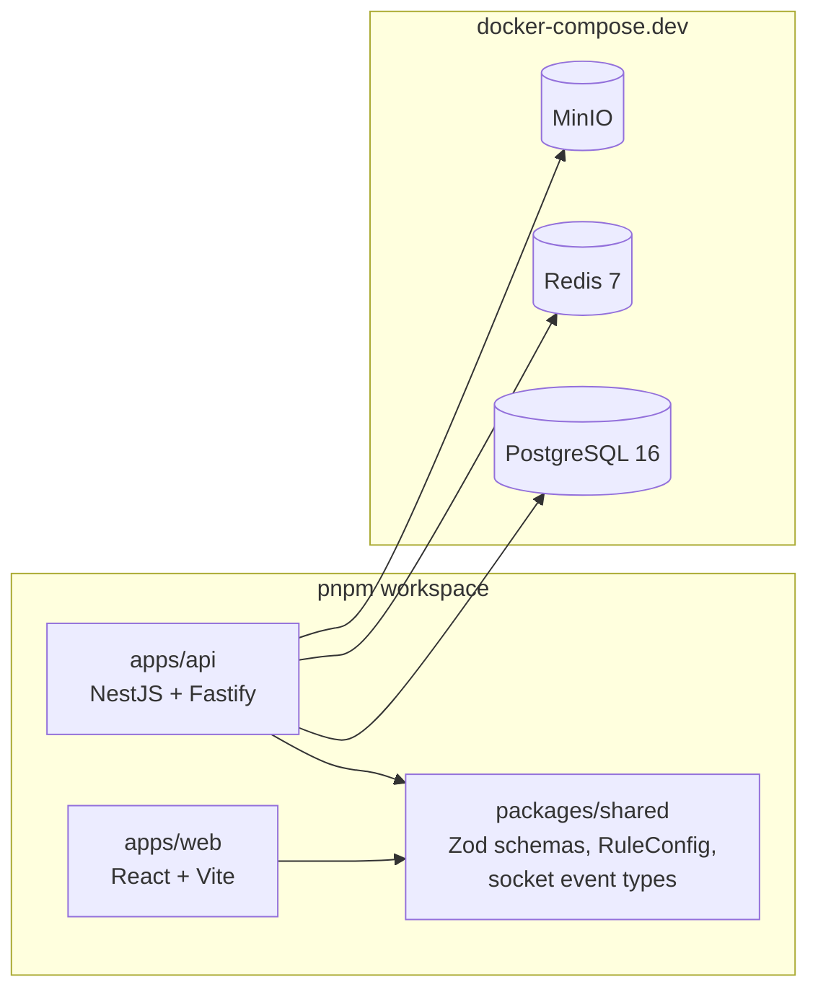

# Phase 1: Foundation & Infrastructure

## Overview
Dựng monorepo, hạ tầng dev (Postgres/Redis/MinIO), bootstrap NestJS+Fastify và **spike xác minh Socket.IO chạy được trên Fastify adapter** — rủi ro kỹ thuật số 1 của dự án.

## Requirements
- Functional: monorepo chạy `pnpm dev` là lên đủ api + web; Socket.IO echo test hoạt động.
- Non-functional: hot-reload cả 2 app; type-safe end-to-end qua `packages/shared`.

## Architecture

## Related Code Files
- Create: `pnpm-workspace.yaml`, `package.json`, `tsconfig.base.json`, `.editorconfig`, `docker-compose.dev.yml`
- Create: `apps/api/` (NestJS scaffold, FastifyAdapter, config module đọc env qua Zod)
- Create: `apps/web/` (Vite scaffold, MUI theme từ design tokens của `public/assets/tokens.css`)
- Create: `packages/shared/` (Zod schemas, hằng số socket event names)
- Create: `.github/workflows/ci.yml` (lint + typecheck + test)

## Implementation Steps
0. **Abstraction layer hạ tầng ngay từ đầu (user chốt 12/07 — 2 deployment profile)**: interface `StateDriver` / `QueueDriver` / `StorageDriver` / `SocketAdapterFactory` trong `packages/shared` hoặc `apps/api/src/infra` — implementation Redis/MinIO cho profile compose, in-process/filesystem cho profile **portable Windows không Docker (LAN, 1 instance)**. Mọi code nghiệp vụ chỉ gọi qua interface; chọn driver bằng env `INFRA_PROFILE=compose|portable`.
1. Init pnpm workspace 3 package; tsconfig strict, path alias `@shared/*`.
2. `docker-compose.dev.yml`: postgres:16, redis:7, minio + tạo bucket `question-media` (init script).
3. Scaffold NestJS với `FastifyAdapter`; module `ConfigModule` validate env bằng Zod; healthcheck `/healthz`.
4. **SPIKE (timebox 1 ngày — DEFERED D9, mở rộng theo red-team H7)**: trên FastifyAdapter phải PASS đủ CẢ HAI: (a) Socket.IO qua custom `IoAdapter` trên `app.getHttpServer()` — connect + echo + room broadcast; (b) **Better-auth** mount handler + đăng nhập username/password + đọc session từ cookie. Fail bất kỳ cái nào → chuyển `ExpressAdapter` (chỉ đổi `main.ts` + dependency), ghi journal lý do.
5. Cài `@socket.io/redis-adapter` + verify broadcast giữa 2 instance api (chạy 2 port); thử `createShardedAdapter` (Redis 7) — không chạy được với Redis đang dùng thì fallback adapter thường (red-team L5).
6. Scaffold Vite React app: router (`/login`, `/contestant`, `/viewer`, `/overlay`, `/admin`, `/questions`), MUI theme, Zustand store rỗng, socket client singleton (websocket-only transport).
7. CI: pnpm install cache, lint (eslint+prettier), `tsc --noEmit`, vitest. ESLint rule cấm literal string tiếng Việt trong JSX (`react/jsx-no-literals` giới hạn ở apps/web) để giữ kỷ luật tách string ra `vi.ts` (DEFERED D2b, red-team L7).

## Success Criteria
- [ ] `docker compose up` + `pnpm dev` → api :3000, web :5173 chạy.
- [ ] Spike Socket.IO trên Fastify PASS (hoặc quyết định fallback được ghi lại) — client connect, join room, nhận broadcast qua Redis adapter với 2 instance.
- [ ] CI xanh trên PR đầu tiên.

## Risk Assessment
- **nest#14953** (cao): đã có kế hoạch spike + fallback ở step 4.
- Windows dev environment (docker/pnpm path issues): dùng WSL2 nếu gặp vấn đề, ghi vào README.
