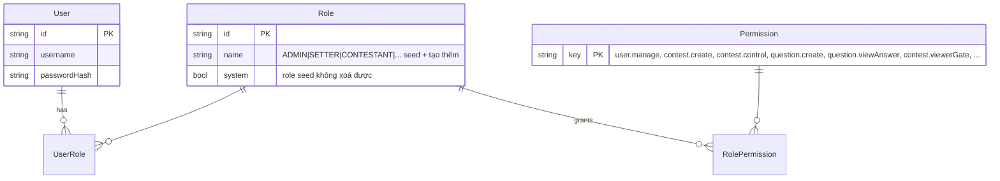

# Phase 2: Auth & User Management

## Overview
Better-auth với username+password (không email, không OAuth cho thí sinh), RBAC theo permission (role = tập permission, user nhiều role, role mở rộng được — **5 role mặc định là seed, gồm REVIEWER ✅ D15.1**), admin tạo/quản lý user + role. Auth phủ cả HTTP lẫn WebSocket handshake.

## Requirements
- Functional: đăng nhập username+password; admin CRUD user + gán role; session HttpOnly cookie; WS handshake xác thực bằng session cookie; viewer là guest (không account — DEFERED D5).
- Non-functional: chống brute-force (rate limit theo username+IP qua Redis); password Argon2id.

## Architecture

**RBAC theo permission (user đã chốt 12/07), hiện thực bằng `@casl/ability`** (đánh giá: `research/tech-architecture.md` §2b): 1 role = tập permission; 1 user có nhiều role; role tạo thêm được. Authz check LUÔN theo ability (`ability.can('update', subject)`), không bao giờ theo tên role — thêm role mới không sửa code. Permission rows trong DB ánh xạ thành CASL rules (`action` + `subject` + `conditions` JSON) — nhờ conditions tả được "câu hỏi CỦA MÌNH", "contest ĐƯỢC GÁN host".

Permission catalog (hằng số trong `packages/shared`, nhóm theo module): `user.*`, `question.*` (create/update/**review** [activate DRAFT→ACTIVE — ✅ D15.1 12/07]/viewAnswer/export/import), `contest.*` (create/control/adjustScore/viewerGate/soundboard), `match.viewAnswer`, `system.*`. Seed **5 role** mặc định: ADMIN (toàn bộ), SETTER (question.* của mình), **REVIEWER (`question.review` + xem đáp án câu đang duyệt — ✅ D15.1)**, CONTESTANT (thi đấu), VIEWER (guest — không phải account, ticket riêng).

- Better-auth qua `@thallesp/nestjs-better-auth` (pin version), **bọc sau interface `AuthService` nội bộ** để cô lập rủi ro package cộng đồng.
- Better-auth `username` plugin; tắt đăng ký tự do — chỉ admin tạo account.
- WS: `handleConnection` đọc cookie handshake → `auth.api.getSession()` → `socket.data.user`; guest viewer nhận ticket riêng (Phase 5).
- Guard: `@CheckAbility('create', 'Question')` decorator + `AbilityGuard` (build/cached CASL Ability từ roles của user) cho REST; WS gắn ability vào `socket.data` lúc handshake. Ability cache Redis, invalidate khi đổi role.
- Query filtering: `@casl/prisma` `accessibleBy(ability)` cho các list endpoint (kho đề của setter tự lọc "của mình").
- FE nhận `packRules()` sau login → `@casl/react` `<Can>` ẩn/hiện UI theo quyền (check thật vẫn ở server).

## Related Code Files
- Create: `apps/api/src/auth/` (auth.module, auth.service wrapper, roles.guard, ws-auth.middleware)
- Create: `apps/api/src/users/` (users controller/service — admin only)
- Modify: `packages/shared` (Zod: LoginInput, UserDto, PermissionKey catalog + RoleDto)
- Create: `apps/web/src/pages/login`, `apps/web/src/api/auth.ts`
- Prisma: model `User`, `Session` (theo Better-auth schema), `Role`

## Implementation Steps
1. Prisma schema User/Session/Account theo Better-auth + bảng `Role`, `Permission`, `UserRole`, `RolePermission` (như ERD); seed permission catalog + 5 role mặc định gồm REVIEWER (`system: true` không xoá được); `displayName`, `disabled`.
1b. UI + API admin quản lý role: tạo role mới từ danh sách permission, gán nhiều role cho 1 user.
2. Cấu hình Better-auth: username plugin, Argon2id, cookie `HttpOnly; SameSite=Lax`; `Secure` bật ở profile compose (HTTPS). **Profile portable chạy HTTP LAN — ✅ user chốt 12/07, không cần HTTPS** (gap-sweep H-F1): `Secure` off theo `INFRA_PROFILE`, **api serve luôn web static cùng origin** (`express.static` / ServeStaticModule) để khỏi vỡ cookie cross-origin, Better-auth `baseURL`/`trustedOrigins` đọc từ IP LAN máy lúc start (in ra console + QR). Session theo role: thí sinh **24h**, admin/setter 7 ngày; admin có nút "logout mọi phiên thí sinh" sau trận.
3. Rate limit đăng nhập: Redis sliding window 5 lần/phút/username.
4. REST admin: `POST/GET/PATCH /users` (tạo user + role, reset password, disable). Admin ĐẦU TIÊN qua CLI `pnpm create-admin` bắt nhập password mạnh ngay lúc chạy — **cấm default credentials** kiểu admin/admin (gap 3.3).
5. WS auth middleware dùng chung cho mọi namespace; reject nếu session invalid (trừ namespace viewer-guest).
6. FE: trang login tối giản (autofocus, Enter submit — thí sinh dùng keyboard-only); lưu user vào Zustand; guard route theo role.

## Success Criteria
- [ ] Admin tạo được user 3 role; user disabled không đăng nhập được.
- [ ] Socket connect không có session hợp lệ bị từ chối (trừ guest namespace).
- [ ] Brute-force 6 lần sai trong 1 phút → 429.
- [ ] E2E: login → cookie → gọi API → connect socket → nhận user context.

## Risk Assessment
- Package cộng đồng breaking change → pin version + wrapper interface; test upgrade trong CI riêng.
- Session cookie cross-origin khi FE/BE khác domain → dùng cùng domain qua reverse proxy (ghi vào deployment docs Phase 10).
