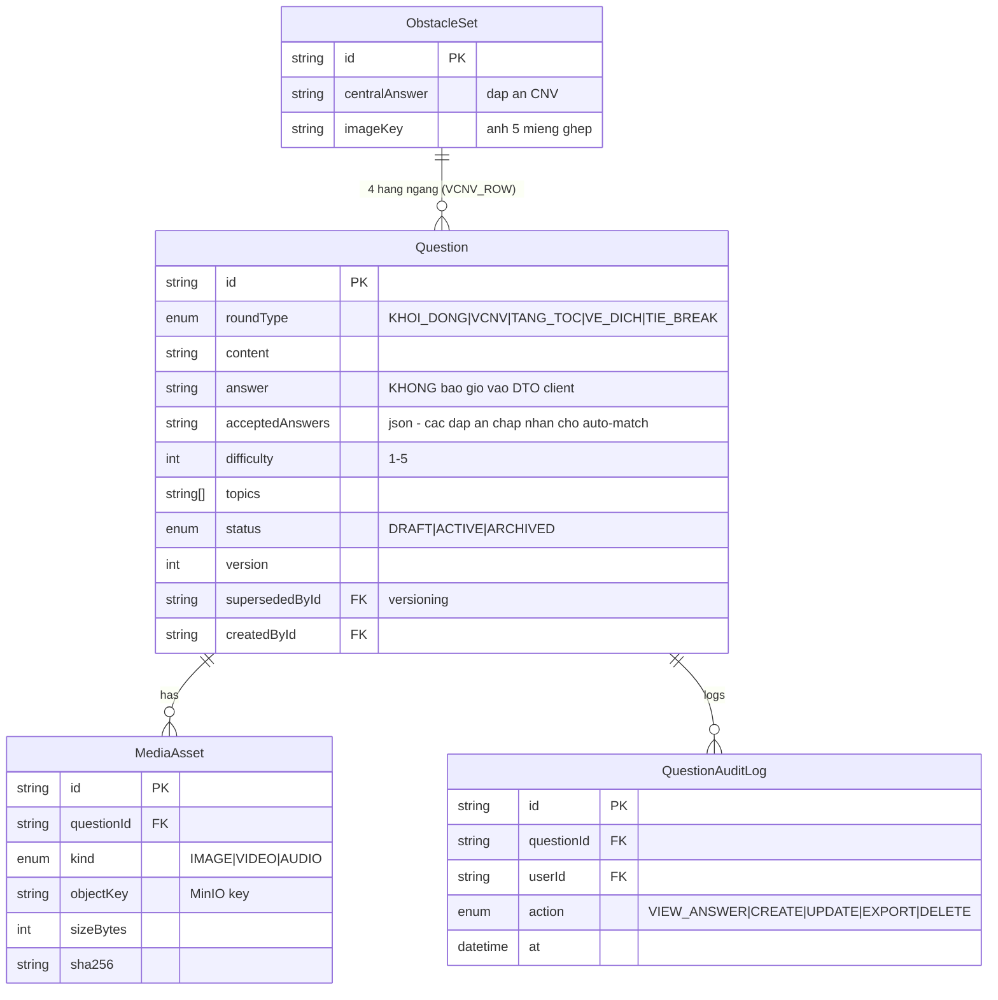

# Phase 3: Question Bank (kho đề)

## Overview
Kho câu hỏi bảo mật cao: schema Prisma với metadata + versioning, CRUD cho SETTER/ADMIN, media lên MinIO qua presigned URL, đáp án không bao giờ xuống client ngoài luồng admin/MC, audit log đầy đủ. **Mở rộng 12/07 (xem `research/ruleconfig-v2-spec.md` §8):** bộ đề (QuestionSet) là thực thể hạng nhất với visibility public/private + share-link, taxonomy lĩnh vực, tra cứu đa chiều.

## Bổ sung 12/07 — QuestionSet & taxonomy

- **Question thêm fields**: `displayId` (mã ngắn tra cứu, vd `Q-000123`), `fieldId` (FK → bảng `Field` — nhãn lĩnh vực do admin/setter tạo/quản lý), `wordCount` (auto-compute từ content khi save), `explanation` (giải thích đáp án), `note`, `timeSeconds?` (thuộc tính thời gian từng câu — TT/VĐ), `value?` (mức điểm VĐ), `clues[]?` (3-4 dữ kiện cho tăng tốc format clue-buzz).
- **QuestionSet (bộ đề)** — mô hình đầy đủ theo **spec v2 §9 (đã vá red-team C-v2-1/C-v2-3)**: `displayId`, name, `visibility: PRIVATE|PUBLIC`, `everPublic` (cờ một chiều trên cả Set lẫn Question); PRIVATE = owner + **ACL 3 mức view/viewAnswer/export**; share-link = token ≥128-bit + password (rate-limit 5 lần/phút/IP+link) + TTL + revoke, **mặc định KHÔNG kèm đáp án**, audit theo token+IP; PUBLIC = xem/tải tự do kèm đáp án theo setting per-set (default có, cảnh báo) và đóng dấu everPublic vĩnh viễn; **pre-flight mọi match hard-block câu everPublic/đang-public** (kiểm ở đơn vị CÂU, cả chiều gán set public vào contest).
- **SetItem**: reference câu kho theo displayId HOẶC câu nhập tay inline (thuộc set); câu nhập tay có checkbox "lưu vào kho đề".
- **Tra cứu kho đề** theo: displayId, lĩnh vực, người thực hiện, đáp án (search theo đáp án chỉ cho người có `question.viewAnswer`) + các filter metadata cũ.

## Requirements
- Functional: CRUD câu hỏi theo 6 loại (KHOI_DONG, VCNV, VCNV_ROW, TANG_TOC, VE_DICH, TIE_BREAK — ERD rút gọn ở dưới thiếu VCNV_ROW, schema thật đủ 6); metadata: độ khó (1-5), chủ đề (tags), lớp/kiến thức, ghi chú; đính kèm ảnh/video/audio; trạng thái DRAFT→ACTIVE→ARCHIVED; versioning khi sửa câu ACTIVE.
- Non-functional: đáp án chỉ trả về cho ADMIN (và SETTER với câu mình tạo); mọi truy cập đáp án ghi audit; media giới hạn dung lượng (DEFERED D6).

## Architecture

Ghi chú thiết kế:
- **VCNV là một `ObstacleSet`**: 1 đáp án trung tâm + ảnh + `rowCount` (4-8) câu hàng ngang (mỗi hàng là Question con có `charCount` + `hintMap` — vị trí ký tự thuộc CNV cho chế độ gợi ý); ảnh chia miếng theo rowCount (+center), không cứng 5 miếng.
- **DTO 2 tầng**: `QuestionPublicDto` (không answer — dùng khi phát cho thí sinh/viewer) vs `QuestionFullDto` (chỉ ADMIN/SETTER-owner). Tách ở tầng serializer, test bảo đảm không rò.
- Media upload flow: client xin presigned PUT (validate MIME + size trước khi cấp) → upload thẳng MinIO → confirm → server verify tồn tại + ghi `MediaAsset`. Đọc qua presigned GET TTL 30-60 phút.

## Related Code Files
- Create: `apps/api/src/questions/` (controller, service, serializer, audit)
- Create: `apps/api/src/media/` (minio.service, presign endpoints, mime/size policy)
- Modify: `packages/shared` (Zod: QuestionCreateInput per roundType — discriminated union; QuestionPublicDto/FullDto)
- Prisma migration: Question, MediaAsset, ObstacleSet, QuestionAuditLog
- Create: `apps/web/src/pages/questions/` (bảng + filter + editor modal — port design từ `public/questions.html`)

## Implementation Steps
1. Prisma schema + migration như ERD; index (roundType, status, difficulty), GIN index topics.
2. **TRIM mọi field text khi lưu** (nội dung, đáp án, acceptedAnswers, giải thích — user chốt 12/07, tránh space đầu/cuối phá auto-match; Zod `.trim()` toàn bộ). Zod discriminated union theo roundType (VE_DICH có `value` số nguyên tuỳ ý + `timeSeconds?`; TANG_TOC có `timeSeconds?` + `clues[]?` cho format clue-buzz; VCNV_ROW có `charCount` + `hintMap`; ObstacleSet có `rowCount` 4-8). Bảng ERD ở trên là bản rút gọn ban đầu — schema thật mở rộng theo mục "Bổ sung 12/07" + spec v2 §9 (thêm Field, QuestionSet, SetItem, displayId, everPublic).
3. Service CRUD + versioning (sửa câu ACTIVE → tạo bản mới `version+1`, bản cũ `supersededById`); soft-delete = ARCHIVED. **Chỉ admin (permission `question.review`) chuyển DRAFT→ACTIVE** — setter không tự duyệt đề mình (gap 2.1, DEFERED D15). `Question.visibility` là **derived, read-only** (= PUBLIC nếu câu đang thuộc ≥1 set public, else PRIVATE — không set tay; vá red-team H-v2-10); cột `everPublic` một chiều đi kèm. Câu inline lưu vào kho → vào DRAFT (qua duyệt như thường). Fuzzy-dedup cảnh báo trùng đề giữa setters khi save = P2.
4. Serializer 2 tầng + unit test chống rò answer (snapshot DTO không chứa key `answer`).
5. MinIO presign PUT/GET + policy dung lượng. Khi confirm upload: server **sniff magic bytes** đối chiếu MIME khai báo (MIME trên presign là self-declared — red-team M4); **cấm SVG** (stored XSS qua Content-Disposition inline); antivirus scan là P3.
5b. Seed script tạo **fixture question bank** đủ pre-flight 1 trận (24+12 khởi động, 1 VCNV set, 4 tăng tốc, 12 về đích, 3 câu phụ + media mẫu) — dùng cho E2E các phase 6-10 và demo dev (red-team M7).
6. Audit log interceptor: VIEW_ANSWER (khi admin mở đáp án), CREATE/UPDATE/EXPORT/DELETE.
7. FE trang kho đề: DataGrid (MUI) filter vòng/độ khó/topic/search, editor modal, upload media có progress, preview.

## Success Criteria
- [ ] SETTER tạo đủ 5 loại câu + VCNV set hoàn chỉnh, kèm media.
- [ ] Response của mọi endpoint không-admin KHÔNG chứa answer (test tự động quét payload).
- [ ] Presigned URL hết hạn đúng TTL; URL cũ 403.
- [ ] Audit log ghi lại việc admin xem đáp án.

## Risk Assessment
- Rò đáp án qua endpoint phụ (search, export) → test quét payload tập trung 1 chỗ, review mọi DTO mới.
- Media mồ côi trên MinIO khi client bỏ dở upload → cron dọn object không có `MediaAsset` sau 24h.
