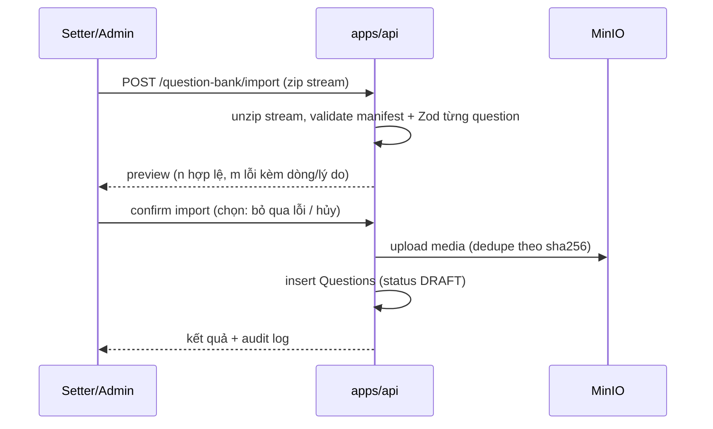

# Phase 4: Import / Export đề

## Overview
Import/export kho đề & bộ đề. **Excel theo template quy ước là format CHÍNH cho người dùng** (đã nâng cấp 12/07 — nhập bộ đề từ Excel + xuất bộ đề ra Excel, roundtrip); ZIP bundle (manifest + questions.json + media/) giữ vai trò format đầy đủ khi có media. Không rò đáp án cho role không đủ quyền.

## Bổ sung 12/07 — Excel convention

- Template Excel quy ước theo **bộ đề**: sheet đầu = metadata set, mỗi round type một sheet (cột theo loại: khởi động, VCNV set + hàng ngang, tăng tốc kèm clues/timeSeconds, về đích kèm value/timeSeconds, câu phụ); cột chung: displayId (để reference câu kho), lĩnh vực, nội dung, đáp án, acceptedAnswers, giải thích, ghi chú, tên file media (đi kèm ZIP khi có media).
- Export bộ đề ra Excel (kèm hoặc không kèm đáp án tuỳ quyền + lựa chọn); import Excel roundtrip được với chính file export.
- Mapping cột linh hoạt vẫn giữ cho file không đúng template.

## Requirements
- Functional: export theo filter (vòng/topic/bộ đề đã chọn) ra `.zip`; import zip có validate + preview + báo lỗi từng dòng; import Excel/CSV với cột mapping linh hoạt (không hard-code vùng ô như Athena cũ).
- Non-functional: file lớn (media nhiều) xử lý streaming, không load hết vào RAM; export tuân **ACL 3 mức của bộ đề (view/viewAnswer/export — spec v2 §9)**: export-kèm-đáp-án cần viewAnswer+export, câu reference của setter khác cần quyền trên CÂU theo CASL conditions; export ghi audit log.

## Architecture

Format bundle:
```
olympia-bank-export.zip
├── manifest.json    # { formatVersion: 1, exportedAt, counts, checksums }
├── questions.json   # QuestionExport[] — Zod schema trong packages/shared
└── media/<sha256>.<ext>
```



## Related Code Files
- Create: `apps/api/src/question-bank/` (export.service, import.service, excel-parser)
- Modify: `packages/shared` (Zod: `QuestionExportSchema`, `BundleManifestSchema` — formatVersion để migrate sau)
- Modify: `apps/web/src/pages/questions/` (modal import có bảng preview lỗi, nút export theo filter)

## Implementation Steps
1. Định nghĩa `QuestionExportSchema` (bao gồm answer — vì file export nằm ngoài hệ thống, cảnh báo rõ trong UI) + manifest.
2. Export: stream zip (archiver), media lấy từ MinIO stream-to-stream, checksum sha256.
3. Import: unzip stream (yauzl), validate 2 bước (manifest → từng question), dedupe media theo sha256, tất cả vào DRAFT để duyệt lại.
4. Excel/CSV parser (exceljs / papaparse): bước 1 upload file → server đọc header → FE cho map cột ↔ field; template mẫu tải về được.
5. Idempotency: import lại cùng bundle không nhân đôi (so `sourceId` + checksum, hỏi user overwrite/skip).
6. Audit: EXPORT log kèm số câu + filter.

## Success Criteria
- [ ] Roundtrip: export 50 câu đủ 5 loại + media → import vào DB sạch → diff logic = 0 khác biệt.
- [ ] Import file hỏng/thiếu media → báo lỗi từng mục, không ghi nửa vời (transaction).
- [ ] Import Excel với template mẫu hoạt động; cột lệch vẫn map được bằng tay.

## Risk Assessment
- Zip bomb / file độc → giới hạn tổng dung lượng giải nén + số entry; chỉ nhận MIME whitelist **kèm sniff magic bytes**; sanitize entry path chống **zip-slip** (`media/../../etc` — reject mọi entry có `..` hoặc path tuyệt đối) (red-team M4).
- Export chứa đáp án là điểm rò rỉ chính của "bảo mật kho đề" → chỉ ADMIN/SETTER-owner, audit bắt buộc, cân nhắc export có mật khẩu (zip AES) — ghi DEFERED nếu user muốn.
