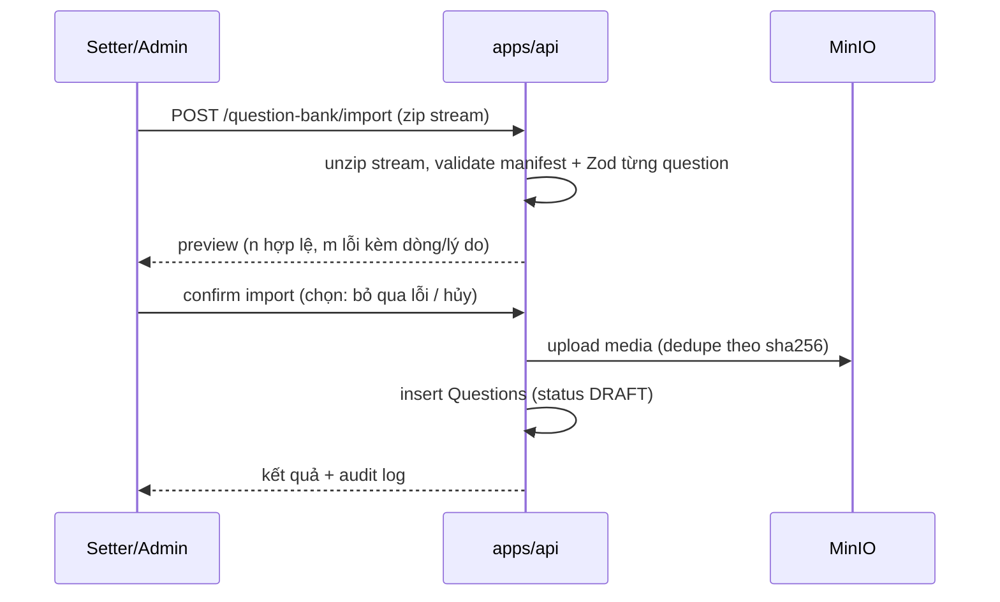

# Phase 4: Import / Export đề & Contest config

## Overview
Import/export kho đề & bộ đề & **CONTEST CONFIG trọn gói (✅ D23 12/07)**. **Excel theo template quy ước là format CHÍNH cho người dùng** (nhập/xuất bộ đề, roundtrip); ZIP bundle giữ vai trò format đầy đủ khi có media. **Use-case chính của contest bundle: admin soạn contest + settings + ĐỀ + DANH SÁCH USER THAM GIA trên bản Internet (compose) → export → import vào bản portable (LAN ngày thi) → ngày thi chạy offline; sau trận export kết quả ngược về central (🟡 D26/D27).** Không rò đáp án cho role không đủ quyền.

**Điểm cốt lõi (🟡 D26):** bản Internet và bản portable là **2 database ĐỘC LẬP** — account thí sinh (Better-auth) tạo bên Internet KHÔNG tồn tại bên portable. Nên contest bundle phải mang thêm **roster (danh sách user tham gia + gán ghế + role)**, nếu không import xong không thí sinh nào đăng nhập được. Đồng thời `contest.json` phải nhúng **RuleConfig đã RESOLVE đầy đủ** (không chỉ tham chiếu preset id `O26_DEFAULT@1`) vì portable có thể chưa có row preset đó.

## Bổ sung 12/07 — Excel convention

- Template Excel quy ước theo **bộ đề**: sheet đầu = metadata set, mỗi round type một sheet (cột theo loại: khởi động, VCNV set + hàng ngang, tăng tốc kèm clues/timeSeconds, về đích kèm value/timeSeconds, câu phụ); cột chung: displayId (để reference câu kho), lĩnh vực, nội dung, đáp án, acceptedAnswers, giải thích, ghi chú, tên file media (đi kèm ZIP khi có media).
- Export bộ đề ra Excel (kèm hoặc không kèm đáp án tuỳ quyền + lựa chọn); import Excel roundtrip được với chính file export.
- Mapping cột linh hoạt vẫn giữ cho file không đúng template.

## Requirements
- Functional: export theo filter (vòng/topic/bộ đề đã chọn) ra `.zip`; import zip có validate + preview + báo lỗi từng dòng; import Excel/CSV/Google Sheet (default Excel — ✅ D23) với cột mapping linh hoạt (không hard-code vùng ô như Athena cũ); **export/import CONTEST CONFIG trọn gói (✅ D23)** — roundtrip compose → portable không mất dữ liệu (RuleConfig + đề đã gán + media + theme/sound assets).
- Non-functional: file lớn (media nhiều) xử lý streaming, không load hết vào RAM; export tuân **ACL 3 mức của bộ đề (view/viewAnswer/export — spec v2 §9)**: export-kèm-đáp-án cần viewAnswer+export, câu reference của setter khác cần quyền trên CÂU theo CASL conditions; export ghi audit log.

## Architecture

Format bundle kho đề/bộ đề:
```
olympia-bank-export.zip
├── manifest.json    # { formatVersion: 1, exportedAt, counts, checksums }
├── questions.xlsx   # format CHÍNH cho câu hỏi (CSV/Google Sheet cũng nhận — default Excel, ✅ D23)
├── media-meta.json  # metadata media: mapping câu ↔ file, checksum sha256, loại
└── media/<round-type>/<file>   # media gom SUBFOLDER THEO VÒNG (✅ D23): khoi-dong/ vcnv/ tang-toc/ ve-dich/ tie-break/
```

**Contest bundle (✅ D23 + 🟡 D26 roster — export/import trọn contest):**
```
olympia-contest-export.zip
├── manifest.json      # formatVersion, exportedAt, contestId/exportId, checksums, hasRoster, roster.kdf (salt/params — KHÔNG chứa key)
├── contest.json       # RuleConfig ĐÃ RESOLVE đầy đủ (không chỉ tham chiếu preset) + playlist + theme config + sound cue mapping + seats khung + seat profile (tên/trường/lớp — thuộc contest)
├── roster.bin         # 🟡 D26: THÔNG TIN USER MÃ HOÁ BINARY (LUÔN mã hoá) — plaintext bên trong = user tham gia (username, displayName, role[], seatIndex) + role CUSTOM definition + (tuỳ chọn) passwordHash. Container: magic+version | KDF(salt,params) | nonce | AES-256-GCM ciphertext | authTag
├── questions.xlsx     # toàn bộ câu hỏi đã gán theo vòng (sheet per round — template phase-04)
├── media-meta.json    # mapping câu ↔ media, checksum
├── media/<round-type>/...        # media đề theo subfolder vòng
└── assets/            # theme/sound file của contest (logo, video hình hiệu, SFX cue)
```
Import contest bundle vào portable: validate Zod contest.json + đối chiếu checksum + magic-bytes; **nếu bundle CÓ `roster.bin` (manifest `hasRoster`) → import BẮT BUỘC nhập mật khẩu** (chính passphrase admin đã đặt ở khâu export user information) để **giải mã `roster.bin`** (passphrase → Argon2id KDF ra key → AES-256-GCM giải mã + verify authTag; sai passphrase/tampered → từ chối, không import nửa vời); bundle KHÔNG có roster thì import bình thường không cần mật khẩu. Sau giải mã: validate Zod roster + **dựng account** (D26 merge policy: username trùng → link/tạo-mới-hậu-tố/huỷ; regenerate password default + xuất phiếu tài khoản, hoặc mang hash khi opt-in); tạo contest ở trạng thái nháp + **auto gán ghế theo roster**, chạy pre-flight như thường (danh sách đề đã gán sẵn trong bundle — khớp D22). CHỈ export user ĐƯỢC GÁN vào contest (thí sinh + MC/host), không dump toàn bộ user hệ thống.

**Result bundle — chiều NGƯỢC portable → central (🟡 D27):**
```
olympia-result-export.zip
├── manifest.json      # formatVersion, matchId/contestId, exportedAt, checksums
├── results.json       # điểm chung cuộc + MatchEvent log (event-sourced, replay được)
├── stats-delta.json   # thống kê câu hỏi (%đúng, thời gian TB) map theo displayId để ghi ngược kho central
└── report.pdf         # bản PDF kết quả (tuỳ chọn)
```
Import vào central: idempotent theo `matchId` (import 2 lần không nhân đôi stats); merge stats-delta theo `displayId` (D24). Dùng lại toàn bộ hạ tầng bundle của D23.



## Related Code Files
- Create: `apps/api/src/question-bank/` (export.service, import.service, excel-parser)
- Modify: `packages/shared` (Zod: `QuestionExportSchema`, `BundleManifestSchema` — formatVersion để migrate sau)
- Modify: `apps/web/src/pages/questions/` (modal import có bảng preview lỗi, nút export theo filter)

## Implementation Steps
1. Định nghĩa `QuestionExportSchema` (bao gồm answer — vì file export nằm ngoài hệ thống, cảnh báo rõ trong UI) + manifest.
2. Export: stream zip (archiver), media lấy từ MinIO stream-to-stream, checksum sha256.
3. Import: unzip stream (yauzl), validate 2 bước (manifest → từng question), dedupe media theo sha256, tất cả vào DRAFT để duyệt lại.
4. Excel/CSV parser (exceljs / papaparse): bước 1 upload file → server đọc header → FE cho map cột ↔ field; template mẫu tải về được.
5. Idempotency: import lại cùng bundle không nhân đôi (so `sourceId` + checksum, hỏi user overwrite/skip).
6. Audit: EXPORT log kèm số câu + filter.
7. **Contest bundle (✅ D23)**: export contest (contest.json với **RuleConfig đã resolve** + questions.xlsx theo vòng + media subfolder vòng + assets theme/sound) / import tạo contest nháp + pre-flight; test roundtrip compose → portable trên máy Windows thật (kết hợp Phase 10 profile portable).
8. **Roster user tham gia — MÃ HOÁ BINARY (🟡 D26)**: export `roster.bin` (**LUÔN mã hoá**; plaintext bên trong = user được gán vào contest + role[] + seatIndex + role custom def + tuỳ chọn hash). Crypto: admin đặt **passphrase** lúc export → **Argon2id** (tái dùng lib đã có ở Phase 2) ra key 256-bit → **AES-256-GCM** (nonce ngẫu nhiên/lần, authTag chống sửa); KDF salt/params ghi ở manifest, KEY KHÔNG BAO GIỜ nằm trong bundle. **Form export roster có SETTING** (user chốt 15/07): (i) bật/tắt kèm roster; (ii) **cách xử lý mật khẩu** — radio "tạo mật khẩu mới + phiếu" (khuyến nghị) / "giữ mật khẩu hiện tại" (mang hash); (iii) passphrase mã hoá. Import: nhập passphrase → giải mã → verify authTag → validate Zod → dựng account theo **merge policy** (username trùng → link/tạo-mới/huỷ) + theo setting mật khẩu đã chọn (**regenerate password + xuất phiếu tài khoản (PDF bảng in)** hoặc **giữ Argon2id hash** — cả hai đều nằm trong lớp mã hoá roster). Audit `EXPORT_ROSTER`/`IMPORT_ROSTER`. Serialize plaintext gọn (JSON/CBOR) trước khi mã hoá — không lộ `.json` ra ngoài. Phụ thuộc Phase 2 (users/roles) — chạm `apps/api/src/users` qua service, không sửa trực tiếp.
9. **Result bundle ngược (🟡 D27, có thể để P2)**: export từ portable (`results.json` + `stats-delta.json` + PDF) / import vào central idempotent theo `matchId`, ghi ngược stats theo `displayId`. Dùng lại archiver/yauzl + manifest + checksum của step 2-3.

## Success Criteria
- [ ] Roundtrip: export 50 câu đủ 3 pool (KV/TT/CN — D24) + media → import vào DB sạch → diff logic = 0 khác biệt, displayId giữ nguyên.
- [ ] Import file hỏng/thiếu media → báo lỗi từng mục, không ghi nửa vời (transaction).
- [ ] Import Excel với template mẫu hoạt động; cột lệch vẫn map được bằng tay.
- [ ] Contest bundle roundtrip: export contest đầy đủ (đề + media + theme/sound) từ compose → import vào portable → pre-flight PASS, trận chạy được ngay (✅ D23).
- [ ] **Roster roundtrip mã hoá (🟡 D26)**: export contest có 4 thí sinh + 1 MC (đặt passphrase) → `roster.bin` là binary, mở bằng text editor KHÔNG đọc được PII → import nhập đúng passphrase giải mã OK, 5 account dựng đúng, gán ghế đúng, phiếu tài khoản in ra được, thí sinh đăng nhập vào đúng ghế; **sai passphrase → từ chối; sửa 1 byte trong roster.bin → authTag fail, từ chối**; username trùng → merge policy hoạt động; toggle "giữ mật khẩu" → đăng nhập bằng pass cũ.
- [ ] **Result bundle ngược (🟡 D27)**: chạy trận trên portable → export result → import vào central → stats câu hỏi ghi ngược đúng theo displayId, import lại lần 2 không nhân đôi.

## Risk Assessment
- Zip bomb / file độc → giới hạn tổng dung lượng giải nén + số entry; chỉ nhận MIME whitelist **kèm sniff magic bytes**; sanitize entry path chống **zip-slip** (`media/../../etc` — reject mọi entry có `..` hoặc path tuyệt đối) (red-team M4).
- Export chứa đáp án là điểm rò rỉ chính của "bảo mật kho đề" → chỉ ADMIN/SETTER-owner, audit bắt buộc, cân nhắc export có mật khẩu (zip AES) — ghi DEFERED nếu user muốn.
- **Roster chứa PII + (tuỳ chọn) password hash (🟡 D26)** → **toàn bộ thông tin user LUÔN mã hoá thành `roster.bin`** (AES-256-GCM, passphrase→Argon2id) — PII học sinh và hash không bao giờ nằm plaintext trong bundle đi USB. Passphrase truyền QUA KÊNH KHÁC (không kèm trong ZIP), key không có trong bundle. Default vẫn KHÔNG mang hash (regenerate + phiếu) để giảm thiệt hại nếu lộ CẢ passphrase; seat profile PII (có thể trẻ vị thành niên) → cảnh báo consent (product-gaps §privacy) + khuyến nghị xoá bundle sau trận + audit mọi export/import roster. Passphrase yếu = điểm yếu nhất → yêu cầu độ mạnh tối thiểu lúc export.
- **Preset/RuleConfig drift giữa 2 bản** → nếu chỉ tham chiếu preset id, portable thiếu row `O26_DEFAULT@1` sẽ import lỗi/sai luật → contest.json PHẢI nhúng RuleConfig đã resolve đầy đủ (self-contained), preset id chỉ để hiển thị nguồn gốc.
