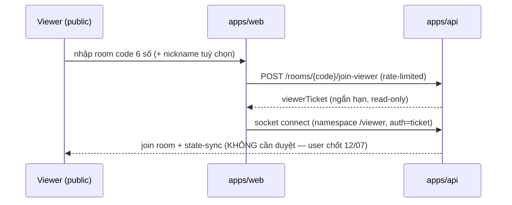

# Phase 5: Contest & Room Management

## Overview
Admin tạo contest, gán thí sinh + đề (snapshot), phát mã phòng 6 số; flows join cho thí sinh (login) và viewer/overlay (public theo mã phòng — user chốt 12/07); hạ tầng socket room + reconnect. Đây là "vỏ" để Phase 6 nhét game engine vào.

## Requirements
- Functional: contest CRUD (tên, lịch, RuleConfig v2 — playlist/preset, **1-12 ghế cá nhân** [teams UI → Phase 12/v2; schema Team/scoringUnit vẫn dựng từ phase này — D18], bộ đề); **người tạo contest PHẢI CHỌN danh sách câu hỏi + gán (snapshot) TRƯỚC khi contest bắt đầu — hệ thống KHÔNG tự lấy đề từ kho; draw chỉ random trong danh sách đã gán; mỗi câu gán kèm CHECKBOX phần-được-phép-dùng (theo pool D24 + điều kiện điểm); pool được phép DƯ so với nhu cầu; câu đã hỏi đánh dấu `usedInContest` — KHÔNG lặp lại trong cùng contest (✅ D22)**; room code 6 số duy nhất khi contest mở; thí sinh login rồi nhập room code → vào ghế; viewer/overlay nhập room code (+ nickname tuỳ chọn) → vào xem ngay (public, không duyệt; admin có khoá cổng + kick); lobby trước trận (tech check: thử chuông, âm thanh, đo ping); pre-flight validate danh sách đã gán đủ câu cho RuleConfig (chặn start nếu thiếu).
- Non-functional: reconnect grace 120s giữ ghế; 1 phiên đăng nhập/thí sinh (login mới đá phiên cũ, có cảnh báo); room code không đoán được tuần tự (random, không reuse trong 24h).

## Architecture

**Mô hình truy cập (user chốt 12/07 — thay thế flow duyệt viewer cũ):** viewer + overlay là **PUBLIC theo mã phòng** — có mã là vào xem, không account, không hàng chờ duyệt; overlay dùng chính flow này (join bằng room code, read-only). Kiểm soát của admin: **rate-limit theo IP + nút "khoá cổng viewer"** (đóng/mở join mới) + kick viewer đang xem. Zero-trust: namespace /viewer server DROP mọi event ghi. Thí sinh/MC/admin luôn cần auth + permission.

Socket topology (namespace + room):
- Namespace `/match`: thí sinh + admin (session auth). Rooms: `match:{id}`, `match:{id}:seat:{n}`, `match:{id}:admin`.
- Namespace `/viewer`: viewer + overlay OBS — public theo mã phòng (đổi mã lấy ticket read-only ngắn hạn, xem step 4). Room: `match:{id}:viewers`.
- Viewer/overlay là **read-only**: server không nhận game event từ namespace này.

## Related Code Files
- Create: `apps/api/src/contests/` (contest.controller/service, seat assignment, room-code.service)
- Create: `apps/api/src/rooms/` (join flows, viewer gate (khoá cổng/kick), ticket issuer, lobby/tech-check endpoints)
- Create: `apps/api/src/gateway/` (match.gateway, viewer.gateway, reconnect handler)
- Prisma: `Contest`, `ContestSeat`, `ContestQuestionSnapshot`, `ViewerSession`
- Modify: `packages/shared` (Zod: ContestCreateInput, RoomJoinInput, socket event payloads)
- Create: `apps/web/src/pages/join`, `apps/web/src/pages/lobby`

## Implementation Steps
1. Prisma: Contest (ruleConfig JSONB theo **RuleConfig v2** — round playlist, xem `research/ruleconfig-v2-spec.md`; theme JSONB + asset refs), **Match** (Contest 1-n Match — trận chính thức + practice/rehearsal; status LOBBY/LIVE/PAUSED/FINISHED; ruleConfig snapshot lúc start — red-team M6/H9), ContestSeat (**1-12 ghế**, userId nullable — D1 đã chốt), **Team** (optional, seatIds[], scoringUnit seat/team, individualTurnMode all-members/representative — đã chốt 12/07), ContestQuestionSnapshot (copy câu hỏi khi gán đề — sửa kho không phá trận). Room/socket đặt tên nhất quán theo `match:{id}`.
1b. **Seat profile** (gap 4.3, privacy 1.1): displayName/ảnh/trường-lớp nhập lúc gán ghế, THUỘC contest (không thuộc User — xoá contest là xoá profile); overlay/viewer hiển thị từ đây, có toggle "dùng nickname" cho livestream. **Seat profile thuộc-contest chính là điều làm roster export/import (🟡 D26) khả thi** — profile đi theo contest.json, chỉ `userId` cần map lại qua roster.json khi nhập sang bản khác; seat assignment tái lập tự động từ `seatIndex` trong roster khi import. **Reassign seat** được đến trước khi match start (thao tác admin, audit log — thay thí sinh phút chót, gap 2.3). RuleConfig preset = **row DB immutable có version** (`O26_DEFAULT@1`) — phát hành luật mới (O27) là thêm row, trận cũ replay đúng preset cũ (gap 5.3).
2. Room code service: random 6 số, unique đang-hoạt-động, TTL, không reuse 24h (Redis SETNX).
3. Join flow thí sinh: validate user được gán ghế trong contest; join khi LOBBY/LIVE; single-session (Redis key `user:{id}:socket`, socket mới đá socket cũ kèm thông báo).
4. Viewer/overlay public flow như sequence trên (user chốt 12/07: chỉ cần mã phòng, KHÔNG duyệt), kèm **P1**: rate limit join theo IP + nút "khoá cổng viewer" + kick (room code lộ công khai trên stream — flood là DoS vận hành, red-team M5). Overlay = cùng flow viewer (URL `overlay?code=482913` — mã phòng là secret duy nhất; room code thuộc contest đang mở — chết khi contest đóng (match FINISHED không giết mã nếu contest còn match khác); red-team H6 về token dài hạn không còn áp dụng vì không còn token).
5. Lobby/tech-check: thí sinh bấm thử chuông (đo round-trip hiển thị ms), thử phát âm thanh, trạng thái sẵn sàng ✅ cho admin thấy; server đo ping định kỳ.
6. Pre-flight validate theo spec v2 §12: so playlist config với snapshot đề (đủ câu từng pool/phần-được-tick/mức điểm/clues/rowCount; **chỉ đếm câu CHƯA `usedInContest` — pool dư hợp lệ, thiếu mới chặn (✅ D22.3)**; draw worst-case + reservePerField; custom-build worst-case per value; tie-break pool; **everPublic hard-block**; media tồn tại trên MinIO; teams hợp lệ) → chặn start nếu thiếu, báo cụ thể.
7. Reconnect: disconnect → giữ ghế 120s (Redis TTL), reconnect trong grace → auto re-join + `state-sync`; quá grace → ghế trống, admin quyết (RuleConfig `dropoutPolicy`).

## Success Criteria
- [ ] Admin tạo contest bằng builder (playlist + 1-12 ghế ± đội), gán đề, mở phòng ra mã 6 số.
- [ ] Thí sinh join bằng mã (auth); viewer/overlay vào xem ngay bằng mã (public, read-only enforced server-side); khoá cổng chặn join mới, kick hoạt động.
- [ ] Đá phiên cũ khi login nơi khác; reconnect trong 120s giữ nguyên ghế + state.
- [ ] Pre-flight chặn start khi đề thiếu câu, thông báo rõ thiếu gì.

## Risk Assessment
- Viewer flood → đã nâng lên P1 (step 4).
- Ticket viewer ngắn hạn 1 kết nối; public nên chống share vô nghĩa — kiểm soát thật là rate-limit + khoá cổng + kick.
- Ping config tách theo namespace: thí sinh ping ngắn (5s/3s) để phát hiện rớt nhanh; viewer ping dài hơn (25s/20s) tránh reconnect storm trên mobile (red-team L3).
