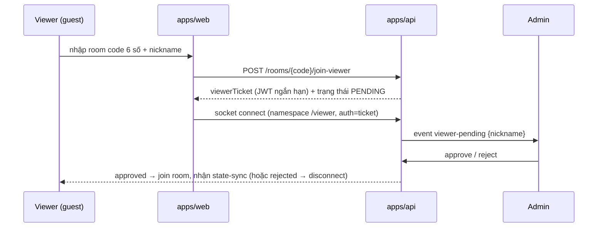

# Phase 5: Contest & Room Management

## Overview
Admin tạo contest, gán thí sinh + đề (snapshot), phát mã phòng 6 số; flows join cho thí sinh (login) và viewer (guest + admin duyệt); hạ tầng socket room + reconnect. Đây là "vỏ" để Phase 6 nhét game engine vào.

## Requirements
- Functional: contest CRUD (tên, lịch, RuleConfig preset, 4 ghế thí sinh, bộ đề); room code 6 số duy nhất khi contest mở; thí sinh login rồi nhập room code → vào ghế; viewer nhập room code + nickname → hàng chờ → admin approve/reject; lobby trước trận (tech check: thử chuông, âm thanh, đo ping); pre-flight validate đề đủ câu cho RuleConfig.
- Non-functional: reconnect grace 120s giữ ghế; 1 phiên đăng nhập/thí sinh (login mới đá phiên cũ, có cảnh báo); room code không đoán được tuần tự (random, không reuse trong 24h).

## Architecture

Socket topology (namespace + room):
- Namespace `/match`: thí sinh + admin (session auth). Rooms: `match:{id}`, `match:{id}:seat:{n}`, `match:{id}:admin`.
- Namespace `/viewer`: viewer guest (ticket auth) + overlay OBS (bootstrap token ngắn hạn do admin phát → đổi lấy socket ticket, không cần duyệt — xem step 4). Room: `match:{id}:viewers`.
- Viewer/overlay là **read-only**: server không nhận game event từ namespace này.

## Related Code Files
- Create: `apps/api/src/contests/` (contest.controller/service, seat assignment, room-code.service)
- Create: `apps/api/src/rooms/` (join flows, viewer approval, ticket issuer, lobby/tech-check endpoints)
- Create: `apps/api/src/gateway/` (match.gateway, viewer.gateway, reconnect handler)
- Prisma: `Contest`, `ContestSeat`, `ContestQuestionSnapshot`, `ViewerSession`
- Modify: `packages/shared` (Zod: ContestCreateInput, RoomJoinInput, socket event payloads)
- Create: `apps/web/src/pages/join`, `apps/web/src/pages/lobby`

## Implementation Steps
1. Prisma: Contest (ruleConfig JSONB), **Match** (Contest 1-n Match — trận chính thức + practice/rehearsal; status LOBBY/LIVE/PAUSED/FINISHED; ruleConfig snapshot lúc start — red-team M6/H9), ContestSeat (1-4, userId nullable — DEFERED D1), ContestQuestionSnapshot (copy câu hỏi khi gán đề — sửa kho không phá trận). Room/socket đặt tên nhất quán theo `match:{id}`.
1b. **Seat profile** (gap 4.3, privacy 1.1): displayName/ảnh/trường-lớp nhập lúc gán ghế, THUỘC contest (không thuộc User — xoá contest là xoá profile); overlay/viewer hiển thị từ đây, có toggle "dùng nickname" cho livestream. **Reassign seat** được đến trước khi match start (thao tác admin, audit log — thay thí sinh phút chót, gap 2.3). RuleConfig preset = **row DB immutable có version** (`O26_DEFAULT@1`) — phát hành luật mới (O27) là thêm row, trận cũ replay đúng preset cũ (gap 5.3).
2. Room code service: random 6 số, unique đang-hoạt-động, TTL, không reuse 24h (Redis SETNX).
3. Join flow thí sinh: validate user được gán ghế trong contest; join khi LOBBY/LIVE; single-session (Redis key `user:{id}:socket`, socket mới đá socket cũ kèm thông báo).
4. Viewer guest flow như sequence trên, kèm **P1**: rate limit join theo IP + giới hạn kích thước hàng chờ + nút "khoá cổng viewer" cho admin (room code lộ công khai trên stream — flood là DoS vận hành, red-team M5). Overlay: URL chỉ chứa **bootstrap token ngắn hạn dùng 1 lần** → đổi lấy socket ticket (token dài hạn trong URL lộ qua screenshot/OBS scene collection — red-team H6); admin có nút revoke + phát lại; ticket chết khi match FINISHED.
5. Lobby/tech-check: thí sinh bấm thử chuông (đo round-trip hiển thị ms), thử phát âm thanh, trạng thái sẵn sàng ✅ cho admin thấy; server đo ping định kỳ.
6. Pre-flight validate: so RuleConfig với snapshot đề (đủ số câu khởi động/VCNV set/4 câu tăng tốc/3 gói về đích/câu phụ + media tồn tại trên MinIO) → chặn start nếu thiếu, báo cụ thể.
7. Reconnect: disconnect → giữ ghế 120s (Redis TTL), reconnect trong grace → auto re-join + `state-sync`; quá grace → ghế trống, admin quyết (RuleConfig `dropoutPolicy`).

## Success Criteria
- [ ] Admin tạo contest, gán 4 thí sinh + đề, mở phòng ra mã 6 số.
- [ ] Thí sinh join bằng mã; viewer pending → admin approve mới thấy nội dung.
- [ ] Đá phiên cũ khi login nơi khác; reconnect trong 120s giữ nguyên ghế + state.
- [ ] Pre-flight chặn start khi đề thiếu câu, thông báo rõ thiếu gì.

## Risk Assessment
- Viewer flood → đã nâng lên P1 (step 4).
- Ticket viewer bị share → ticket bind IP + 1 kết nối.
- Ping config tách theo namespace: thí sinh ping ngắn (5s/3s) để phát hiện rớt nhanh; viewer ping dài hơn (25s/20s) tránh reconnect storm trên mobile (red-team L3).
