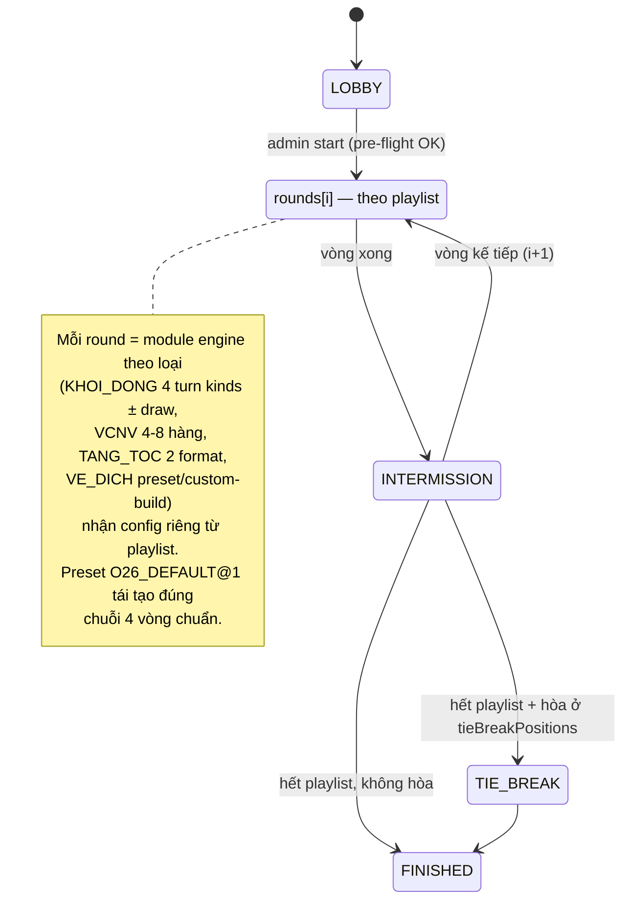
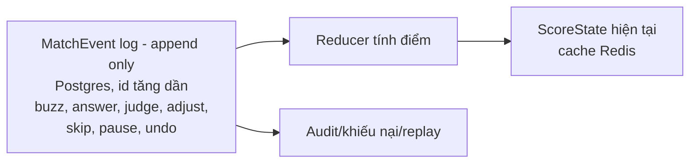

# Phase 6: Game Engine (luật 2026)

## Overview
Trái tim hệ thống: state machine server-authoritative theo **RuleConfig v2 — round playlist** (`research/ruleconfig-v2-spec.md`; `rules-2026.md` là luật gốc + edge-cases), timer server, buzzer công bằng, chấm điểm (auto + manual), event-sourced match log cho undo/audit/replay, pause/resume, backup state.

**Tổng quát hoá 12/07 (đã chốt với user):** không còn chuỗi 4 vòng cứng — orchestrator chạy `rounds[]` playlist tuỳ ý; 1-12 ghế + đội (buzz cá nhân, điểm về `scoringUnit`); khởi động 4 kiểu lượt + rút đề ngẫu nhiên theo lĩnh vực (event `QUESTIONS_DRAWN`, noRepeatInMatch, server-side để replay được); VCNV 4-8 hàng ± gợi ý ký tự; tăng tốc 2 format (ranked-speed / clue-buzz "3-4 dữ kiện"); về đích gói preset hoặc custom-build, `timeSeconds` là thuộc tính từng câu; sound cue slot theo THÀNH PHẦN × round + background tracks. Phổ điểm là mảng theo số đơn vị điểm. Preset-driven để kìm test matrix: engine hỗ trợ mọi tổ hợp Zod-hợp-lệ, test/UAT chạy trên preset chuẩn.

## Requirements
- Functional: chạy trọn round playlist bất kỳ (Zod-hợp-lệ) — preset `O26_DEFAULT@1` là kịch bản chuẩn; admin đổi timer/điểm per-contest (RuleConfig v2) và can thiệp giữa trận (cộng/trừ điểm tay, skip câu, thay câu dự phòng, pause/resume, undo, CONFIG_PATCH có re-preflight); sound-cue events phát cho client; preload media phân tầng audience.
- Non-functional: buzzer xếp hạng theo server timestamp (đơn vị ms); state phục hồi được sau server restart; mọi biến động điểm truy vết được.

## Architecture

### Match state machine



Mỗi vòng là một module engine riêng implement interface chung:

```ts
interface RoundEngine {
  start(ctx: MatchContext): void;
  handleEvent(e: ContestantEvent | AdminEvent): EngineResult; // validate + emit
  snapshot(): RoundStateSnapshot;   // để state-sync & backup
  restore(s: RoundStateSnapshot): void;
}
```

### Event sourcing & điểm số



- **Điểm = reduce(events)**: không có cột `score` sửa tay; "sửa điểm" = append `SCORE_ADJUST {delta, reason}`; "undo" = append `UNDO {targetEventId}` (reducer bỏ qua event bị undo). Immutable log = audit + replay + phân xử "em bấm trước" (giữ cả server-received ts lẫn socket packet ts).
- **Undo có domain semantics** (red-team H5): chỉ cho undo event chấm điểm GẦN NHẤT chưa có event khác build-upon (chưa sang câu/lượt mới); trường hợp khác dùng `SCORE_ADJUST` kèm lý do. Tương tác admin-can-thiệp × luật (NSHV đã chọn rồi câu bị thay → NSHV áp sang câu thay thế; câu bị skip khi đang mở quyền cướp → huỷ cửa sổ cướp, không ai mất điểm) định nghĩa trong `rules-2026.md` §7.
- **Thứ tự persist** (red-team H8): mọi event = append Postgres **synchronous** (1 insert) → apply vào state → broadcast. Không bao giờ broadcast trước khi persist — crash không được làm "tụt" điểm client đã thấy. Kill-test phải assert invariant này.
- **Single-writer per match** (red-team C1) qua **QueueDriver** (quyết định queue: `research/queue-decision.md`): mọi game-event enqueue vào FIFO per match (compose: BullMQ queue theo matchId, worker concurrency=1 tại instance owner giữ Redis lease; portable: in-process FIFO). Failover: lease hết hạn → instance khác claim queue + restore từ snapshot + replay event log, tự động PAUSE chờ admin resume. Socket.IO Redis adapter chỉ lo broadcast — KHÔNG lo xử lý event. Test bắt buộc: 100+ event tuần tự giữ đúng thứ tự (ordering vỡ nếu concurrency>1). Background jobs (import/export, PDF, dọn media) đi queue riêng: BullMQ (compose) / pg-boss (portable).
- **Degraded mode khi mất Redis** (red-team C3): health-check Redis; mất kết nối → engine tự PAUSE trận + thông báo "tạm dừng kỹ thuật" trên mọi màn; Redis quay lại → khôi phục từ Postgres snapshot/event log rồi admin resume.
- **RuleConfig freeze** (red-team H9): RuleConfig snapshot vào match lúc start; sau start chỉ đổi được qua event `CONFIG_PATCH` (versioned) để reducer áp đúng config theo thời điểm — điểm luôn tái lập được từ log.
- **Concurrency control admin** (red-team H1): tại một thời điểm chỉ 1 host giữ **control lock** (người khác read-only, có nút "take control"); mọi AdminEvent kèm `expectedStateVersion`, lệch → reject để chặn double-click/2-người-cùng-bấm.
- **Auto-pause khi mất admin** (red-team H2): RuleConfig `autoPauseOnHostDisconnect: true` — admin channel trống quá N giây trong phần thi tự trôi (khởi động riêng) → engine tự PAUSE.
- **Buzzer**: mở cửa sổ chuông → client bấm → server ghi `BUZZ {seat, tsServer}` (Redis `INCR` thứ tự nguyên tử) → khoá chuông người thắng, thông báo tất cả. Sai ở lượt chung khởi động: `-5` theo RuleConfig.
- **Timer service**: server giữ deadline tuyệt đối (`endsAt`), tick broadcast 250ms `{remainingMs, serverNow}`; client interpolate để render mượt; hết giờ server tự chuyển state (không chờ client).
- **RuleConfig** (Zod, `packages/shared`): toàn bộ tham số trong `rules-2026.md` §6 — preset `O26_DEFAULT`, admin clone + sửa per contest; validate ràng buộc (vd mảng điểm VCNV giảm dần).
- **Chấm**: câu nhập text → normalize (**TRIM đầu/cuối — user chốt 12/07**, bỏ dấu cách thừa giữa từ, không phân biệt hoa thường, tuỳ chọn bỏ dấu tiếng Việt) so `acceptedAnswers` (đã trim khi lưu ở phase-03) → kết quả tạm + admin confirm/override; submission rỗng/toàn whitespace sau trim → SKIP giữ bản trước (✅ D20.1); câu miệng → admin bấm Đúng/Sai (DEFERED D4).
- **Media preload phân tầng theo audience** (red-team C2 — media CHÍNH LÀ đề ở Tăng tốc/VCNV, preload sớm cho thí sinh = rò đề qua DevTools): viewer/overlay được preload câu N+1 sớm; **thí sinh chỉ nhận URL media đúng lúc reveal** (chấp nhận phụ thuộc băng thông — LAN khi thi thật thì không vấn đề). Policy trong RuleConfig `preloadPolicy` (DEFERED D12). Media 404/lỗi → admin nhận cảnh báo + nút skip/thay câu dự phòng.
- **Submission không lộ chéo** (red-team H10): đáp án đang gõ/đã gửi của thí sinh chỉ tới admin channel realtime; thí sinh khác + viewer chỉ thấy sau `TIME_UP`/reveal — là invariant có test riêng.
- **Pause/resume**: PAUSE đóng băng deadline (lưu `remainingMs`), khoá input; RESUME đặt `endsAt` mới. **Backup**: snapshot state (Redis) ghi Postgres mỗi 10s + mỗi event quan trọng; server restart → restore từ snapshot + replay event sau đó.
- **Sound cues**: engine emit `sound-cue {slot}` theo CueSlot matrix spec v2 §10 (round type × cue + global) — client resolve file theo sound config của contest với fallback chain slot → global → silent (Phase 7-9).

## Related Code Files
- Create: `apps/api/src/engine/` (match-orchestrator, rounds/khoi-dong.engine.ts, vcnv.engine.ts, tang-toc.engine.ts, ve-dich.engine.ts, tie-break.engine.ts, timer.service, buzzer.service, scoring.reducer, answer-matcher, snapshot.service)
- Prisma: `MatchEvent`, `MatchSnapshot`
- Modify: `packages/shared` (RuleConfigSchema + preset O26_DEFAULT, toàn bộ socket event contracts, ScoreState)
- Test: `apps/api/test/engine/` — unit test reducer + từng round engine là TRỌNG TÂM test của cả dự án

## Milestones nội bộ (red-team M9 + M-v2-8; phase này = critical path, to hơn nữa sau khi user chốt "1 version đủ tính năng")

- **6a** (mở khoá Phase 7/8 integrate sớm): MatchEvent + reducer (kèm team-reduce) + timer + buzzer + single-writer/lease + **orchestrator-skeleton chạy playlist tuần tự** + engine KHOI_DONG kind `individual-count` + `common-count`.
- **6b**: 2 turn kinds còn lại + draw service; VCNV (4-8 hàng, hintMap), TANG_TOC (2 format), VE_DICH (2 package modes), TIE_BREAK engines; teams semantics đầy đủ (§2b spec); preload + snapshot/restore + degraded mode + CONFIG_PATCH re-preflight.

## Implementation Steps
1. `RuleConfigSchema` **v2** (round playlist + seats/teams + 4 turn types + VCNV variants + TT 2 formats + VĐ package modes + sound slots + drawConfig — full spec ở `ruleconfig-v2-spec.md`) + presets: `O26_DEFAULT@1` (chuẩn, các giá trị ⚠️ D8 là default có comment), `O21_CLASSIC@1`, `TEAM_12@1`; kèm `buzzWindowSec`, `dropoutPolicy`, `autoPauseOnHostDisconnect`, `preloadPolicy`, `stealMode`, `revealAnswerAfterJudge` + `matchPurpose bundle (§13)`, quy tắc làm tròn điểm lẻ — Zod ép số nguyên, validate mảng điểm theo số đơn vị điểm.
2. MatchEvent schema — **mọi event có `schemaVersion` ngay từ event đầu tiên** (reducer đọc được version cũ; thiếu cái này thì release sau làm event log trận cũ không replay được — gap 3.1) + scoring reducer thuần (pure function) + property-based tests (điểm không âm ngoài luật cho phép, undo idempotent...).
3. Timer service + buzzer service (Redis) + test công bằng: 50 buzz đồng thời xếp đúng thứ tự server-received. **Buzzer timestamp gắn tại instance OWNER của match** (không phải instance nhận socket — 2 máy lệch clock là bất công hệ thống, gap 5.1); deployment yêu cầu NTP/chrony, vào checklist ngày thi.
4. Round engines (mỗi loại nhận config v2 của nó, orchestrator chạy playlist): KHOI_DONG (4 turn kinds + draw service) → VCNV (4-8 hàng, char hints) → TANG_TOC (ranked-speed + clue-buzz) → VE_DICH (preset/custom-build packages, time per-question) → TIE_BREAK, mỗi engine kèm bộ test kịch bản — BẮT BUỘC gồm các edge-case ở `rules-2026.md` §7: cả 4 bị loại khỏi VCNV, chuông CNV giữa timer hàng ngang, hòa timestamp Tăng tốc, tie-break 3-4 người/nhiều vị trí, thí sinh rớt mạng đúng lượt riêng, NSHV × skip/substitute, không ai bấm chuông hết `buzzWindowSec`.
5. Match orchestrator nối các engine + state **`INTERMISSION`** giữa các vòng (admin điều khiển; viewer/overlay hiện bảng điểm tổng + vòng kế tiếp + intro thí sinh đầu trận — 30-40% thời lượng buổi thi thật là "giữa các vòng", gap 4.2) + admin intervention (adjust/skip/substitute/pause/undo) + state-sync cho mọi client mới/reconnect. Chức năng **anonymize contestant** (thay displayName bằng mã trong dữ liệu trận cũ, không phá event log — privacy gap 1.1, retention config D14). Emit `ANSWER_REVEALED` sau JUDGE khi revealAnswerAfterJudge bật.
6. Media preload pipeline + sound-cue emitter.
7. Snapshot/restore + kill-test: giết process giữa vòng, restart, trận tiếp tục đúng.

## Success Criteria
- [ ] Chạy trọn trận mô phỏng automated ra điểm đúng với bảng tính tay cho ≥3 kịch bản trên preset `O26_DEFAULT@1` (4 thí sinh) + ≥1 kịch bản `TEAM_12@1` (12 người/4 đội) + ≥1 kịch bản playlist tuỳ biến (clue-buzz + VCNV 8 hàng + draw).
- [ ] Buzzer: 50 kết nối bấm trong cùng 100ms → thứ tự đúng theo server timestamp, không trùng hạng.
- [ ] Undo chấm sai → điểm tự tính lại đúng; log giữ nguyên cả 2 event.
- [ ] Kill server giữa VCNV → restart → trận resume đúng state, client tự sync.
- [ ] Admin đổi RuleConfig (vd tăng tốc 20/20/30/30) → engine chạy theo giá trị mới không sửa code.

## Risk Assessment
- Phức tạp nhất dự án — chia nhỏ theo round engine, mỗi engine PR riêng + test riêng.
- Reducer chậm khi log dài → snapshot điểm định kỳ, reduce từ snapshot gần nhất.
- Đồng hồ client lệch → mọi hiển thị đếm ngược dựa `serverNow` trong tick, không dùng `Date.now()` client trực tiếp.
