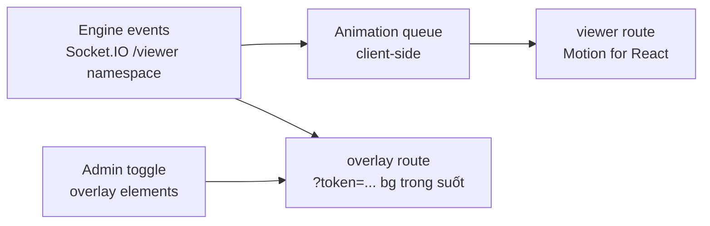

# Phase 9: Viewer UI + OBS Overlay

## Overview
Màn viewer "sân khấu" với animation đầy đủ nhưng không lag, và trang overlay OBS 1920×1080 nền trong suốt cho livestream. Port design + animation từ `public/viewer.html` và `public/overlay.html`.

## Requirements
- Functional: viewer join qua room code + duyệt (Phase 5); hiển thị đủ 5 phần thi với animation (bảng điểm count-up, VCNV lật ô + mở miếng ghép, tăng tốc lane, về đích NSHV/cướp, podium + confetti); overlay OBS: lower-third câu hỏi, timer ring, score strip, banner vòng, badge NSHV, điều khiển hiển thị phần tử từ admin; sound đồng bộ theo sound-cue.
- Non-functional: 60fps trên máy phổ thông (chỉ transform/opacity, GPU-friendly); `prefers-reduced-motion`; viewer chỉnh cỡ chữ + contrast AA; overlay chạy trong OBS Browser Source < 50% CPU; read-only tuyệt đối.

## Architecture

- **Animation queue**: event server đến dồn dập → hàng đợi tuần tự hoá animation (điểm cộng xong mới chạy hiệu ứng tiếp theo), skip-to-latest khi tụt hậu > N event (viewer không bao giờ chặn engine — engine không chờ animation).
- Overlay: route riêng không MUI layout (bundle tối thiểu), token auth (Phase 5), query `?elements=` + admin toggle runtime; hint checkerboard khi mở ngoài OBS.
- Motion for React cho hiệu ứng phức hợp; hiệu ứng lặp thuần CSS.

## Related Code Files
- Create: `apps/web/src/pages/viewer/` (Stage, Scoreboard, round stages, Podium, ConfettiCanvas, AnimationQueue)
- Create: `apps/web/src/pages/overlay/` (OverlayRoot, LowerThird, TimerRing, ScoreStrip, RoundBanner, HopeStarBadge)
- Tham chiếu design: `public/viewer.html`, `public/overlay.html`, `public/assets/tokens.css`

## Implementation Steps
1. AnimationQueue + hook `useAnimatedScore` (count-up đồng bộ queue).
2. Scoreboard + round stages port từ demo (giữ token design, chuyển sang Motion for React).
3. VCNV board (flip 3D từng ô, mở miếng ghép ảnh theo mask), hiệu ứng giải CNV toàn màn.
4. Về đích: gói điểm, NSHV, cướp quyền; Podium + confetti (canvas, tự viết — không lib nặng).
5. Overlay route: các phần tử độc lập bật/tắt, animation enter/exit transform-only; đo CPU trong OBS thật.
6. Viewer settings (cỡ chữ, reduced motion, âm lượng); soak test 2h không memory leak.
7. **Bộ SFX mặc định royalty-free** (DEFERED D10b, red-team M10): chọn nguồn (Pixabay/freesound CC0...), commit file + LICENSE, mapping cue→file (`buzz|correct|wrong|timeup|round-intro` × 5 vòng); admin upload thay từng cue ở settings contest.

## Bổ sung từ gap-analysis
- **Viewer mobile là mặc định thực tế** (480/500 viewer là điện thoại): responsive ≥360px, test trên Android tầm trung; `?kiosk=1` ẩn UI chrome cho projector/khán giả tại chỗ (gap 4.4).
- **Route `/mc`** (P2): màn cho MC đọc câu hỏi — read-only, chữ rất to, chỉ câu hỏi hiện tại; đáp án chỉ hiện SAU khi admin reveal (mặc định theo D15.2, chờ user chốt).
- **Overlay toggle "ẩn tên thật"** per-contestant (dùng nickname từ seat profile) cho livestream chưa có consent phụ huynh (gap 1.2).

## Success Criteria
- [ ] Viewer dùng được trên điện thoại Android tầm trung (≥360px, không vỡ layout, animation không giật quá 30fps).
- [ ] Kịch bản trận đầy đủ chạy mượt 60fps (DevTools performance, máy không GPU rời).
- [ ] Overlay trong OBS 1920×1080@30fps < 50% CPU 1 core, nền trong suốt đúng.
- [ ] Viewer tụt mạng 10s → skip-to-latest, không dồn animation vô hạn.
- [ ] Không gửi được bất kỳ event nào từ viewer/overlay lên server (test).

## Risk Assessment
- Confetti/particle gây drop fps → canvas + object pool, tự tắt khi reduced-motion.
- OBS browser source memory leak khi reconnect liên tục → reconnect backoff + tự reload trang sau N lần fail.
