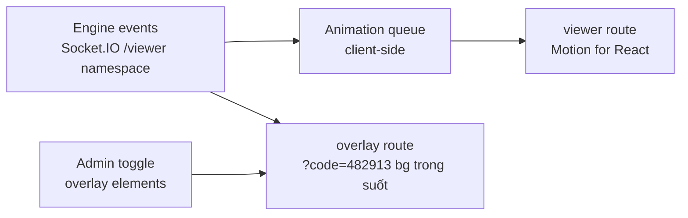

# Phase 9: Viewer UI + OBS Overlay

## Overview
Màn viewer "sân khấu" với animation đầy đủ nhưng không lag, và trang overlay OBS 1920×1080 nền trong suốt cho livestream. Port design + animation từ `public/viewer.html` và `public/overlay.html`.

## Requirements
- Functional: viewer/overlay join public qua room code — không duyệt (Phase 5, user chốt 12/07); hiển thị mọi loại vòng trong playlist với animation (bảng điểm count-up, VCNV lật ô + mở miếng ghép, tăng tốc lane, về đích NSHV/cướp, podium + confetti); overlay OBS: lower-third câu hỏi, timer ring, score strip, banner vòng, badge NSHV, điều khiển hiển thị phần tử từ admin; sound đồng bộ theo sound-cue.
- Non-functional: 60fps trên máy phổ thông (chỉ transform/opacity, GPU-friendly); `prefers-reduced-motion`; viewer chỉnh cỡ chữ + contrast AA; overlay chạy trong OBS Browser Source < 50% CPU; read-only tuyệt đối.

## Architecture

- **Animation queue**: event server đến dồn dập → hàng đợi tuần tự hoá animation (điểm cộng xong mới chạy hiệu ứng tiếp theo), skip-to-latest khi tụt hậu > N event (viewer không bao giờ chặn engine — engine không chờ animation).
- **Animation là MODULE ĐỘC LẬP (✅ D22)**: mỗi hiệu ứng (count-up, lật ô VCNV, lane tăng tốc, podium...) là component riêng chỉ nhận **semantic event** từ animation-queue; mapping event→animation là bảng cấu hình client-side — nhà phát triển sửa RULE server (vd cách chọn câu hỏi) không đụng animation, thay/thêm animation không đụng engine.
- Overlay: route riêng không MUI layout (bundle tối thiểu), join public bằng room code (Phase 5), query `?elements=` + admin toggle runtime; hint checkerboard khi mở ngoài OBS.
- Motion for React cho hiệu ứng phức hợp; hiệu ứng lặp thuần CSS.

## Related Code Files
- Create: `apps/web/src/pages/viewer/` (Stage, Scoreboard, round stages, Podium, ConfettiCanvas, AnimationQueue)
- Create: `apps/web/src/pages/overlay/` (OverlayRoot, LowerThird, TimerRing, ScoreStrip, RoundBanner, HopeStarBadge)
- Tham chiếu design: `public/viewer.html`, `public/overlay.html`, `public/assets/tokens.css`

## Implementation Steps
1. AnimationQueue + hook `useAnimatedScore` (count-up đồng bộ queue).
2. Scoreboard + round stages port từ demo (giữ token design, chuyển sang Motion for React).
3. VCNV board (flip 3D từng ô, mở miếng ghép ảnh theo mask), hiệu ứng giải CNV toàn màn.
4. Về đích: gói điểm, NSHV, cướp quyền; Podium + confetti (canvas, tự viết — không lib nặng).
5. Overlay route: các phần tử độc lập bật/tắt, animation enter/exit transform-only; đo CPU trong OBS thật.
6. Viewer settings (cỡ chữ, reduced motion, âm lượng); soak test 2h không memory leak.
7. **Sound cues (✅ D10 chốt lại)**: KHÔNG cần bộ SFX default cầu kỳ — admin tự upload file cho từng cue slot ở sound editor (phase-08); CueSlot matrix theo spec v2 §10 (mỗi round type × ~10 cue + global) với **fallback chain: slot → global → SILENT** (slot trống = im lặng, trận vẫn chạy); client pre-download toàn bộ file cue khi vào phòng (nhỏ, phát tức thì theo event).

## Bổ sung từ gap-analysis
- **Viewer mobile là mặc định thực tế** (480/500 viewer là điện thoại): responsive ≥360px, test trên Android tầm trung; `?kiosk=1` ẩn UI chrome cho projector/khán giả tại chỗ (gap 4.4).
- **Route `/mc`** (nâng lên P1, user đã chốt 12/07): màn cho MC — read-only, chữ rất to, hiện **câu hỏi + ĐÁP ÁN + tóm tắt kết quả/bảng điểm vòng**. Permission `match.viewAnswer` gán theo contest; MC channel là nơi thứ 2 (sau admin) đáp án được phép tới — authenticated + audit log.
- **Overlay toggle "ẩn tên thật"** per-contestant (dùng nickname từ seat profile) cho livestream chưa có consent phụ huynh (gap 1.2).

## Bổ sung 12/07 — theming + adaptive layout
- **Theme per contest**: CSS variables override từ theme config (màu), logo/banner/ảnh thí sinh/video hình hiệu từ MinIO; INTERMISSION phát video hình hiệu; viewer/overlay/MC đều áp theme.
- **Adaptive layout theo số đơn vị điểm (đã chốt)**: ≤4 giữ layout sân khấu đầy đủ như demo; 5-12 chuyển grid/list gọn (vẫn count-up + delta animation); hiển thị theo ĐỘI khi scoringUnit=team (điểm đội to, thành viên nhỏ).
- **Tăng tốc clue-buzz**: UI mở dần 3-4 dữ kiện + hiệu ứng chuông giành quyền; **background music** phát ở viewer/overlay theo soundboard admin (duck khi cue).
- Viewer/overlay render đáp án sau chấm KHI match bật revealAnswerAfterJudge (default tắt ở official).

## Success Criteria
- [ ] Viewer dùng được trên điện thoại Android tầm trung (≥360px, không vỡ layout, animation không giật quá 30fps).
- [ ] Kịch bản trận đầy đủ chạy mượt 60fps (DevTools performance, máy không GPU rời).
- [ ] Overlay trong OBS 1920×1080@30fps < 50% CPU 1 core, nền trong suốt đúng.
- [ ] Viewer tụt mạng 10s → skip-to-latest, không dồn animation vô hạn.
- [ ] Không gửi được bất kỳ event nào từ viewer/overlay lên server (test).

## Risk Assessment
- Confetti/particle gây drop fps → canvas + object pool, tự tắt khi reduced-motion.
- OBS browser source memory leak khi reconnect liên tục → reconnect backoff + tự reload trang sau N lần fail.
