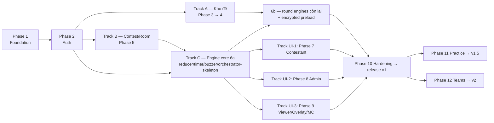

# Olympia Contest System

Nền tảng web tổ chức thi đấu gameshow kiến thức **tuỳ biến hoàn toàn** theo mô hình Đường lên đỉnh Olympia: round playlist tuỳ ý (số vòng/loại vòng/thứ tự), 1-12 thí sinh, mọi timer/điểm là config (nút **"Áp dụng luật 2026"** áp preset O26 theo [Fandom wiki — source of truth D8](https://duong-len-dinh-olympia.fandom.com/vi/wiki/Lu%E1%BA%ADt_ch%C6%A1i/Olympia_26)), kho đề + bộ đề bảo mật, thi đấu realtime độ trễ thấp, overlay OBS + màn MC cho livestream, theming đồ hoạ/âm thanh per contest.

**Lộ trình version (✅ D18 chốt lại 12/07):**

| Mốc | Scope phát hành | Phase |
|---|---|---|
| **v1 — Solo contest** | Contest chính thức, thí sinh CÁ NHÂN 1-12 ghế, đủ mọi loại vòng + biến thể, kho đề + import/export, viewer/overlay/MC/admin, 2 profile deploy | Phase 1-10 |
| **v1.5 — Practice contest** | `matchPurpose: practice` (reveal sau chấm, retention 3 tháng, rematch, trainer role), bộ đề PUBLIC + share-link, UI luyện tập solo | Phase 11 ([chi tiết](phase-11-practice-mode.md)) |
| **v2 — Thi ĐỘI** | Teams: buzz cá nhân điểm về đội, teamLockout, NSHV/đội, preset TEAM_12, UI đội mọi màn | Phase 12 ([chi tiết](phase-12-teams.md)) |

**Ràng buộc xuyên suốt: DB + Zod schema chuẩn bị ĐẦY ĐỦ ngay từ v1** (Team/seat.teamId/scoringUnit, matchPurpose, visibility/everPublic, ACL bộ đề, retention fields) — tránh migrate về sau; v1 chỉ chưa bật UI/engine-path tương ứng. *(Chi tiết engine: `research/ruleconfig-v2-spec.md`.)*

## Tài liệu

| File | Nội dung |
|---|---|
| `research/ruleconfig-v2-spec.md` | **Spec engine chính**: RuleConfig v2 — round playlist, 1-12 ghế + đội, mọi timer/điểm tuỳ biến, rút đề, sound slots, theming (12/07) |
| `research/rules-2026.md` | Luật gốc O26 + edge-cases — ✅ D8 chốt 12/07: **Fandom wiki = source of truth**, giá trị đã đối chiếu toàn văn |
| `research/tech-architecture.md` | Research kiến trúc: Better-auth, game state, buzzer, MinIO, import/export (§1 Fastify đã superseded — D9 chốt Express) |
| `research/sound-cues.md` | **Cue map event-driven** từ 36 cue của Athena + chương trình thật (12/07 — D10) |
| `research/athena-scout.md` | Bài học từ bản C#/WPF cũ (Athena) |
| `research/ux-gaps.md` | Các khía cạnh UX/vận hành bị bỏ quên (sound cues, pause/undo, grace reconnect...) |
| `research/red-team.md` | Findings red-team + trạng thái xử lý (C1-C3, H1-H10, M, L) |
| `research/product-gaps.md` | Gap-analysis vòng 2: pháp lý/privacy, quy trình con người, vòng đời sản phẩm |
| `research/queue-decision.md` | Queue + 2 deployment profile: BullMQ (compose) / in-process + pg-boss (portable), quy ước compose.yml/prod.compose.yml (12/07) |
| `PRD.md` / `user-stories.md` | Yêu cầu sản phẩm + user stories theo epic (map về phase) |
| `DEFERED.md` | Sổ quyết định D1-D27 — D1-D25 **chốt hết**; **D26 (roster user tham gia trong bundle) + D27 (kết quả portable→central) MỚI MỞ 15/07 chờ chốt**; D10 cue map là việc research của Claude |
| `../../public/` | Demo tĩnh mock data + animation (deliverable của giai đoạn planning, host Vercel được) |

## Stack (đã chốt, không đổi)

- **Backend**: TypeScript, NestJS trên **Express adapter** (✅ D9 chốt 12/07 — đổi từ Fastify để tương thích Socket.IO gateway + Better-auth), Zod, Prisma + PostgreSQL, Redis, Better-auth, Socket.IO
- **Frontend**: TypeScript, React + Vite, MUI, Motion for React, Zustand, TanStack Query, Socket.IO client, Zod
- **Storage**: MinIO (S3-compatible) cho media đề
- **Cấu trúc dự kiến khi code**: monorepo pnpm — `apps/api`, `apps/web`, `packages/shared` (Zod schemas + RuleConfig dùng chung)

## Kiến trúc tổng quan

```
                    ┌─────────────────────────────────────────┐
                    │              apps/web (React)           │
                    │  /contestant  /viewer  /overlay  /admin │
                    │  /questions  /mc  (route theo role)     │
                    └──────┬──────────────────────┬───────────┘
                     HTTP (TanStack Query)   Socket.IO (websocket-only)
                    ┌──────┴──────────────────────┴───────────┐
                    │        apps/api (NestJS + Express)      │
                    │  REST: auth, users, questions, contests │
                    │  WS Gateway: match rooms, buzzer, timer │
                    │  Game Engine: state machine per round   │
                    └──┬───────────┬───────────┬──────────────┘
                       │           │           │
                  PostgreSQL     Redis       MinIO
                  (Prisma)   (match state,  (media đề,
                              socket adapter, presigned URL)
                              buzzer order)
```

Nguyên tắc xương sống (rút từ nghiên cứu + bài học Athena):

1. **Server-authoritative tuyệt đối**: timer, thứ tự bấm chuông (server timestamp), điểm số đều tính ở server; client chỉ gửi intent và render.
2. **Đáp án chỉ rời server tới admin + MC** (authenticated + audit); ngoại lệ revealAnswerAfterJudge (per-match, default tắt ở official) đẩy xuống SAU khi chấm; media qua presigned URL TTL ngắn; audit log truy cập đề.
3. **RuleConfig JSON (Zod-validated)** — mọi timer/điểm là config per-contest với preset "O26 chuẩn"; không hard-code như Athena.
4. **Event-sourced match log**: mọi sự kiện trận (chuông, đáp án, chấm điểm, chỉnh tay) được append vào log → undo/sửa điểm có dấu vết, phân xử khiếu nại, replay.
5. **Snapshot đề vào trận**: gán đề là copy tại thời điểm gán; sửa kho đề không phá trận.

## Phases

| # | Phase | Status | Phụ thuộc |
|---|-------|--------|-----------|
| 1 | [Foundation & Infrastructure](phase-01-foundation.md) | pending | — |
| 2 | [Auth & User Management](phase-02-auth-users.md) | pending | 1 |
| 3 | [Question Bank (kho đề)](phase-03-question-bank.md) | pending | 2 |
| 4 | [Import / Export đề](phase-04-import-export.md) | pending | 3 |
| 5 | [Contest & Room Management](phase-05-contest-room.md) | pending | 2 |
| 6 | [Game Engine (luật 2026)](phase-06-game-engine.md) | pending | 3, 5 |
| 7 | [Contestant UI](phase-07-contestant-ui.md) | pending | 6 |
| 8 | [Admin Control UI](phase-08-admin-ui.md) | pending | 6 |
| 9 | [Viewer UI + OBS Overlay](phase-09-viewer-overlay.md) | pending | 6 |
| 10 | [Hardening, Ops & Release](phase-10-hardening.md) | pending | 7, 8, 9 |
| 11 | [Practice Mode — **v1.5**](phase-11-practice-mode.md) | pending | 10 (release v1) |
| 12 | [Teams (thi đội) — **v2**](phase-12-teams.md) | pending | 10 (release v1); D17.1/.3/.4 |

Phase 1-10 = release **v1**; Phase 11 = release **v1.5**; Phase 12 = release **v2** (11 và 12 độc lập nhau, có thể đảo nếu nhu cầu đổi).

### Thi công song song (chia track theo ranh giới file-ownership)



- **Sau Phase 2, ba track chạy song song**: A (kho đề 3→4, own `apps/api/src/questions|import-export` + `apps/web/src/pages/questions`), B (contest/room 5, own `apps/api/src/contests|rooms|gateway`), C (engine 6a, own `apps/api/src/engine`). Track B xong socket topology là C gắn vào; A chỉ chạm C ở `ContestQuestionSnapshot` (contract định nghĩa trong `packages/shared` từ Phase 1).
- **Milestone 6a mở khoá cả 3 track UI cùng lúc** (7/8/9 own 3 thư mục pages riêng, không đụng file nhau; socket contracts + `matchStore` pattern là ranh giới chung — định nghĩa xong trong 6a). 6b (round engines còn lại) chạy song song với UI vì UI render theo playlist config, không cứng theo engine nào.
- **Quy tắc chống conflict**: mọi contract (Zod schemas, socket events, RuleConfig, permission catalog) chỉ sửa ở `packages/shared` và phải merge trước; mỗi track PR riêng theo thư mục ownership; Phase 11 và 12 là 2 track độc lập sau release v1 (11 own `retention|practice pages`, 12 own `engine teams-branch + team UI`).

**Gate trước Phase 7-9 (gap-analysis 6.1):** đem demo `public/` (host Vercel) cho **người thật dùng thử** — tối thiểu 1 giáo viên tạo thử câu hỏi trên màn kho đề + 2 học sinh thi thử màn thí sinh, 30 phút. Toàn bộ review đến nay là AI-review-AI; phản hồi người thật rẻ nhất tại thời điểm này, đắt dần theo mỗi phase code thật.

## Rủi ro chính

| Rủi ro | Mức | Giảm thiểu |
|---|---|---|
| ~~NestJS Fastify + Socket.IO incompatibility~~ | ĐÃ HOÁ GIẢI | D9 chốt Express adapter (12/07) — gateway + Better-auth đều đường chính thống |
| Engine stateful × multi-instance (race, timer đôi) | Cao | Single-writer per match qua Redis lease; failover restore từ snapshot (phase-06, red-team C1) |
| Redis chết giữa trận live | Cao | AOF everysec + degraded mode auto-pause + khôi phục từ Postgres; chaos drill Phase 10 (red-team C3) |
| ~~Luật 2026 sai chi tiết (nguồn mâu thuẫn)~~ | ĐÃ HOÁ GIẢI | ✅ D8 12/07: Fandom wiki = source of truth, đã đối chiếu toàn văn; mọi giá trị vẫn là RuleConfig |
| Encrypted preload (D12b) phức tạp phía client | Trung | Fallback reveal-only tự động; test D12b riêng trong Phase 6/7 |
| Better-auth + NestJS là package cộng đồng | Trung | Pin version, wrap sau interface `AuthService` riêng để thay được |
| Buzzer fairness qua Internet | Trung | Server timestamp + websocket-only; khuyến cáo LAN khi thi thật |
| Overlay lag trong OBS | Thấp | Chỉ transform/opacity; test OBS thật ở Phase 9 |

## Demo

`public/` đã build xong và **được verify bằng Playwright + Chrome** (6 trang render đúng, console 0 error). **✅ Đã sync theo các quyết định 12/07:** luật D8 theo Fandom (RULES: 3s khởi động, VCNV 60/50/40/30+20, tăng tốc 20/20/30/30, về đích steal transfer — verify logic transfer +20/−20), displayId theo pool D24 (`KV-XXXX-YYYY`... — verify 61 câu 0 sai format), font Be Vietnam Pro (D25 — verify `document.fonts`). Demo là design reference hợp lệ cho Phase 7-9.

## Open questions

Xem `DEFERED.md` (cùng thư mục). **Đã chốt:** D1 (1-12 ghế; đội = v2), D2 (chỉ tiếng Việt + UTC+7), D3 (admin điều khiển + RBAC/CASL), D4 (admin chấm miệng, auto-match câu gõ), D5 (viewer public theo mã phòng), D6 (ảnh ≤10MB / video ≤200MB / audio ≤20MB, env config), **D8 (Fandom wiki = source of truth; nút "Áp dụng luật 2026"; điểm độc lập thời gian — `timeSeconds` là metadata từng câu)**, D9 (**Express adapter** — bỏ Fastify), **D12 (b — preload blob MÃ HOÁ qua service worker, key phát lúc reveal; fallback reveal-only)**, D15-MC, D16 (cột `visibility` từ v1; public set + UI solo = v1.5), D17.2 (last-wins), **D18 (lộ trình 3 mốc: v1 solo / v1.5 practice / v2 teams — DB đủ từ v1)**, D19 (portable HTTP, <10 viewer), D20 (skip rỗng + trim), D21 (retention practice 3 tháng / official 12 tháng; trainer tạo practice match — thuộc v1.5). **Đợt chốt cuối 12/07:** D11 (<50 viewer/trận, ~5 trận song song — load test đổi kịch bản), D13 toàn bộ (VCNV cả 4 loại → admin mở miếng ghép THỦ CÔNG; rớt mạng → pause+admin; tie-break chỉ nhất), D15.1 (duyệt đề = permission `question.review`, seed role REVIEWER), D17 toàn bộ (khởi động/về đích khoá CÁ NHÂN — `teamLockout: false` default; VCNV loại CẢ ĐỘI; NSHV 1/đội). **D7/D14 đã bỏ.** **Mới mở 15/07 (chờ chốt):** **D26** (roster — danh sách user tham gia đi kèm contest bundle, **thông tin user LUÔN mã hoá binary `roster.bin`** AES-256-GCM + passphrase→Argon2id; password regenerate+phiếu default / giữ-hash opt-in, merge policy username trùng), **D27** (result bundle chiều ngược portable→central để stats-writeback + tổng hợp lịch sử). **Còn chờ:** D10 cue map (việc research của Claude → `research/sound-cues.md`, không phải quyết định của user).
