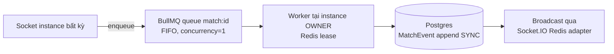

# Quyết định Queue + 2 deployment profile (12/07)

> Tổng hợp research (chi tiết đầy đủ: `research/queue/` — 3 file). User đã chốt: có 2 hình thức triển khai; cần queue để xử lý event.

## Khuyến nghị chốt

| Bài toán | Profile **compose** (server Internet) | Profile **portable** (Windows không Docker, LAN, 1 máy) |
|---|---|---|
| A. Game-event ingestion (đường nóng, FIFO per match, <5-10ms) | **BullMQ** trên Redis sẵn có — worker concurrency=1 **per match** (queue/group theo matchId; concurrency>1 phá ordering) | **In-process FIFO** (EventEmitter, <0.1ms) — 1 instance nên không cần broker |
| B. Background jobs (import/export, PDF, dọn media, thống kê) | **BullMQ** (`@nestjs/bullmq`) + Bull Board dashboard | **pg-boss** trên Postgres portable (SKIP LOCKED, ACID; bật LISTEN/NOTIFY để giảm polling latency 2-5s) |
| Socket.IO adapter | Redis adapter | default in-memory (1 instance) |
| Single-writer lease | Redis lease | không cần (1 process) |
| Storage | MinIO | filesystem driver (hoặc MinIO single .exe nếu cần presigned URL đồng nhất) |
| Postgres | container | **Postgres portable binaries (zip)** — KHÔNG dùng PGlite/embedded (giới hạn concurrency) |

**Kiến trúc bắt buộc: abstraction layer từ Phase 1** — `QueueDriver` / `StateDriver` / `StorageDriver` / `SocketAdapterFactory` interface; chọn driver bằng `INFRA_PROFILE=compose|portable`. Code nghiệp vụ (engine, services) không biết driver nào đang chạy. (~4h công, mở khoá portable không ép Redis lên Windows.)

Bị loại: NATS JetStream/RabbitMQ/Kafka (thêm hạ tầng mới — trái ràng buộc); Redis pub/sub thuần (mất message); Redis Streams thô (latency tốt hơn BullMQ ~1-2ms nhưng vận hành phức tạp ×4: XCLAIM failover, trim, PEL — không đáng với đội nhỏ).

## Luồng event (compose)

Portable: thay Q bằng in-process FIFO, W cùng process, broadcast trực tiếp — cùng interface.

## Pitfalls phải nhớ (đưa vào phase-06 test)

1. BullMQ ordering vỡ nếu concurrency>1 → test 100+ event tuần tự giữ đúng thứ tự. **Lưu ý: "group" là tính năng BullMQ Pro trả phí** — OSS dùng queue-per-match + worker khởi tạo động khi claim lease; match FINISHED → `queue.obliterate()` + tháo worker + release lease (không leak Redis keys); Bull Board đăng ký/gỡ queue động (gap-sweep M-F1).
2. pg-boss polling mặc định 2-5s → bật LISTEN/NOTIFY cho job cần phản hồi nhanh.
3. Lease failover: heartbeat renewal + worker mới claim queue khi owner chết (chaos drill Phase 10 đã có).
4. Portable 1 instance: không Redis adapter — không được code đường tắt bypass abstraction.

## Quy ước compose (user chốt 12/07)

- **`compose.yml`** — DEV: luồng chính vẫn đi qua proxy (đồng dạng prod), **NHƯNG đồng thời map TOÀN BỘ port từng service ra host** (pg 5432, redis 6379, minio 9000/9001, api 3000, web 5173, proxy 80) để test/debug trực tiếp từng service không cần qua proxy.
- **`compose.prod.yml`** — SERVER: **chỉ expose đúng 1 port của reverse proxy** (80/443); mọi service khác chỉ nằm trong network nội bộ.
- **Cả hai file đều có reverse proxy nginx** (user chốt; TLS ở prod qua certbot; dev cũng đi qua proxy để môi trường đồng dạng: cùng domain/cookie/path như prod; nginx config chú ý `proxy_read_timeout` + `Upgrade`/`Connection` headers cho WebSocket). **Không cần sticky session** — websocket-only + Redis adapter + QueueDriver forward là đủ, đừng thêm `ip_hash` thừa; hệ quả websocket-only: không có polling fallback sau proxy khắt khe (đã là quyết định có chủ đích).
- Port service ở compose.yml dev bind `127.0.0.1` (không mở default-credential ra LAN — gap-sweep M-F3).

## Nguồn chính

- https://docs.bullmq.io · https://docs.nestjs.com/techniques/queues
- https://timgit.github.io/pg-boss/ · https://github.com/madeindjs/nestjs-pg-boss
- https://redis.io/docs/latest (streams, distributed locks)
- Chi tiết trade-off + code mẫu: `research/queue/queue-research-report.md`, `portable-profile-guide.md`, `sources-and-tradeoffs.md`
